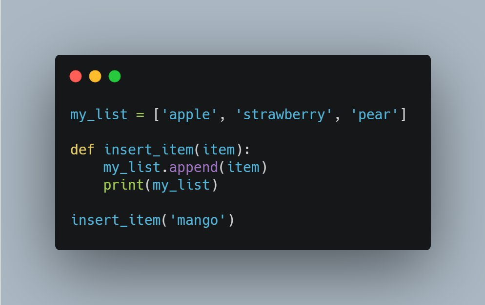
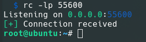
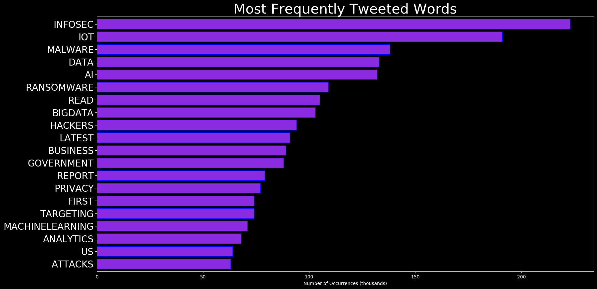
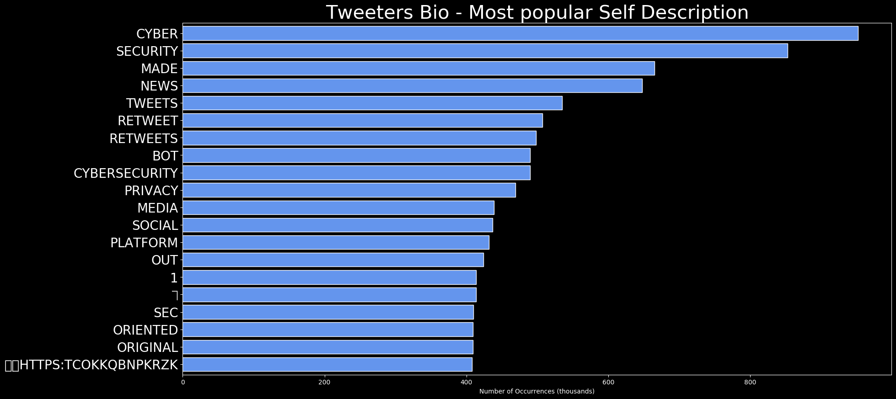
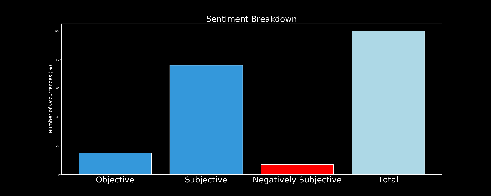

# DARKWIRE SOCIAL CYBER INSIGHTS 
&#x1F34E; **TOPIC = "cybersecurity"**

## AUTOMATED RESEARCH SUMMARY
     

|  Trending  |   Images | 
:-------------------------:|:-------------------------:
|        |   |   
 
 

  
The most popular user is: **Coredao_Org**  
 

## #CoreDAO is pleased to announce our partnership with the industry leading cybersecurity firm @HalbornSecurity  for… https://t.co/F4XhjIWjDu 

  

### TRENDING SHARED IMAGE

|                **Sample-Tweets**        |
| :-------------: |
| For #Hacked #Gmail recoveryDm now #Hackedgmail #CyberSecurity #hacker #infosec @reach2ratan #security #cyber #tech… https://t.co/j8jz4UpVYl |
| RT @BowTiedCyber: 4 IT CERTIFICATIONS IN 60 DAYSNetwork+ • 30 DaysSecurity+ • 15 DaysSplunk Core User • 10 DaysAzure 900 • 5 Days… |
| RT @enricomolinari: Generative #AI explained by #ArtificialIntelligence#ChatGPT #ML #fintech #marketing #finserv #ehealth #enricomolinari… |

## RELATED METRICS 
| Metric | Value |
| ------------- | ------------- |
| #1 Most tweeted to  | **SecurityTrybe** |
| #2 Most tweeted to  | **BowTiedCyber** |
| #3 Most tweeted to  | **hackinarticles** |
| NewProfiles (less than 10 days) | 0.4%  |
| Tweeters with < 10 followers  | 5.24%|
| Tweeters with > 1000000 followers  | 0.06%  |

## MOST POPULAR TWEET TERMS 

| Popularity Rank  | Term |
| ------------- | ------------- |
| first  | **INFOSEC**  |
| second  | **DAYS**  |
| third  | **•** |
| fourth  | **HACKING**  |
| fifth  | **PENTESTING**  |

## Twitter Bio Analysis
### SENTIMENT ANALYSIS

VIEWS WERE : **SUBJECTIVE**  (26.67%) & **NEGATIVELY-SUBJECTIVE** (6.67%) **OBJECTIVE** (66.67%)

### TWEET SAMPLE 
| Random value picked from array |
| ------------- |
|RT @CyberOutlook: Read the latest Cyber Outlook Rundown: A Cybersecurity briefing on noteworthy Cyber Attacks, Vulnerabilities, and InfoSe… |

### MOST RETWEETED 

| The most retweeted user is: **Coredao_Org**  |
| ------------- |
| #CoreDAO is pleased to announce our partnership with the industry leading cybersecurity firm @HalbornSecurity  for… https://t.co/F4XhjIWjDu |

# Potential Fake Accounts
 
# julieaboulangerUSER INFO

 
`User ScreenName:` julieaboulanger 
 
`User chosen Name:` Julie Boulanger ☁️ 
 
`Is the User Verified?:` False 
 
`User signup date?:` Sat Feb 04 22:15:15 +0000 2023 
 
`User Description?:` B2B SaaS Technology Copywriter | Content Marketing Writer | Cloud technology | Cybersecurity | Search Engine Optimisation (SEO) & a knack for words 🚀 
 
`Followers?: `0 
 
`Following?:` 7 
 
`User URL?:` https://t.co/0HJYK2Vpz6 
 
`Location:` London, United Kingdom 
 
`Number of tweets extracted`  : 1 
 
`Profile image:` http://pbs.twimg.com/profile_images/1622004156448866304/6Wvp7DAX_normal.jpg 
 
`Number of tweets excluding replies:` 1 
 

 

 
## User Top tweeted words 
 
**PUBLISHED** 1 , **EXPLORING** 1 , **IMPACT** 1 , **ARTIFICIAL** 1 , **INTELLIGENCE** 1 , **CYBERSECURITY** 1 , **:** 1 , **REVOLUTIONIZING** 1 , **THREAT** 1 , **DETECTIO…** 1 , **HTTPS://TCO/ZOAJ5NRUPW** 1 , 
 
## What this user tweeted
 
I just published Exploring the Impact of Artificial Intelligence on Cybersecurity : Revolutionizing Threat Detectio… https://t.co/zoAj5nRUpw
 
# 0xAyesansUSER INFO

 
`User ScreenName:` 0xAyesans 
 
`User chosen Name:` 0xAyesans 
 
`Is the User Verified?:` False 
 
`User signup date?:` Sat Feb 04 10:55:12 +0000 2023 
 
`User Description?:`  
 
`Followers?: `1 
 
`Following?:` 31 
 
`User URL?:` None 
 
`Location:`  
 
`Number of tweets extracted`  : 46 
 
`Profile image:` http://pbs.twimg.com/profile_images/1621824692071055360/BNBAbUk-_normal.png 
 
`Number of tweets excluding replies:` 47 
 

 

 
## User Top tweeted words 
 
**TEAM** 18 , **NICE** 17 , **PROJECTCONGRATULATIONS** 17 , **EFFORTS** 16 , **DEDICATION** 16 , **HIGHLY** 13 , **✅** 11 , **TOKEN** 7 , **POOL** 7 , **X** 7 , **AIRDROP** 6 , **FOLLOW** 6 , **MASSIVE** 5 , **APPRECIATED…** 5 , **PRESALE** 4 , **BIG** 4 , **GIVEAWAY** 4 , **PRIZE** 4 , **TOKENS** 4 , **@REALGALAXYLAB:** 4 , 
 
## What this user tweeted
 
RT @eva_token: 🔥#EvaToken - Concluding the Benefits &amp; Challenges

Benefits:
🌬Reduced emissions
🦺Improved safety
📈Increased convenience

Cha…
 
# jerrytech20USER INFO

 
`User ScreenName:` jerrytech20 
 
`User chosen Name:` Jerry Tech 
 
`Is the User Verified?:` False 
 
`User signup date?:` Sun Jan 29 17:05:57 +0000 2023 
 
`User Description?:` 🥇Pro-Hacking Service. *Private investigator* * Recovery Services* *Recovery Services* *Crypto* *Instagram* *icloud ID* *Snapchat* *Facebook* #NoFreeServices 
 
`Followers?: `2 
 
`Following?:` 9 
 
`User URL?:` None 
 
`Location:` United States 
 
`Number of tweets extracted`  : 193 
 
`Profile image:` http://pbs.twimg.com/profile_images/1621112912675803136/E-Bx6pBl_normal.jpg 
 
`Number of tweets excluding replies:` 193 
 

 

 
## User Top tweeted words 
 
**ACCOUNT** 138 , **HACKED** 95 , **INBOX** 79 , **RECOVER** 56 , **SNAPCHAT** 42 , **I'M** 40 , **HACKING** 40 , **GUIDE** 38 , **AVAILABLE** 37 , **HACK** 35 , **LOST** 35 , **HELP** 35 , **DM** 33 , **FACEBOOKDOWN** 33 , **RECOVERY** 30 , **NEED** 30 , **HACKER** 29 , **ICLOUD** 29 , **ACCOUNTS** 28 , **ANY** 24 , 
 
## What this user tweeted
 
Linux Path Cheat Sheet

#infosec #cybersecurity #cybersecuritytips  #pentesting #oscp  #informationsecurity  #cissp… https://t.co/ca6GfbKbLB
 
# khemsok97USER INFO

 
`User ScreenName:` khemsok97 
 
`User chosen Name:` khem 👨‍💻 
 
`Is the User Verified?:` False 
 
`User signup date?:` Fri Jan 27 23:43:31 +0000 2023 
 
`User Description?:` swe at aws | psu 18' | umich 23' 🥷 
 
`Followers?: `24 
 
`Following?:` 1 
 
`User URL?:` None 
 
`Location:`  
 
`Number of tweets extracted`  : 200 
 
`Profile image:` http://pbs.twimg.com/profile_images/1619196071690878976/wja6xeY__normal.jpg 
 
`Number of tweets excluding replies:` 2290 
 

 

 
## User Top tweeted words 
 
**USE** 53 , **TIP:** 37 , **DATA** 33 , **SURE** 32 , **MAKE** 31 , **CODE** 28 , **KEEP** 21 , **TIME** 19 , **PROGRAMMING** 18 , **DESIGN** 18 , **DATABASE** 15 , **ENSURE** 15 , **COMPONENTS** 14 , **PERFORMANCE** 14 , **DATABASES** 14 , **INTO** 13 , **HELP** 13 , **BREAK** 12 , **COMPLEX** 12 , **SYSTEM** 12 , 
 
## What this user tweeted
 
Network security: Always encrypt your transmissions! #progtip #networking #cybersecurity https://t.co/w4Zk6WNA55Use firewalls, secure software &amp; VPNs to protect your network. #networking #security #programming #cybersecurity https://t.co/ExH63bx6Du
 
# LeokJaneUSER INFO

 
`User ScreenName:` LeokJane 
 
`User chosen Name:` Jane Leok 
 
`Is the User Verified?:` False 
 
`User signup date?:` Sat Feb 04 20:08:29 +0000 2023 
 
`User Description?:`  
 
`Followers?: `0 
 
`Following?:` 9 
 
`User URL?:` None 
 
`Location:`  
 
`Number of tweets extracted`  : 2 
 
`Profile image:` http://pbs.twimg.com/profile_images/1621963928023490561/VpTx-ie8_normal.jpg 
 
`Number of tweets excluding replies:` 2 
 

 

 
## User Top tweeted words 
 
**RT** 1 , **@WRITINGTORICHES:** 1 , **AI** 1 , **COPYWRITING** 1 , **TOOLS** 1 , **CHECK** 1 , **OUT:** 1 , **1** 1 , **CHAT** 1 , **GPT** 1 , **RESEARCH** 1 , **2** 1 , **QUILLBOT** 1 , **PARAPHRASING** 1 , **3** 1 , **STORYLAB** 1 , **HOOKS** 1 , **OUTLINES…CHECK** 1 , **LATEST** 1 , **ARTICLE:** 1 , 
 
## What this user tweeted
 
Check out my latest article: How the Interrogation Process Can Be Used to Supplement Your Organizations Collection… https://t.co/vh7t9GExc3
 
# SoterTechCSUSER INFO

 
`User ScreenName:` SoterTechCS 
 
`User chosen Name:` Soter Tech Consultoria y Servicios 
 
`Is the User Verified?:` False 
 
`User signup date?:` Thu Jan 26 20:47:42 +0000 2023 
 
`User Description?:`  
 
`Followers?: `3 
 
`Following?:` 5 
 
`User URL?:` https://t.co/fZfyrhF7Nm 
 
`Location:` CDMX 
 
`Number of tweets extracted`  : 36 
 
`Profile image:` http://pbs.twimg.com/profile_images/1618713550465409024/mTLaIkkP_normal.jpg 
 
`Number of tweets excluding replies:` 36 
 

 

 
## User Top tweeted words 
 
**@AKAMAI:** 26 , **DE** 8 , **AKAMAI** 7 , **DATA** 5 , **CLOUD** 5 , **ATTACKS** 4 , **AGAINST** 4 , **SERVICES** 4 , **SECURITY** 4 , **LEARN** 4 , **WEB** 4 , **@AXWAY:** 4 , **FINANCIAL** 3 , **FIND** 3 , **AKAMAI'S** 3 , **DISCUSSES** 3 , **@FERMAMPO:** 3 , **Y** 3 , **EN** 3 , **WHICH** 3 , 
 
## What this user tweeted
 
RT @Akamai: Financial services cybersecurity programs are some of the most mature in the world, yet cybercriminals still find ways to revit…
 
# realailabUSER INFO

 
`User ScreenName:` realailab 
 
`User chosen Name:` AILab 
 
`Is the User Verified?:` False 
 
`User signup date?:` Thu Jan 26 21:54:14 +0000 2023 
 
`User Description?:` "Leading the way in artificial intelligence innovation. Transforming industries and improving lives through cutting-edge technology. #AI #Innovation #Technology 
 
`Followers?: `2 
 
`Following?:` 25 
 
`User URL?:` None 
 
`Location:`  
 
`Number of tweets extracted`  : 6 
 
`Profile image:` http://pbs.twimg.com/profile_images/1618729085793980419/kWCJAHfH_normal.jpg 
 
`Number of tweets excluding replies:` 6 
 

 

 
## User Top tweeted words 
 
**SLEEP** 3 , **MENTAL** 2 , **PHYSICAL** 2 , **CYBERSECURITY** 1 , **PRACTICE** 1 , **PROTECTING** 1 , **COMPUTER** 1 , **SYSTEMS** 1 , **NETWORKS** 1 , **SENSITIVE** 1 , **INFORMATION** 1 , **UNAUTHORIZED…** 1 , **HTTPS://TCO/DQIGGNVVP3EXCITING** 1 , **DEVELOPMENTS** 1 , **SPORTS** 1 , **WORLD** 1 , **SUMMER** 1 , **OLYMPICS** 1 , **APPROACH!** 1 , **WHO'S** 1 , 
 
## What this user tweeted
 
Cybersecurity is the practice of protecting computer systems, networks, and sensitive information from unauthorized… https://t.co/dQIGGNvVP3
 
# simple_stories0USER INFO

 
`User ScreenName:` simple_stories0 
 
`User chosen Name:` Simple Stories 
 
`Is the User Verified?:` False 
 
`User signup date?:` Sat Feb 04 19:24:36 +0000 2023 
 
`User Description?:`  
 
`Followers?: `0 
 
`Following?:` 4 
 
`User URL?:` None 
 
`Location:`  
 
`Number of tweets extracted`  : 2 
 
`Profile image:` http://pbs.twimg.com/profile_images/1621952883657777152/gnAifWqb_normal.png 
 
`Number of tweets excluding replies:` 2 
 

 

 
## User Top tweeted words 
 
**UPGRADED** 2 , **ONLINE** 2 , **SECURITY** 2 , **@WINDSCRIBECOM** 2 , **MUST** 2 , **SAY** 2 , **FEEL** 2 , **MUCH** 2 , **SECURE** 2 , **PROTECTED** 2 , **WHIL…** 2 , **"JUST** 1 , **HTTPS://TCO/CZYCXSTLXJ"JUST** 1 , **HTTPS://TCO/AVH43L9V2B** 1 , 
 
## What this user tweeted
 
"Just upgraded my online security with @WindscribeCom and I must say, I feel so much more secure and protected whil… https://t.co/czYCxstLXj
 
# 38esrarengizUSER INFO

 
`User ScreenName:` 38esrarengiz 
 
`User chosen Name:` Esra UZUN AKSU 
 
`Is the User Verified?:` False 
 
`User signup date?:` Fri Feb 03 19:56:14 +0000 2023 
 
`User Description?:` Cyber Security Analyst | CompTIA Security+ | SIEM Tools | Splunk ES | IBM QRadar | EDR Tool | CrowdStrike | Ticketing | The Hive | SOC Experience | Teamwork 
 
`Followers?: `9 
 
`Following?:` 250 
 
`User URL?:` None 
 
`Location:`  
 
`Number of tweets extracted`  : 8 
 
`Profile image:` http://pbs.twimg.com/profile_images/1621600057634979845/ivNk8VXM_normal.jpg 
 
`Number of tweets excluding replies:` 8 
 

 

 
## User Top tweeted words 
 
**@CYBLACKORG:** 3 , **CYBERSECURITY** 3 , **LINUX** 2 , **SOMEONE** 2 , **CYBER** 2 , **SECURITY** 2 , **RT** 1 , **@LINUXOPSYS:** 1 , **FOLKS?** 1 , **😄** 1 , **HTTPS://TCO/0VXLEBHNR3RT** 1 , **RECONNAISSANCE** 1 , **VULNERABILITY** 1 , **ANALYSIS** 1 , **SOCIAL** 1 , **ENGINEERING** 1 , **TECHNIQUES** 1 , **IOT** 1 , **OT** 1 , **HACKING** 1 , 
 
## What this user tweeted
 
RT @Cyblackorg: Join us to discuss the role of cybersecurity in elections.

Set a reminder here: https://t.co/OqzNAqrC9d https://t.co/c00vx…RT @JACOBSAMATHIAS: BREAKING IN……to the Cybersecurity Industry: A Guide...
https://t.co/X32qERcEVERT @Cyblackorg: Are you looking for a Cybersecurity buddy?

Someone you can learn with/from?

Someone you can share ideas with?

How about…
 
# BawaBlessing3USER INFO

 
`User ScreenName:` BawaBlessing3 
 
`User chosen Name:` mhizgold 
 
`Is the User Verified?:` False 
 
`User signup date?:` Fri Feb 03 15:26:17 +0000 2023 
 
`User Description?:` entrepreneur 🖤 
 
`Followers?: `13 
 
`Following?:` 12 
 
`User URL?:` None 
 
`Location:` Ondo, Nigeria 
 
`Number of tweets extracted`  : 97 
 
`Profile image:` http://pbs.twimg.com/profile_images/1621535930526883842/OXYHCGN7_normal.jpg 
 
`Number of tweets excluding replies:` 97 
 

 

 
## User Top tweeted words 
 
**@SHILLIN_VILLIAN:** 17 , **@BARKMETA:** 13 , **@NOTTHREADGUY:** 12 , **GM** 11 , **WEB3** 9 , **@MICHAELA_NFT:** 9 , **@EVERYTHING_SOL:** 8 , **@FRANKDEGODS:** 7 , **@_SHANICEBEST:** 7 , **@0XDEGENAPE:** 5 , **FUCKING** 5 , **@ZK_SHARK:** 5 , **🫡** 5 , **🔥RT** 4 , **LOVE** 4 , **SOME** 4 , **WE'RE** 4 , **MINT** 4 , **PLEASE** 3 , **ANOTHER** 3 , 
 
## What this user tweeted
 
RT @ZK_shark: Cybersecurity  🧵

Potentially the most important thread you will read in your lifetime.... 🫡

Topics:
-Passwords
-2FA
-Email…
 
# rachid_guiadiUSER INFO

 
`User ScreenName:` rachid_guiadi 
 
`User chosen Name:` RACHID GUIADI 
 
`Is the User Verified?:` False 
 
`User signup date?:` Sat Feb 04 18:12:40 +0000 2023 
 
`User Description?:`  
 
`Followers?: `1 
 
`Following?:` 1 
 
`User URL?:` None 
 
`Location:`  
 
`Number of tweets extracted`  : 1 
 
`Profile image:` http://pbs.twimg.com/profile_images/1621934780009807873/kAlzR5T8_normal.png 
 
`Number of tweets excluding replies:` 1 
 

 

 
## User Top tweeted words 
 
**TELEGRAM** 2 , **–** 2 , **SENDER** 1 , **PRO** 1 , **V8730** 1 , **FULL** 1 , **ACTIVATED** 1 , **MARKETING** 1 , **DISCOUNT** 1 , **100%** 1 , **OFF** 1 , **HTTPS://TCO/CZBEERVMIR…** 1 , **HTTPS://TCO/NCJFJ1WYRV** 1 , 
 
## What this user tweeted
 
Telegram Sender Pro v8.7.3.0 Full Activated – Telegram Marketing – Discount 100% OFF https://t.co/CzBeerVMIr… https://t.co/nCjfj1wyRv
 
# chaouiissam2USER INFO

 
`User ScreenName:` chaouiissam2 
 
`User chosen Name:` chaoui issam 
 
`Is the User Verified?:` False 
 
`User signup date?:` Sun Jan 29 10:22:59 +0000 2023 
 
`User Description?:`  
 
`Followers?: `3 
 
`Following?:` 142 
 
`User URL?:` None 
 
`Location:`  
 
`Number of tweets extracted`  : 147 
 
`Profile image:` http://pbs.twimg.com/profile_images/1619642257006632960/21aB4LtF_normal.png 
 
`Number of tweets excluding replies:` 147 
 

 

 
## User Top tweeted words 
 
**CRYPTO** 15 , **NEW** 12 , **NFT** 11 , **JOIN** 11 , **2023** 7 , **@FRACTONPROTOCOL:** 7 , **@QUICKTIKK:** 6 , **BUSINESS** 6 , **…RT** 6 , **SCAMS** 6 , **CHECK** 6 , **@QUICKDIGICARD:** 5 , **CRYPTOCURRENCY** 5 , **NFTS** 5 , **TOKENS** 5 , **FEBRUARY** 5 , **RT** 4 , **WHATSAPP** 4 , **US** 4 , **MAY** 4 , 
 
## What this user tweeted
 
RT @dmaminmahi: Cybersecurity is the practice of protecting critical systems and sensitive information from digital attacks. A strong cyber…
 
# DavidLo81073404USER INFO

 
`User ScreenName:` DavidLo81073404 
 
`User chosen Name:` David Lol 
 
`Is the User Verified?:` False 
 
`User signup date?:` Thu Feb 02 17:04:21 +0000 2023 
 
`User Description?:` 😺😺 
 
`Followers?: `2 
 
`Following?:` 30 
 
`User URL?:` None 
 
`Location:`  
 
`Number of tweets extracted`  : 60 
 
`Profile image:` http://pbs.twimg.com/profile_images/1621193641095237632/KyfNlX_Q_normal.jpg 
 
`Number of tweets excluding replies:` 60 
 

 

 
## User Top tweeted words 
 
**JOIN** 4 , **FEBRUARY** 4 , **2023** 4 , **PM** 4 , **…RT** 4 , **OMMNIVERSE** 4 , **CHANCE** 3 , **HERE** 3 , **TIME** 3 , **@OMMNIVERSE_NEWS:** 3 , **READY** 3 , **CRYPTO** 3 , **TOP** 3 , **FEB** 3 , **Y** 3 , **COM** 3 , **2** 3 , **RT** 2 , **@PES_STATE:** 2 , **FREE** 2 , 
 
## What this user tweeted
 
RT @dmaminmahi: Cybersecurity is the practice of protecting critical systems and sensitive information from digital attacks. A strong cyber…
 
# maria_nomenUSER INFO

 
`User ScreenName:` maria_nomen 
 
`User chosen Name:` Maria Nomen 
 
`Is the User Verified?:` False 
 
`User signup date?:` Sat Feb 04 16:42:42 +0000 2023 
 
`User Description?:`  
 
`Followers?: `3 
 
`Following?:` 56 
 
`User URL?:` None 
 
`Location:`  
 
`Number of tweets extracted`  : 36 
 
`Profile image:` http://pbs.twimg.com/profile_images/1621912142893948928/V01Z17Ym_normal.png 
 
`Number of tweets excluding replies:` 36 
 

 

 
## User Top tweeted words 
 
**@SGATE_IN:** 5 , **FREE** 4 , **LOOKING** 4 , **JOIN** 3 , **LINK** 3 , **GIFT** 3 , **FEBRUARY** 3 , **COM** 3 , **SPY** 2 , **@EAGLES** 2 , **2023** 2 , **BUSINESS** 2 , **@PES_STATE:** 2 , **LINK:** 2 , **RELIABLE** 2 , **EMAIL** 2 , **GOT** 2 , **COVERED** 2 , **COMPREHENSIVE** 2 , **DEVELOPMENT** 2 , 
 
## What this user tweeted
 
RT @dmaminmahi: Cybersecurity is the practice of protecting critical systems and sensitive information from digital attacks. A strong cyber…
 
# BinitSingUSER INFO

 
`User ScreenName:` BinitSing 
 
`User chosen Name:` Binit Sing 
 
`Is the User Verified?:` False 
 
`User signup date?:` Thu Jan 26 09:16:37 +0000 2023 
 
`User Description?:`  
 
`Followers?: `2 
 
`Following?:` 1 
 
`User URL?:` None 
 
`Location:`  
 
`Number of tweets extracted`  : 200 
 
`Profile image:` http://pbs.twimg.com/profile_images/1619220080113635330/lWszPFOI_normal.jpg 
 
`Number of tweets excluding replies:` 1358 
 

 

 
## User Top tweeted words 
 
**के** 114 , **में** 77 , **की** 71 , **को** 57 , **का** 45 , **से** 40 , **जी** 39 , **और** 36 , **श्री** 26 , **बजट** 23 , **है** 21 , **एवं** 18 , **लिए** 18 , **पर** 17 , **ने** 15 , **है।** 15 , **@NARENDRAMODI:** 14 , **दिल्ली** 14 , **भी** 13 , **व** 12 , 
 
## What this user tweeted
 
RT @AmritMahotsav: Never take the bait of clicking suspicious links. They are usually from scammers and fraudsters who are looking to steal…
 
# mahmoud29855814USER INFO

 
`User ScreenName:` mahmoud29855814 
 
`User chosen Name:` mahmoud sabry 
 
`Is the User Verified?:` False 
 
`User signup date?:` Wed Feb 01 00:22:11 +0000 2023 
 
`User Description?:`  
 
`Followers?: `0 
 
`Following?:` 23 
 
`User URL?:` None 
 
`Location:`  
 
`Number of tweets extracted`  : 96 
 
`Profile image:` http://pbs.twimg.com/profile_images/1620578220344053760/zmgQTiq__normal.png 
 
`Number of tweets excluding replies:` 97 
 

 

 
## User Top tweeted words 
 
**NFT** 11 , **@FRACTONPROTOCOL:** 7 , **JOIN** 6 , **DER** 6 , **LINK** 6 , **DON'T** 5 , **FEBRUARY** 5 , **2** 5 , **MOST** 5 , **CRYPTO** 4 , **TIME** 4 , **…RT** 4 , **PM** 4 , **LOOKING** 4 , **MISS** 4 , **ORIGINAL** 4 , **HERE** 4 , **@URBABYSFAVE:** 4 , **RT** 3 , **APP** 3 , 
 
## What this user tweeted
 
RT @dmaminmahi: Cybersecurity is the practice of protecting critical systems and sensitive information from digital attacks. A strong cyber…RT @PrivacyNinjaSG: 👉 Don't ignore the importance of penetration testing! The recent IES data breach serves as a wake-up call for the vital…
 

<b> This report is AUTOMATED and not hand crafted, it is designed for pulling metrics on a given keyword or hashtag and performs a series of reporting and analysis.</b>  
### CONCLUSION & EXTERNAL ANALYSIS

*This is my [Adam McMurchie`s] opinion on the data from the tweets, it serves as no objective truth.Since the tweets themselves are a mixture of fact & opinion. 
Authors analytical summary on request.
**RECOMMENDATIONS** WILL BE UPDATED IN NEXT  24 HOURS  