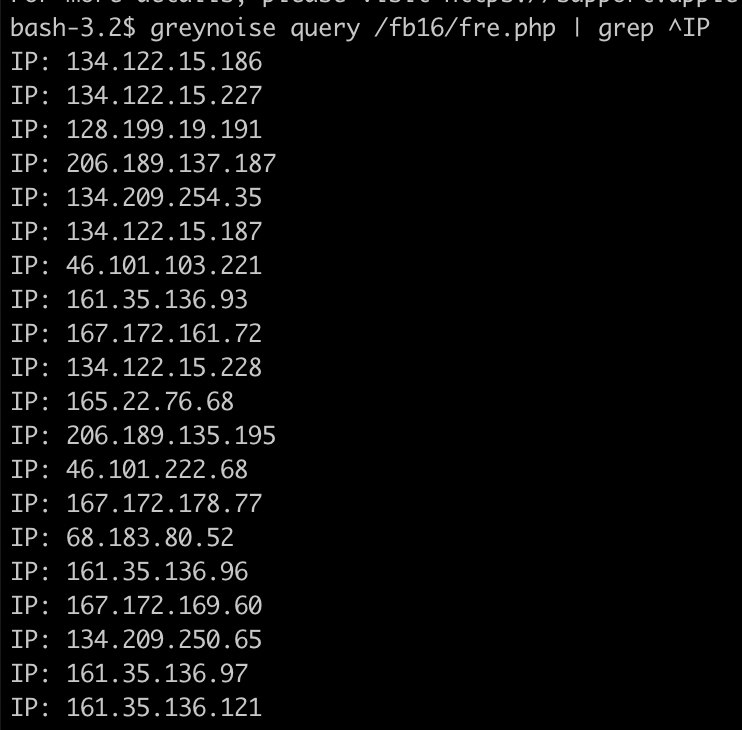
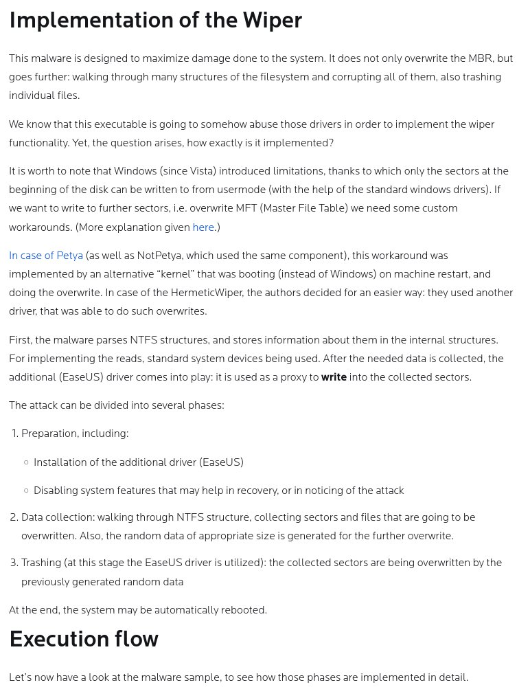
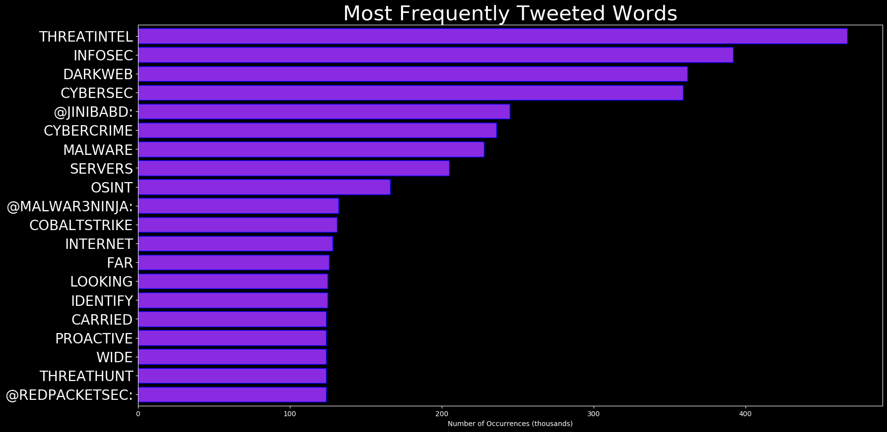
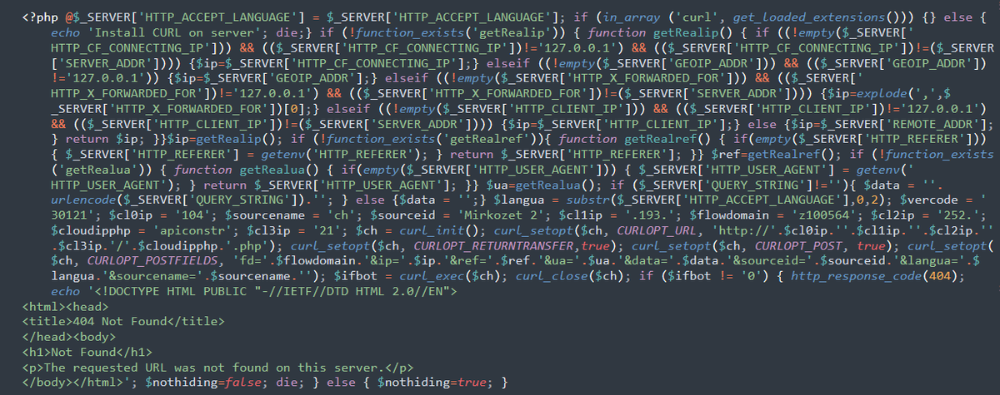
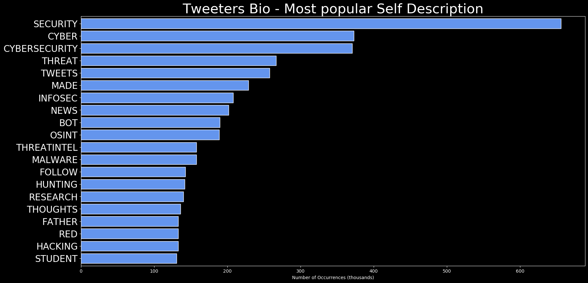
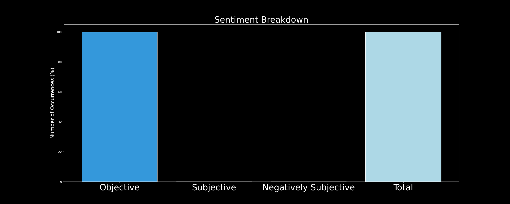

# DARKWIRE SOCIAL CYBER INSIGHTS 
&#x1F34E; **TOPIC = "threatintel"**

## AUTOMATED RESEARCH SUMMARY
     

|  Trending  |   Images | 
:-------------------------:|:-------------------------:
|        |   |   
 
 

  
The most popular user is: **BushidoToken**  
 

## My first blog of 2023 - Tips for Investigating Cybercrime Infrastructure

🔗https://t.co/bc4vEjPKIS

#CTI… https://t.co/xEIDMYnw5o 

  

### TRENDING SHARED IMAGE

|                **Sample-Tweets**        |
| :-------------: |
| RT @FalconFeedsio: New #ransomware alert! A group on the #darkweb is recruiting skilled pentesters with Active Directory Network experience… |
| Microsoft Windows Common Log File System Driver privilege escalation | CVE-2023-28252 - https://t.co/80FZgmco5x… https://t.co/YSDj1wIiYI |
| RT @CyberIQs_: Researchers disclose critical sandbox escape bug in vm2 sandbox library #infosec #infosecurity #cybersecurity #threatintel #… |

## RELATED METRICS 
| Metric | Value |
| ------------- | ------------- |
| #1 Most tweeted to  | **CyberIQs_** |
| #2 Most tweeted to  | **DailyOsint** |
| #3 Most tweeted to  | **FalconFeedsio** |
| NewProfiles (less than 10 days) | 0.04%  |
| Tweeters with < 10 followers  | 1.21%|
| Tweeters with > 1000000 followers  | 0.0%  |

## MOST POPULAR TWEET TERMS 

| Popularity Rank  | Term |
| ------------- | ------------- |
| first  | **INFOSEC**  |
| second  | **INFOSECURITY**  |
| third  | **THREATINTEL** |
| fourth  | **THREATINTEL…**  |
| fifth  | **@CYBERIQS_:**  |

## Twitter Bio Analysis
### SENTIMENT ANALYSIS

VIEWS WERE : **SUBJECTIVE**  (13.33%) & **NEGATIVELY-SUBJECTIVE** (20.0%) **OBJECTIVE** (66.67%)

### TWEET SAMPLE 
| Random value picked from array |
| ------------- |
|RT @CyberIQs_: Fortinet security advisory (AV23-205) #infosec #infosecurity #cybersecurity #threatintel #threatintelligence #hacking #cyber… |

### MOST RETWEETED 

| The most retweeted user is: **BushidoToken**  |
| ------------- |
| My first blog of 2023 - Tips for Investigating Cybercrime Infrastructure🔗https://t.co/bc4vEjPKIS#CTI… https://t.co/xEIDMYnw5o |

# Potential Fake Accounts
 
# ashim____USER INFO

 
`User ScreenName:` ashim____ 
 
`User chosen Name:` ashim 
 
`Is the User Verified?:` False 
 
`User signup date?:` Sun Apr 09 06:21:08 +0000 2023 
 
`User Description?:`  
 
`Followers?: `0 
 
`Following?:` 21 
 
`User URL?:` None 
 
`Location:`  
 
`Number of tweets extracted`  : 1 
 
`Profile image:` http://abs.twimg.com/sticky/default_profile_images/default_profile_normal.png 
 
`Number of tweets excluding replies:` 1 
 

 

 
## User Top tweeted words 
 
**RT** 1 , **@FALCONFEEDSIO:** 1 , **NEWLY** 1 , **EMERGED** 1 , **HACKING** 1 , **GROUP** 1 , **WHICH** 1 , **CLAIMS** 1 , **NEPAL** 1 , **TARGETED** 1 , **DEFACED** 1 , **FEW** 1 , **WEBSITES** 1 , **BELONGING** 1 , **PAKISTAN…** 1 , 
 
## What this user tweeted
 
RT @FalconFeedsio: A newly emerged hacking group which claims to be from Nepal is targeted and defaced few websites belonging to Pakistan.…
 
# HackOgrammerUSER INFO

 
`User ScreenName:` HackOgrammer 
 
`User chosen Name:` {Hack}Ogrammer 
 
`Is the User Verified?:` False 
 
`User signup date?:` Sat Apr 08 10:18:43 +0000 2023 
 
`User Description?:` Programmer | Penetration Tester | Offensive Coder | Bug Bounty Hunter 
 
`Followers?: `3 
 
`Following?:` 79 
 
`User URL?:` https://t.co/uWDbdRdpac 
 
`Location:` Cyber Space 
 
`Number of tweets extracted`  : 7 
 
`Profile image:` http://pbs.twimg.com/profile_images/1644824760344514561/SRqfRJRI_normal.jpg 
 
`Number of tweets excluding replies:` 7 
 

 

 
## User Top tweeted words 
 
**SANDBOX** 2 , **OSINT** 2 , **SECURITY** 2 , **RT** 1 , **@DAILYOSINT:** 1 , **NEED** 1 , **MALWARE** 1 , **SERVICE?** 1 , **TRY** 1 , **@CERT_EE** 1 , **'S** 1 , **CUCKOO** 1 , **ANALYZE** 1 , **SUSPICIOUS** 1 , **FILES** 1 , **HTTPS://TCO/BNMK…RT** 1 , **@HACKINARTICLES:** 1 , **NMAP** 1 , **CHEAT** 1 , **SHEET** 1 , 
 
## What this user tweeted
 
RT @DailyOsint: Do you need a malware sandbox as a service?

Try @CERT_EE 's Cuckoo Sandbox to analyze suspicious files.

https://t.co/bNmK…
 

<b> This report is AUTOMATED and not hand crafted, it is designed for pulling metrics on a given keyword or hashtag and performs a series of reporting and analysis.</b>  
### CONCLUSION & EXTERNAL ANALYSIS

*This is my [Adam McMurchie`s] opinion on the data from the tweets, it serves as no objective truth.Since the tweets themselves are a mixture of fact & opinion. 
Authors analytical summary on request.
**RECOMMENDATIONS** WILL BE UPDATED IN NEXT  24 HOURS  