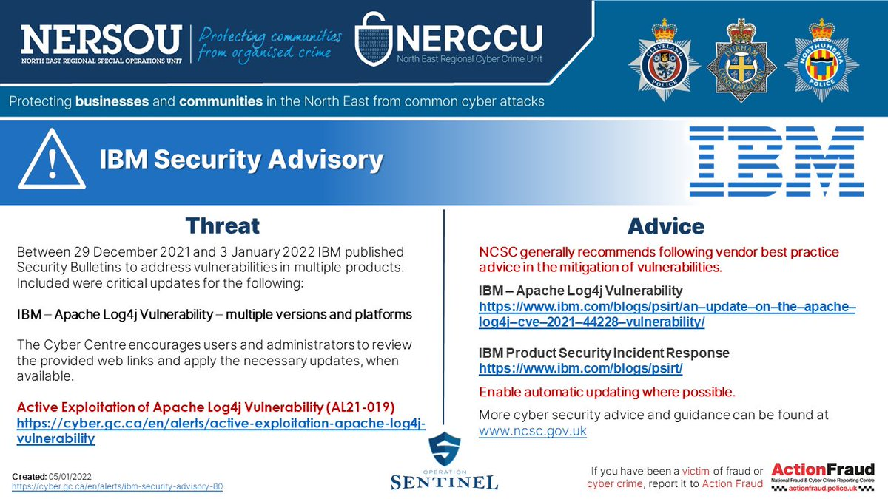
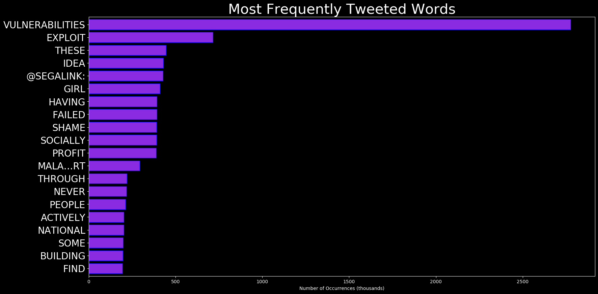
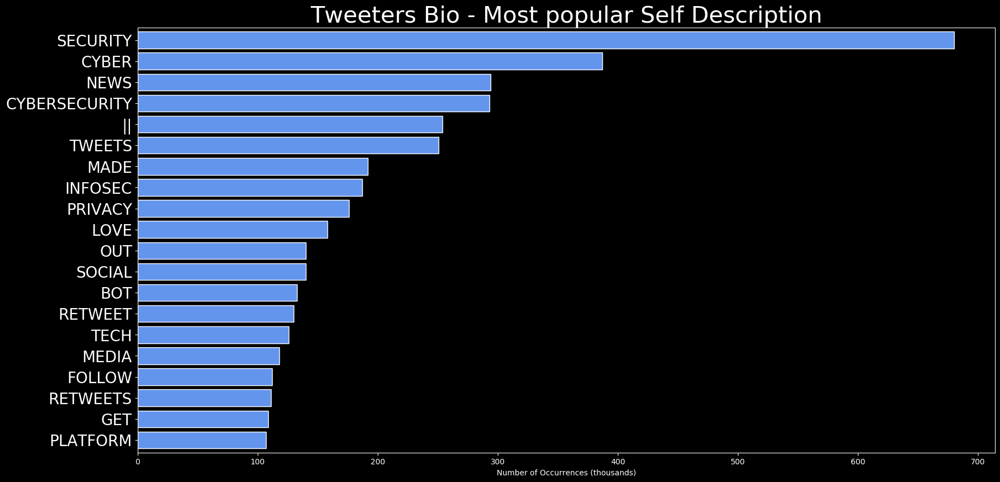
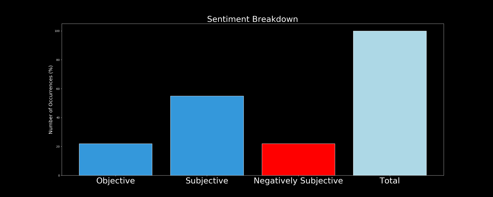

# DARKWIRE SOCIAL CYBER INSIGHTS 
&#x1F34E; **TOPIC = "vulnerabilities"**

## AUTOMATED RESEARCH SUMMARY
     

|  Trending  |   Images | 
:-------------------------:|:-------------------------:
|        |   |   
 
 

  
The most popular user is: **QuaiNetwork**  
 

## Quai Network's developers are focused on making the core codebase as light-weight and efficient as possible.

This… https://t.co/9kCO6ugG3G 

  

### TRENDING SHARED IMAGE

|                **Sample-Tweets**        |
| :-------------: |
| RT @rana__khalil: 🚨 New @WebSecAcademy video has been added to my Youtube channel! 🚨In this video, we cover the theory behind Access Cont… |
| RT @gregolear: Gal pulled no punches when discussing DeSantis’s vulnerabilities: “He’s not great in debates. He’s a fucking asshole; people… |
| Interesting @sysdig webinar coming up on #EthicalHacking! Hear 2 ex-Gartner analysts &amp; renowned ethical hacker… https://t.co/OMhZb1Vh2h |

## RELATED METRICS 
| Metric | Value |
| ------------- | ------------- |
| #1 Most tweeted to  | **gregolear** |
| #2 Most tweeted to  | **hackinarticles** |
| #3 Most tweeted to  | **RVAwonk** |
| NewProfiles (less than 10 days) | 0.32%  |
| Tweeters with < 10 followers  | 4.82%|
| Tweeters with > 1000000 followers  | 0.18%  |

## MOST POPULAR TWEET TERMS 

| Popularity Rank  | Term |
| ------------- | ------------- |
| first  | **VULNERABILITIES**  |
| second  | **INFOSEC**  |
| third  | **PENTESTING** |
| fourth  | **CYBERSECURITYTIPS**  |
| fifth  | **OSCP**  |

## Twitter Bio Analysis
### SENTIMENT ANALYSIS

VIEWS WERE : **SUBJECTIVE**  (35.71%) & **NEGATIVELY-SUBJECTIVE** (21.43%) **OBJECTIVE** (42.86%)

### TWEET SAMPLE 
| Random value picked from array |
| ------------- |
|On Jan 17 the US Cybersecurity and Infrastructure Security Agency (CISA) warned that a set of vulnerabilities found… https://t.co/tiEmrdcJZ0 |

### MOST RETWEETED 

| The most retweeted user is: **QuaiNetwork**  |
| ------------- |
| Quai Network's developers are focused on making the core codebase as light-weight and efficient as possible.This… https://t.co/9kCO6ugG3G |

# Potential Fake Accounts
 
# Angel002023USER INFO

 
`User ScreenName:` Angel002023 
 
`User chosen Name:` Angel 
 
`Is the User Verified?:` False 
 
`User signup date?:` Wed Jan 18 04:24:13 +0000 2023 
 
`User Description?:`  
 
`Followers?: `6 
 
`Following?:` 10 
 
`User URL?:` None 
 
`Location:`  
 
`Number of tweets extracted`  : 55 
 
`Profile image:` http://pbs.twimg.com/profile_images/1615565702479446016/yg8nrUsw_normal.png 
 
`Number of tweets excluding replies:` 55 
 

 

 
## User Top tweeted words 
 
**ABHI** 18 , **ABHIR** 18 , **AK** 17 , **BABY** 9 , **COULD** 8 , **AKSHARA** 8 , **SHOW** 7 , **EVEN** 6 , **COZ** 6 , **NAV** 6 , **@SHI_SHIYANI** 6 , **AWAY** 5 , **CARE** 5 , **RIGHTS** 4 , **@ITSMINI19** 4 , **DIDNT** 4 , **WIFE** 4 , **DON'T** 4 , **GO** 4 , **SH…** 4 , 
 
## What this user tweeted
 
@ItsMini19 Nav is orphan craving for a real family. AK should hve helped him settle down
But AK who wanted to keep… https://t.co/RQoKgBNWRX
 
# Ambr_enceUSER INFO

 
`User ScreenName:` Ambr_ence 
 
`User chosen Name:` Ambr_ence 
 
`Is the User Verified?:` False 
 
`User signup date?:` Sun Jan 15 20:27:13 +0000 2023 
 
`User Description?:` New account, making it comfortable. Coder and translator during the night, florist during the day (and proud of it). FR/EN/IT 
 
`Followers?: `2 
 
`Following?:` 30 
 
`User URL?:` None 
 
`Location:` he/him. Med. 
 
`Number of tweets extracted`  : 8 
 
`Profile image:` http://pbs.twimg.com/profile_images/1615357781048958977/2G0e9XWK_normal.jpg 
 
`Number of tweets excluding replies:` 8 
 

 

 
## User Top tweeted words 
 
**POUR** 3 , **LES** 2 , **RT** 1 , **@EYNOXART:** 1 , **"WATERPIXEL** 1 , **ART"** 1 , **NO1⃣8⃣** 1 , **©️** 1 , **♥️** 1 , **SCIFICONCEPT** 1 , **PORTRAITART** 1 , **ACTIVEARTCOLLECTIVE** 1 , **DIGITALART** 1 , **AIART** 1 , **MIXEDMEDIA** 1 , **SCIFI** 1 , **WATERPI…RT** 1 , **@THREE_CUBE:** 1 , **BUG** 1 , **BOUNTY** 1 , 
 
## What this user tweeted
 
RT @three_cube: Bug   Bounty Hunting, Part 1: Getting Started #bugbounty #infosec #vulnerabilities #cybersecurity #cyberwarrior

https://t.…
 
# cristofflozadaUSER INFO

 
`User ScreenName:` cristofflozada 
 
`User chosen Name:` cristOffjhOn | freetag 
 
`Is the User Verified?:` False 
 
`User signup date?:` Tue Jan 17 03:38:32 +0000 2023 
 
`User Description?:` #btc #eth #shiba #sol hold a little longer for the future 💯💯💯💯💯💯💯💯 follow you back 🙂
telegram acct :
@jhOncristoffLozada
looking forward pals 
 
`Followers?: `43 
 
`Following?:` 471 
 
`User URL?:` None 
 
`Location:`  
 
`Number of tweets extracted`  : 200 
 
`Profile image:` http://pbs.twimg.com/profile_images/1615192444626403328/23aja6v7_normal.jpg 
 
`Number of tweets excluding replies:` 266 
 

 

 
## User Top tweeted words 
 
**☀️** 69 , **DAILY** 55 , **PARTNERSHIP** 54 , **DIGEST** 52 , **X** 33 , **🚀** 26 , **@SMARTCRYPTONEW1:** 23 , **@DEFINEWS_INFO:** 20 , **@ARBITRUM_WORLD:** 19 , **PARTNERS** 18 , **@SMARTBSCNEWS:** 18 , **LIVE** 16 , **JAN** 15 , **🤝** 15 , **@FANTOM_UNIVERS:** 15 , **NFT** 14 , **@AVALANCHE_SPACE:** 14 , **🔶** 14 , **💟** 13 , **@METAVERS_WORLDS:** 13 , 
 
## What this user tweeted
 
RT @saulidity: We are happy to announce our partnership with @0xPolygon, enabling projects on Polygon to easily protect their smart contrac…
 
# jacksonville577USER INFO

 
`User ScreenName:` jacksonville577 
 
`User chosen Name:` Jacksonville577 
 
`Is the User Verified?:` False 
 
`User signup date?:` Sun Jan 22 09:55:01 +0000 2023 
 
`User Description?:` Send in your Hacking Issues and get Real Solution Fast
I'm available 24/7 
 
`Followers?: `1 
 
`Following?:` 10 
 
`User URL?:` None 
 
`Location:`  
 
`Number of tweets extracted`  : 3 
 
`Profile image:` http://pbs.twimg.com/profile_images/1617104169348878338/vow4wWDr_normal.jpg 
 
`Number of tweets excluding replies:` 3 
 

 

 
## User Top tweeted words 
 
**HACKING** 2 , **NEWPROFILEPIC** 1 , **HTTPS://TCO/P6UTCU0YYUSEND** 1 , **ISSUES** 1 , **REAL** 1 , **SOLUTION** 1 , **FAST** 1 , **I'M** 1 , **AVAILABLE** 1 , **24/7** 1 , **TWITTERDOWN** 1 , **FACEBOOKDOWN…** 1 , **HTTPS://TCO/0C7RT6O8VE@MARYFTADDOH** 1 , **@DOCTORTRE1** 1 , **SORRY** 1 , **MATE** 1 , **😅** 1 , **NEXT** 1 , **THING** 1 , **THEY'LL** 1 , 
 
## What this user tweeted
 
Send in your Hacking Issues and get Real Solution Fast
I'm available 24/7 
#hacking #twitterdown #facebookdown… https://t.co/0c7Rt6o8ve
 
# MonirHa75208716USER INFO

 
`User ScreenName:` MonirHa75208716 
 
`User chosen Name:` Monir hasan 
 
`Is the User Verified?:` False 
 
`User signup date?:` Sun Jan 22 07:45:08 +0000 2023 
 
`User Description?:` mom love 
 
`Followers?: `5 
 
`Following?:` 30 
 
`User URL?:` None 
 
`Location:`  
 
`Number of tweets extracted`  : 12 
 
`Profile image:` http://pbs.twimg.com/profile_images/1617070405910683654/MPotOYY-_normal.jpg 
 
`Number of tweets excluding replies:` 12 
 

 

 
## User Top tweeted words 
 
**@ESIKNETWORK** 11 , **@MONIRHA81177840** 5 , **@HENRYTEYLOR72** 5 , **@THOMAS507027811@CRYPTOGROWCLUB0** 5 , **@CRYPTOGROWCLUB0** 1 , **2023** 1 , **YEAR** 1 , **EXPLOSIVE** 1 , **MARKET** 1 , **NFT** 1 , **MOVE-2-EARN** 1 , **ECOLOGY** 1 , **WIT…** 1 , **HTTPS://TCO/EMRG7JGGVM@CRYPTOGROWCLUB0** 1 , **MANY** 1 , **PLAYERS** 1 , **INTERESTED** 1 , **PRICE** 1 , **TOKENS** 1 , **NFTS** 1 , 
 
## What this user tweeted
 
@CryptoGROWClub0 @EsikNetwork There is a very high chance of vulnerabilities in today's smart contracts, which allo… https://t.co/pAqtlx8Yju
 
# DrugsHackUSER INFO

 
`User ScreenName:` DrugsHack 
 
`User chosen Name:` Drugs Hack 
 
`Is the User Verified?:` False 
 
`User signup date?:` Sun Jan 22 04:37:33 +0000 2023 
 
`User Description?:`  
 
`Followers?: `7 
 
`Following?:` 1 
 
`User URL?:` None 
 
`Location:`  
 
`Number of tweets extracted`  : 65 
 
`Profile image:` http://pbs.twimg.com/profile_images/1617019243794501637/5oF-ci6F_normal.jpg 
 
`Number of tweets excluding replies:` 65 
 

 

 
## User Top tweeted words 
 
**CYBERSECURITY** 37 , **INFOSEC** 29 , **SECURITY** 21 , **TECH** 16 , **2** 16 , **1** 15 , **3** 14 , **HACKER** 10 , **HACKED** 10 , **4** 10 , **CYBERATTACK** 9 , **5** 9 , **CYBERSEC** 9 , **HACKING** 8 , **TOOLS** 7 , **2023** 6 , **PYTHON** 6 , **CODING** 5 , **LINUX** 5 , **TOP** 5 , 
 
## What this user tweeted
 
8 Most Common Computer Vulnerabilities 

1. Broken Authentication 
2. Poor Resource Mgt 
3. Out of Date Software/Ha… https://t.co/ZHPOwbRG6d
 
# behroozgholiza4USER INFO

 
`User ScreenName:` behroozgholiza4 
 
`User chosen Name:` zero 
 
`Is the User Verified?:` False 
 
`User signup date?:` Tue Jan 17 16:14:06 +0000 2023 
 
`User Description?:`  
 
`Followers?: `2 
 
`Following?:` 103 
 
`User URL?:` None 
 
`Location:`  
 
`Number of tweets extracted`  : 4 
 
`Profile image:` http://pbs.twimg.com/profile_images/1615381960829845509/e85kz_sq_normal.png 
 
`Number of tweets excluding replies:` 4 
 

 

 
## User Top tweeted words 
 
**VULN-EXP** 2 , **RT** 1 , **@0XRAYAN7:** 1 , **@BUGCROWD** 1 , **TIPS** 1 , **LAST** 1 , **P1** 1 , **:** 1 , **BUGBOUNTYTIPS** 1 , **1** 1 , **FOUND** 1 , **DEV** 1 , **PORTAL** 1 , **DEVELOPING** 1 , **REQUIREBASIC** 1 , **AUTH** 1 , **2** 1 , **SEARCH** 1 , **GITHUB** 1 , **"DO…RT** 1 , 
 
## What this user tweeted
 
RT @AnukulHexx: vuln-exp 90🚀 | Announcement📢

🤔What is vuln-exp?
vuln-exp is a challenge for me where I will be posting summaries related t…
 
# Fifth377261581USER INFO

 
`User ScreenName:` Fifth377261581 
 
`User chosen Name:` Fifth 
 
`Is the User Verified?:` False 
 
`User signup date?:` Wed Jan 18 15:32:22 +0000 2023 
 
`User Description?:` Trader 
 
`Followers?: `24 
 
`Following?:` 111 
 
`User URL?:` None 
 
`Location:`  
 
`Number of tweets extracted`  : 21 
 
`Profile image:` http://pbs.twimg.com/profile_images/1617147081013006336/blSclPxo_normal.jpg 
 
`Number of tweets excluding replies:` 21 
 

 

 
## User Top tweeted words 
 
**BITCOIN** 4 , **BTC** 3 , **BREAK** 3 , **AROUND** 3 , **PRICE** 3 , **FALLING** 2 , **WEDGE** 2 , **1)** 2 , **IS…** 2 , **CLASS** 2 , **TIME** 2 , **NEXT** 2 , **25K** 2 , **SOLID** 2 , **REVISIT** 2 , **SIGNAL** 2 , **TRUST** 2 , **ANY** 2 , **X** 2 , **ZOOMED** 1 , 
 
## What this user tweeted
 
Any asset class has the following vulnerabilities:
1) Political change/upheaval
2) Human error/element
3) Unexpecte… https://t.co/GqzQjaYZ5F
 
# artificial_OrgUSER INFO

 
`User ScreenName:` artificial_Org 
 
`User chosen Name:` Artificial Organization 
 
`Is the User Verified?:` False 
 
`User signup date?:` Wed Jan 18 15:46:21 +0000 2023 
 
`User Description?:` Hacking | Coding | Technology
Science, Technology & Engineering
👨‍💻 • Self Learner 🔁 | Self Educated🚨
👥 • HackingBasics \ Creator 
 
`Followers?: `9 
 
`Following?:` 69 
 
`User URL?:` https://t.co/VWDifwj6Cm 
 
`Location:`  
 
`Number of tweets extracted`  : 8 
 
`Profile image:` http://pbs.twimg.com/profile_images/1615737365674459136/2IeM0jBh_normal.png 
 
`Number of tweets excluding replies:` 8 
 

 

 
## User Top tweeted words 
 
**ORGANIZATION:** 3 , **SECURITY** 3 , **2023** 3 , **@ARTIFICIAL_ORG** 3 , **CYBERSECURITY** 3 , **TOP** 2 , **CYBER** 2 , **BEST** 2 , **HACKING** 2 , **LANGUAGES** 2 , **HACKERS** 2 , **ARTIFICIAL** 1 , **LEARNING** 1 , **RESOURCES** 1 , **HTTPS://TCO/UAKGY6J0UJ** 1 , **LEARNING…** 1 , **HTTPS://TCO/IVEWNYP468ARTIFICIAL** 1 , **DOES** 1 , **NMAP** 1 , **DO??** 1 , 
 
## What this user tweeted
 
Cyber Safety Tips 2023 @artificial_Org
#infosec #cybersecurity #cybersecuritytips #pentesting #oscp #redteam… https://t.co/IRIO1KOaW0
 
# ShrutiSuhane2USER INFO

 
`User ScreenName:` ShrutiSuhane2 
 
`User chosen Name:` Shruti Suhane 
 
`Is the User Verified?:` False 
 
`User signup date?:` Fri Jan 13 11:39:27 +0000 2023 
 
`User Description?:`  
 
`Followers?: `7 
 
`Following?:` 25 
 
`User URL?:` None 
 
`Location:`  
 
`Number of tweets extracted`  : 193 
 
`Profile image:` http://pbs.twimg.com/profile_images/1617209910508523524/irFTQ6Y0_normal.jpg 
 
`Number of tweets excluding replies:` 1315 
 

 

 
## User Top tweeted words 
 
**PRIYANKIT** 180 , **REUNITE** 123 , **BB16** 73 , **BB16RT** 43 , **@ROCKSTARJAHAAN:** 28 , **@PRIYANKITFC:** 18 , **PRIYANKITRT** 17 , **ANKITGUPTA** 17 , **@SAMRUDDHI9096:** 15 , **LOVE** 14 , **@COLORSTV** 13 , **PRIYANKA** 13 , **PRIYANKACHAHARCHOUDHARY** 13 , **GIVE** 11 , **HAI** 11 , **PLEASE** 10 , **@BIGGBOSS** 10 , **US** 10 , **REUNION** 10 , **ANKIT** 10 , 
 
## What this user tweeted
 
RT @mehfilmeinteri: Not a believer of astrology, but watching BB taunt relationships, target vulnerabilities &amp; script narratives is disturb…
 
# Pratima2121USER INFO

 
`User ScreenName:` Pratima2121 
 
`User chosen Name:` Pratima Pandey 
 
`Is the User Verified?:` False 
 
`User signup date?:` Sat Jan 14 11:23:59 +0000 2023 
 
`User Description?:`  
 
`Followers?: `7 
 
`Following?:` 10 
 
`User URL?:` None 
 
`Location:`  
 
`Number of tweets extracted`  : 193 
 
`Profile image:` http://pbs.twimg.com/profile_images/1614221788476747776/Av2CoZjI_normal.png 
 
`Number of tweets excluding replies:` 3209 
 

 

 
## User Top tweeted words 
 
**PRIYANKACHAHARCHOUDHARY** 82 , **PRIYANKA** 44 , **PRIYANKIT** 43 , **@ALIZEHVM:** 38 , **BBQUEENPRIYANKA** 36 , **BB16** 31 , **BIGGBOSS16** 27 , **PRIYANKAPALTAN** 23 , **PARI** 14 , **BIGGBOSS** 14 , **WON** 12 , **HAI** 11 , **CONGRATULATIONS** 11 , **@COLORSTV** 11 , **@ARSHIKOFFICIAL_:** 11 , **TINA** 9 , **ANKITGUPTA** 9 , **❤️** 9 , **PRIYANKAISTHEBOSS** 9 , **@PRLYANKAFCOFF:** 8 , 
 
## What this user tweeted
 
RT @PaperRiingsx: Strength cannot be defined as the absence of weakness. It's when you embrace those vulnerabilities, and make the best of…
 
# SooshS2USER INFO

 
`User ScreenName:` SooshS2 
 
`User chosen Name:` Soosh 
 
`Is the User Verified?:` False 
 
`User signup date?:` Mon Jan 16 01:08:14 +0000 2023 
 
`User Description?:` C4 Warden :D 
 
`Followers?: `58 
 
`Following?:` 106 
 
`User URL?:` None 
 
`Location:`  
 
`Number of tweets extracted`  : 12 
 
`Profile image:` http://pbs.twimg.com/profile_images/1614791607072751618/a6OX_IaG_normal.png 
 
`Number of tweets excluding replies:` 12 
 

 

 
## User Top tweeted words 
 
**@CODE4RENA** 11 , **@TRUST__90** 3 , **ISSUES** 3 , **FIRST** 3 , **@PATRICKALPHAC** 2 , **4** 2 , **3** 2 , **HTTPS://TCO/UVDJH6XHQ6** 2 , **UNDERSTAND** 2 , **PROTOCOL** 2 , **FOUND** 2 , **😎@SMACAUD1** 1 , **ADVISE** 1 , **MEANS** 1 , **STUDYING** 1 , **ALREADY** 1 , **LESS** 1 , **VALUABL…** 1 , **HTTPS://TCO/7A0XDIVBFZ@SMACAUD1** 1 , **TOOK** 1 , 
 
## What this user tweeted
 
RT @code4rena: Warden spotlight: @SooshS2 🔎

Quality &gt; quantity is demonstrated by Soosh, who, in the last 90 days, found 3 medium-sev vuln…
 
# Ravi28143418USER INFO

 
`User ScreenName:` Ravi28143418 
 
`User chosen Name:` Ravi Kumar 
 
`Is the User Verified?:` False 
 
`User signup date?:` Sat Jan 14 16:25:03 +0000 2023 
 
`User Description?:`  
 
`Followers?: `1 
 
`Following?:` 11 
 
`User URL?:` None 
 
`Location:`  
 
`Number of tweets extracted`  : 200 
 
`Profile image:` http://pbs.twimg.com/profile_images/1614297553968988161/ZMQ_JbUE_normal.png 
 
`Number of tweets excluding replies:` 731 
 

 

 
## User Top tweeted words 
 
**BLOOD** 159 , **SAINT** 85 , **GURMEET** 73 , **RAM** 72 , **BEAREALHERO** 71 , **JI** 69 , **RAHIM** 65 , **DERA** 55 , **SACHA** 49 , **DONATE** 47 , **SAUDA** 46 , **DONATION** 45 , **PEOPLE** 43 , **SAVE** 34 , **VOLUNTEERS** 33 , **FOLLOWERS** 29 , **LIFE** 28 , **LIVES** 23 , **INSPIRATION** 22 , **DONATING** 20 , 
 
## What this user tweeted
 
RT @anshuls88868314: Dera Sacha Sauda volunteers emerge as a big hope for them.

Where the vulnerabilities were on the rise for the destitu…RT @anshuls88868314: They distributed warm clothes kits to all such people who were at high risk of winter vulnerabilities.
#GiftOfSmile ht…
 
# YouthAriseJA876USER INFO

 
`User ScreenName:` YouthAriseJA876 
 
`User chosen Name:` Youth Arise 
 
`Is the User Verified?:` False 
 
`User signup date?:` Fri Jan 20 04:03:44 +0000 2023 
 
`User Description?:` Youth Arise Jamaica is a youth-led youth development non-government organization our market value is the development of marginalized youth. 
 
`Followers?: `3 
 
`Following?:` 49 
 
`User URL?:` None 
 
`Location:`  
 
`Number of tweets extracted`  : 6 
 
`Profile image:` http://pbs.twimg.com/profile_images/1616292795131502594/08skkID7_normal.jpg 
 
`Number of tweets excluding replies:` 6 
 

 

 
## User Top tweeted words 
 
**YOUTH** 3 , **BUILD** 2 , **@JAMAICAOBSERVER:** 2 , **FOLLOW** 1 , **PLATFORMS** 1 , **MESSAGE** 1 , **US** 1 , **WHATSAPP** 1 , **LEARN** 1 , **JOIN** 1 , **MEMBERSHIP:** 1 , **HTTPS://TCO/1ELVAF8R3DYOUNG** 1 , **PEOPLE** 1 , **FUTURE** 1 , **PROGRESSIVE** 1 , **SOCIETY** 1 , **FOUNDATIONS** 1 , **TOMORROW’S** 1 , **WORLD** 1 , **JAMAICAN** 1 , 
 
## What this user tweeted
 
YouthAriseJ is a youth-led youth development NGO, our market value is to build and shape the innate capacities &amp; fo… https://t.co/LFfOde2SB2
 
# CryptoQuicklyUSER INFO

 
`User ScreenName:` CryptoQuickly 
 
`User chosen Name:` Crypto Quickly 
 
`Is the User Verified?:` False 
 
`User signup date?:` Fri Jan 20 00:15:24 +0000 2023 
 
`User Description?:` Your go-to source for all the latest crypto news, summarized through GPT Ai and delivered straight to your timeline. 

News without the clutter! 
 
`Followers?: `2 
 
`Following?:` 1 
 
`User URL?:` None 
 
`Location:`  
 
`Number of tweets extracted`  : 17 
 
`Profile image:` http://pbs.twimg.com/profile_images/1616232811991629832/BWsGubkh_normal.jpg 
 
`Number of tweets excluding replies:` 17 
 

 

 
## User Top tweeted words 
 
**ITS** 6 , **CRYPTO** 5 , **INDUSTRY** 3 , **BITCOIN** 3 , **POSITIVE** 3 , **PRICE** 3 , **REGULATORS** 2 , **ANTI-MONEY** 2 , **LAUNDERING** 2 , **MILLION** 2 , **ETHEREUM** 2 , **MOST** 2 , **ACCEPTING** 2 , **CRYPTONEWSTHE** 2 , **MARK** 2 , **MOVEMENT** 2 , **15** 2 , **DAYS** 2 , **STREAK** 2 , **BTC** 2 , 
 
## What this user tweeted
 
BREAKING: Security vulnerabilities have been found in Netcomm and TP-Link routers that could allow for remote code… https://t.co/hstLtST75B
 

<b> This report is AUTOMATED and not hand crafted, it is designed for pulling metrics on a given keyword or hashtag and performs a series of reporting and analysis.</b>  
### CONCLUSION & EXTERNAL ANALYSIS

*This is my [Adam McMurchie`s] opinion on the data from the tweets, it serves as no objective truth.Since the tweets themselves are a mixture of fact & opinion. 
Authors analytical summary on request.
**RECOMMENDATIONS** WILL BE UPDATED IN NEXT  24 HOURS  