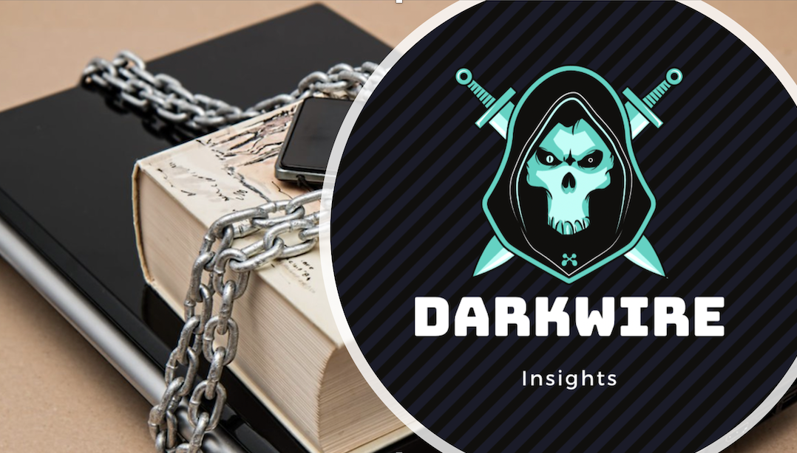
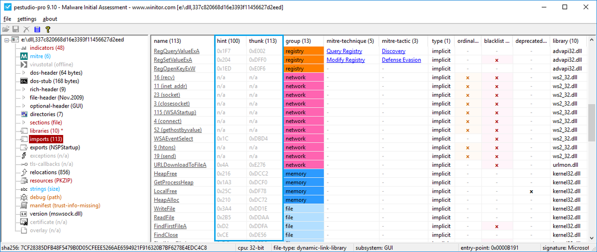
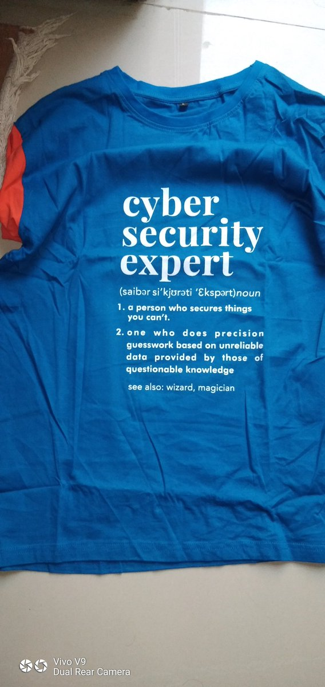
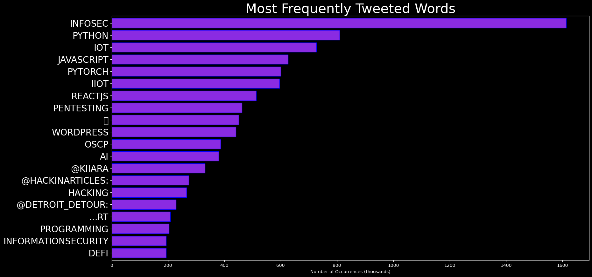
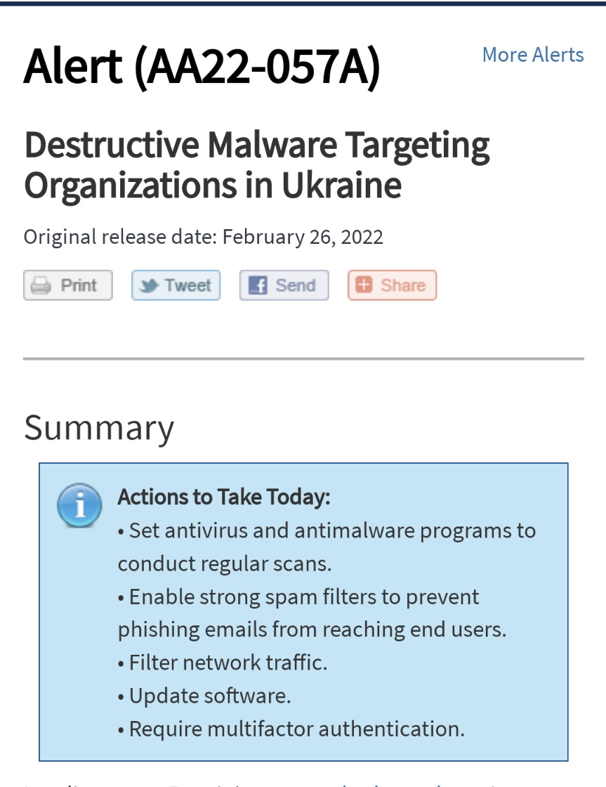
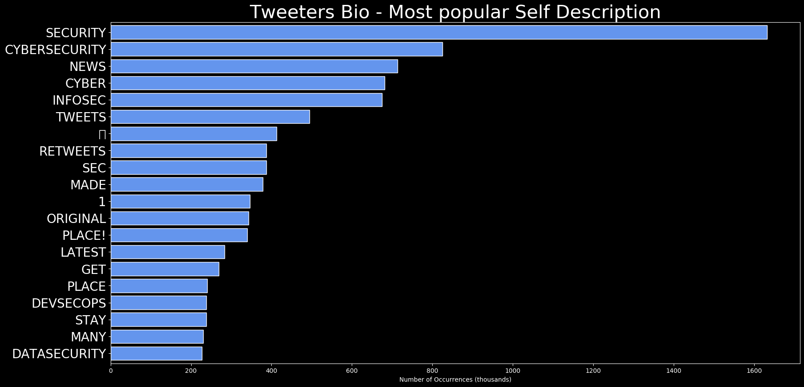
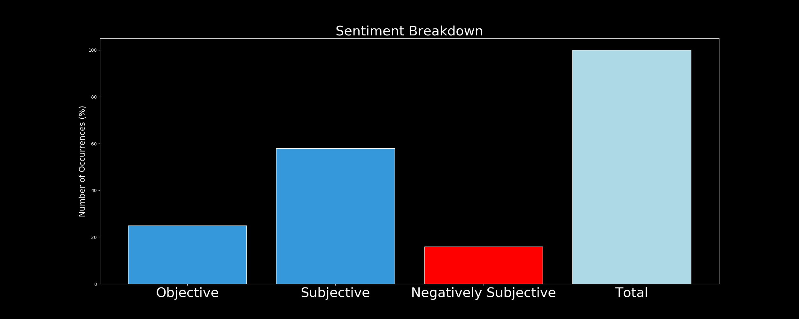

# DARKWIRE SOCIAL CYBER INSIGHTS 
&#x1F34E; **TOPIC = "infosec"**

## AUTOMATED RESEARCH SUMMARY
     

|  Trending  |   Images | 
:-------------------------:|:-------------------------:
|        |   |   
 
 

  
The most popular user is: **PeterObi**  
 

## In the past few days, I have observed various campaigns of calumny directed at my person, with the latest being all… https://t.co/feNmgSQu8F 

  

### TRENDING SHARED IMAGE

|                **Sample-Tweets**        |
| :-------------: |
| Exciting news 4! We’re thrilled to announce that Dr. Deepak Kumar will be our speaker for the topic “Digital Forens… https://t.co/9dMnnChm7c |
| RT @ryanlindley: Galen Weston just got a yearly raise that equals the same amount the Daily Bread Food Bank needs to operate per month.It… |
| Using #Observability to Power a Smarter #Cybersecurity Strategy &gt; https://t.co/uJXaGFccGZ #security #infosec… https://t.co/Y6SMJVXb6n |

## RELATED METRICS 
| Metric | Value |
| ------------- | ------------- |
| #1 Most tweeted to  | **hackinarticles** |
| #2 Most tweeted to  | **hack_git** |
| #3 Most tweeted to  | **williamstyles23** |
| NewProfiles (less than 10 days) | 0.2%  |
| Tweeters with < 10 followers  | 4.54%|
| Tweeters with > 1000000 followers  | 0.0%  |

## MOST POPULAR TWEET TERMS 

| Popularity Rank  | Term |
| ------------- | ------------- |
| first  | **INFOSEC**  |
| second  | **PENTESTING**  |
| third  | **INFOSECURITY** |
| fourth  | **CYBERSECURITYTIPS**  |
| fifth  | **@HACKINARTICLES:**  |

## Twitter Bio Analysis
### SENTIMENT ANALYSIS

VIEWS WERE : **SUBJECTIVE**  (40.0%) & **NEGATIVELY-SUBJECTIVE** (0.0%) **OBJECTIVE** (60.0%)

### TWEET SAMPLE 
| Random value picked from array |
| ------------- |
|RT @williamstyles23: Want to display tournament results with fewer characters? Tetragrams are the way to go.𝌆 𝌮 𝍖 @FavourableGroup#meme… |

### MOST RETWEETED 

| The most retweeted user is: **PeterObi**  |
| ------------- |
| In the past few days, I have observed various campaigns of calumny directed at my person, with the latest being all… https://t.co/feNmgSQu8F |

# Potential Fake Accounts
 
# sky_cryptUSER INFO

 
`User ScreenName:` sky_crypt 
 
`User chosen Name:` sky 
 
`Is the User Verified?:` False 
 
`User signup date?:` Tue Apr 04 18:57:53 +0000 2023 
 
`User Description?:` Securing the past from breaches.
#cyberarchive 
 
`Followers?: `0 
 
`Following?:` 11 
 
`User URL?:` None 
 
`Location:`  
 
`Number of tweets extracted`  : 2 
 
`Profile image:` http://pbs.twimg.com/profile_images/1643327961007898627/WPFoEn8j_normal.jpg 
 
`Number of tweets excluding replies:` 2 
 

 

 
## User Top tweeted words 
 
**CYBERSECURITY** 2 , **RT** 1 , **@SHUBHAM_PEN:** 1 , **BEST** 1 , **HACKING** 1 , **TOOLS** 1 , **CREDIT:** 1 , **HTTPS://TCO/W84HFSUQGQ** 1 , **INFOSEC** 1 , **PENTESTING** 1 , **OSCP** 1 , **INFORMATIONSECURITY** 1 , **HA…EXCITED** 1 , **LAUNCH** 1 , **ARCHIVE** 1 , **ACCOUNT!** 1 , **FOLLOW** 1 , **ALONG** 1 , **EXPERT** 1 , **INSIGHTS** 1 , 
 
## What this user tweeted
 
RT @Shubham_pen: Best of Hacking Tools 
Credit: https://t.co/W84HfSuqgQ

#infosec #cybersecurity #pentesting #oscp #informationsecurity #ha…
 
# NjiJesse88066USER INFO

 
`User ScreenName:` NjiJesse88066 
 
`User chosen Name:` nji jesse 
 
`Is the User Verified?:` False 
 
`User signup date?:` Wed Apr 05 15:16:16 +0000 2023 
 
`User Description?:`  
 
`Followers?: `1 
 
`Following?:` 1 
 
`User URL?:` None 
 
`Location:`  
 
`Number of tweets extracted`  : 3 
 
`Profile image:` http://pbs.twimg.com/profile_images/1643633663244943360/p3yXMAhq_normal.png 
 
`Number of tweets excluding replies:` 3 
 

 

 
## User Top tweeted words 
 
**–** 2 , **INFOSEC** 2 , **BUGCROWD** 2 , **BUGBOUNTYTIPS** 2 , **BUGBOUNTYTIP** 2 , **CYBERSECURITY** 2 , **100DAYSOFCODE…** 2 , **SEO** 1 , **POWERSUITE** 1 , **ENTERPRISE** 1 , **V975** 1 , **FULL** 1 , **ACTIVATED** 1 , **MARKETING** 1 , **TOOL** 1 , **DISCOUNT** 1 , **100%** 1 , **OFF** 1 , **HTTPS://TCO/84LHT8ZHX8…** 1 , **HTTPS://TCO/0QGBMEXQKKTRENDING** 1 , 
 
## What this user tweeted
 
SEO PowerSuite Enterprise v97.5 Full Activated – Marketing Tool – Discount 100% OFF https://t.co/84lHT8zHX8… https://t.co/0QgBMExQkKTrending https://t.co/THY0L1iDe3 #infosec #bugcrowd #bugbountytips #bugbountytip #CyberSecurity #100DaysOfCode… https://t.co/lvjXUf3FFT
 
# Jull420frUSER INFO

 
`User ScreenName:` Jull420fr 
 
`User chosen Name:` Jull420 
 
`Is the User Verified?:` False 
 
`User signup date?:` Mon Apr 03 04:12:47 +0000 2023 
 
`User Description?:` Bon plan beuh en cash main propre 🇫🇷 Contactez-moi sur
Telegram :@Zoneverte
Snap :@bedo420fr_ce
Passez vos commandes 🇫🇷 
 
`Followers?: `5 
 
`Following?:` 58 
 
`User URL?:` None 
 
`Location:` Rennes, France 
 
`Number of tweets extracted`  : 112 
 
`Profile image:` http://pbs.twimg.com/profile_images/1642749590452445185/pk8lROdQ_normal.jpg 
 
`Number of tweets excluding replies:` 112 
 

 

 
## User Top tweeted words 
 
**PSG** 39 , **@FRANCELEGAL420:** 24 , **100DAYSOFCODE** 20 , **@BEUH420FR_CE:** 20 , **MACHINELEARNING** 17 , **@CANNABI2000:** 17 , **@WEEDLEGAL420F:** 16 , **@JULL420FR:** 15 , **DATASECURITY** 14 , **GAMEDEV** 13 , **RANSOMWARE** 13 , **CLOUDSECURITY** 13 , **PRIVACY** 12 , **PHISHING** 12 , **…RT** 11 , **FRANCEVERTE** 10 , **PROGRAMMING** 9 , **PARIS** 9 , **SNAP👻:BEDO420FR_CE** 9 , **LYON** 8 , 
 
## What this user tweeted
 
RT @Jull420fr: Teleg:Zoneverte
#Ransomware #PSG #EVETOT #DebatVerkiezingen #FranceVerte
#DataSecurity #100DaysOfCode #CloudSecurity #Machin…
 
# SecureutechUSER INFO

 
`User ScreenName:` Secureutech 
 
`User chosen Name:` SecureU 
 
`Is the User Verified?:` False 
 
`User signup date?:` Thu Mar 30 15:09:56 +0000 2023 
 
`User Description?:` Keeping you safe online 
 
`Followers?: `2 
 
`Following?:` 0 
 
`User URL?:` None 
 
`Location:`  
 
`Number of tweets extracted`  : 29 
 
`Profile image:` http://pbs.twimg.com/profile_images/1641470169120665601/TKU-oed4_normal.jpg 
 
`Number of tweets excluding replies:` 29 
 

 

 
## User Top tweeted words 
 
**USE** 8 , **CYBERSECURITY** 7 , **REPUTABLE** 5 , **ACCOUNTS** 4 , **WEB3** 4 , **USING** 4 , **PROTECT** 4 , **SECURITY** 3 , **BEFORE** 3 , **CAUTIOUS** 3 , **AVOID** 3 , **PRIVATE** 3 , **OTHER** 3 , **VERIFY** 3 , **INFORMATION** 3 , **CYBERCRIMINALS** 3 , **REGULARLY** 3 , **ONLINE** 3 , **INCIDENT** 2 , **RESPONSE** 2 , 
 
## What this user tweeted
 
🤝 Partner with reputable cybersecurity firms for threat intelligence, incident response, and security consulting. S… https://t.co/iexzC3vs0m
 
# actinfo001USER INFO

 
`User ScreenName:` actinfo001 
 
`User chosen Name:` Act Info 
 
`Is the User Verified?:` False 
 
`User signup date?:` Mon Apr 03 12:16:46 +0000 2023 
 
`User Description?:`  
 
`Followers?: `0 
 
`Following?:` 1 
 
`User URL?:` None 
 
`Location:`  
 
`Number of tweets extracted`  : 8 
 
`Profile image:` http://pbs.twimg.com/profile_images/1642863710804013056/1NXhMXGv_normal.png 
 
`Number of tweets excluding replies:` 8 
 

 

 
## User Top tweeted words 
 
**THREATINTELLIGENCE** 6 , **THREATINTEL** 3 , **RANSOMWARE** 2 , **INCIDENTRESPONSE** 2 , **INFOSEC** 2 , **TEST** 1 , **CLOUDSECURITYTEST** 1 , **CLOUDSECURITYTHREAT** 1 , **THREATTEST** 1 , **THREAT** 1 , **THREATSTHREATINTELLIGENCE** 1 , **THREATRANSOMWARETEST** 1 , **THREATTHREATINTEL** 1 , **HEY** 1 , **GUYS** 1 , 
 
## What this user tweeted
 
Test #ThreatIntel #ThreatIntelligence #ransomware #incidentresponse #infosec #cloudsecurityTest
#ThreatIntel  #ThreatIntelligence #ransomware #incidentresponse #infosec  #cloudsecurity
 
# 0utRoseUSER INFO

 
`User ScreenName:` 0utRose 
 
`User chosen Name:` OutRose 
 
`Is the User Verified?:` False 
 
`User signup date?:` Tue Mar 28 03:03:41 +0000 2023 
 
`User Description?:`  
 
`Followers?: `0 
 
`Following?:` 31 
 
`User URL?:` None 
 
`Location:`  
 
`Number of tweets extracted`  : 1 
 
`Profile image:` http://abs.twimg.com/sticky/default_profile_images/default_profile_normal.png 
 
`Number of tweets excluding replies:` 1 
 

 

 
## User Top tweeted words 
 
**COMPLETED** 1 , **GRABTHEPHISHER** 1 , **CHALLENGE** 1 , **HTTPS://TCO/C2NLOXTLKQ** 1 , **BLUEYARD** 1 , **CYBERDEFENDERS** 1 , **BLUETEAM** 1 , **DFIR** 1 , **INFOSEC…** 1 , **HTTPS://TCO/L5ML7NB48S** 1 , 
 
## What this user tweeted
 
I completed GrabThePhisher challenge https://t.co/c2nlOXtLKq #BlueYard #CyberDefenders #BlueTeam #DFIR #InfoSec… https://t.co/L5ml7nb48S
 
# Bug_hunt001USER INFO

 
`User ScreenName:` Bug_hunt001 
 
`User chosen Name:` Bug_hunter 
 
`Is the User Verified?:` False 
 
`User signup date?:` Mon Mar 27 01:03:16 +0000 2023 
 
`User Description?:` This channel ‘Bug_Hunter’ is now on Twitter 🐞# https://t.co/cVGd85VITA 
 
`Followers?: `9 
 
`Following?:` 133 
 
`User URL?:` https://t.co/PPsGXQwHG9 
 
`Location:` Malappuram (Perintalmanna) 
 
`Number of tweets extracted`  : 17 
 
`Profile image:` http://pbs.twimg.com/profile_images/1640165064828399617/IpXkLAAP_normal.jpg 
 
`Number of tweets excluding replies:` 18 
 

 

 
## User Top tweeted words 
 
**@PSG_ENGLISH:** 3 , **BOUNTY** 2 , **TIME** 2 , **FIRST** 2 , **NEW** 2 , **@HACKINARTICLES:** 2 , **INFOSEC** 2 , **CYBERSECURITY** 2 , **CYBERSECURITYTIPS** 2 , **AIX** 2 , **GOOGLE** 2 , **INJECTION** 2 , **RT** 1 , **@ADARSHSHETTYY:** 1 , **YAY** 1 , **AWARDED** 1 , **$35000** 1 , **@HACKER0X01!** 1 , **I'VE** 1 , **CROSSED** 1 , 
 
## What this user tweeted
 
RT @adarshshettyy: Yay, I was awarded a $35,000 bounty on @Hacker0x01! 
With this I've crossed $100,000 in all time rewards from Hackerone.…
 
# Nabin071362898USER INFO

 
`User ScreenName:` Nabin071362898 
 
`User chosen Name:` Nabin 
 
`Is the User Verified?:` False 
 
`User signup date?:` Wed Apr 05 02:45:50 +0000 2023 
 
`User Description?:` BUG HUNTER 
 
`Followers?: `0 
 
`Following?:` 33 
 
`User URL?:` None 
 
`Location:` HYDERABAD 
 
`Number of tweets extracted`  : 2 
 
`Profile image:` http://pbs.twimg.com/profile_images/1643444806734032896/7O-xDtkt_normal.png 
 
`Number of tweets excluding replies:` 2 
 

 

 
## User Top tweeted words 
 
**BUG** 2 , **=** 2 , **RT** 1 , **@TRICK3ST:** 1 , **CALLING** 1 , **BOUNTY** 1 , **HUNTERS** 1 , **📣** 1 , **INVENTORY** 1 , **ROOM** 1 , **PUBLIC** 1 , **PROGRAM** 1 , **MONITOR** 1 , **SUBDOMAINS** 1 , **WEB** 1 , **SERVERS…RT** 1 , **@JHADDIX:** 1 , **INFOSEC** 1 , **SUPER-THREAD** 1 , **BIG** 1 , 
 
## What this user tweeted
 
RT @Jhaddix: = Infosec super-thread =

A big part of my presos is tools/resources I like for offensive security &amp; bug hunting. 

Here's a t…
 

<b> This report is AUTOMATED and not hand crafted, it is designed for pulling metrics on a given keyword or hashtag and performs a series of reporting and analysis.</b>  
### CONCLUSION & EXTERNAL ANALYSIS

*This is my [Adam McMurchie`s] opinion on the data from the tweets, it serves as no objective truth.Since the tweets themselves are a mixture of fact & opinion. 
Authors analytical summary on request.
**RECOMMENDATIONS** WILL BE UPDATED IN NEXT  24 HOURS  