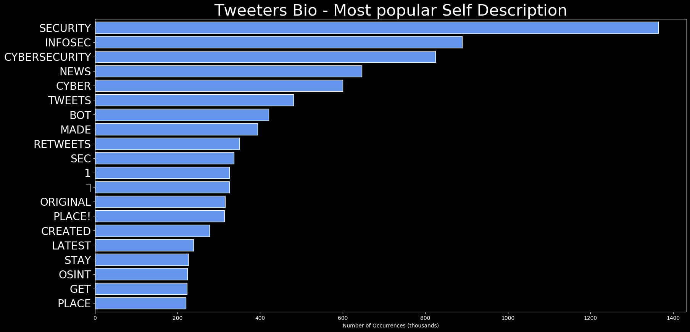
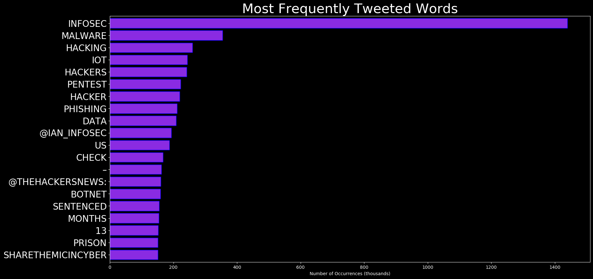
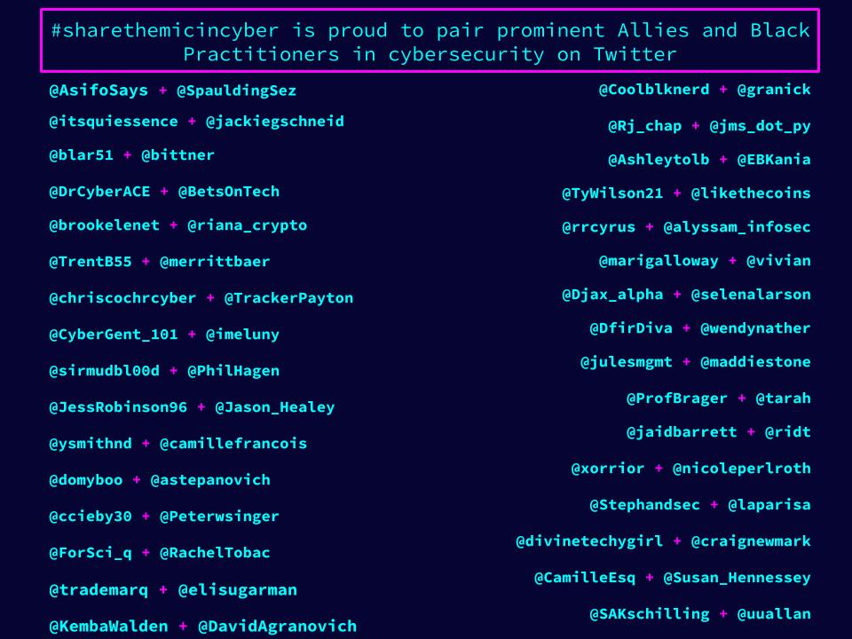
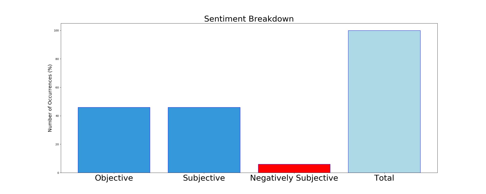

# DARKWIRE SOCIAL CYBERINSIGHTS 
&#x1F34E; **TOPIC = "malware"**

## AUTOMATED RESEARCH SUMMARY
|  Trending  |   Images | 
:-------------------------:|:-------------------------:
|        |   |   

     
 
 
    
  
<b> This report is AUTOMATED and not hand crafted, it is designed for pulling metrics on a given keyword or hashtag and performs a series of reporting and analysis.</b>  
  

### TRENDING SHARED IMAGE

|                **Sample-Tweets**        |
| :-------------: |
| RT @CheckPointSW: The world has become mobile. Most organizations only rely on Unified Endpoint Management #UEM and #MDM which is not nearl… |
| RT @TrendMicroRSRCH: #XORDDoS infiltrates #Docker servers to infect hosted containers, while #Kaiji deploys its own container. More details… |
| @ashdubh malwarebytes is (atleast how most people use it) a scan you can run on your pc to detect general malware a… https://t.co/x8EfPxCZFO |

The most popular user is: **YakuzaFriday**

 Friday at last... https://t.co/KxOPoOSka4

## RELATED METRICS 
| Metric | Value |
| ------------- | ------------- |
| #1 Most tweeted to  | **TheHackersNews** |
| #2 Most tweeted to  | **USCERT_gov** |
| #3 Most tweeted to  | **DfirDiva** |
| NewProfiles (less than 10 days) | 0.9%  |
| Tweeters with < 10 followers  | 3.9%|
| Tweeters with > 1000000 followers  | 0.0%  |

## MOST POPULAR TWEET TERMS 

| Popularity Rank  | Term |
| ------------- | ------------- |
| first  | **MALWARE**  |
| second  | **PHISHING**  |
| third  | **IOT** |
| fourth  | **SENTENCED**  |
| fifth  | **BOTNET**  |

## Twitter Bio Analysis
### SENTIMENT ANALYSIS

VIEWS WERE : **SUBJECTIVE**  (6.67%) & **NEGATIVELY-SUBJECTIVE** (20.0%) **OBJECTIVE** (73.33%)

### TWEET SAMPLE 
| Random value picked from array |
| ------------- |
|RT @QContrarian: Maze #ransomware operators claimed on their website that they breached/locked the network of LG Electronics📌 #hackers sai… |

### MOST RETWEETED 

| The most retweeted user is: **YakuzaFriday**  |
| ------------- |
| Friday at last... https://t.co/KxOPoOSka4 |

# Potential Fake Accounts
 
# JanHbotUSER INFO

 
`User ScreenName:` JanHbot 
 
`User chosen Name:` JanH Bot 
 
`Is the User Verified?:` False 
 
`User signup date?:` Fri Jun 26 09:00:27 +0000 2020 
 
`User Description?:` News, alerts and such. Scanning the crypto markets. 
 
`Followers?: `0 
 
`Following?:` 0 
 
`User URL?:` None 
 
`Location:`  
 
`Number of tweets extracted`  : 33 
 
`Profile image:` http://pbs.twimg.com/profile_images/1276534330584686593/VgS5qc9p_normal.png 
 
`Number of tweets excluding replies:` 33 
 

 

 
## User Top tweeted words 
 
**BITCOIN** 9 , **BTC** 3 , **OIL** 2 , **NEWSBTC** 2 , **NASDAQ** 2 , **DATA** 2 , **ANALYSIS** 2 , **NEWS** 2 , **AML** 2 , **BITCOIN'S** 2 , **JUNE** 2 , **COINDESK** 2 , **BLOCKCHAIN** 2 , **ANALYST:** 2 , **NEXT** 2 , **DROP** 2 , **MAY** 2 , **LAST** 2 , **TIME** 2 , **BELOW** 2 , 
 
## What this user tweeted
 
****
DECRYPT.COMALWARE THAT USES BITCOIN'S BLOCKCHAIN COULD BE A PAID SERVICE - DECRYPT
https://t.co/3mdRRvwxHA
 
# Bropha9USER INFO

 
`User ScreenName:` Bropha9 
 
`User chosen Name:` Bropha 
 
`Is the User Verified?:` False 
 
`User signup date?:` Tue Jun 23 06:32:28 +0000 2020 
 
`User Description?:` karateka tr@iner,,self respect self reliance. 
 
`Followers?: `12 
 
`Following?:` 150 
 
`User URL?:` None 
 
`Location:` Central Zambia 
 
`Number of tweets extracted`  : 4 
 
`Profile image:` http://pbs.twimg.com/profile_images/1275316664704348161/1zEPbLPo_normal.jpg 
 
`Number of tweets excluding replies:` 4 
 

 

 
## User Top tweeted words 
 
**CYBERSECURITY** 2 , **RT** 1 , **@VR_OASIS:** 1 , **MAINSTREAM** 1 , **MEDIA** 1 , **VS** 1 , **VRI** 1 , **LOOK** 1 , **FORWARD** 1 , **DAY** 1 , **EAT** 1 , **WORDS** 1 , **HTTPS://TCO/Y1MZLL7KWART** 1 , **@DFIRDIVA:** 1 , **LINKS** 1 , **100** 1 , **FREE** 1 , **DFIR** 1 , **TRAINING** 1 , **COURSES** 1 , 
 
## What this user tweeted
 
RT @DfirDiva: Links to over 100 FREE DFIR &amp; Cybersecurity Training Courses

Categories include:

-General Cybersecurity
-Incident Response…
 
# MK0hgaUSER INFO

 
`User ScreenName:` MK0hga 
 
`User chosen Name:` MASTER-K0HGA 
 
`Is the User Verified?:` False 
 
`User signup date?:` Thu Jun 25 22:29:32 +0000 2020 
 
`User Description?:` CAUTION: 18+ ONLY . I post lewdy
Hey so, I'm an average adult dummy who works a part time job in retail. But I do draw a lot in my free time! 
Comms are open !! 
 
`Followers?: `3 
 
`Following?:` 3 
 
`User URL?:` https://t.co/wLnL1QBlsq 
 
`Location:`  
 
`Number of tweets extracted`  : 9 
 
`Profile image:` http://pbs.twimg.com/profile_images/1276579137780682753/wdy32sWD_normal.jpg 
 
`Number of tweets excluding replies:` 9 
 

 

 
## User Top tweeted words 
 
**I'VE** 3 , **POST** 2 , **ANYWAYS** 2 , **ALWAYS** 2 , **PM** 2 , **I'LL** 2 , **HERE** 2 , **DOES** 1 , **ANYBODY** 1 , **WANNA** 1 , **UNNATURALLY** 1 , **LONG** 1 , **LIST** 1 , **OCS** 1 , **GOT?** 1 , **NAHHH?BTW** 1 , **I'MMA** 1 , **SKETCHES** 1 , **MADE** 1 , **DISCORD** 1 , 
 
## What this user tweeted
 
Them's sneaky banana loving monkeys know how to use malware apparently, Who knew~! Anyways thank you so much… https://t.co/u2nF5Et793
 
# Aj41119874USER INFO

 
`User ScreenName:` Aj41119874 
 
`User chosen Name:` Aj 
 
`Is the User Verified?:` False 
 
`User signup date?:` Mon Jun 22 13:14:43 +0000 2020 
 
`User Description?:`  
 
`Followers?: `1 
 
`Following?:` 8 
 
`User URL?:` None 
 
`Location:`  
 
`Number of tweets extracted`  : 17 
 
`Profile image:` http://abs.twimg.com/sticky/default_profile_images/default_profile_normal.png 
 
`Number of tweets excluding replies:` 17 
 

 

 
## User Top tweeted words 
 
**@LIVEMINT:** 5 , **@FLYINGBEAST320** 5 , **HAI** 5 , **@FLYINGBEAST320:** 3 , **CASES** 3 , **@FLYINGMARINER** 3 , **@DHRUV_RATHEE** 3 , **GO** 2 , **SOME** 2 , **YE** 2 , **@ISHKARNBHANDARI** 2 , **KYA** 2 , **RT** 1 , **WATCH** 1 , **GIVEN** 1 , **PROOFS** 1 , **@DHRUV_RATHEE’S** 1 , **CHANNEL** 1 , **@AIRASIAINDIAN** 1 , **CUTS** 1 , 
 
## What this user tweeted
 
RT @TheHackersNews: 22-year-old hacker has been sentenced to 13 months in prison for creating 'Satori' IoT botnet #malware — one of the suc…
 
# DannyBreckenri2USER INFO

 
`User ScreenName:` DannyBreckenri2 
 
`User chosen Name:` Danny Breckenridge 
 
`Is the User Verified?:` False 
 
`User signup date?:` Fri Jun 26 17:43:40 +0000 2020 
 
`User Description?:`  
 
`Followers?: `0 
 
`Following?:` 0 
 
`User URL?:` None 
 
`Location:`  
 
`Number of tweets extracted`  : 3 
 
`Profile image:` http://pbs.twimg.com/profile_images/1276572194613506049/eiOneRc8_normal.jpg 
 
`Number of tweets excluding replies:` 3 
 

 

 
## User Top tweeted words 
 
**HTTPS://TCO/XI4DKWZK6CHTTPS://TCO/WLOHDFKTU8@JAGEXASH** 1 , **THERE’S** 1 , **SCAM** 1 , **GOING** 1 , **FACEBOOK** 1 , **TRYING** 1 , **PEOPLE’S** 1 , **PASSWORD** 1 , **SURELY** 1 , **SOMETHING** 1 , **FA…** 1 , **HTTPS://TCO/KQMMYZ4HTF** 1 , 
 
## What this user tweeted
 
@JagexAsh there’s this scam going on Facebook trying to get people’s password. Surely you can do something about Fa… https://t.co/KqMMyz4htF
 
# FxTrdingAcademyUSER INFO

 
`User ScreenName:` FxTrdingAcademy 
 
`User chosen Name:` Forex Trading Academy 
 
`Is the User Verified?:` False 
 
`User signup date?:` Sun Jun 21 04:03:50 +0000 2020 
 
`User Description?:` 💱Forex 📈📉 Trading🏛Academy 👑
🥇Namibian Young Millionaires 🤝🏼🌍
🛡📆Entrepreneurs 🏗📊 Crypto Investors 🥇
🤝🏼Motivational speakers☀️ 
 
`Followers?: `2 
 
`Following?:` 21 
 
`User URL?:` https://t.co/jvgZ3yK273 
 
`Location:` Windhoek, Namibia.  
 
`Number of tweets extracted`  : 62 
 
`Profile image:` http://pbs.twimg.com/profile_images/1274554014802350086/MCxB4k1X_normal.jpg 
 
`Number of tweets excluding replies:` 62 
 

 

 
## User Top tweeted words 
 
**@BUSINESS:** 9 , **XRP** 6 , **VIA** 6 , **@ZILLIQA:** 6 , **ITS** 5 , **@FXTRDINGACADEMY:** 4 , **RESET** 4 , **GLOBAL** 4 , **@MIDDLEEAST:** 4 , **YEARS** 4 , **BEST** 3 , **BITCOIN** 3 , **US** 3 , **COULD** 3 , **SERVICE** 3 , **WORLD** 3 , **@BITCOINMAGAZINE:** 3 , **BEING** 3 , **@RIPPLE:** 3 , **MONTHS** 3 , 
 
## What this user tweeted
 
Malware that uses Bitcoin’s blockchain could be a paid service

https://t.co/usnc0SFKYK
 
# ad3m_gr3YUSER INFO

 
`User ScreenName:` ad3m_gr3Y 
 
`User chosen Name:` Adem Grey 
 
`Is the User Verified?:` False 
 
`User signup date?:` Fri Jun 26 14:18:23 +0000 2020 
 
`User Description?:` cybersecurity enthusiast |
pen tester |
programmer |
developer 
 
`Followers?: `1 
 
`Following?:` 183 
 
`User URL?:` None 
 
`Location:`  
 
`Number of tweets extracted`  : 4 
 
`Profile image:` http://pbs.twimg.com/profile_images/1276558317104410625/re4X3-dr_normal.jpg 
 
`Number of tweets excluding replies:` 5 
 

 

 
## User Top tweeted words 
 
**2K20'S** 1 , **RANSOMWARE** 1 , **WEEK** 1 , **HTTPS://TCO/MDKPNDORPSNEW** 1 , **HIGH-END** 1 , **LINUX** 1 , **LAPTOP:** 1 , **SYSTEM76'S** 1 , **ORYX** 1 , **PRO** 1 , **PACKS** 1 , **LATEST** 1 , **INTEL** 1 , **CORE** 1 , **I7** 1 , **H-SERIES** 1 , **CPU** 1 , **HTTPS://TCO/IRDW0FUVFCRT** 1 , **@PRY0CC:** 1 , **NOBODY** 1 , 
 
## What this user tweeted
 
RT @TheHackersNews: 22-year-old hacker has been sentenced to 13 months in prison for creating 'Satori' IoT botnet #malware — one of the suc…
 
# C0nMrUSER INFO

 
`User ScreenName:` C0nMr 
 
`User chosen Name:` Mr. C0N 
 
`Is the User Verified?:` False 
 
`User signup date?:` Fri Jun 19 22:29:16 +0000 2020 
 
`User Description?:` RT ( 📽 Conference  •  🛡 CyberSecurity  •  🌐 Tech ) 
 
`Followers?: `51 
 
`Following?:` 684 
 
`User URL?:` None 
 
`Location:` Iberoamérica + Global   
 
`Number of tweets extracted`  : 200 
 
`Profile image:` http://pbs.twimg.com/profile_images/1275646927619620864/vFr_ZaxD_normal.jpg 
 
`Number of tweets excluding replies:` 467 
 

 

 
## User Top tweeted words 
 
**DE** 155 , **EN** 76 , **LA** 66 , **Y** 43 , **EL** 42 , **CON** 31 , **@DOJOCONFPA:** 29 , **PARA** 26 , **QUE** 22 , **CIBERSEGURIDAD** 21 , **LAS** 19 , **DEL** 13 , **ES** 13 , **UN** 12 , **UNA** 12 , **PONENTES** 12 , **NUESTROS** 12 , **E** 10 , **YA** 10 , **LOS** 10 , 
 
## What this user tweeted
 
RT @BlackHatEvents: #BlackHat Interviewed Matt Suiche (@msuiche) about being #BHUSA 2020 Malware Track Lead, what he does in his "off" time…
 
# saIutbonjourUSER INFO

 
`User ScreenName:` saIutbonjour 
 
`User chosen Name:` salut bonjour 
 
`Is the User Verified?:` False 
 
`User signup date?:` Thu Jun 25 07:01:36 +0000 2020 
 
`User Description?:` python \\ slt c salut bonjour g un blog !!!! cv vous ? 
 
`Followers?: `5 
 
`Following?:` 46 
 
`User URL?:` https://t.co/TvSLRELRWi 
 
`Location:` mars :o 
 
`Number of tweets extracted`  : 108 
 
`Profile image:` http://pbs.twimg.com/profile_images/1276048026084270080/Inso4ter_normal.jpg 
 
`Number of tweets excluding replies:` 108 
 

 

 
## User Top tweeted words 
 
**DE** 15 , **UN** 12 , **ET** 11 , **JE** 11 , **PAS** 10 , **LE** 10 , **LA** 10 , **DES** 10 , **QUE** 7 , **TU** 7 , **LES** 7 , **OK** 7 , **OU** 6 , **SUR** 6 , **CEST** 6 , **FAIT** 6 , **CA** 6 , **CE** 5 , **EN** 5 , **LOL** 5 , 
 
## What this user tweeted
 
RT @TheHackersNews: 22-year-old hacker has been sentenced to 13 months in prison for creating 'Satori' IoT botnet #malware — one of the suc…
 
### CONCLUSION & EXTERNAL ANALYSIS

*This is my [Adam McMurchie`s] opinion on the data from the tweets, it serves as no objective truth.Since the tweets themselves are a mixture of fact & opinion. 
Authors analytical summary on request.
**RECOMMENDATIONS** WILL BE UPDATED IN NEXT  24 HOURS  