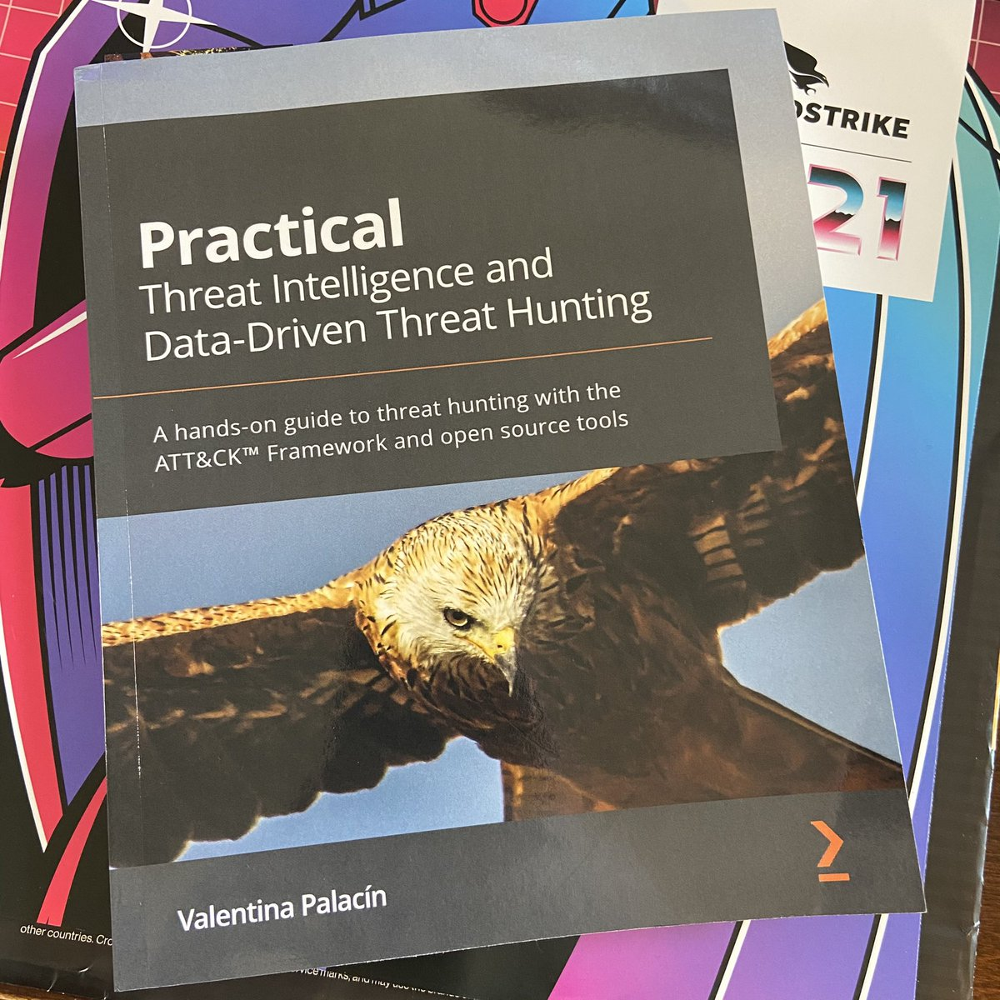

# DARKWIRE SOCIAL CYBER INSIGHTS 
&#x1F34E; **TOPIC = "threatintel"**

## AUTOMATED RESEARCH SUMMARY
     

|  Trending  |   Images | 
:-------------------------:|:-------------------------:
|        |   |   
 
 

  
The most popular user is: **AbuseIPDB_bot**  
 

## IP address 119.29.27.246 has been caught red handed! 766 reports have been filed and a 100/100 confidence score has… https://t.co/XC7L3KSSUb 

  

### TRENDING SHARED IMAGE

|                **Sample-Tweets**        |
| :-------------: |
| Newly observed #phishing website#infosec #cybersecurity #scam #threatintelURL: hxxps://www[.]etdc-ckans-co-jp[.]… https://t.co/9233UpVF8o |
| RT @Bank_Security: Here my GitHub with some Crowdstrike threat hunting queries useful for blue teamers and threat hunters - Enjoy!https://… |
| RT @PolySwarm: Access unique samples. Compete to detect malware. Get paid to be right!You're invited to join the PolySwarm marketplace.… |

## RELATED METRICS 
| Metric | Value |
| ------------- | ------------- |
| #1 Most tweeted to  | **noladefense** |
| #2 Most tweeted to  | **DailyOsint** |
| #3 Most tweeted to  | **Malwar3Ninja** |
| NewProfiles (less than 10 days) | 0.04%  |
| Tweeters with < 10 followers  | 1.04%|
| Tweeters with > 1000000 followers  | 0.0%  |

## MOST POPULAR TWEET TERMS 

| Popularity Rank  | Term |
| ------------- | ------------- |
| first  | **THREATINTEL**  |
| second  | **INFOSEC**  |
| third  | **PHISHING** |
| fourth  | **WEBSITE**  |
| fifth  | **OBSERVED**  |

## Twitter Bio Analysis
### SENTIMENT ANALYSIS

VIEWS WERE : **SUBJECTIVE**  (7.69%) & **NEGATIVELY-SUBJECTIVE** (69.23%) **OBJECTIVE** (23.08%)

### TWEET SAMPLE 
| Random value picked from array |
| ------------- |
|RT @CyberIQs_: Data Privacy Week 2023: Virtual events and webinars to attend #infosec #infosecurity #cybersecurity #threatintel #threatinte… |

### MOST RETWEETED 

| The most retweeted user is: **AbuseIPDB_bot**  |
| ------------- |
| IP address 119.29.27.246 has been caught red handed! 766 reports have been filed and a 100/100 confidence score has… https://t.co/XC7L3KSSUb |

# Potential Fake Accounts
 
# uJkMLD0kygVboAOUSER INFO

 
`User ScreenName:` uJkMLD0kygVboAO 
 
`User chosen Name:` 1 900 
 
`Is the User Verified?:` False 
 
`User signup date?:` Thu Jan 19 04:46:47 +0000 2023 
 
`User Description?:` I'm a transfer student from Eastern Europe. I like #dance, #freediving/#snorkeling, #music & #skateboarding. I'm married to a Catholic social-worker in Africa. 
 
`Followers?: `33 
 
`Following?:` 235 
 
`User URL?:` None 
 
`Location:` Arlington, VA 
 
`Number of tweets extracted`  : 166 
 
`Profile image:` http://pbs.twimg.com/profile_images/1615939034454319104/ejm9JX-u_normal.jpg 
 
`Number of tweets excluding replies:` 166 
 

 

 
## User Top tweeted words 
 
**DE** 24 , **LA** 13 , **BLACKTECHTWITTER** 12 , **@BLEEPINCOMPUTER:** 11 , **@SAMFBIDDLE:** 10 , **PYTHON** 9 , **À** 9 , **DES** 9 , **@UNIT42_INTEL:** 9 , **NEW** 8 , **QUE** 7 , **C'EST** 7 , **LINUX** 6 , **NE** 6 , **PAS** 6 , **LE** 6 , **UN** 6 , **!!!** 5 , **JAVASCRIPT** 5 , **ONT** 5 , 
 
## What this user tweeted
 
RT @Unit42_Intel: 📣 Learn from the past and look into the future. Join our webinar with Unit 42  #ThreatIntel experts @mikesiko and Ramarcu…
 

<b> This report is AUTOMATED and not hand crafted, it is designed for pulling metrics on a given keyword or hashtag and performs a series of reporting and analysis.</b>  
### CONCLUSION & EXTERNAL ANALYSIS

*This is my [Adam McMurchie`s] opinion on the data from the tweets, it serves as no objective truth.Since the tweets themselves are a mixture of fact & opinion. 
Authors analytical summary on request.
**RECOMMENDATIONS** WILL BE UPDATED IN NEXT  24 HOURS  