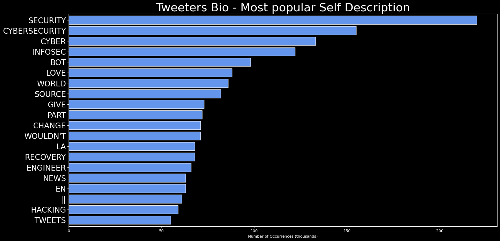

# DARKWIRE SOCIAL CYBER INSIGHTS 
&#x1F34E; **TOPIC = "infosec"**

## AUTOMATED RESEARCH SUMMARY
     

|  Trending  |   Images | 
:-------------------------:|:-------------------------:
|        |   |   
 
 

  
The most popular user is: **shanlonwu**  
 

## Great example of Trump strategy back-firing - by forcing Manhattan DA's office to further detail/justify reasons fo… https://t.co/xm4QkxeXw6 

  

### TRENDING SHARED IMAGE

|                **Sample-Tweets**        |
| :-------------: |
| RT @campuscodi: Enjoy some infosec absurdity:A Mirai botnet is hijacking those super-powerful F5 BIG-IP devices.Dear sysadmin, be great… |
| RT @analyst_infosec: The India CyberSlide features some of the most innovative cybersecurity companies in India: https://t.co/nXhefcRFVWT… |
| RT @VeteranSec: Thanks to the teams @offsectraining and @CyberSecLabsUK for their help in our mission of helping vets get into information… |

## RELATED METRICS 
| Metric | Value |
| ------------- | ------------- |
| #1 Most tweeted to  | **reach2ratan** |
| #2 Most tweeted to  | **rajchandel** |
| #3 Most tweeted to  | **Hakin9** |
| NewProfiles (less than 10 days) | 2.38%  |
| Tweeters with < 10 followers  | 2.28%|
| Tweeters with > 1000000 followers  | 0.0%  |

## MOST POPULAR TWEET TERMS 

| Popularity Rank  | Term |
| ------------- | ------------- |
| first  | **INFOSEC**  |
| second  | **HACKERS**  |
| third  | **MALWARE** |
| fourth  | **DATA**  |
| fifth  | **HACKING**  |

## Twitter Bio Analysis
### SENTIMENT ANALYSIS

VIEWS WERE : **SUBJECTIVE**  (33.33%) & **NEGATIVELY-SUBJECTIVE** (6.67%) **OBJECTIVE** (60.0%)

### TWEET SAMPLE 
| Random value picked from array |
| ------------- |
|Youthful trio charged over alleged Bitcoin scam roles in Twitter hack - Fintech Direct#Hack #Fraud #FinTech… https://t.co/cYBWA8LPi2 |

### MOST RETWEETED 

| The most retweeted user is: **shanlonwu**  |
| ------------- |
| Great example of Trump strategy back-firing - by forcing Manhattan DA's office to further detail/justify reasons fo… https://t.co/xm4QkxeXw6 |

# Potential Fake Accounts
 
# sentinelleFrUSER INFO

 
`User ScreenName:` sentinelleFr 
 
`User chosen Name:` Sentinelle 
 
`Is the User Verified?:` False 
 
`User signup date?:` Sun Aug 02 14:32:01 +0000 2020 
 
`User Description?:`  
 
`Followers?: `22 
 
`Following?:` 1 
 
`User URL?:` None 
 
`Location:`  
 
`Number of tweets extracted`  : 200 
 
`Profile image:` http://pbs.twimg.com/profile_images/1289947708971724810/Xo7Zm8Og_normal.jpg 
 
`Number of tweets excluding replies:` 1190 
 

 

 
## User Top tweeted words 
 
**HACKING** 44 , **CYBERSECURITY** 39 , **INFOSEC** 26 , **SECURITY** 22 , **NEW** 21 , **LINUX** 20 , **HACKERS** 14 , **[+]** 12 , **IOT** 12 , **TWITTER** 11 , **OSINT** 10 , **DATA** 10 , **PRIVACY** 10 , **OPENSOURCE** 9 , **CYBER** 8 , **2020** 8 , **RANSOMWARE** 8 , **@NCSVENTURES:** 8 , **PROGRAMMING** 8 , **@0FORTUNEBOT:** 8 , 
 
## What this user tweeted
 
RT @SpywareTweets: 11 Hot Startups to Watch at Black Hat USA . A sneak peek at the up-and-coming organizations to check out on the Black Ha…RT @ulcamilo: I'm really glad to be accepted as a speaker this year @DragonJAR @DragonJARCon, I hope to see u in this excellent conference…RT @PhishStats: https://t.co/MAuIXRvYiq detected 8 new websites hosting #phishing | new today: 4925 | #infosec #cybersecurity #malware http…RT @HiWabbi: Do you want to help your company be at the cutting edge of delivering more secure code without having to sacrifice agility or…RT @IAM__Network: Information Security Products and Services Market 2020 COVID-19 Impact 

READ MORE: https://t.co/zoNP7Wfvf1

#CyberSecuri…RT @Lance_Edelman: Majority of #security pros fed up with alert fatigue - https://t.co/szyYPKFXhG #cybersecurity #infosec #ITsecurity https…RT @Pastor_Paul: YOU DEVISE/SET PLANS TO ARRIVE IN THE SHORTEST TIME TO THE GREATEST RESULT IN THE AREA DESIRED - Plans Keep You On Track -…RT @erinleeryan: I swear, #infosec twitter is going to do a post mortem of Science Twitter after this all shakes out.RT @IAM__Network: Biometrics stocks wrap: Mitek reports record revenue as Thales, Aware, Qualcomm see long-term growth signs 

READ MORE: h…RT @jfslowik: A decent chunk of #infosec / #hacker culture right now as Summer Camp goes online only: https://t.co/u4NTkypjrbRT @WritingGifts: CIRCUIT TRACER  🖥️
PROTECT your passwords!

https://t.co/hYbRWoLy8j 🔒

#datasecurity #Website #security #sports #students…RT @Securonix: @Securonix is excited to announce it's partnership with @AttackIQ for their #PreactiveSecurityExchange (PSE) platform. 
Read…RT @CyberSematic: Understanding all the different buyers is important in selling #CyberSecurity #DigitalTransformation  #CloudSecurity #Dat…RT @jodelak: Github dorks for finding secret data..

#bugbountytips #Security #Network #infographics
#hacker #malware #cybercriminal #botne…RT @infosec_events: ⚡️Just Added ⚡️|| Physical Event
.
Black Hat Europe 2020
.
https://t.co/xo8JddIe8t
.
One of the best cybersecurity conf…RT @reach2ratan: CWT Travel Agency Faces $4.5M Ransom in Cyberattack, Report https://t.co/dvbtZXK4rv

#CyberSecurity #digital #Hackers #inf…RT @reach2ratan: CWT Travel Agency Faces $4.5M Ransom in Cyberattack, Report https://t.co/dvbtZXK4rv

#CyberSecurity #digital #Hackers #inf…RT @keepnetlabs: Secure your organisation, try Keepnet for free. https://t.co/2e0QuMOQR6 #cybersecurity #hacking #technology #infosec #hack…RT @CyberSecurity32: Cyber Operations and Futu #Cybersecurity #CyberAttack #Hacking #IoT #malware #privacy #Security #DDoS #Ransomware #Inf…RT @Yumi_Sec: An interesting trick: you can bypass a WAF during a XSS attack on ASP(dot)NET/IIS technology by using a HTTP parameter pollut…RT @IAM__Network: Biometrics tech far, far ahead of public understanding—intelligence insider 

READ MORE: https://t.co/R00fHfLDxD

#Access…RT @reach2ratan: Travel company CWT avoids ransomware derailment by paying $4.5m blackmail demand https://t.co/mXXjw5hdIn

#CyberSecurity #…RT @archonsec: #cybersecurity #infosec    VIA @happygeek     Meetup Security Flaws Exposed 4️⃣4️⃣M Members To Data Loss &amp; Payment Threat👇…RT @ITUNeed: Happy Monday 😄
.
#cybersecurity #infosec #computerscience #computerengineering #encryption #IoT #AI #privacy #hacking #hacker…RT @CioAmaro: Self-Healing Robot Recovers from Damage
#Infosec #CyberSecurity #CyberAttack #Hacking #Privacy #Threat #Malware #Ransomware #…RT @vishne0: How to stop Facebook from tracking everything you do (sort of)

https://t.co/WVQLAhOSWf

#cybersecurity #infosec #securityRT @RustySowers: 📡-Also, via @SGGRC &amp; @TWiT pod, w/ @CheckPointSW It is 19yo Window Server DNS worm (ICYMI)

#podcast  #Microsoft #CyberSec…RT @Webimprints: #infosec #informationsecurity #hacking @Twitter These 3 teenagers hacked Twitter &amp; performed Bitcoin scam https://t.co/tyS…RT @StandardUserLLC: What is identity theft? 

@USAGov defines identity theft as taking place when someone steals another’s personal detail…RT @EbotAyuk: Follow @EbotAyuk
https://t.co/5Sa3VASmcd
Smartwatch maker #Garmin has paid a multi-million dollar ransom to criminals. #cyber…RT @EbotAyuk: Follow @EbotAyuk
https://t.co/5Sa3VASmcd
Smartwatch maker #Garmin has paid a multi-million dollar ransom to criminals. #cyber…RT @DianaInitiative: We are pleased to announce our 2 opening keynote speakers Yolonda Smith @ysmithnd &amp; Tracy Z. Maleeff @InfoSecSherpa 
J…RT @EbotAyuk: #RIPWILLAMENGLISH
The co-creator of the computer mouse, William English, has died aged 91.#cybersecurity #infosec #encryption…RT @reach2ratan: 3 Ways Social Distancing Can Strengthen your Network https://t.co/4xqzuPOm1r

#CyberSecurity #digital #Hackers #infosec @r…RT @IAM__Network: China Crisis (Part 2) – Understanding And Kindness | Information Security Buzz 

READ MORE: https://t.co/IJOTggWM3i

#Cyb…RT @PhishStats: new #phishing at hXXp://virgin[.]aiscor[.]com/ | 162[.]241[.]148[.]86 | United States | UNIFIEDLAYER-AS-1 | ASN 46606 #info…RT @SentinelOne: 🤙Trying to integrate MITRE ATT&amp;CK into your cybersecurity program? Look no further: We have native MITRE integration in th…RT @keepnetlabs: Cybersecurity &amp; Neuroscience... developing healthy #cybersecurity habits - https://t.co/X6z0DM2JHu #information #infosec #…RT @ME_ADSolutions: [ebook] This #pandemic has given rise to thousands of malicious domains. How are you going to tackle this threat landsc…RT @gkhck_: #bugbountytips #infosec #bugbountytip

1 -  Go Burp Suite / Target
2 -  Select all items
3 - "Save selected items" (targets)
4…RT @CyberStartupObs: The Most Dangerous Cyberattack (and how to prevent it)
https://t.co/ZCX8J0gBAb
@Reblaze
This article is part of the Cy…RT @idtheftpro1: #cybersecurity #identitytheft #fullz #hacking #malware #keyloggers #EndpointLock #infosec #cybersec Don’t let cyber crimin…RT @Webimprints: #infosec #informationsecurity #hacking #cyberwarfare Iranian hackers shut down 28 Israeli railway stations; they had plans…RT @ptracesecurity: Learning XSS: Part 1 — Reflected XSS (Brief Concept, Techniques, Challenge Walkthrough) https://t.co/FCm0wQpPou   #Java…RT @keepnetlabs: Spring #Digital Cleaning Checklist: https://t.co/HcPoFIXQVP #privacy #security #cybersecurity #technology #dataprotection…RT @nogofallmaga: 🚨 SCAM ALERT 🚨 Read our latest investigation: Pennywise Wealth Management 👇

https://t.co/1IyOY9njMR

#NoGoFallMaga #scam…RT @Cyberseccentre: Windows and Mac Trick for accidentally closing a Browser Tab

#CyberSecurity #infosec #technews #cloudsecurity #cyberne…RT @sucurisecurity: Bad actors compromised a #Magento site with malware hidden in PNG files and #GitHub repositories. Learn how hackers can…RT @Sudhans42246878: Hey infosec People just wanted to ask one question 
For what purpose you use retwits on Twitter ... Like you really li…RT @midnight_comms: this week: I am going to create a post on how to profile an organization, keep a look out for the publish #osint #infos…RT @PhishStats: new #phishing at hXXp://glasanjetobato[.]000webhostapp[.]com/ | 145[.]14[.]144[.]140 | United States | AWEX Hostinger Inter…RT @Webimprints: #infosec #cybersecurity #hacking #Australia Australia had around 1,000 data leaks reported in one year. Millions of record…RT @YUSUPHKILEO: #Infosec Next Week I'll Address ICT Managers about "The impact of Global pandemic on #ICTsecurity for the work place"-I ur…RT @vishne0: PM Modi Asks Students To Come Up With Innovative Concepts

https://t.co/mokBt4TNDL

#cybersecurity #infosec #securityRT @Corix_JC: Honoured to be ranked by @Thinkers360 in the Top 10 of Global Thought-Leaders for #Cybersecurity, Risk Management, #Leadershi…RT @ForSci_Q: You Ready?!?

See you on Saturday, August 8 from 6-8pm EST!

SEASONED: A Fireside Chat with Black Cyber OGs, Part I

Register…RT @Secburo: RT @bountyhunter_fr 🏴‍☠️Top 25 Server-Side Request Forgery (SSRF) Dorks 🏴‍☠️

Note: The popularity of dorks can vary.

#bugbou…RT @three_cube: Why Every Hacker Should Know and Use Linux #linux #hacker #pentesting #linux4hackers #cybersecurity #infosec

https://t.co/…RT @TheHackersNews: — BREAKING —

A 17-year-old 'Mastermind' and two other 19 &amp; 22-year-old suspected hackers behind the biggest Twitter ha…RT @TheHackersNews: &lt;&lt; Interesting Case Study &gt;&gt;

How Bug Bounty Platforms—HackerOne, Bugcrowd, Synack, Intigriti, and Zerocopter—Respond t…RT @ceos3c: People ask me this a lot and I don't have an answer. So let's ask our community.

The best learning Platform to get better at B…RT @SuburbanAnarchy: What a brilliant idea! A threat query/reporting interface, which allows me to enter my addresses and passwords, to det…RT @cryptobuzznews: Update: 🔥 Underage #Bitcoin  #hacker mastermind who cracked Twitter will be tried in Florida. #Twitterhacked #cryptohac…RT @Secburo: RT @SSXman2 🧮 Top 25 Local File Inclusion (LFI) Parameters 🛡️

#bugbountytips #bugbountytip #bugbounty #cybersecurity #infosec…RT @Secburo: RT @SSXman2 🧮 Top 25 Local File Inclusion (LFI) Parameters 🛡️

#bugbountytips #bugbountytip #bugbounty #cybersecurity #infosec…RT @Secburo: RT @YogeshBang Good news, @SecurityTube  will be hosting labs for @georgiaweidman's "Penetration Testing: A Hands-on Introduct…RT @alfredpayne: Thanks to @Nclose_sa, lockdown just got a whole lot better! Catch them at the virtual @ITWeb security summit 25-27 August…RT @2601hz: @TriBabes I am very curious what ranks as

totally weird

vs
merely

interesting?

my suspicions are it's something to do with…RT @ExposingEpiq: Horrible work environment.

#horrible #leadership #legaltech #infosec #glassdoor #epiqfail https://t.co/SwP3g5ZbAURT @0xblackl1ght: Decrease your AV detections with this one weird trick - Use shellter to inject your payload into a windows PE. 
Used shel…RT @TheDFIRReport: If a Empire C2 gets outed but no one's listening what happens? Well it gets reused of course. See our write up on a Doc…RT @ComplianceConst: FCA Authorisation preparation and submission service for #startups, #fintech, #IFA, #FundManagers #risk #infosec #GDPR…RT @PhishStats: https://t.co/MAuIXRNz9Y detected 127 new websites hosting #phishing | new today: 3657 | #infosec #cybersecurity #malware ht…RT @AudreyDesisto: Excellent topic: Keeping Your Crypto Wallet Safe - via  @InfosecurityMag 
https://t.co/ClhPIjLcFs 
#Technology #crypto #…RT @Hakin9: One of our favourite hacking tool got a new update - uDork  v.2.0 is here! If you didn't have a chance to check it before, do i…RT @Hakin9: One of our favourite hacking tool got a new update - uDork  v.2.0 is here! If you didn't have a chance to check it before, do i…RT @startups_observ: https://t.co/6pS3wQOZjl makes open source security easy https://t.co/KcjsRWqvFX
#Darmstadt #startupradio #techpodcast…RT @Cypaw: How does @Twitter use your data?🤔
◾
◾
◾
#cybersecurity #hacking #security #hacker #technology #infosec #ethicalhacking #tech #li…RT @Dhananjaya_N: #Garmin 'paid multi-million dollar ransom to criminals using #Arete IR', say sources.

#cyberattacks #databreach #datapro…RT @USCERT_gov: Adobe released security updates to address vulnerabilities in Magento Commerce 2 and Magento Open Source 2. Read more at ht…RT @NJCybersecurity: ADVISORY: A vulnerability discovered in #Google Chrome could allow for arbitrary code execution. 

Learn more at https…RT @NJCybersecurity: ADVISORY: A vulnerability discovered in #Google Chrome could allow for arbitrary code execution. 

Learn more at https…RT @drmuhammadmalik: Twitter confirms spear-phishing attack on employees
#isdots #infosec #cybersecurity

To find out more, visit the websi…RT @drmuhammadmalik: Twitter confirms spear-phishing attack on employees
#isdots #infosec #cybersecurity

To find out more, visit the websi…RT @Info_Sec_Buzz: Twitter confirms spear-phishing attack on employees
#isdots #infosec #cybersecurity

To find out more, visit the website…RT @Hackademicus: Latest: Ghostwriter disinformation campaign aimed at discrediting NATO https://t.co/m0NczEXoM5 #blog #infosec #netsec #ne…RT @helpnetsecurity: There's CISSP training, then there's official CISSP training - https://t.co/QAaxhTQbtZ - @ISC2 #CISSP #certification #…RT @CISOMAG: A new KPMG survey revealed that U.S. consumers are becoming increasingly concerned with, and distrustful of, how companies use…RT @Fisher85M: How to create #value from converging #technologies? {Infographic}

#Industry40 #IoT #AR #VR #startups @Fisher85M #Robotics #…RT @Fisher85M: The NIST #CyberSecurity Framework {Infographic}

[@JacBurns_Comext] MT

#infosec #Malware #hacking #cybercrime @fisher85m #t…RT @rajchandel: Privilege Escalation Cheatsheet for OSCP

This cheatsheet is aimed at the CTF Players and Beginners to help them understand…RT @krizzsk: A small but effective way to recon and get internal subdomains to increase your attack surface. #bugbountytips #bugbountytips…RT @secarmyofficial: Mastering the Skills of Bug Bounty

Credit: @vickieli7  

https://t.co/zfsTs22pBV

#bugbountytips #infosec #cybersecur…RT @karmbian: A great write up from @fossbytes14 about the development of Karmbian #linux

https://t.co/ld8DErJT1o

#hacker #hacking #cyber…RT @softwarnet: #infosec 
https://t.co/LTiIs8I8ZG
Does Tik Tok track people?

You betcha it does...RT @Eliza_MayAustin: Check out this #podcast with @jorgeorchilles, #CTO of 
@scythe_io &amp; @SANSInstitute instructor. We R talking #purpletea…RT @the_yellow_fall: bluescan: A powerful Bluetooth scanner https://t.co/Y027nUWlVC #opensource #infosec #security #pentestRT @softwarnet: #infosec
https://t.co/wFBcVsmkkI
Hackers cause Telstra outages in Australia’s eastern states with ‘malicious’ cyber attackRT @IotBrand: RT @Hakin9: HomePwn - Swiss Army Knife for Pentesting of IoT Dev https://t.co/cjCU1Ma7u5 

#infosec #hacking #hackers #Pentes…RT @DataShadow: How drones affect your threat model https://t.co/NO9uhGWnRC #DataPrivacy #DataProtection #CyberSecurity #CIO #CISO​ #CPO #s…RT @anonos: For those involved with cloud computing, immediate action is required to comply with Schrems II and the ruling that “additional…
 
# iamhalsghostUSER INFO

 
`User ScreenName:` iamhalsghost 
 
`User chosen Name:` Kendra 
 
`Is the User Verified?:` False 
 
`User signup date?:` Sun Aug 02 19:11:21 +0000 2020 
 
`User Description?:` reverse engineer, hardware hacking, she/her, another woman in tech🌴🖥️⌨️🌴 
 
`Followers?: `13 
 
`Following?:` 12 
 
`User URL?:` None 
 
`Location:`  
 
`Number of tweets extracted`  : 13 
 
`Profile image:` http://pbs.twimg.com/profile_images/1290095340356476992/1ZN45m8l_normal.jpg 
 
`Number of tweets excluding replies:` 13 
 

 

 
## User Top tweeted words 
 
**THANK** 3 , **I'M** 2 , **COMING** 2 , **@HACKS4PANCAKES** 2 , **INTO** 2 , **ADVICE** 2 , **HARDWARE** 2 , **HACKING** 2 , **DON'T** 2 , **@ZEPHRFISH** 1 , **@DRFEDDC** 1 , **HEY** 1 , **REFERENCES!I** 1 , **PROBABLY** 1 , **SAY** 1 , **DEVELOPER** 1 , **BACKGROUND** 1 , **JAVA** 1 , **MOSTLY** 1 , **I'VE** 1 , 
 
## What this user tweeted
 
How to get started in infosec? What do I need to know?
 
# moneyrealtorbotUSER INFO

 
`User ScreenName:` moneyrealtorbot 
 
`User chosen Name:` themoneyrealtorbot 
 
`Is the User Verified?:` False 
 
`User signup date?:` Sat Jul 25 22:22:02 +0000 2020 
 
`User Description?:` Sharing the best of @themoneyrealtor 
 
`Followers?: `61 
 
`Following?:` 27 
 
`User URL?:` None 
 
`Location:`  
 
`Number of tweets extracted`  : 199 
 
`Profile image:` http://pbs.twimg.com/profile_images/1287152904600723457/YErMML3O_normal.jpg 
 
`Number of tweets excluding replies:` 1997 
 

 

 
## User Top tweeted words 
 
**PYTHON** 107 , **STATISTICS** 35 , **LITERATURE** 34 , **NURSING** 34 , **BIOLOGY** 34 , **DONE** 31 , **@SMITHSWRITERS:** 30 , **HISTORY** 30 , **EXPERTS** 27 , **ASSIGNMENTS** 27 , **CHEMISTRY** 26 , **LAW** 26 , **TOP-CLASS☑️** 19 , **P…RT** 19 , **DATASCIENCE** 18 , **PROGRAMMING** 16 , **DATA** 15 , **LEARN** 14 , **BIGDATA** 14 , **ANALYTICS** 14 , 
 
## What this user tweeted
 
RT @hackzism: https://t.co/ABk0TtLqWh

hping3
👾🕷️🕸️🐍👨‍💻🌐

 #100DaysOfCode #python #ethicalhacking #cybersecurity #reacts #nodejs #flutter #…RT @EbotAyuk: Follow @EbotAyuk
https://t.co/5Sa3VASmcd
Smartwatch maker #Garmin has paid a multi-million dollar ransom to criminals. #cyber…RT @Aramishrt: https://t.co/kiTCRG3bP0
Check this out!
New Repo!
👨🏽‍💻
#javascript #nodejs #reactjs #graphql #infosec #cybersecurity #Ethica…RT @EbotAyuk: https://t.co/dDuc2e4uhE
Security vulnerabilities in popular online meeting service and events website #Meetup. #cybersecurity…RT @EbotAyuk: #RIPWILLAMENGLISH
The co-creator of the computer mouse, William English, has died aged 91.#cybersecurity #infosec #encryption…
 
# Indu79171134USER INFO

 
`User ScreenName:` Indu79171134 
 
`User chosen Name:` Indu 
 
`Is the User Verified?:` False 
 
`User signup date?:` Mon Aug 03 17:40:23 +0000 2020 
 
`User Description?:` Information technologies and spiritual related 
 
`Followers?: `0 
 
`Following?:` 46 
 
`User URL?:` None 
 
`Location:`  
 
`Number of tweets extracted`  : 11 
 
`Profile image:` http://pbs.twimg.com/profile_images/1290342470723579905/yijhVqLN_normal.jpg 
 
`Number of tweets excluding replies:` 11 
 

 

 
## User Top tweeted words 
 
**@DUNGAREXCEL:** 11 , **EXCEL** 5 , **VIA** 4 , **@YOUTUBE** 4 , **"अधिक** 3 , **जानकारी** 3 , **के** 3 , **लिए** 3 , **SATLOK** 3 , **ASHRAM** 3 , **YOUTUBE** 3 , **चैनल** 3 , **पर** 3 , **VISIT** 3 , **करें"** 3 , **REAL** 3 , **GOD** 3 , **DATA** 3 , **@MICROSO…RT** 3 , **GODKABIR_REALSAVIOR** 2 , 
 
## What this user tweeted
 
RT @DungarExcel: DATA FILTER IN MS-EXCEL. (HOW TO USE FILTER,FILTERING DATA , USE FILTERS... https://t.co/RKBJJiwhtk via @YouTube

#alcohol…
 
# ComplexRNAUSER INFO

 
`User ScreenName:` ComplexRNA 
 
`User chosen Name:` ! ( RNA ) 
 
`Is the User Verified?:` False 
 
`User signup date?:` Sun Aug 02 15:10:02 +0000 2020 
 
`User Description?:` Computer Researcher 
 
`Followers?: `1 
 
`Following?:` 17 
 
`User URL?:` None 
 
`Location:`  
 
`Number of tweets extracted`  : 13 
 
`Profile image:` http://pbs.twimg.com/profile_images/1289942953264283649/jxf9H1Yh_normal.jpg 
 
`Number of tweets excluding replies:` 13 
 

 

 
## User Top tweeted words 
 
**FUCK** 3 , **IM** 2 , **GOOD** 2 , **DOING** 2 , **FUCKING** 2 , **THING** 2 , **CODE** 2 , **ARCHIVE** 2 , **LEARN** 2 , **LOOKING** 1 , **MENTAL** 1 , **COMPILER** 1 , **ANY** 1 , **SUGGESTIONS?FUCK** 1 , **TWITTERI'M** 1 , **WORST** 1 , **DEMON** 1 , **SAME** 1 , **TIME** 1 , **BEST** 1 , 
 
## What this user tweeted
 
RT @SandboxBear: 5. Fuck infosec twitter. Fuck this industry. Stay focused on doing what makes you happy and don't get distracted by all th…
 
# ISecdoUSER INFO

 
`User ScreenName:` ISecdo 
 
`User chosen Name:` InfoSecdo 
 
`Is the User Verified?:` False 
 
`User signup date?:` Sat Jul 25 10:51:18 +0000 2020 
 
`User Description?:` Head Of Information Technology not for profit sector, He, on the coalface trying to get your sh*t to do what you promised it would and run it in the real world 
 
`Followers?: `0 
 
`Following?:` 1 
 
`User URL?:` None 
 
`Location:`  
 
`Number of tweets extracted`  : 5 
 
`Profile image:` http://pbs.twimg.com/profile_images/1286977562741276672/ywbfMj-O_normal.jpg 
 
`Number of tweets excluding replies:` 5 
 

 

 
## User Top tweeted words 
 
**SECURITY** 2 , **MAYBE** 1 , **SHARING** 1 , **ACCOUNT** 1 , **ALWAYS** 1 , **CLICK** 1 , **ACCEPT?!WHAT'S** 1 , **BETTING** 1 , **MFA?!?** 1 , **INFOSEC** 1 , **INFOSECURITY** 1 , **GUARDIAN:** 1 , **CLASSIFIED** 1 , **DOCUMENTS** 1 , **US-UK** 1 , **TRADE** 1 , **TALKS** 1 , **'HACKED…** 1 , **HTTPS://TCO/JJCZOYWUHGYES** 1 , **YES** 1 , 
 
## What this user tweeted
 
What's the betting no MFA?!? #infosec
#infosecurity
The Guardian: Classified documents on US-UK trade talks 'hacked… https://t.co/JJczoYWUHG
 
# DuvvurimeghaUSER INFO

 
`User ScreenName:` Duvvurimegha 
 
`User chosen Name:` Meghamala Duvvuri 
 
`Is the User Verified?:` False 
 
`User signup date?:` Mon Aug 03 13:14:05 +0000 2020 
 
`User Description?:` Digital Forensic Analyst 
 
`Followers?: `5 
 
`Following?:` 54 
 
`User URL?:` None 
 
`Location:` Hyderabad, India 
 
`Number of tweets extracted`  : 30 
 
`Profile image:` http://pbs.twimg.com/profile_images/1290276534423453705/zwUKmtpU_normal.jpg 
 
`Number of tweets excluding replies:` 30 
 

 

 
## User Top tweeted words 
 
**@ENDNOWCYBER:** 26 , **CYBERBULLYING** 8 , **BEFORE** 4 , **SOCIAL** 4 , **MEDIA** 4 , **WORDS** 4 , **INFOSEC** 4 , **TWO** 3 , **UPI** 3 , **CYBERCRIMES** 3 , **CYBERFRAUDS** 3 , **NEVER** 3 , **SHARE** 3 , **OTP** 3 , **DON'T** 3 , **ADDICTION** 3 , **TIPS!** 3 , **CYBER** 3 , **HURT** 3 , **SHOW** 3 , 
 
## What this user tweeted
 
RT @EndNowCyber: Important - Password Safety Tips!

#infosec #cybersecurity #cybersafety #digitalsafety #vulnerability #infosec #cybersec #…
 
# shellologistUSER INFO

 
`User ScreenName:` shellologist 
 
`User chosen Name:` shellologist 
 
`Is the User Verified?:` False 
 
`User signup date?:` Mon Aug 03 14:44:09 +0000 2020 
 
`User Description?:` Red Team Apprentice 
 
`Followers?: `2 
 
`Following?:` 107 
 
`User URL?:` None 
 
`Location:`  
 
`Number of tweets extracted`  : 3 
 
`Profile image:` http://pbs.twimg.com/profile_images/1290305505303420933/wDZpaNUr_normal.jpg 
 
`Number of tweets excluding replies:` 3 
 

 

 
## User Top tweeted words 
 
**GETTING** 1 , **RIDE** 1 , **LUNCH** 1 , **REDTEAMFIT** 1 , **HTTPS://TCO/TFORL3R9QADIPPING** 1 , **TOES** 1 , **INTO** 1 , **INFOSEC** 1 , **TWITTER** 1 , **HERE** 1 , **GOES** 1 , **NOTHINGNEW** 1 , **ACCOUNT** 1 , **DIS?** 1 , 
 
## What this user tweeted
 
Dipping my toes into the #infosec twitter. Here goes nothing.
 
# CyberInvestig11USER INFO

 
`User ScreenName:` CyberInvestig11 
 
`User chosen Name:` Cyber Investigator 
 
`Is the User Verified?:` False 
 
`User signup date?:` Sat Aug 01 19:02:21 +0000 2020 
 
`User Description?:` Role :  Modern Cyber Investigator 🕵️,,

Mission:  Spreading Awareness,,

Status : started now wait and see ...,,

Note : Don't ask my orginal Name . 
 
`Followers?: `15 
 
`Following?:` 184 
 
`User URL?:` None 
 
`Location:` Hyderabad, India 
 
`Number of tweets extracted`  : 54 
 
`Profile image:` http://pbs.twimg.com/profile_images/1290310606940041216/7gsWo1zn_normal.jpg 
 
`Number of tweets excluding replies:` 54 
 

 

 
## User Top tweeted words 
 
**@ENDNOWCYBER:** 45 , **CYBER** 14 , **WEEKLY** 11 , **!** 11 , **TALK** 10 , **@** 10 , **@ANILRACHUMALLA** 9 , **ARTICLE** 9 , **సైబర్** 8 , **CYBERBULLYING** 8 , **@TASKTS** 7 , **ONLINE** 6 , **గురు** 6 , **నేటి** 5 , **కార్యక్రమంలో** 5 , **MEDIA** 5 , **రేడియో** 5 , **సిటీ** 5 , **911)** 5 , **@CCAWARENESS11** 5 , 
 
## What this user tweeted
 
RT @EndNowCyber: Important - Password Safety Tips!

#infosec #cybersecurity #cybersafety #digitalsafety #vulnerability #infosec #cybersec #…
 
# geromey51USER INFO

 
`User ScreenName:` geromey51 
 
`User chosen Name:` geromey5 
 
`Is the User Verified?:` False 
 
`User signup date?:` Mon Jul 27 10:33:29 +0000 2020 
 
`User Description?:`  
 
`Followers?: `10 
 
`Following?:` 219 
 
`User URL?:` None 
 
`Location:`  
 
`Number of tweets extracted`  : 47 
 
`Profile image:` http://pbs.twimg.com/profile_images/1287697939494830086/jOXXO4Db_normal.jpg 
 
`Number of tweets excluding replies:` 47 
 

 

 
## User Top tweeted words 
 
**@TECHTIMES_NEWS:** 9 , **TECH** 9 , **NEW** 6 , **TECHNOLOGY** 6 , **NETFLIX** 6 , **VPN** 4 , **SHARING** 4 , **ANTIHOLD** 4 , **CYBERSECURITY** 3 , **TECHNEWS** 3 , **HTTPS:/…RT** 3 , **@NETFLIX** 3 , **SE** 3 , **RT** 2 , **COVID-19** 2 , **LIKELY** 2 , **US** 2 , **BAN** 2 , **AFTER** 2 , **DAY** 2 , 
 
## What this user tweeted
 
RT @TryTeckedin: Teckedin's latest #technews &amp; #technology #webinars. We've added a category and hope you find it useful.

Link to our news…
 
# Rick0CUSER INFO

 
`User ScreenName:` Rick0C 
 
`User chosen Name:` Rick'0C 
 
`Is the User Verified?:` False 
 
`User signup date?:` Mon Aug 03 10:58:28 +0000 2020 
 
`User Description?:` Delving into the deep, deep depths of #infosec | Always learning | How do you even grow on Twitter these days? | #blm 
 
`Followers?: `2 
 
`Following?:` 111 
 
`User URL?:` None 
 
`Location:` Eng Land 
 
`Number of tweets extracted`  : 3 
 
`Profile image:` http://pbs.twimg.com/profile_images/1290280126781980673/kJh3rdWp_normal.jpg 
 
`Number of tweets excluding replies:` 3 
 

 

 
## User Top tweeted words 
 
**LOGS** 2 , **RT** 1 , **@FS0C131Y:** 1 , **FIRST** 1 , **ARTICLE** 1 , **TIKTOK** 1 , **ONLINE:** 1 , **"TIKTOK:** 1 , **LOGS"** 1 , **HTTPS://TCO/2HXCRTGEX3RT** 1 , **@SWIFTONSECURITY:** 1 , **DON’T** 1 , **NAME** 1 , **CRIME** 1 , **YOU’VE** 1 , **COMMITTED** 1 , **DEFINITELY** 1 , **FUCKING** 1 , **ILLEGAL** 1 , **HTTPS://TCO/FCIXKLWNBGTHE** 1 , 
 
## What this user tweeted
 
The more I learn about #infosec and #cybersecurity the more I realise that the company I work for at the moment is… https://t.co/LLlx9duums
 
# somdinfosecUSER INFO

 
`User ScreenName:` somdinfosec 
 
`User chosen Name:` somdinfosec 
 
`Is the User Verified?:` False 
 
`User signup date?:` Wed Jul 29 16:28:46 +0000 2020 
 
`User Description?:` Starting anew after temporarily deactivating account.  Don't change account name before deactivating your account, you might not get it back. 
 
`Followers?: `5 
 
`Following?:` 148 
 
`User URL?:` None 
 
`Location:`  
 
`Number of tweets extracted`  : 21 
 
`Profile image:` http://abs.twimg.com/sticky/default_profile_images/default_profile_normal.png 
 
`Number of tweets excluding replies:` 21 
 

 

 
## User Top tweeted words 
 
**GOOD** 4 , **DIDN'T** 2 , **POSSIBLE** 2 , **MAKE** 2 , **I'VE** 2 , **FAMILY** 2 , **PASSIONATE** 2 , **GOVERNMENT** 2 , **@WORKHORSEBREWS** 2 , **BEER** 2 , **@JFSLOWIK** 1 , **BUY** 1 , **SOMETHING** 1 , **GROUP** 1 , **LAST** 1 , **YEAR?@HACKS4PANCAKES** 1 , **OPENING** 1 , **YOURSELF** 1 , **LAWSUIT** 1 , **EVEN** 1 , 
 
## What this user tweeted
 
@gobias_infosec You forgot:

no fun
 
# Maxxiejoseph16USER INFO

 
`User ScreenName:` Maxxiejoseph16 
 
`User chosen Name:` Maxxiejoseph 
 
`Is the User Verified?:` False 
 
`User signup date?:` Fri Jul 31 20:09:42 +0000 2020 
 
`User Description?:`  
 
`Followers?: `253 
 
`Following?:` 298 
 
`User URL?:` None 
 
`Location:` Nairobi 
 
`Number of tweets extracted`  : 200 
 
`Profile image:` http://pbs.twimg.com/profile_images/1289293072313057286/_6eU67SR_normal.jpg 
 
`Number of tweets excluding replies:` 361 
 

 

 
## User Top tweeted words 
 
**FOLLOW** 51 , **DROP** 22 , **RETWEET** 21 , **HANDLES** 15 , **LIKES** 14 , **LET'S** 12 , **EVERYONE** 12 , **RETWEETS** 11 , **GO** 9 , **NA** 9 , **GAIN** 9 , **KWA** 8 , **NI** 8 , **@ARTMONSTERLIFE:** 8 , **SOME** 7 , **FOLLOWERS** 6 , **KAMA** 6 , **LET** 6 , **ATI** 6 , **RELATIONSHIP** 6 , 
 
## What this user tweeted
 
RT @DCI_Kenya: Fraudulent Apps.

#CyberSafely #CyberSecurity #InfoSec 

One would expect that apps that are  purchased or downloaded from o…
 
# fcutting1USER INFO

 
`User ScreenName:` fcutting1 
 
`User chosen Name:` Fletcher Cutting 
 
`Is the User Verified?:` False 
 
`User signup date?:` Mon Aug 03 11:34:40 +0000 2020 
 
`User Description?:` Combining my experience in infosec and software development to create security focused software. 
 
`Followers?: `1 
 
`Following?:` 24 
 
`User URL?:` None 
 
`Location:` Melbourne, Australia 
 
`Number of tweets extracted`  : 1 
 
`Profile image:` http://pbs.twimg.com/profile_images/1290253464925138944/neLsjBhx_normal.jpg 
 
`Number of tweets excluding replies:` 1 
 

 

 
## User Top tweeted words 
 
**TIME** 1 , **START** 1 , **LEARNING** 1 , **HACK** 1 , **BRAINS** 1 , **HTTPS://TCO/MV29EH4VJM** 1 , **INFOSEC** 1 , 
 
## What this user tweeted
 
Time to start learning how to hack brains.

https://t.co/Mv29Eh4VJm

#infosec
 
# DungarExcelUSER INFO

 
`User ScreenName:` DungarExcel 
 
`User chosen Name:` Dungar - Excel Learning 
 
`Is the User Verified?:` False 
 
`User signup date?:` Mon Aug 03 01:39:36 +0000 2020 
 
`User Description?:` My YouTube channel’s videos and some spiritual post to be published.

My YouTube channel is 👉🏽”Dungar - Excel Learning” 
 
`Followers?: `18 
 
`Following?:` 416 
 
`User URL?:` None 
 
`Location:`  
 
`Number of tweets extracted`  : 39 
 
`Profile image:` http://pbs.twimg.com/profile_images/1290100144398950401/0kZdSYRT_normal.jpg 
 
`Number of tweets excluding replies:` 39 
 

 

 
## User Top tweeted words 
 
**@SATKABIR_:** 14 , **@DUNGAREXCEL:** 11 , **ALLAH_DIDNTALLOW_QURBANI** 11 , **KABIR** 10 , **EXCEL** 9 , **VIA** 8 , **पर** 8 , **के** 7 , **लिए** 7 , **GODKABIR_REALSAVIOR** 7 , **REAL** 6 , **जानकारी** 6 , **SATLOK** 6 , **ASHRAM** 6 , **YOUTUBE** 6 , **चैनल** 6 , **VISIT** 6 , **यह** 5 , **GOD** 5 , **करें"** 5 , 
 
## What this user tweeted
 
RT @DungarExcel: DATA FILTER IN MS-EXCEL. (HOW TO USE FILTER,FILTERING DATA , USE FILTERS... https://t.co/RKBJJiwhtk via @YouTube

#alcohol…
 

<b> This report is AUTOMATED and not hand crafted, it is designed for pulling metrics on a given keyword or hashtag and performs a series of reporting and analysis.</b>  
### CONCLUSION & EXTERNAL ANALYSIS

*This is my [Adam McMurchie`s] opinion on the data from the tweets, it serves as no objective truth.Since the tweets themselves are a mixture of fact & opinion. 
Authors analytical summary on request.
**RECOMMENDATIONS** WILL BE UPDATED IN NEXT  24 HOURS  