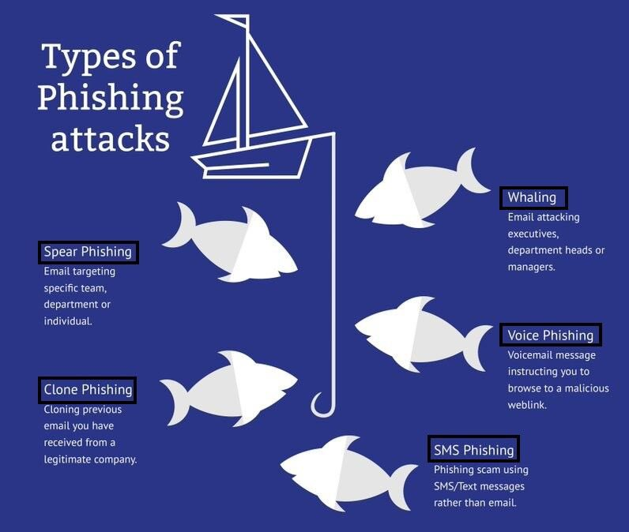

# DARKWIRE SOCIAL CYBER INSIGHTS 
&#x1F34E; **TOPIC = "infosec"**

## AUTOMATED RESEARCH SUMMARY
     

|  Trending  |   Images | 
:-------------------------:|:-------------------------:
|        |   |   
 
 

  
The most popular user is: **sfchronicle**  
 

## BREAKING: The solution to what’s known as the 340 Cypher, one of the most vexing mysteries of the Zodiac Killer’s m… https://t.co/Jh31gYaigS 

  

### TRENDING SHARED IMAGE

|                **Sample-Tweets**        |
| :-------------: |
| RT @MantaRay4ensics: 2020 Q4 VirusShare (0-389) MantaRay Forensics Refined Hash Set Released! @ https://t.co/YQ8fry8Bku #DFIR #malware #inf… |
| new #phishing at hXXp://hostname[.]d-tv[.]tv/ | 104[.]24[.]109[.]103 | United States | ETB - Colombia | ASN 19429… https://t.co/0pyahhwaS8 |
| RT @InfoSecComm: New Write-up on InfoSec Write-ups publication : "[THM] Break out the cage" #bugbounty… https://t.co/nkhWPNMhHr |

## RELATED METRICS 
| Metric | Value |
| ------------- | ------------- |
| #1 Most tweeted to  | **reach2ratan** |
| #2 Most tweeted to  | **AlyssaM_InfoSec** |
| #3 Most tweeted to  | **keepnetlabs** |
| NewProfiles (less than 10 days) | 0.36%  |
| Tweeters with < 10 followers  | 1.02%|
| Tweeters with > 1000000 followers  | 0.0%  |

## MOST POPULAR TWEET TERMS 

| Popularity Rank  | Term |
| ------------- | ------------- |
| first  | **INFOSEC**  |
| second  | **MALWARE**  |
| third  | **PHISHING** |
| fourth  | **@REACH2RATAN:**  |
| fifth  | **DIGITAL**  |

## Twitter Bio Analysis
### SENTIMENT ANALYSIS

VIEWS WERE : **SUBJECTIVE**  (20.0%) & **NEGATIVELY-SUBJECTIVE** (0.0%) **OBJECTIVE** (80.0%)

### TWEET SAMPLE 
| Random value picked from array |
| ------------- |
|RT @reach2ratan: FBI warns of hackers abusing email forwarding rules in recent attacks https://t.co/77FtMiNutk#CyberSecurity #digital #Ha… |

### MOST RETWEETED 

| The most retweeted user is: **sfchronicle**  |
| ------------- |
| BREAKING: The solution to what’s known as the 340 Cypher, one of the most vexing mysteries of the Zodiac Killer’s m… https://t.co/Jh31gYaigS |

# Potential Fake Accounts
 
# ChesteenKaitlynUSER INFO

 
`User ScreenName:` ChesteenKaitlyn 
 
`User chosen Name:` Kaitlyn Chesteen 
 
`Is the User Verified?:` False 
 
`User signup date?:` Tue Dec 08 21:51:24 +0000 2020 
 
`User Description?:` Mom, Manager and hoping to start a career in Cybet Security 
 
`Followers?: `2 
 
`Following?:` 11 
 
`User URL?:` None 
 
`Location:` Jacksonville, FL 
 
`Number of tweets extracted`  : 9 
 
`Profile image:` http://pbs.twimg.com/profile_images/1336428480830054401/NsNul5YD_normal.jpg 
 
`Number of tweets excluding replies:` 9 
 

 

 
## User Top tweeted words 
 
**SECURITY** 3 , **@NCSVENTURES:** 2 , **RANSOMWARE** 2 , **BREACH** 2 , **FIREEYE** 2 , **LINUX** 2 , **RT** 1 , **COMPUTERHACKER** 1 , **HACKERS** 1 , **CALLING** 1 , **VICTIMS** 1 , **ADD** 1 , **PRESSURE** 1 , **HTTPS://TCO/378YP8S5TGRT** 1 , **@WEBIMPRINTS:** 1 , **INFOSEC** 1 , **INFORMATIONSECURITY** 1 , **HACKING** 1 , **7** 1 , **SERVICES** 1 , 
 
## What this user tweeted
 
RT @Webimprints: #infosec #informationsecurity #hacking #security 7 SERVICES FOR CHECKING IF YOUR INFORMATION WAS A PART OF DATA BREACH OR…
 
# IoNotebookUSER INFO

 
`User ScreenName:` IoNotebook 
 
`User chosen Name:` LabNotebookIO with ✨glitter✨ 
 
`Is the User Verified?:` False 
 
`User signup date?:` Thu Dec 03 01:06:00 +0000 2020 
 
`User Description?:` Experiments from the home lab of an #infosec, #linux, #networking explorer. Mad scientist ENTP. It’s all one ongoing experiment. 🔬🧪 
 
`Followers?: `24 
 
`Following?:` 122 
 
`User URL?:` https://t.co/CTX7UEbV9s 
 
`Location:` My garage 
 
`Number of tweets extracted`  : 200 
 
`Profile image:` http://pbs.twimg.com/profile_images/1335625590376960001/vPgAUP16_normal.jpg 
 
`Number of tweets excluding replies:` 269 
 

 

 
## User Top tweeted words 
 
**SOME** 10 , **@GABSMASHH:** 10 , **24DAYSOFMICROBES** 10 , **DAY** 10 , **DIFFERENT** 7 , **THESE** 7 , **FOLKS** 7 , **I’M** 6 , **THINGS** 6 , **PEOPLE** 5 , **DOING** 5 , **FEEL** 5 , **WORKS** 5 , **KIND** 5 , **LOT** 5 , **GOOD** 5 , **@MALWAREJAKE:** 5 , **ALSO:** 5 , **@SARAHASMITH75** 4 , **@WH_Y** 4 , 
 
## What this user tweeted
 
@DougonIPComm @hacks4pancakes Ooooh....not gonna lie:  Part of my interest in infosec has roots in creeper behavior… https://t.co/ljkMTXJdEx
 
# ArjunasEyesUSER INFO

 
`User ScreenName:` ArjunasEyes 
 
`User chosen Name:` Roberto 
 
`Is the User Verified?:` False 
 
`User signup date?:` Tue Dec 08 18:28:02 +0000 2020 
 
`User Description?:` Don’t tell anyone, but I’m a ninja 
 
`Followers?: `19 
 
`Following?:` 15 
 
`User URL?:` None 
 
`Location:` Rug Village 
 
`Number of tweets extracted`  : 106 
 
`Profile image:` http://pbs.twimg.com/profile_images/1336382473975033859/w7pfVnbb_normal.jpg 
 
`Number of tweets excluding replies:` 106 
 

 

 
## User Top tweeted words 
 
**@WARONRUGS:** 42 , **@WARONRUGS** 29 , **@BASEPROTOCOL** 27 , **SCAM** 24 , **$BASE** 20 , **@CYBERSEC_EU** 19 , **@SCAMWATCH_GOV** 16 , **@CYBER** 14 , **ADVISORY** 10 , **@NCYOTEE** 10 , **❌** 9 , **PROJECT** 8 , **FUNDS** 7 , **PONZI** 7 , **CHECK** 6 , **?** 6 , **@SOLIDITYFINANCE** 6 , **@PELPA87** 6 , **WHERE** 5 , **SPECTIVVR** 5 , 
 
## What this user tweeted
 
RT @ArjunasEyes: Where did the 97% of the funds go @BaseProtocol
 ? #spectivvr @SEC_Investor_Ed

 #infosec @WARONRUGS

 #ScamAlert @Scams_a…
 
# th3cr4zycl4yUSER INFO

 
`User ScreenName:` th3cr4zycl4y 
 
`User chosen Name:` Th3cr4zycl4y 
 
`Is the User Verified?:` False 
 
`User signup date?:` Fri Dec 04 07:04:17 +0000 2020 
 
`User Description?:` life is to short... enjoy every moment... have fun living it... 
 
`Followers?: `4 
 
`Following?:` 158 
 
`User URL?:` None 
 
`Location:`  
 
`Number of tweets extracted`  : 74 
 
`Profile image:` http://pbs.twimg.com/profile_images/1334758092718944256/xbzygVIz_normal.jpg 
 
`Number of tweets excluding replies:` 75 
 

 

 
## User Top tweeted words 
 
**@CVENEW:** 15 , **ISSUE** 10 , **DISCOVERED** 10 , **THROUGH** 10 , **BUG** 6 , **PICOTCP** 6 , **170** 6 , **CODE** 6 , **CHECK** 6 , **STORED** 5 , **XSS** 5 , **DNS** 5 , **DOMAIN** 5 , **BUGBOUNTY** 5 , **BUGBOUNTYTIPS** 5 , **@INTIGRITI:** 5 , **@EXPLOITDB:** 5 , **BUGBOUNTYTIP** 5 , **10** 4 , **PICOTCP-NG** 4 , 
 
## What this user tweeted
 
RT @theunited36: Here is video on URL Redirection for people starting woth bug bounty:
https://t.co/5k2IAT1r1B

 @ADITYASHENDE17
 @Bugcrowd…
 
# cloudsecmagUSER INFO

 
`User ScreenName:` cloudsecmag 
 
`User chosen Name:` Cloud Security Magazine 
 
`Is the User Verified?:` False 
 
`User signup date?:` Thu Dec 10 23:53:01 +0000 2020 
 
`User Description?:`  
 
`Followers?: `1 
 
`Following?:` 11 
 
`User URL?:` None 
 
`Location:` Dallas, TX 
 
`Number of tweets extracted`  : 10 
 
`Profile image:` http://abs.twimg.com/sticky/default_profile_images/default_profile_normal.png 
 
`Number of tweets excluding replies:` 10 
 

 

 
## User Top tweeted words 
 
**@SANSCLOUDSEC:** 2 , **CHEAT** 2 , **CLOUDSECURITY** 2 , **SECURITY** 2 , **JOIN** 2 , **CLOUD** 2 , **CLOUDSEC** 2 , **3** 2 , **FREE** 2 , **TRAINING** 2 , **AWS** 2 , **RT** 1 , **🚨NEW** 1 , **SHEET🚨** 1 , **CHECK** 1 , **NEW** 1 , **SHEET** 1 , **SEC540** 1 , **SEC534** 1 , **"FIX** 1 , 
 
## What this user tweeted
 
RT @reach2ratan: Cloud Security Threats for 2021 https://t.co/oja5RLNedO

#CyberSecurity #digital #Hackers #infosec @reach2ratan #malware #…
 
# Simon99731093USER INFO

 
`User ScreenName:` Simon99731093 
 
`User chosen Name:` Simon (he) 
 
`Is the User Verified?:` False 
 
`User signup date?:` Sat Dec 05 23:32:34 +0000 2020 
 
`User Description?:` Was mit IT. Student. Mag Züge, #SQL, #Rust and Python. #100daysofCode 
 
`Followers?: `13 
 
`Following?:` 291 
 
`User URL?:` None 
 
`Location:` Cottbus, Germany 
 
`Number of tweets extracted`  : 200 
 
`Profile image:` http://pbs.twimg.com/profile_images/1336291083999997952/hgDOVKLq_normal.jpg 
 
`Number of tweets excluding replies:` 306 
 

 

 
## User Top tweeted words 
 
**CYBERSECURITY** 25 , **DIE** 18 , **SECURITY** 13 , **DER** 12 , **UND** 10 , **MIT** 10 , **WIR** 9 , **NEW** 9 , **@NIXCRAFT:** 8 , **FÜR** 7 , **ALS** 7 , **EINE** 7 , **IST** 7 , **DAS** 7 , **VON** 6 , **MALWARE** 6 , **DEN** 6 , **AUCH** 6 , **US** 6 , **2** 5 , 
 
## What this user tweeted
 
RT @CioAmaro: Easy actions to improve your cybersecurity
#Infosec #CyberSecurity #CyberAttack #Hacking #Privacy #Threat #Malware #Ransomwar…
 
# Mr0L00KUSER INFO

 
`User ScreenName:` Mr0L00K 
 
`User chosen Name:` Hany Soliman 
 
`Is the User Verified?:` False 
 
`User signup date?:` Fri Dec 04 13:31:26 +0000 2020 
 
`User Description?:` Pentester Guy 
 
`Followers?: `13 
 
`Following?:` 308 
 
`User URL?:` None 
 
`Location:`  
 
`Number of tweets extracted`  : 88 
 
`Profile image:` http://pbs.twimg.com/profile_images/1334869371747962891/_m2FCjgs_normal.jpg 
 
`Number of tweets excluding replies:` 88 
 

 

 
## User Top tweeted words 
 
**XSS** 12 , **BUGBOUNTY** 12 , **@TRBUGHUNTERS:** 11 , **BUGBOUNTYTIPS** 10 , **TOOL** 10 , **🛡️** 9 , **NEW** 8 , **@SECNHACK:** 7 , **DORKS** 7 , **PAYLOAD** 6 , **CYBERSECURITY** 6 , **BYPASS** 5 , **BUG** 5 , **SOME** 5 , **25** 5 , **BUGBOUNTYTIP** 5 , **FILTERS** 5 , **GOOD** 5 , **USE** 5 , **@DINOSN:** 4 , 
 
## What this user tweeted
 
RT @0xInfection: I learnt today that IP addresses can be shortened by dropping the zeroes.
Examples:
http://1.0.0.1 → http://1.1
http://192…
 
# ai4todayUSER INFO

 
`User ScreenName:` ai4today 
 
`User chosen Name:` AI FORTODAY 
 
`Is the User Verified?:` False 
 
`User signup date?:` Sat Dec 12 08:35:12 +0000 2020 
 
`User Description?:` Insights and news about Artificial Intelligence : science, business, applications... 
Account curated by scientists & experts from Europe. 
 
`Followers?: `6 
 
`Following?:` 67 
 
`User URL?:` None 
 
`Location:`  
 
`Number of tweets extracted`  : 16 
 
`Profile image:` http://pbs.twimg.com/profile_images/1337707302254743558/yACPbIFC_normal.jpg 
 
`Number of tweets excluding replies:` 16 
 

 

 
## User Top tweeted words 
 
**AI** 10 , **MOST** 3 , **LEARNING** 3 , **WORLD** 2 , **INFORMATION** 2 , **SYSTEMS** 2 , **@PAULA_PICCARD:** 2 , **MACHINELEARNING** 2 , **MACHINE** 2 , **DATA** 2 , **MAKE** 2 , **NEED** 1 , **KNOWLEDGE** 1 , **CONTEXT** 1 , **BOTH** 1 , **LACK** 1 , **HTTPS://TCO/HCSZDFLUBWDON'T** 1 , **FORGET** 1 , **TRAINING** 1 , **RELIES** 1 , 
 
## What this user tweeted
 
RT @Paula_Piccard: Is Now the Time to Start Protecting Government Data from Quantum Hacking?

#cybersecurity #riskmanagement #phishing #mal…
 
# gorithim_secUSER INFO

 
`User ScreenName:` gorithim_sec 
 
`User chosen Name:` Salem 
 
`Is the User Verified?:` False 
 
`User signup date?:` Fri Dec 04 01:59:42 +0000 2020 
 
`User Description?:` Emirati 🇦🇪 | interested in technology. 
 
`Followers?: `13 
 
`Following?:` 376 
 
`User URL?:` None 
 
`Location:` Abu Dhabi / Seattle, WA. 
 
`Number of tweets extracted`  : 37 
 
`Profile image:` http://pbs.twimg.com/profile_images/1336259308099670017/ot5HzTfn_normal.jpg 
 
`Number of tweets excluding replies:` 37 
 

 

 
## User Top tweeted words 
 
**/** 7 , **DEFENSE** 4 , **LEVEL** 4 , **MILITARY** 4 , **UAV** 4 , **UAE** 3 , **PROCESSORS** 3 , **CRYPTOGRAPHY** 3 , **GPS** 3 , **JAMMING** 3 , **:** 3 , **SPOOFING** 3 , **في** 3 , **RF** 2 , **PROTECTION** 2 , **TECHNICAL** 2 , **SURVEILLANCE** 2 , **@GORITHIM_SEC:** 2 , **SUPERVISORS** 2 , **@MAXIMINTEGRATED** 2 , 
 
## What this user tweeted
 
Enova tech line of X-wall crypto processors are suitable for enterprise / non military use. They have reliable data… https://t.co/EltvBAbK3DAnother level 4+ certified security supervisor is Made by mix-sig is MSIFPS ic. It contains multiple physical tampe… https://t.co/pHDvqc386NSecure supervisors and processors by @maximintegrated meet type -1 NSA/ Level 4 NIST cryptography for military and… https://t.co/fmWlbFOd6AHeads up, the Chinese ‘spy chip’ is in fact a ceramic high/low pass RF filter. Very tiny in size, true. Can’t comme… https://t.co/eQ63ol87BH
 
# ilalyvUSER INFO

 
`User ScreenName:` ilalyv 
 
`User chosen Name:` Lyv 
 
`Is the User Verified?:` False 
 
`User signup date?:` Thu Dec 10 04:57:45 +0000 2020 
 
`User Description?:` coming soon ... 
 
`Followers?: `19 
 
`Following?:` 544 
 
`User URL?:` None 
 
`Location:` anarcha 
 
`Number of tweets extracted`  : 29 
 
`Profile image:` http://pbs.twimg.com/profile_images/1336908540582178816/K2kOAodo_normal.jpg 
 
`Number of tweets excluding replies:` 29 
 

 

 
## User Top tweeted words 
 
**WHICH** 4 , **NEVER** 4 , **CLASS** 2 , **INTO** 2 , **OLD** 2 , **ISN'T** 2 , **STATE** 2 , **STRUGGLE** 2 , **YET** 2 , **DIDN'T** 2 , **I'VE** 2 , **REVOLUTIONARY** 2 , **1ST** 2 , **AGE** 2 , **RT** 1 , **@MUSLIMAHSAMIYAH:** 1 , **"THE** 1 , **CAPITALIST** 1 , **RESPECTS** 1 , **KIND** 1 , 
 
## What this user tweeted
 
I'm having 2nd thoughts about my low-cost InfoSec OpSec here. As I logged into Twitter greeted by the notification… https://t.co/MlS739x3vN
 
# MrNico63495111USER INFO

 
`User ScreenName:` MrNico63495111 
 
`User chosen Name:` Mr.Nico 
 
`Is the User Verified?:` False 
 
`User signup date?:` Sat Dec 12 05:00:12 +0000 2020 
 
`User Description?:` I have seen that in any great undertaking is not enough to man to simplify upon himself 
 
`Followers?: `0 
 
`Following?:` 41 
 
`User URL?:` None 
 
`Location:` Iuiú, Brasil 
 
`Number of tweets extracted`  : 20 
 
`Profile image:` http://pbs.twimg.com/profile_images/1337623417252528131/okPQl7nU_normal.jpg 
 
`Number of tweets excluding replies:` 20 
 

 

 
## User Top tweeted words 
 
**ATTACK** 5 , **DDOS** 4 , **@THEHACKERSNEWS:** 3 , **COULD** 2 , **💥** 2 , **@WHITEBIT6:** 2 , **🎄** 2 , **SOME** 2 , **TRYING** 2 , **US** 2 , **LATEST** 2 , **I'VE** 2 , **PRIVACY** 2 , **@BRIANKREBS:** 2 , **SHELL** 2 , **RT** 1 , **MULTIPLE** 1 , **CRITICAL** 1 , **FLAWS** 1 , **CORE** 1 , 
 
## What this user tweeted
 
RT @TheHackersNews: Multiple critical flaws in a core networking library powering Valve's Steam online #gaming platform could have allowed…RT @TheHackersNews: The U.S. Federal Trade Commission (FTC) and 48 states are suing #Facebook for allegedly breaking antitrust laws for ill…RT @cyber: Edge computing increases the risks of untrusted components into #5G networks. Read the latest @CISAgov resource to learn how to…RT @TheHackersNews: Connect with @TheHackersNews on Telegram to receive latest #cybersecurity news updates immediately!

Join this channel…
 
# 56cyberUSER INFO

 
`User ScreenName:` 56cyber 
 
`User chosen Name:` cyber_security_club_hk 
 
`Is the User Verified?:` False 
 
`User signup date?:` Tue Dec 08 05:21:11 +0000 2020 
 
`User Description?:` I Will give you information about cyber security and cyber crimes and what we need to aware of this cyber attacks 
 
`Followers?: `3 
 
`Following?:` 25 
 
`User URL?:` None 
 
`Location:`  
 
`Number of tweets extracted`  : 3 
 
`Profile image:` http://pbs.twimg.com/profile_images/1336179164286767105/ODIbe9As_normal.jpg 
 
`Number of tweets excluding replies:` 3 
 

 

 
## User Top tweeted words 
 
**ETHICALHACKING** 3 , **HACKING** 2 , **SECURITY** 2 , **HACKER** 2 , **TECHNOLOGY** 2 , **INFOSEC** 2 , **FOLLOW** 1 , **:-** 1 , **@56CYBER** 1 , **CYBERSECURITY** 1 , **CYBERCRIME…** 1 , **HTTPS://TCO/VUOQMEFHHGHACKING_OR_SECUTIY** 1 , **WIFIHACKING** 1 , **HACKINGTEAM** 1 , **ANONYMOUSHACKTIVIST** 1 , **CYBERSQUAD** 1 , **CYBERSECURITYMAJOR💻…** 1 , **HTTPS://TCO/OVWZEHVRPOCYBERSECURITY** 1 , **CYBERCRIME** 1 , **LINUX** 1 , 
 
## What this user tweeted
 
Follow me :- @56cyber 
#cybersecurity #hacking #security #hacker #technology #infosec #ethicalhacking #cybercrime… https://t.co/vuoQMefhHg
 

<b> This report is AUTOMATED and not hand crafted, it is designed for pulling metrics on a given keyword or hashtag and performs a series of reporting and analysis.</b>  
### CONCLUSION & EXTERNAL ANALYSIS

*This is my [Adam McMurchie`s] opinion on the data from the tweets, it serves as no objective truth.Since the tweets themselves are a mixture of fact & opinion. 
Authors analytical summary on request.
**RECOMMENDATIONS** WILL BE UPDATED IN NEXT  24 HOURS  