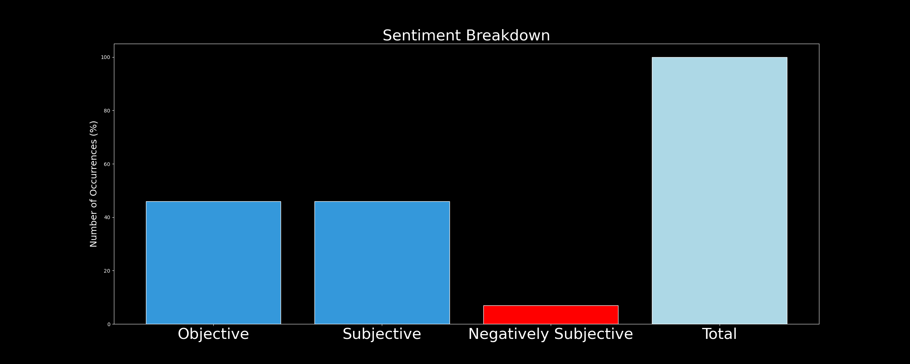

# DARKWIRE SOCIAL CYBER INSIGHTS 
&#x1F34E; **TOPIC = "cybersecurity"**

## AUTOMATED RESEARCH SUMMARY
     

|  Trending  |   Images | 
:-------------------------:|:-------------------------:
|        |   |   
 
 

  
The most popular user is: **BlackHippy77**  
 

## My baby is officially enrolled in the 3D program. By 10th grade she'll have her diploma. By 12th she'll have her AA… https://t.co/rYPG0TLkRx 

  

### TRENDING SHARED IMAGE

|                **Sample-Tweets**        |
| :-------------: |
| RT @aicanedo: How is #AI centered product desing diferent? https://t.co/q5HjMDMg84 #ArtificialIntelligence #MachineLearning #AI #100DaysOfC… |
| RT @klnash77: 💻 @click_studios, the company behind the Passwordstate enterprise #password manager, notified customers that attackers compro… |
| COVID-19 and E-Discovery- How Things Are Changing https://t.co/9wVRlEH9aP  #CyberSecurityNews #Cyber #CyberSecurity… https://t.co/7aqAMdOr0N |

## RELATED METRICS 
| Metric | Value |
| ------------- | ------------- |
| #1 Most tweeted to  | **iotcybersec24** |
| #2 Most tweeted to  | **ingliguori** |
| #3 Most tweeted to  | **Eli_Krumova** |
| NewProfiles (less than 10 days) | 1.04%  |
| Tweeters with < 10 followers  | 2.44%|
| Tweeters with > 1000000 followers  | 0.06%  |

## MOST POPULAR TWEET TERMS 

| Popularity Rank  | Term |
| ------------- | ------------- |
| first  | **DATA**  |
| second  | **RANSOMWARE**  |
| third  | **INFOSEC** |
| fourth  | **MALWARE**  |
| fifth  | **IOT**  |

## Twitter Bio Analysis
### SENTIMENT ANALYSIS

VIEWS WERE : **SUBJECTIVE**  (20.0%) & **NEGATIVELY-SUBJECTIVE** (13.33%) **OBJECTIVE** (66.67%)

### TWEET SAMPLE 
| Random value picked from array |
| ------------- |
|RT @Optiv: Why choose our #Cybersecurity education services?🌎 7,000+ clients in 70 countries🤝 300+ subject matter experts👩‍💻 1,000,000+… |

### MOST RETWEETED 

| The most retweeted user is: **BlackHippy77**  |
| ------------- |
| My baby is officially enrolled in the 3D program. By 10th grade she'll have her diploma. By 12th she'll have her AA… https://t.co/rYPG0TLkRx |

# Potential Fake Accounts
 
# solmedi64446184USER INFO

 
`User ScreenName:` solmedi64446184 
 
`User chosen Name:` sol medina 
 
`Is the User Verified?:` False 
 
`User signup date?:` Thu Apr 29 21:19:04 +0000 2021 
 
`User Description?:`  
 
`Followers?: `0 
 
`Following?:` 13 
 
`User URL?:` None 
 
`Location:`  
 
`Number of tweets extracted`  : 46 
 
`Profile image:` http://abs.twimg.com/sticky/default_profile_images/default_profile_normal.png 
 
`Number of tweets excluding replies:` 46 
 

 

 
## User Top tweeted words 
 
**DE** 37 , **LA** 31 , **Y** 18 , **EL** 17 , **EN** 10 , **AL** 9 , **ARISTÓBULO** 9 , **POR** 9 , **DEL** 9 , **LOS** 9 , **UN** 8 , **QUE** 7 , **PARA** 7 , **CON** 7 , **ISTÚRIZ** 7 , **ES** 7 , **NUESTRO** 7 , **@NICOLASMADURO:** 6 , **@CONCILIAFLORES** 6 , **@CONCILIAFLORES:** 6 , 
 
## What this user tweeted
 
RT @BscSteve: It’s never been a more critical time for tech professionals to be fully embedded in the business. The #WSJProCyber Forum will…
 
# bl34klyUSER INFO

 
`User ScreenName:` bl34kly 
 
`User chosen Name:` bleakly 
 
`Is the User Verified?:` False 
 
`User signup date?:` Tue Apr 20 21:15:22 +0000 2021 
 
`User Description?:` skeletons, infosec & creative coding stuff. 
 
`Followers?: `4 
 
`Following?:` 64 
 
`User URL?:` None 
 
`Location:`  
 
`Number of tweets extracted`  : 10 
 
`Profile image:` http://pbs.twimg.com/profile_images/1384667758093340676/vepaOoQw_normal.jpg 
 
`Number of tweets excluding replies:` 10 
 

 

 
## User Top tweeted words 
 
**INFOSEC** 3 , **SKILLS?** 2 , **BREAK** 2 , **COMPUTER** 2 , **WHOOP** 2 , **RT** 1 , **@0X0ZONE:** 1 , **WANNA** 1 , **INTO** 1 , **INFOSEC?** 1 , **GOT** 1 , **MAD** 1 , **PROBLEM** 1 , **ANALYSIS/TROUBLESHOOTING** 1 , **SYSTEM** 1 , **AND/OR** 1 , **NETWORK** 1 , **ADMIN** 1 , **I’LL** 1 , **FIGHT** 1 , 
 
## What this user tweeted
 
RT @0x0zone: Wanna get into infosec?  Got mad problem analysis/troubleshooting skills?  System and/or network admin skills?  I’ll fight to…
 
# LacieCarlson19USER INFO

 
`User ScreenName:` LacieCarlson19 
 
`User chosen Name:` Lacie Carlson 
 
`Is the User Verified?:` False 
 
`User signup date?:` Wed Apr 28 22:30:30 +0000 2021 
 
`User Description?:`  
 
`Followers?: `0 
 
`Following?:` 14 
 
`User URL?:` None 
 
`Location:` Arizona  
 
`Number of tweets extracted`  : 6 
 
`Profile image:` http://pbs.twimg.com/profile_images/1387534758519918596/_FXPyxPh_normal.jpg 
 
`Number of tweets excluding replies:` 6 
 

 

 
## User Top tweeted words 
 
**@LUMENTECHCO** 2 , **DURING** 2 , **WEEK** 2 , **INTERESTED** 1 , **LEARNING** 1 , **RANSOMWARE?** 1 , **READ** 1 , **AFFECT** 1 , **ORGANIZATION…** 1 , **HTTPS://TCO/KU1QODMVBGWE** 1 , **READY** 1 , **JOIN** 1 , **@ZOOM_US** 1 , **PHONE** 1 , **DELIVERED** 1 , **FAMILY** 1 , **ANSWER** 1 , **CALL?** 1 , **HTTPS://TCO/C7BGRCHX0ZSECURITY** 1 , **FIRM** 1 , 
 
## What this user tweeted
 
Interested in learning more about #ransomware? Read about what it is and how it can affect your organization.… https://t.co/Ku1QOdmvbg
 
# SuccessfulInve6USER INFO

 
`User ScreenName:` SuccessfulInve6 
 
`User chosen Name:` Successful Investor 
 
`Is the User Verified?:` False 
 
`User signup date?:` Sun Apr 25 19:42:44 +0000 2021 
 
`User Description?:` Private investor ioT #TERN PLC #cybersecurity 
 
`Followers?: `11 
 
`Following?:` 117 
 
`User URL?:` None 
 
`Location:`  
 
`Number of tweets extracted`  : 68 
 
`Profile image:` http://abs.twimg.com/sticky/default_profile_images/default_profile_normal.png 
 
`Number of tweets excluding replies:` 69 
 

 

 
## User Top tweeted words 
 
**TERN** 52 , **PLC** 40 , **INVESTEE** 23 , **@DEVICEAUTHORITY** 21 , **COMPANIES** 15 , **MICROSOFT** 14 , **IOT** 14 , **RMS** 13 , **@WYLDNETWORKS** 12 , **PREM** 12 , **STARTED** 12 , **BOIL** 11 , **NYCT** 7 , **PARTNERSHIP** 6 , **MODE** 6 , **COOPERATION** 6 , **GREAT** 5 , **14P** 5 , **WITH…** 5 , **88E** 5 , 
 
## What this user tweeted
 
@KirkDBorne #tern This is all about Tern Plc and tern's great investee companies @DeviceAuthority and @WyldNetworks… https://t.co/82roWtnGqa
 
# AzuerBotUSER INFO

 
`User ScreenName:` AzuerBot 
 
`User chosen Name:` azuer-bot 
 
`Is the User Verified?:` False 
 
`User signup date?:` Sun Apr 25 00:08:42 +0000 2021 
 
`User Description?:` Hey there, I'm a bot 🤖, I retweet #100DaysOfCode, #programming, #coding and  #javascript. @fernandot_23 is my creator 😊 
 
`Followers?: `73 
 
`Following?:` 0 
 
`User URL?:` None 
 
`Location:`  
 
`Number of tweets extracted`  : 200 
 
`Profile image:` http://pbs.twimg.com/profile_images/1386116533290733570/qLvPNj1N_normal.jpg 
 
`Number of tweets excluding replies:` 8504 
 

 

 
## User Top tweeted words 
 
**PYTHON** 53 , **BIGDATA** 52 , **MACHINELEARNING** 46 , **PAY** 45 , **ESSAYPAY** 43 , **ANALYTICS** 40 , **DUE** 40 , **100DAYSOFCODE** 39 , **JAVASCRIPT** 39 , **@UDEMY_COUPONS1:** 38 , **ESSAY** 36 , **ASSIGNMENT** 29 , **DATASCIENCE** 27 , **WRITE** 27 , **PROGRAMMING** 27 , **PHYSICS** 26 , **CHEMISTRY** 25 , **SOMEONE** 25 , **ONLINECLASS** 23 , **AI** 22 , 
 
## What this user tweeted
 
RT @MiriamAsensi: take a look at the future of #EndpointManagement 

#bigfix #IDC #UEM #futureofwork
#Appsec #cybersecurity #datascience #j…RT @SherifFelife: vidIQ Vision For YouTube Enterprise v3.45.0 Full Activated - YouTube SEO – Discount 100% OFF ~ Dr.FarFar https://t.co/MLg…RT @AgoryumV: Giving our best on each and every effort, every time out, every new project, every new product, every new technology and ever…RT @Udemy_Coupons1: Mobile Cybersecurity Awareness https://t.co/DCA34RqzAU

#MachineLearning. #BigData #Analytics #DataScience #AI #IoT #II…RT @PaoloPiccolo7: Have a look at this latest Research about #HCLCommerce!#hclswlobp #nocode #lowcode #javascript #github #nodejs #cybersec…RT @Eli_Krumova: 🤣@realColinMac:
'If #HarryPotter can speak in parseltongue, he can damn well #code #Python ' 🪄🧙🏽

#DEVCommunity #Programmi…RT @Eli_Krumova: How to get started with #Coding 👨🏽‍💻
#ThursdayMotivation #thursdaymood

v @SourabhSKatoch
#DEVCommunity #Programming #100D…RT @aicanedo: How is #AI centered product desing diferent? https://t.co/q5HjMDMg84 #ArtificialIntelligence #MachineLearning #AI #100DaysOfC…RT @MiriamAsensi: Code once deploy everywhere with  #VoltMX

#VR #AR  #CX #AI #Python #nocode #iot #cybersecurity  #datascience #javascript…RT @Annie134873511: https://t.co/b7WhCy6mKr
Get hire me as your #assistant on #fiverr
#fiverrgigs #math #Excel #MadeOnFiverr
#100DaysOfCode…RT @jiad25: AutLand Suite Microsocial v21.16.1 Full Activated - Social Media Marketing – Discount 100% OFF ~ Dr.FarFar https://t.co/YirWeu7…RT @_NerdParrot: 💡Bash tips and tricks 
Return to the previous directory:
𝚌𝚍 -

#linux #programming #hacking #coding #cybersecurity #kalili…RT @Nasser71388125: AutLand Suite Microsocial v21.16.1 Full Activated - Social Media Marketing – Discount 100% OFF ~ Dr.FarFar https://t.co…RT @Nasser71388125: vidIQ Vision For YouTube Enterprise v3.45.0 Full Activated - YouTube SEO – Discount 100% OFF ~ Dr.FarFar https://t.co/Z…RT @PaoloPiccolo7: Enterprises are becoming data-driven to make informed decisions for their business!#hclswlobp #nocode #lowcode #javascri…RT @nnbofficial786: Website Auto Traffic Generator Ultimate v7.4 Full Activated – Discount 100% OFF ~ Dr.FarFar https://t.co/GSWeT8FqQ8 #in…RT @nnbofficial786: Mailbird Business v2.9.27.0 Full Activated – Discount 100% OFF ~ Dr.FarFar https://t.co/ILrSHMU2QM #infosec #bugcrowd #…RT @Analytics_699: Making IoT devices Safe &amp; Secured from Hackers▶️
#Analytics #MachineLearning #AI #Python #Rstats #Reactjs #IoT #IIoT #Bi…RT @nnbofficial786: vidIQ Vision For YouTube Enterprise v3.45.0 Full Activated - YouTube SEO – Discount 100% OFF ~ Dr.FarFar https://t.co/I…RT @zefinescu: Quantum Computing Explained
#100DaysOfCode
#AI #Python #javascript #DataScience
#MachineLearning #cybersecurity #IoT #DEVCom…RT @Emmansam281: vidIQ Vision For YouTube Enterprise v3.45.0 Full Activated - YouTube SEO – Discount 100% OFF ~ Dr.FarFar https://t.co/jkmv…RT @HackingBooksPDF: Hacking with Python

#books #100DaysOfCode #bugbountytips #ethicalhacking #Hackers #Pentesting #CyberSecurity #BugsBun…RT @Xoriant: Check out 5 IoT trends to watch in 2021. 
via @Forbes 

https://t.co/bo5h0QJV5x 

#BigData #Analytics #DataScience #MachineLea…RT @startup_magnate: RT @MoZouine: #Lowcode #Webinar: join today
#nocode #lowcode #javascript #github #nodejs #cybersecurity #devops #100Da…RT @Eli_Krumova: #Python #Interview Questions: 👨🏽‍💻
🗨️Difference b/n len( ) 🆚 getsizeof( )❓

#BigData #Analytics #DataScience #MachineLearn…RT @MoZouine: #Lowcode use case: Retail

#nocode #javascript #github #nodejs #cybersecurity #devops #100DaysOfCode #datascience #ai #iot #m…RT @Annie134873511: https://t.co/5VdrjXMJ0u
Get hire me as your #assistant on #fiverr
#fiverrgigs #math #Excel #MadeOnFiverr
#100DaysOfCode…RT @Annie134873511: https://t.co/b7WhCy6mKr
Get hire me as your #assistant on #fiverr
#fiverrgigs #math #Excel #MadeOnFiverr
#100DaysOfCode…RT @ndroid_techk: Ethical Hacking Tools - Part 2 

https://t.co/IM1HzmnC1o 

#100DaysOfCode #100DaysOfMLCode #AndroidDev #gamedev #programm…RT @UsmanSh88723716: https://t.co/MAD1NsaIcH
Get hire me as your #assistant on #fiverr
#fiverrgigs #math #Excel #MadeOnFiverr
#100DaysOfCod…RT @UsmanSh88723716: https://t.co/vt5OGRwU2Z
Get hire me as your #assistant on #fiverr
#fiverrgigs #math #Excel #MadeOnFiverr
#100DaysOfCod…RT @Eli_Krumova: 😂 @SourabhSKatoch:
'Satan getting back to work'

#100DaysOfCode #MachineLearning #ML #Python #programming #IoT #IIoT #IoTP…RT @hhilhorst: Digital trends leading to #HCLDX

@HCLTech @HCLDigital @HCLSoftware #hclswlobp #dx #cms #digitaltransformation #webdev #webd…
 
# PetrosKlironom1USER INFO

 
`User ScreenName:` PetrosKlironom1 
 
`User chosen Name:` Petros Klironomos 
 
`Is the User Verified?:` False 
 
`User signup date?:` Mon Apr 26 16:00:26 +0000 2021 
 
`User Description?:`  
 
`Followers?: `1 
 
`Following?:` 54 
 
`User URL?:` None 
 
`Location:`  
 
`Number of tweets extracted`  : 1 
 
`Profile image:` http://abs.twimg.com/sticky/default_profile_images/default_profile_normal.png 
 
`Number of tweets excluding replies:` 1 
 

 

 
## User Top tweeted words 
 
**RT** 1 , **@ENISA_EU:** 1 , **EUROPEAN** 1 , **UNION** 1 , **AGENCY** 1 , **CYBERSECURITY** 1 , **COMMITTED** 1 , **PROTECTING** 1 , **EUROPE** 1 , **CYBER** 1 , **THREATS** 1 , **TOGETHER** 1 , **EU…** 1 , 
 
## What this user tweeted
 
RT @enisa_eu: We at the European Union Agency for Cybersecurity are committed to protecting Europe from cyber threats together with our EU…
 
# Maxima02665316USER INFO

 
`User ScreenName:` Maxima02665316 
 
`User chosen Name:` Randolph 
 
`Is the User Verified?:` False 
 
`User signup date?:` Thu Apr 22 00:13:04 +0000 2021 
 
`User Description?:`  
 
`Followers?: `0 
 
`Following?:` 0 
 
`User URL?:` None 
 
`Location:`  
 
`Number of tweets extracted`  : 2 
 
`Profile image:` http://pbs.twimg.com/profile_images/1387863768101687300/a9CLAxdf_normal.jpg 
 
`Number of tweets excluding replies:` 2 
 

 

 
## User Top tweeted words 
 
**@WITLINKA** 1 , **CYBERSECURITY?** 1 , **DOES** 1 , **MEAN?@TOP7ICO** 1 , **@PLETHORI** 1 , **@KYLIN_NETWORK** 1 , **@POLKADOT** 1 , **ANY** 1 , **OTHER** 1 , **PARTNERSHIPS** 1 , **PLANNED?** 1 , 
 
## What this user tweeted
 
@WitlinkA Cybersecurity? What does it mean?
 
# ThomasR03160129USER INFO

 
`User ScreenName:` ThomasR03160129 
 
`User chosen Name:` Thomas Richard 
 
`Is the User Verified?:` False 
 
`User signup date?:` Thu Apr 29 19:46:46 +0000 2021 
 
`User Description?:` Former Aviation 🚁🚁Officer at United States #Army/Airforce / 🔫🔫🔪🔪🗡Examiner at U.S. parachute ass.. Skydiver instructor / 🏹🏒🏋️‍♀️🏊‍♀️🎯🏔 
 
`Followers?: `0 
 
`Following?:` 19 
 
`User URL?:` None 
 
`Location:` Turkey 
 
`Number of tweets extracted`  : 7 
 
`Profile image:` http://pbs.twimg.com/profile_images/1387856526916952068/xENYUhZ-_normal.jpg 
 
`Number of tweets excluding replies:` 7 
 

 

 
## User Top tweeted words 
 
**RT** 1 , **@FRRONCONI:** 1 , **LOOKING** 1 , **NEW** 1 , **OPPORTUNITIES** 1 , **EUROPE** 1 , **HTTPS://TCO/TF6AXIAPUG** 1 , **JOB** 1 , **JOBOPPORTUNITY** 1 , **LOOKINGFORJOB** 1 , **PLS** 1 , **RTRT** 1 , **@FOGLE_SHANE:** 1 , **THURSDAYVIBES** 1 , **MOOD** 1 , **CC:** 1 , **@DIGITALCLOUDGAL** 1 , **@JOLABURNETT** 1 , **@ARCHONSEC** 1 , **@ALCGROUP** 1 , 
 
## What this user tweeted
 
RT @DrJDrooghaag: 🔵 On April 17th, we will launch the 5th edition of Internet Safety for Kids and celebrate 15 years raising cybersecurity…
 
# kelvin61374331USER INFO

 
`User ScreenName:` kelvin61374331 
 
`User chosen Name:` kelvin 
 
`Is the User Verified?:` False 
 
`User signup date?:` Thu Apr 29 00:10:32 +0000 2021 
 
`User Description?:` I love my family ❤️ 
 
`Followers?: `0 
 
`Following?:` 16 
 
`User URL?:` None 
 
`Location:` New Mexico, USA 
 
`Number of tweets extracted`  : 76 
 
`Profile image:` http://pbs.twimg.com/profile_images/1387559971714441218/AuUXMUyB_normal.jpg 
 
`Number of tweets excluding replies:` 76 
 

 

 
## User Top tweeted words 
 
**ACCOUNT** 20 , **GOT** 17 , **LOCKED** 16 , **🚀** 16 , **HAPPEN** 15 , **DOGECOIN** 13 , **SUPPORT** 12 , **SERVICE** 11 , **AREN’T** 11 , **DOING** 11 , **@UNITEDSTANDMUFC:** 7 , **ANYTHING** 5 , **@CHAIRWOMANDOGE:** 5 , **@DOGECOIN_RISE:** 5 , **TIME** 4 , **POGBA** 4 , **A…** 4 , **ROMA** 3 , **S…** 3 , **@SNAPCHATSUPPORT** 3 , 
 
## What this user tweeted
 
RT @ESET: What are the key #FinTech takeaways?

Find out more about why it’s high time to get serious about apps in the world of FinTech. #…
 
# ISafety4KidsUSER INFO

 
`User ScreenName:` ISafety4Kids 
 
`User chosen Name:` Internet Safety for Kids 
 
`Is the User Verified?:` False 
 
`User signup date?:` Fri Apr 23 07:44:47 +0000 2021 
 
`User Description?:` Internet Safety for Kids - enable children and parents to use the internet responsibly! #InternetSafetyForKids #InternetSafety4Kids #CyberSecurity 
 
`Followers?: `19 
 
`Following?:` 22 
 
`User URL?:` https://t.co/XCtO3fuARF 
 
`Location:`  
 
`Number of tweets extracted`  : 35 
 
`Profile image:` http://pbs.twimg.com/profile_images/1385524314905137154/lV17Ldyq_normal.jpg 
 
`Number of tweets excluding replies:` 35 
 

 

 
## User Top tweeted words 
 
**INTERNET** 32 , **SAFETY** 29 , **KIDS** 26 , **@DRJDROOGHAAG:** 25 , **🔵** 25 , **KIDS!** 18 , **CYBERSECURITY** 11 , **PARENTS** 9 , **CISO** 9 , **INFOSEC** 9 , **MADE** 8 , **JOIN** 8 , **PRIVACY** 8 , **KINDEREN** 8 , **TEACHERS** 7 , **PROGRAM** 7 , **ENABLE** 7 , **ENJOY** 7 , **EPISODE** 7 , **UND** 7 , 
 
## What this user tweeted
 
RT @ISafety4Kids: Internet Safety for Kids - Episode 2 - Privacy and Social Media

#CyberSecurity #CISO #Infosec #privacy #SocialMedia #Par…
 
# AispLabUSER INFO

 
`User ScreenName:` AispLab 
 
`User chosen Name:` AISPLab 
 
`Is the User Verified?:` False 
 
`User signup date?:` Thu Apr 22 13:22:51 +0000 2021 
 
`User Description?:` The Advanced Information Security and Privacy (AISP) Research Lab is dedicated to promote usable security and privacy models to enhance safety and privacy. 
 
`Followers?: `0 
 
`Following?:` 2 
 
`User URL?:` None 
 
`Location:`  
 
`Number of tweets extracted`  : 2 
 
`Profile image:` http://abs.twimg.com/sticky/default_profile_images/default_profile_normal.png 
 
`Number of tweets excluding replies:` 2 
 

 

 
## User Top tweeted words 
 
**CYBERSECURITY** 2 , **RT** 1 , **@SUNYCANTONNEWS:** 1 , **TWO** 1 , **SUNY** 1 , **CANTON'S** 1 , **TOP** 1 , **EXPERTS** 1 , **HOSTING** 1 , **PANEL** 1 , **DISCUSSION** 1 , **CYBERBULLYING** 1 , **FOLLOWING** 1 , **TRAGIC** 1 , **DEA…RT** 1 , **@DRGHAZINOUR:** 1 , **DELIGHTED** 1 , **ANNOUNCE** 1 , **RECEIVED** 1 , **NSF** 1 , 
 
## What this user tweeted
 
RT @SUNYCantonNews: Two of SUNY Canton's top Cybersecurity experts are hosting a panel discussion on cyberbullying following the tragic dea…
 
# Nasser71388125USER INFO

 
`User ScreenName:` Nasser71388125 
 
`User chosen Name:` Nasser 
 
`Is the User Verified?:` False 
 
`User signup date?:` Thu Apr 29 18:48:54 +0000 2021 
 
`User Description?:`  
 
`Followers?: `2 
 
`Following?:` 2 
 
`User URL?:` None 
 
`Location:`  
 
`Number of tweets extracted`  : 2 
 
`Profile image:` http://pbs.twimg.com/profile_images/1387841424826187776/1U8vg5Kc_normal.jpg 
 
`Number of tweets excluding replies:` 2 
 

 

 
## User Top tweeted words 
 
**FULL** 2 , **ACTIVATED** 2 , **–** 2 , **DISCOUNT** 2 , **100%** 2 , **OFF** 2 , **~** 2 , **DRFARFAR…** 2 , **YOUTUBE** 2 , **AUTLAND** 1 , **SUITE** 1 , **MICROSOCIAL** 1 , **V21161** 1 , **SOCIAL** 1 , **MEDIA** 1 , **MARKETING** 1 , **HTTPS://TCO/X7XNDGZ0KWVIDIQ** 1 , **VISION** 1 , **ENTERPRISE** 1 , **V3450** 1 , 
 
## What this user tweeted
 
AutLand Suite Microsocial v21.16.1 Full Activated - Social Media Marketing – Discount 100% OFF ~ Dr.FarFar… https://t.co/X7XNdgZ0kwvidIQ Vision For YouTube Enterprise v3.45.0 Full Activated - YouTube SEO – Discount 100% OFF ~ Dr.FarFar… https://t.co/mYADGHJsxi
 
# danielkoehler14USER INFO

 
`User ScreenName:` danielkoehler14 
 
`User chosen Name:` daniel koehler 
 
`Is the User Verified?:` False 
 
`User signup date?:` Tue Apr 27 17:08:41 +0000 2021 
 
`User Description?:`  
 
`Followers?: `0 
 
`Following?:` 1 
 
`User URL?:` None 
 
`Location:`  
 
`Number of tweets extracted`  : 4 
 
`Profile image:` http://abs.twimg.com/sticky/default_profile_images/default_profile_normal.png 
 
`Number of tweets excluding replies:` 4 
 

 

 
## User Top tweeted words 
 
**FULL** 4 , **ACTIVATED** 4 , **–** 4 , **DISCOUNT** 4 , **100%** 4 , **OFF** 4 , **~** 4 , **DRFARFAR…** 3 , **YOUTUBE** 2 , **AUTLAND** 1 , **SUITE** 1 , **MICROSOCIAL** 1 , **V21161** 1 , **SOCIAL** 1 , **MEDIA** 1 , **MARKETING** 1 , **HTTPS://TCO/YZ2AAOFJGZNINJATOK** 1 , **V1247** 1 , **UNLIMITED** 1 , **TIKTOK** 1 , 
 
## What this user tweeted
 
AutLand Suite Microsocial v21.16.1 Full Activated - Social Media Marketing – Discount 100% OFF ~ Dr.FarFar… https://t.co/yZ2aAOfjgzNinjaTok v1.2.4.7 Full Activated - Unlimited TikTok Accounts – Discount 100% OFF ~ Dr.FarFar… https://t.co/YdkGIGFv1k
 
# Brittanyazavi2USER INFO

 
`User ScreenName:` Brittanyazavi2 
 
`User chosen Name:` Brittanyazavi 
 
`Is the User Verified?:` False 
 
`User signup date?:` Sat Apr 24 08:15:01 +0000 2021 
 
`User Description?:` ❤️❤️here too meet people 
 
`Followers?: `29 
 
`Following?:` 44 
 
`User URL?:` None 
 
`Location:` Florida, USA 
 
`Number of tweets extracted`  : 200 
 
`Profile image:` http://pbs.twimg.com/profile_images/1386170752085417989/1IuZxfcm_normal.jpg 
 
`Number of tweets excluding replies:` 4123 
 

 

 
## User Top tweeted words 
 
**BIDEN** 14 , **US** 14 , **@DAVIDHOGG111:** 13 , **PRESIDENT** 11 , **@STOOLPRESIDENTE:** 10 , **@RAPSHEET:** 9 , **FIRST** 9 , **NEW** 8 , **@ADAMSCHEFTER:** 7 , **@BILLKRISTOL:** 7 , **DAY** 7 , **@DAVIDFRUM:** 7 , **DEMOCRACY** 6 , **TIME** 6 , **MADE** 5 , **GUN** 5 , **WAY** 5 , **LOOK** 5 , **LAST** 5 , **GOOD** 5 , 
 
## What this user tweeted
 
RT @ITU_AIForGood: KEYNOTE | W/ @Mikko!
💀 Can #malware reprogram its own code?
💀 Will #phishing attacks detect what works and adjust?
💀 Can…
 
# AkashPa77746391USER INFO

 
`User ScreenName:` AkashPa77746391 
 
`User chosen Name:` Akash Pandey (TAF) 
 
`Is the User Verified?:` False 
 
`User signup date?:` Wed Apr 28 07:19:38 +0000 2021 
 
`User Description?:` #जय_श्री_राम
#देश_भक्त 
 
`Followers?: `106 
 
`Following?:` 122 
 
`User URL?:` None 
 
`Location:`  
 
`Number of tweets extracted`  : 200 
 
`Profile image:` http://pbs.twimg.com/profile_images/1387314636299509762/LkGFLgop_normal.jpg 
 
`Number of tweets excluding replies:` 308 
 

 

 
## User Top tweeted words 
 
**HAI** 50 , **@MYOGIADITYANATH** 42 , **के** 42 , **में** 37 , **@MYOGIOFFICE** 34 , **@JPNADDA** 32 , **@RAOMAHESHYADAV9** 27 , **NHI** 26 , **@TEAM_RWY** 25 , **@SHUKLA8922** 24 , **@AKASHDEEPAKSRI1…** 24 , **KI** 24 , **@VIJAYKU11005514** 23 , **TOH** 23 , **से** 22 , **और** 21 , **KO** 20 , **की** 19 , **को** 19 , **BHAI** 19 , 
 
## What this user tweeted
 
RT @PoliceBilaspur: BEWARE OF CYBER ATTACK
#cybersecurity https://t.co/pTAkkZofFP
 
# AminoBoeviUSER INFO

 
`User ScreenName:` AminoBoevi 
 
`User chosen Name:` Amino Boevi 
 
`Is the User Verified?:` False 
 
`User signup date?:` Thu Apr 29 18:04:11 +0000 2021 
 
`User Description?:`  
 
`Followers?: `0 
 
`Following?:` 5 
 
`User URL?:` None 
 
`Location:`  
 
`Number of tweets extracted`  : 32 
 
`Profile image:` http://abs.twimg.com/sticky/default_profile_images/default_profile_normal.png 
 
`Number of tweets excluding replies:` 32 
 

 

 
## User Top tweeted words 
 
**DE** 53 , **LA** 37 , **DU** 28 , **@CNEJTG:** 24 , **À** 19 , **LE** 16 , **DES** 14 , **CNEJ** 12 , **ET** 9 , **CE** 8 , **2021** 7 , **LES** 7 , **POUR** 7 , **CONSEIL** 7 , **L'EMPLOI** 7 , **JEUNES** 7 , **L'ATELIER** 6 , **MINISTRE** 6 , **SUR** 6 , **TOGO** 6 , 
 
## What this user tweeted
 
RT @_voxdigitali: Great to see the building blocks of #CyberSecurity being put into place in #Togo so nicely one after the other. Excellent…
 
# AApriyudiUSER INFO

 
`User ScreenName:` AApriyudi 
 
`User chosen Name:` Arizal Apriyudi 
 
`Is the User Verified?:` False 
 
`User signup date?:` Thu Apr 29 13:54:46 +0000 2021 
 
`User Description?:` baik hati 
 
`Followers?: `13 
 
`Following?:` 33 
 
`User URL?:` None 
 
`Location:`  
 
`Number of tweets extracted`  : 27 
 
`Profile image:` http://pbs.twimg.com/profile_images/1387767776341897228/6dV0zMYK_normal.jpg 
 
`Number of tweets excluding replies:` 27 
 

 

 
## User Top tweeted words 
 
**PERSON** 8 , **RT** 5 , **GIVE** 4 , **RETWEETS** 4 , **RETWEET** 4 , **FOLLOW** 4 , **JOIN** 4 , **RANDOM** 4 , **TWEET** 3 , **1** 3 , **FOLLOWS** 3 , **TELEGRAM** 3 , **@SCOTTZILWARRIOR:** 3 , **SEND** 3 , **MYSELF** 3 , **@GORILLADIAMONDT:** 3 , **GDT** 3 , **GORILLADIAMOND** 3 , **MUTUALAN** 3 , **🛸** 2 , 
 
## What this user tweeted
 
RT @solid_group_1: Team of crypto developers &amp; smart contract auditors. 
We have a rich portfolio. Our service includes guiding and mentori…
 
# ShieldCoE1USER INFO

 
`User ScreenName:` ShieldCoE1 
 
`User chosen Name:` ShieldCoE 
 
`Is the User Verified?:` False 
 
`User signup date?:` Thu Apr 29 17:38:52 +0000 2021 
 
`User Description?:` SHIELD is committed to working with the leaders in cybersecurity to ensure mobility is secured. 
 
`Followers?: `8 
 
`Following?:` 54 
 
`User URL?:` https://t.co/ujEtCMF3vL 
 
`Location:` Windsor, ON 
 
`Number of tweets extracted`  : 1 
 
`Profile image:` http://pbs.twimg.com/profile_images/1387823751048347657/pYGbMCYm_normal.jpg 
 
`Number of tweets excluding replies:` 1 
 

 

 
## User Top tweeted words 
 
**LEARN** 1 , **LATEST** 1 , **CYBERSECURITY** 1 , **COURSE** 1 , **AWARD-WINNING** 1 , **INSTRUCTOR** 1 , **@IKJOTSAINI_** 1 , **HTTPS://TCO/4RC13YVX9I** 1 , **@SHIELDCOE1** 1 , **@CYBER** 1 , 
 
## What this user tweeted
 
Learn more about our latest Cybersecurity course with award-winning instructor @IkjotSaini_ 

 https://t.co/4rc13YVx9I

@ShieldCoE1 @cyber
 

<b> This report is AUTOMATED and not hand crafted, it is designed for pulling metrics on a given keyword or hashtag and performs a series of reporting and analysis.</b>  
### CONCLUSION & EXTERNAL ANALYSIS

*This is my [Adam McMurchie`s] opinion on the data from the tweets, it serves as no objective truth.Since the tweets themselves are a mixture of fact & opinion. 
Authors analytical summary on request.
**RECOMMENDATIONS** WILL BE UPDATED IN NEXT  24 HOURS  