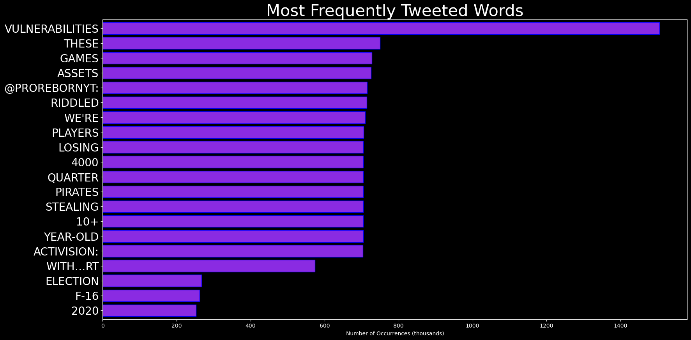

# DARKWIRE SOCIAL CYBER INSIGHTS 
&#x1F34E; **TOPIC = "vulnerabilities"**

## AUTOMATED RESEARCH SUMMARY
     

|  Trending  |   Images | 
:-------------------------:|:-------------------------:
|        |   |   
 
 

  
The most popular user is: **_Pammy_DS_**  
 

## Attract a love who sees all your mess and all your magic and still loves the show. Someone who wants to heal and ev… https://t.co/d3ZWXl6dLu 

  

### TRENDING SHARED IMAGE

|                **Sample-Tweets**        |
| :-------------: |
| RT @andrewbostom: Biden Administration Urges Court Not to Allow Release of Report Dominion Voting Machines' “potential vulnerabilities in… |
| What's the Deal With Anti-Cheat Software in Online Games? https://t.co/QdAn1CGgtT https://t.co/UhK3YIO6n1 |
| RT @TalkMullins: BREAKING!🚨🚨🚨The Federal Gov’s Cybersecurity &amp; Infrastructure Security Agency has filed a brief in a federal lawsuit, to ke… |

## RELATED METRICS 
| Metric | Value |
| ------------- | ------------- |
| #1 Most tweeted to  | **vikramsampath** |
| #2 Most tweeted to  | **Shubhrastha** |
| #3 Most tweeted to  | **TalkMullins** |
| NewProfiles (less than 10 days) | 0.94%  |
| Tweeters with < 10 followers  | 4.6%|
| Tweeters with > 1000000 followers  | 0.08%  |

## MOST POPULAR TWEET TERMS 

| Popularity Rank  | Term |
| ------------- | ------------- |
| first  | **VULNERABILITIES**  |
| second  | **FEDERAL**  |
| third  | **US** |
| fourth  | **EXPOSE**  |
| fifth  | **MISSING**  |

## Twitter Bio Analysis
### SENTIMENT ANALYSIS

VIEWS WERE : **SUBJECTIVE**  (26.67%) & **NEGATIVELY-SUBJECTIVE** (60.0%) **OBJECTIVE** (13.33%)

### TWEET SAMPLE 
| Random value picked from array |
| ------------- |
|RT @cv_cev: 💉Vaccines aren't the panacea they sold us🛅People with persistent vulnerabilities have existed under incredible circumstances… |

### MOST RETWEETED 

| The most retweeted user is: **_Pammy_DS_**  |
| ------------- |
| Attract a love who sees all your mess and all your magic and still loves the show. Someone who wants to heal and ev… https://t.co/d3ZWXl6dLu |

# Potential Fake Accounts
 
# NKmrs85USER INFO

 
`User ScreenName:` NKmrs85 
 
`User chosen Name:` NKmr 
 
`Is the User Verified?:` False 
 
`User signup date?:` Fri Feb 04 09:45:53 +0000 2022 
 
`User Description?:`  
 
`Followers?: `20 
 
`Following?:` 74 
 
`User URL?:` None 
 
`Location:`  
 
`Number of tweets extracted`  : 200 
 
`Profile image:` http://pbs.twimg.com/profile_images/1489535674231447553/z_g-UURs_normal.png 
 
`Number of tweets excluding replies:` 654 
 

 

 
## User Top tweeted words 
 
**@KUCOINCOM** 126 , **KUCOIN** 51 , **@KUCOINMOD** 48 , **@KRYPTONITE1978** 35 , **PEOPLE** 31 , **SECURITY** 27 , **@JELLYBEARARMY:** 24 , **@LYU_JOHNNY** 22 , **@TREE_OF_ALPHA** 17 , **@P76482470:** 17 , **KUCOINHACK** 16 , **KUCOINHACKRT** 15 , **API** 14 , **@JELLYBEARARMY** 13 , **HACKED** 13 , **MONEY** 13 , **PLEASE** 12 , **FUNDS** 12 , **US** 11 , **ACCOUNT** 11 , 
 
## What this user tweeted
 
RT @alinitas1988: Hi, I’m one of more than 40 people that were hacked on KuCoin in the last 3 weeks. We’ve set up a Telegram group that is…RT @Bradders_mcr: @steveebsworth @kucoincom @Tree_of_Alpha @lyu_johnny Great to see @coinbase taking responsibility and fixing their vulner…
 
# dynamiccyopsUSER INFO

 
`User ScreenName:` dynamiccyops 
 
`User chosen Name:` Dynamic CyOps LLC 
 
`Is the User Verified?:` False 
 
`User signup date?:` Fri Feb 11 17:51:56 +0000 2022 
 
`User Description?:`  
 
`Followers?: `3 
 
`Following?:` 389 
 
`User URL?:` None 
 
`Location:` California, USA 
 
`Number of tweets extracted`  : 200 
 
`Profile image:` http://pbs.twimg.com/profile_images/1492200406381850630/HYNz8V2S_normal.jpg 
 
`Number of tweets excluding replies:` 239 
 

 

 
## User Top tweeted words 
 
**US** 18 , **VIA** 13 , **@THEHILL:** 12 , **@EFF:** 11 , **SECURITY** 9 , **WOMEN** 9 , **DAY** 8 , **CYBER** 7 , **RUSSIAN** 7 , **VIEWS** 7 , **UKRAINE** 7 , **SCIENCE** 6 , **NEW** 6 , **FIRST** 6 , **–** 6 , **SURVEILLANCE** 6 , **BLACK** 6 , **@USFLEETFORCES:** 5 , **I’M** 5 , **PEOPLE** 5 , 
 
## What this user tweeted
 
DARPA Cyber Grand Challenge: Proving Vulnerabilities https://t.co/4xi2oY6VVD 
via @YouTube 
1,920 views
July 22, 2016
 
# DevOps_botUSER INFO

 
`User ScreenName:` DevOps_bot 
 
`User chosen Name:` DevOps Bot 
 
`Is the User Verified?:` False 
 
`User signup date?:` Fri Feb 04 10:58:59 +0000 2022 
 
`User Description?:` This Bot retweets the cloud technology's like kubernetes and docker for gathering content at one place for you.
Developed by @john_daniel123 
 
`Followers?: `22 
 
`Following?:` 1 
 
`User URL?:` None 
 
`Location:`  
 
`Number of tweets extracted`  : 200 
 
`Profile image:` http://pbs.twimg.com/profile_images/1489554071388188672/oSgaT5BG_normal.png 
 
`Number of tweets excluding replies:` 2353 
 

 

 
## User Top tweeted words 
 
**KUBERNETES** 118 , **DOCKER** 51 , **@HASDID:** 29 , **AUTOMATED** 29 , **@PUNMASTERSTP:** 17 , **CONTAINER** 13 , **SOFTWARE** 11 , **DEVOPS** 11 , **USE** 11 , **Q:** 11 , **A:** 11 , **USING** 11 , **K8S** 10 , **CONTAINERS** 10 , **JAVA** 10 , **LINUX** 9 , **PROMETHEUS** 9 , **DATA** 8 , **NEW** 8 , **LEARN** 8 , 
 
## What this user tweeted
 
RT @CDWGWAGov: What Is the Difference Between Hashing and Encryption for Agencies #Log4j #publicdisclosure #cybersecurity #Threatpost #Info…RT @CDWGWAGov: iPhones will soon accept contactless payments directly, says report #Log4j #publicdisclosure #cybersecurity #Threatpost #Inf…
 
# SanatanExUSER INFO

 
`User ScreenName:` SanatanEx 
 
`User chosen Name:` Sanatan Ex Secular 
 
`Is the User Verified?:` False 
 
`User signup date?:` Wed Feb 09 12:15:47 +0000 2022 
 
`User Description?:` Ex secular 
 
`Followers?: `2 
 
`Following?:` 107 
 
`User URL?:` None 
 
`Location:`  
 
`Number of tweets extracted`  : 200 
 
`Profile image:` http://pbs.twimg.com/profile_images/1491385749949739012/z_Uehrgt_normal.jpg 
 
`Number of tweets excluding replies:` 248 
 

 

 
## User Top tweeted words 
 
**KASHMIR** 16 , **@PARVEEN91105108:** 12 , **HAR** 10 , **MUSLIM** 9 , **WEARING** 8 , **HIJAB** 8 , **BOLLYWOOD** 8 , **BOYCOTTBOLLYWOOD** 8 , **INDIA** 7 , **PULWAMAATTACK** 7 , **NEVER** 7 , **FORGET** 7 , **LOST** 7 , **BEAUTIFUL** 7 , **PARVAIZ** 7 , **JOIN** 7 , **PM** 7 , **@MUMBAICHADON:** 7 , **EX** 6 , **PAKISTAN** 6 , 
 
## What this user tweeted
 
RT @Shubhrastha: The more they target @vikramsampath , the more they expose the vulnerabilities of their ‘history’. I have read, reviewed &amp;…
 
# DemiLvlupUSER INFO

 
`User ScreenName:` DemiLvlup 
 
`User chosen Name:` demi.lvlup 
 
`Is the User Verified?:` False 
 
`User signup date?:` Sat Feb 12 13:11:13 +0000 2022 
 
`User Description?:` To mastermind a goal, all it takes is discipline and be willing to learn throughout the way 
 
`Followers?: `3 
 
`Following?:` 35 
 
`User URL?:` None 
 
`Location:`  
 
`Number of tweets extracted`  : 6 
 
`Profile image:` http://pbs.twimg.com/profile_images/1492487924520308744/0oQCYBZ-_normal.jpg 
 
`Number of tweets excluding replies:` 6 
 

 

 
## User Top tweeted words 
 
**HIGH** 2 , **US** 2 , **WAY** 2 , **AUST** 2 , **RT** 1 , **@MILESDEUTSCHER:** 1 , **SAME** 1 , **MINDSET** 1 , **APPLIED** 1 , **CRYPTO** 1 , **ENJOY** 1 , **PROCESS** 1 , **LEARNING** 1 , **BUILDING** 1 , **PORTFOLIO** 1 , **MAKING** 1 , **FRIENDSHIPS…RT** 1 , **@SPEICHERX:** 1 , **CRYPTO/WEB3** 1 , **BIG** 1 , 
 
## What this user tweeted
 
RT @Speicherx: Crypto/web3 is a big space of premature innovation with high vulnerabilities, but also immense potential. With so many proje…
 
# nft_happypillsUSER INFO

 
`User ScreenName:` nft_happypills 
 
`User chosen Name:` HappyPills_NFT 
 
`Is the User Verified?:` False 
 
`User signup date?:` Sun Feb 13 10:46:21 +0000 2022 
 
`User Description?:` money over matter 
NFTs for the cheese! 
 
`Followers?: `42 
 
`Following?:` 48 
 
`User URL?:` None 
 
`Location:`  
 
`Number of tweets extracted`  : 33 
 
`Profile image:` http://pbs.twimg.com/profile_images/1492816260215808000/Q2cO-Lat_normal.jpg 
 
`Number of tweets excluding replies:` 33 
 

 

 
## User Top tweeted words 
 
**NFT** 15 , **NFTCOMMUNITY** 12 , **NFTS** 7 , **TIME** 4 , **MAKE** 4 , **MONEY** 4 , **SUPERBOWL** 3 , **;)** 3 , **HAPPY** 3 , **DON'T** 2 , **HURT** 2 , **?** 2 , **@JRNYCRYPTO:** 2 , **MAKES** 2 , **SICK** 2 , **KEEP** 2 , **NICE** 2 , **GETTING** 2 , **WHITELIST** 2 , **FAMILY** 2 , 
 
## What this user tweeted
 
RT @xanderatallah: Excited to officially announce the NFT Security Group.

Web3 security is a community effort, so we’re partnering w/ more…
 
# Chand195501USER INFO

 
`User ScreenName:` Chand195501 
 
`User chosen Name:` Chand 
 
`Is the User Verified?:` False 
 
`User signup date?:` Mon Feb 07 15:45:50 +0000 2022 
 
`User Description?:`  
 
`Followers?: `0 
 
`Following?:` 64 
 
`User URL?:` None 
 
`Location:`  
 
`Number of tweets extracted`  : 96 
 
`Profile image:` http://abs.twimg.com/sticky/default_profile_images/default_profile_normal.png 
 
`Number of tweets excluding replies:` 96 
 

 

 
## User Top tweeted words 
 
**HIJAB** 8 , **@VIKRAMSAMPATH** 8 , **INDIA** 7 , **के** 7 , **@RAHULGANDHI** 7 , **MUSLIM** 5 , **PEOPLE** 5 , **है** 5 , **WOMEN** 4 , **NATIONAL** 4 , **READ** 4 , **@ADITYARAJKAUL:** 4 , **@SHEHZAD_IND:** 4 , **RUPESH** 4 , **PANDEY** 4 , **में** 4 , **INDIAN** 4 , **की** 4 , **OLD** 4 , **U** 4 , 
 
## What this user tweeted
 
RT @Shubhrastha: The more they target @vikramsampath , the more they expose the vulnerabilities of their ‘history’. I have read, reviewed &amp;…
 
# EmpLalitadityaUSER INFO

 
`User ScreenName:` EmpLalitaditya 
 
`User chosen Name:` Emperor Lalitaditya 
 
`Is the User Verified?:` False 
 
`User signup date?:` Tue Feb 08 12:24:01 +0000 2022 
 
`User Description?:` Aan do 
 
`Followers?: `1 
 
`Following?:` 151 
 
`User URL?:` None 
 
`Location:`  
 
`Number of tweets extracted`  : 200 
 
`Profile image:` http://pbs.twimg.com/profile_images/1491061639310835713/ewx3HvbG_normal.jpg 
 
`Number of tweets excluding replies:` 237 
 

 

 
## User Top tweeted words 
 
**HIJAB** 16 , **HINDU** 13 , **HAI** 12 , **MUSLIM** 9 , **FACE** 8 , **WEARING** 7 , **REGRESSION** 7 , **@VIKRAMSAMPATH** 7 , **@ASKANSHUL:** 6 , **में** 6 , **SUPPORT** 6 , **MODI** 6 , **RANA** 6 , **INDIA** 6 , **AROOSA** 6 , **PARVAIZ** 6 , **MUST** 6 , **KI** 6 , **AFTER** 6 , **@ARANGANATHAN72:** 6 , 
 
## What this user tweeted
 
RT @Shubhrastha: The more they target @vikramsampath , the more they expose the vulnerabilities of their ‘history’. I have read, reviewed &amp;…
 
# PerseverancentUSER INFO

 
`User ScreenName:` Perseverancent 
 
`User chosen Name:` THE WHITE KNIGHT 
 
`Is the User Verified?:` False 
 
`User signup date?:` Mon Feb 07 18:35:33 +0000 2022 
 
`User Description?:` Bharat. Patriot. 
 
`Followers?: `3 
 
`Following?:` 418 
 
`User URL?:` None 
 
`Location:` AKHAND BHARAT 
 
`Number of tweets extracted`  : 200 
 
`Profile image:` http://pbs.twimg.com/profile_images/1490756134587617280/_PMeN4id_normal.jpg 
 
`Number of tweets excluding replies:` 849 
 

 

 
## User Top tweeted words 
 
**@ANI:** 20 , **INDIA** 19 , **HIJAB** 16 , **@VIKRAMSAMPATH** 12 , **ITS** 9 , **FIRST** 9 , **AFTER** 8 , **@MEGHBULLETIN:** 7 , **BEING** 6 , **WATCH** 6 , **MUSLIM** 6 , **SHOW** 6 , **ARMY** 6 , **LEFT** 6 , **INDIAN** 6 , **AGAINST** 6 , **CODE** 6 , **PAKISTAN** 6 , **2022** 5 , **@IPL:** 5 , 
 
## What this user tweeted
 
RT @Shubhrastha: The more they target @vikramsampath , the more they expose the vulnerabilities of their ‘history’. I have read, reviewed &amp;…
 
# Sk5609USER INFO

 
`User ScreenName:` Sk5609 
 
`User chosen Name:` Bhartiya🇮🇳 
 
`Is the User Verified?:` False 
 
`User signup date?:` Tue Feb 08 18:07:59 +0000 2022 
 
`User Description?:` 🇮🇳 
 
`Followers?: `82 
 
`Following?:` 111 
 
`User URL?:` None 
 
`Location:`  
 
`Number of tweets extracted`  : 200 
 
`Profile image:` http://pbs.twimg.com/profile_images/1492082761171030017/DgxfGD9r_normal.jpg 
 
`Number of tweets excluding replies:` 5441 
 

 

 
## User Top tweeted words 
 
**के** 23 , **NEVER** 18 , **से** 16 , **है** 15 , **में** 15 , **PULWAMAATTACK** 14 , **को** 13 , **की** 13 , **DAY** 12 , **कांग्रेस** 11 , **PULWAMA** 9 , **INDIA** 9 , **BJP** 9 , **14FEB** 9 , **FORGET** 8 , **SOLDIERS** 8 , **का** 8 , **नहीं** 8 , **PEOPLE** 8 , **BLACK** 7 , 
 
## What this user tweeted
 
RT @Shubhrastha: The more they target @vikramsampath , the more they expose the vulnerabilities of their ‘history’. I have read, reviewed &amp;…
 
# ayodhyavasi34USER INFO

 
`User ScreenName:` ayodhyavasi34 
 
`User chosen Name:` अयोध्यावासी 
 
`Is the User Verified?:` False 
 
`User signup date?:` Thu Feb 10 15:50:35 +0000 2022 
 
`User Description?:`  
 
`Followers?: `6 
 
`Following?:` 228 
 
`User URL?:` None 
 
`Location:`  
 
`Number of tweets extracted`  : 200 
 
`Profile image:` http://pbs.twimg.com/profile_images/1492555955477020674/bFNeQtJu_normal.jpg 
 
`Number of tweets excluding replies:` 559 
 

 

 
## User Top tweeted words 
 
**में** 28 , **के** 25 , **की** 23 , **का** 15 , **को** 13 , **HINDU** 12 , **नहीं** 10 , **पर** 10 , **@MEGHBULLETIN:** 9 , **@BYRAKESHSIMHA:** 9 , **है** 9 , **HIJAB** 8 , **SCHOOL** 8 , **KARNATAKA** 8 , **AFTER** 8 , **से** 8 , **@RITURATHAUR:** 8 , **जी** 8 , **MUSLIM** 7 , **INDIA** 7 , 
 
## What this user tweeted
 
RT @Shubhrastha: The more they target @vikramsampath , the more they expose the vulnerabilities of their ‘history’. I have read, reviewed &amp;…
 
# DPRKHumourUSER INFO

 
`User ScreenName:` DPRKHumour 
 
`User chosen Name:` North Korean Humour 
 
`Is the User Verified?:` False 
 
`User signup date?:` Fri Feb 11 01:03:23 +0000 2022 
 
`User Description?:` North Korea isn't known for its jokes. But it's not all prison camps, missiles and cult of personality. Here's some DPRK humour. Requests welcome! 
 
`Followers?: `48 
 
`Following?:` 17 
 
`User URL?:` None 
 
`Location:` Safely outside the DPRK 
 
`Number of tweets extracted`  : 30 
 
`Profile image:` http://pbs.twimg.com/profile_images/1491941928816234498/jhf6z8xr_normal.jpg 
 
`Number of tweets excluding replies:` 30 
 

 

 
## User Top tweeted words 
 
**JOKES** 6 , **HUMOUR** 6 , **LIFE** 5 , **GREAT** 4 , **MYUNG-BAK** 3 , **SOLDIER'S** 3 , **KOREAN** 3 , **WIT** 3 , **12** 3 , **HEAR** 2 , **LEE** 2 , **SATIRE** 2 , **MILITARY** 2 , **BAD** 2 , **41** 2 , **42** 2 , **ENEMY'S** 2 , **VULNERABILITIES** 2 , **CHOOSE** 2 , **JOKE** 2 , 
 
## What this user tweeted
 
@JaccoZed You didn't specify 4.1 A soldier's life or 4.2 The enemy's vulnerabilities, so we will choose a joke from section 4.1.contents 3/7
4 Military service &amp; soldier's life
4.1 A soldier's life
4.2 The enemy's vulnerabilities
5 Men &amp; women… https://t.co/KqcwLlxAbh
 
# gladys_burnellUSER INFO

 
`User ScreenName:` gladys_burnell 
 
`User chosen Name:` Gladys Burnell 
 
`Is the User Verified?:` False 
 
`User signup date?:` Fri Feb 04 04:44:23 +0000 2022 
 
`User Description?:` I enjoy my life and my family. Midwest living has been good to me.
At my age of 100 , it is sad to read about so much dishonesty in the Republican party. 
 
`Followers?: `55 
 
`Following?:` 332 
 
`User URL?:` None 
 
`Location:`  
 
`Number of tweets extracted`  : 200 
 
`Profile image:` http://pbs.twimg.com/profile_images/1490141123221803014/9TBrru-b_normal.jpg 
 
`Number of tweets excluding replies:` 301 
 

 

 
## User Top tweeted words 
 
**TRUMP** 21 , **CULT** 10 , **REPUBLICANS** 10 , **@CSEXI4** 9 , **@GOBLUE80** 9 , **NEVER** 9 , **SAD** 8 , **REPUBLICAN** 7 , **@THEHILL** 7 , **GUYS** 7 , **MANY** 7 , **IM** 7 , **DUPES** 7 , **GO** 6 , **REPORT** 6 , **DONNY** 6 , **HOPE** 6 , **TIME** 6 , **BEST** 6 , **CANT** 6 , 
 
## What this user tweeted
 
@goblue80 @cSEXI4 This is the synopsis. Nothing about a secret document and Mrs Clinton here.
"The film examines th… https://t.co/h6g730DNuN
 
# KissMyCarolUSER INFO

 
`User ScreenName:` KissMyCarol 
 
`User chosen Name:` ApotheCarolRN 
 
`Is the User Verified?:` False 
 
`User signup date?:` Thu Feb 10 21:19:05 +0000 2022 
 
`User Description?:` Florence Nightingale with zero tolerance for mandates or medical tyranny. I block with gusto. Hosea 4:6 
 
`Followers?: `404 
 
`Following?:` 314 
 
`User URL?:` None 
 
`Location:`  
 
`Number of tweets extracted`  : 109 
 
`Profile image:` http://pbs.twimg.com/profile_images/1492303825906155522/nbOadViu_normal.jpg 
 
`Number of tweets excluding replies:` 109 
 

 

 
## User Top tweeted words 
 
**HERE** 6 , **BAD** 5 , **GOT** 5 , **DOWN** 4 , **TRUMP** 4 , **LOVE** 4 , **@XALPHAWARRIORX** 4 , **RT** 3 , **RESTRICTIONS** 3 , **@MONICAONAIRTALK:** 3 , **PRESIDENT** 3 , **WHITE** 3 , **ELECTION** 3 , **FREEDOM** 3 , **TWITTER** 3 , **PEOPLE** 3 , **UPCOMING** 3 , **CONVOY** 3 , **@4ALLSOULKIND** 3 , **@A13KCF** 3 , 
 
## What this user tweeted
 
RT @ThePr0diga1S0n: CISA has gone from claiming the 2020 election was “the most secure in American history” &amp; there was “no evidence that a…
 
# ShawnSmith1776USER INFO

 
`User ScreenName:` ShawnSmith1776 
 
`User chosen Name:` Shawn Smith 
 
`Is the User Verified?:` False 
 
`User signup date?:` Fri Feb 11 21:22:23 +0000 2022 
 
`User Description?:` Citizen. Patriot. Veteran. Supporter and defender of U.S. Constitution against all enemies, foreign and domestic. 
 
`Followers?: `2 
 
`Following?:` 6 
 
`User URL?:` None 
 
`Location:`  
 
`Number of tweets extracted`  : 84 
 
`Profile image:` http://pbs.twimg.com/profile_images/1492247824586604544/A7OvjXde_normal.jpg 
 
`Number of tweets excluding replies:` 84 
 

 

 
## User Top tweeted words 
 
**@DCWOODRUFF** 42 , **@JENAGRISWOLD** 17 , **@KYLECLARK** 13 , **DON'T** 9 , **REPORT** 9 , **1** 7 , **FORENSIC** 7 , **PEOPLE** 7 , **THAT'S** 7 , **ANYONE** 7 , **LAW** 6 , **I'M** 6 , **US** 5 , **ACTUALLY** 5 , **YOU'RE** 5 , **KYLE** 5 , **LIED** 5 , **ELECTION** 5 , **FRAUD** 5 , **GRISWOLD** 5 , 
 
## What this user tweeted
 
@ariarmstrong @dcwoodruff @CBI_Colorado It's not even remotely close to a death threat and, thanks to Griswold and… https://t.co/17Wrs03OA5@COSecofState Why don't you tell Colorado citizens about the vulnerabilities in CO's voter registration system that… https://t.co/cdz9t3t7Rk
 
# s2phuongqttUSER INFO

 
`User ScreenName:` s2phuongqtt 
 
`User chosen Name:` S2PHUONGQT 
 
`Is the User Verified?:` False 
 
`User signup date?:` Sun Feb 13 01:15:02 +0000 2022 
 
`User Description?:`  
 
`Followers?: `0 
 
`Following?:` 6 
 
`User URL?:` None 
 
`Location:`  
 
`Number of tweets extracted`  : 33 
 
`Profile image:` http://pbs.twimg.com/profile_images/1492668722489663489/lH7rmHuq_normal.jpg 
 
`Number of tweets excluding replies:` 33 
 

 

 
## User Top tweeted words 
 
**@SWAYPROTOCOL** 10 , **@METACRAFTPRO** 10 , **@ASTRONAUT_2021** 10 , **PROJECT** 5 , **CRYPTO** 4 , **DOES** 4 , **MARKET** 4 , **L** 4 , **"SWAYPROTOCOL'** 3 , **INVESTORS** 3 , **DEVELOPMENT** 3 , **AMA** 3 , **COMMUNITY** 3 , **PLANS** 3 , **NEXT** 2 , **TH…** 2 , **I’M** 2 , **DEVELOPER** 2 , **INTERESTED** 2 , **BLOCKCHAIN** 2 , 
 
## What this user tweeted
 
@UniqueVietNams @SwayProtocol I’m a developer, and I’m interested in contributing to your project  alongsides earni… https://t.co/6XUsGgeiQ2
 
# dad_rationalUSER INFO

 
`User ScreenName:` dad_rational 
 
`User chosen Name:` The Rational Dad 
 
`Is the User Verified?:` False 
 
`User signup date?:` Tue Feb 08 23:42:09 +0000 2022 
 
`User Description?:` concerned parent. focused on the data, not politics. asking questions and looking for data-driven answers 
 
`Followers?: `3 
 
`Following?:` 8 
 
`User URL?:` None 
 
`Location:`  
 
`Number of tweets extracted`  : 99 
 
`Profile image:` http://abs.twimg.com/sticky/default_profile_images/default_profile_normal.png 
 
`Number of tweets excluding replies:` 99 
 

 

 
## User Top tweeted words 
 
**@GOVKATHYHOCHUL** 18 , **KIDS** 13 , **COVID** 12 , **DATA** 12 , **PANDEMIC** 8 , **SCHOOL** 7 , **CHILDREN** 7 , **RISK** 7 , **COVID-19** 7 , **MASKS** 6 , **STILL** 6 , **TWO** 5 , **STOP** 5 , **SEASONAL** 5 , **VIRUS** 5 , **MASKED** 5 , **FLU** 5 , **PEOPLE** 5 , **OTHER** 5 , **NEED** 5 , 
 
## What this user tweeted
 
@GovKathyHochul Regardless of the efficacy of masks, the question I have is why we live in fear of this virus, in i… https://t.co/AeDf74qLRC
 
# Patrici41458558USER INFO

 
`User ScreenName:` Patrici41458558 
 
`User chosen Name:` Patricia Vincenti 
 
`Is the User Verified?:` False 
 
`User signup date?:` Sat Feb 12 15:55:00 +0000 2022 
 
`User Description?:` Had 11 yr old twit account shut down same day Trump was purged. suspended for 1.5yrs. I’M BACK Twitches!End the power grab.Biden is the only state of emergency 
 
`Followers?: `27 
 
`Following?:` 213 
 
`User URL?:` None 
 
`Location:` South Carolina, USA 
 
`Number of tweets extracted`  : 200 
 
`Profile image:` http://pbs.twimg.com/profile_images/1492896950257172485/fsrec4Kp_normal.jpg 
 
`Number of tweets excluding replies:` 234 
 

 

 
## User Top tweeted words 
 
**TRUMP** 24 , **HILLARY** 13 , **CLINTON** 12 , **PRESIDENT** 11 , **PEOPLE** 10 , **CAMPAIGN** 10 , **@CATTURD2:** 9 , **BIDEN** 9 , **MASKS** 9 , **FREEDOM** 9 , **THAN** 8 , **@FOXNEWS** 8 , **COVID** 7 , **SPYING** 7 , **TWO** 7 , **STATE** 6 , **WHITE** 6 , **HOUSE** 6 , **SPIED** 6 , **DURHAM** 6 , 
 
## What this user tweeted
 
RT @ThePr0diga1S0n: CISA has gone from claiming the 2020 election was “the most secure in American history” &amp; there was “no evidence that a…
 
# DM_4USAUSER INFO

 
`User ScreenName:` DM_4USA 
 
`User chosen Name:` Lil oh Dave 
 
`Is the User Verified?:` False 
 
`User signup date?:` Sat Feb 12 00:50:47 +0000 2022 
 
`User Description?:` Just an ordinary guy 
 
`Followers?: `12 
 
`Following?:` 20 
 
`User URL?:` None 
 
`Location:`  
 
`Number of tweets extracted`  : 92 
 
`Profile image:` http://pbs.twimg.com/profile_images/1492322445352742919/OxBQzZsD_normal.jpg 
 
`Number of tweets excluding replies:` 93 
 

 

 
## User Top tweeted words 
 
**TRUMP** 6 , **HILLARY** 5 , **PRESIDENT** 5 , **@RONCOLEMAN** 5 , **@MAXMEDIEVAL** 5 , **I'M** 4 , **@DANSCAVINO:** 4 , **TRUCKERS** 4 , **@LAFEMME_BAMBINA** 4 , **@MSU_DAVE** 4 , **@LARALOGAN** 4 , **@USFLYINGTIGER45** 4 , **HEY** 4 , **DURHAM** 3 , **NEW** 3 , **CLINTON** 3 , **TRUMP’S** 3 , **MODERNA** 3 , **SOME** 3 , **@EYESONYOU1776:** 3 , 
 
## What this user tweeted
 
RT @TalkMullins: BREAKING!🚨🚨🚨The Federal Gov’s Cybersecurity &amp; Infrastructure Security Agency has filed a brief in a federal lawsuit, to ke…
 
# CushmanNikUSER INFO

 
`User ScreenName:` CushmanNik 
 
`User chosen Name:` Nik 
 
`Is the User Verified?:` False 
 
`User signup date?:` Thu Feb 10 18:50:05 +0000 2022 
 
`User Description?:` ~Christian ~Conservative ~Pro Freedom ~Real Estate Broker ~ 3rd account😉Didn't survive the purge😕 First account 2009! 
 
`Followers?: `155 
 
`Following?:` 369 
 
`User URL?:` None 
 
`Location:` Somewhere in the Mountains  
 
`Number of tweets extracted`  : 197 
 
`Profile image:` http://pbs.twimg.com/profile_images/1492618040839753733/IjbalTJC_normal.jpg 
 
`Number of tweets excluding replies:` 281 
 

 

 
## User Top tweeted words 
 
**TRUMP** 18 , **BREAKING:** 14 , **@CATTURD2:** 13 , **@SKB_SARA:** 10 , **HILLARY** 10 , **DURHAM** 10 , **US** 10 , **FILING** 8 , **JUSTICE** 8 , **DEPARTMENT** 8 , **SPECIAL** 8 , **COUNSEL** 8 , **JOHN** 8 , **PRESIDENT** 7 , **MAKE** 7 , **FOLLOW** 6 , **@DJTTRACKER:** 6 , **GOOD** 6 , **CONVOY** 6 , **@THATDOLL86** 6 , 
 
## What this user tweeted
 
RT @ThePr0diga1S0n: CISA has gone from claiming the 2020 election was “the most secure in American history” &amp; there was “no evidence that a…
 
# Shelly18152462USER INFO

 
`User ScreenName:` Shelly18152462 
 
`User chosen Name:` Shelly 
 
`Is the User Verified?:` False 
 
`User signup date?:` Sat Feb 12 18:05:07 +0000 2022 
 
`User Description?:`  
 
`Followers?: `3 
 
`Following?:` 193 
 
`User URL?:` None 
 
`Location:`  
 
`Number of tweets extracted`  : 200 
 
`Profile image:` http://abs.twimg.com/sticky/default_profile_images/default_profile_normal.png 
 
`Number of tweets excluding replies:` 778 
 

 

 
## User Top tweeted words 
 
**TRUMP** 13 , **PRESIDENT** 11 , **PEOPLE** 10 , **DURHAM** 8 , **SPYING** 8 , **HILLARY** 7 , **CLINTON** 7 , **COVID** 6 , **@THELASTREFUGE2:** 6 , **GOING** 6 , **NATIONAL** 6 , **US** 6 , **MITCH** 6 , **MCCONNELL** 6 , **GO** 6 , **?** 6 , **@TOMFITTON:** 5 , **CHILDREN** 5 , **WHITE** 5 , **NEVER** 5 , 
 
## What this user tweeted
 
RT @ThePr0diga1S0n: CISA has gone from claiming the 2020 election was “the most secure in American history” &amp; there was “no evidence that a…
 
# MdSaifAlSahabUSER INFO

 
`User ScreenName:` MdSaifAlSahab 
 
`User chosen Name:` saif al sahab 
 
`Is the User Verified?:` False 
 
`User signup date?:` Sat Feb 12 18:42:10 +0000 2022 
 
`User Description?:`  
 
`Followers?: `0 
 
`Following?:` 26 
 
`User URL?:` None 
 
`Location:`  
 
`Number of tweets extracted`  : 1 
 
`Profile image:` http://pbs.twimg.com/profile_images/1492569887570419714/AL6UNJ1U_normal.jpg 
 
`Number of tweets excluding replies:` 1 
 

 

 
## User Top tweeted words 
 
**RT** 1 , **@SUNDARPICHAI:** 1 , **2021** 1 , **AWARDED** 1 , **RECORD** 1 , **$87M** 1 , **RESEARCHERS** 1 , **HELPED** 1 , **US** 1 , **FIND** 1 , **SECURITY** 1 , **BUGS** 1 , **VULNERABILITIES** 1 , **BIG** 1 , **THANKS** 1 , **ALL…** 1 , 
 
## What this user tweeted
 
RT @sundarpichai: In 2021, we awarded a record $8.7M to researchers who helped us find security bugs and vulnerabilities. Big thanks to all…
 
# FizzyFaezzUSER INFO

 
`User ScreenName:` FizzyFaezz 
 
`User chosen Name:` Dior Free 
 
`Is the User Verified?:` False 
 
`User signup date?:` Mon Feb 07 08:28:09 +0000 2022 
 
`User Description?:` 26 - You definitely don’t fuck machines -  Soft Dom - MDNI - FAFO - DMs Open happy to chat - huge fan of @LivurLover :) 
 
`Followers?: `16 
 
`Following?:` 54 
 
`User URL?:` None 
 
`Location:`  
 
`Number of tweets extracted`  : 143 
 
`Profile image:` http://pbs.twimg.com/profile_images/1490634717032599552/2ILJUcbl_normal.jpg 
 
`Number of tweets excluding replies:` 150 
 

 

 
## User Top tweeted words 
 
**♡** 40 , **NSFWTWT** 24 , **•** 22 , **NEW** 15 , **SHE/HER** 10 , **HI** 10 , **RT** 9 , **NSFW** 9 , **SWITCH** 9 , **😊** 8 , **😊RT** 8 , **WANNA** 7 , **HII** 7 , **BI** 7 , **@HENTAIKITTYUWU:** 6 , **KINKS** 6 , **&LT;3** 5 , **18** 5 , **MOOTS?RT** 5 , **HORNY** 5 , 
 
## What this user tweeted
 
@nihilist_peach No one wanna open up and give access to their vulnerabilities, it’s also what will keep them vulnerable.
 
# Nabil8877USER INFO

 
`User ScreenName:` Nabil8877 
 
`User chosen Name:` King Khan 
 
`Is the User Verified?:` False 
 
`User signup date?:` Tue Feb 08 08:53:49 +0000 2022 
 
`User Description?:` Twitter love 
 
`Followers?: `1 
 
`Following?:` 38 
 
`User URL?:` None 
 
`Location:`  
 
`Number of tweets extracted`  : 200 
 
`Profile image:` http://pbs.twimg.com/profile_images/1490972198957649926/HtmmuSaT_normal.jpg 
 
`Number of tweets excluding replies:` 485 
 

 

 
## User Top tweeted words 
 
**@FARHA92559113RJ** 99 , **@HIJABIRANI1** 99 , **@LUNARUSH_LUS** 81 , **@DJ84658875@DUBAICRYPTOBULS** 33 , **@IBULLSWAP** 23 , **@DJ84658875@CRYPTOWOLF70** 22 , **@FRUITCAKESWAP** 15 , **@DJ84658875@CRYPTORUSHNETW1** 15 , **0X75C00F1CA108976EDB4750A862DB210B5A811EE2@CRYPTORUSHNETW1** 15 , **TOKEN** 15 , **@METAPOO_SOLANA** 15 , **@DJ84658875@CRYPTOCLASH1** 15 , **PROJECTS** 13 , **PROJECT** 12 , **IMPORTANT** 11 , **ANY** 10 , **INVESTORS** 10 , **@COVDRTOKEN** 10 , **@MEGADOGEIO** 10 , **@BETAMARS2025** 10 , 
 
## What this user tweeted
 
@CryptoVenture41 @SAFU_Community Can you assure us that this won't be one of those projects that come out, do a lot… https://t.co/JUlYCQRhbv
 
# JoannSnowden2USER INFO

 
`User ScreenName:` JoannSnowden2 
 
`User chosen Name:` Joann Snowden 
 
`Is the User Verified?:` False 
 
`User signup date?:` Sat Feb 05 20:45:34 +0000 2022 
 
`User Description?:`  
 
`Followers?: `3 
 
`Following?:` 2 
 
`User URL?:` None 
 
`Location:`  
 
`Number of tweets extracted`  : 41 
 
`Profile image:` http://pbs.twimg.com/profile_images/1490064967562936321/9kwOnMaC_normal.jpg 
 
`Number of tweets excluding replies:` 41 
 

 

 
## User Top tweeted words 
 
**COMING** 2 , **FEDERAL** 2 , **NEW** 2 , **POLICE** 2 , **ORDER** 2 , **YEAR** 2 , **CENTRAL** 2 , **YOU'RE** 2 , **RT** 1 , **@TOOLEGABRIEL:** 1 , **"WE** 1 , **ALL"IT'S** 1 , **OUTFINALLY** 1 , **HTTPS://TCO/N4QOCNVFWZRT** 1 , **@TALKMULLINS:** 1 , **BREAKING!🚨🚨🚨THE** 1 , **GOV’S** 1 , **CYBERSECURITY** 1 , **INFRASTRUCTURE** 1 , **SECURITY** 1 , 
 
## What this user tweeted
 
RT @TalkMullins: BREAKING!🚨🚨🚨The Federal Gov’s Cybersecurity &amp; Infrastructure Security Agency has filed a brief in a federal lawsuit, to ke…
 
# OpSec_1337USER INFO

 
`User ScreenName:` OpSec_1337 
 
`User chosen Name:` OpSec 
 
`Is the User Verified?:` False 
 
`User signup date?:` Sat Feb 12 11:24:19 +0000 2022 
 
`User Description?:` Cybersecurity. RT ≠ endorsement, ❤️ ≠ endorsement 
 
`Followers?: `0 
 
`Following?:` 49 
 
`User URL?:` None 
 
`Location:`  
 
`Number of tweets extracted`  : 17 
 
`Profile image:` http://pbs.twimg.com/profile_images/1492459672590295044/bQBywvFR_normal.jpg 
 
`Number of tweets excluding replies:` 17 
 

 

 
## User Top tweeted words 
 
**RANSOMWARE** 5 , **CYBER** 3 , **@SECURITYWEEK:** 3 , **THREAT** 2 , **ATTACKS** 2 , **@INFOSECURITYMAG:** 2 , **CYBERSECURITY** 2 , **BLACKBYTE** 2 , **FOREIGN** 2 , **@USCERT_GOV:** 2 , **UKRAINE** 2 , **SAN** 2 , **FRANCISCO** 2 , **49ERS** 2 , **GOOGLE** 2 , **2021** 2 , **@BAD_PACKETS:** 2 , **RT** 1 , **@NCSC:** 1 , **WEEK'S** 1 , 
 
## What this user tweeted
 
RT @SecurityWeek: Vulnerabilities Found by Google Researchers in 2021 Got Patched on Average in 52 Days https://t.co/VEj1SZ8FQM
 
# w00_meetUSER INFO

 
`User ScreenName:` w00_meet 
 
`User chosen Name:` Noah 
 
`Is the User Verified?:` False 
 
`User signup date?:` Tue Feb 08 20:14:49 +0000 2022 
 
`User Description?:` Ephesians 3:20👑 Tribe: Kpelle & Gola Lib🇺🇸🇱🇷 
 
`Followers?: `0 
 
`Following?:` 26 
 
`User URL?:` None 
 
`Location:` Charlotte, NC 
 
`Number of tweets extracted`  : 2 
 
`Profile image:` http://pbs.twimg.com/profile_images/1491147189111902209/AgDw0tuG_normal.jpg 
 
`Number of tweets excluding replies:` 2 
 

 

 
## User Top tweeted words 
 
**RT** 1 , **@ERICALESHAI:** 1 , **BROTHERS** 1 , **WATCH** 1 , **DELILAHS** 1 , **DISCERN** 1 , **WANTS** 1 , **WEAKNESSES** 1 , **VULNERABILITIES** 1 , **SAKE** 1 , **HELPIN…@AIRBNBAE** 1 , **AYOOO😭😭** 1 , 
 
## What this user tweeted
 
RT @ericaleshai: Brothers, watch out for the Delilahs. Discern who wants to know your weaknesses and vulnerabilities for the sake of helpin…
 
# 0xPercyUSER INFO

 
`User ScreenName:` 0xPercy 
 
`User chosen Name:` 0xPercival 
 
`Is the User Verified?:` False 
 
`User signup date?:` Fri Feb 04 22:13:26 +0000 2022 
 
`User Description?:` Solidity lead @ExcaliburDeFi 
 
`Followers?: `3 
 
`Following?:` 17 
 
`User URL?:` None 
 
`Location:`  
 
`Number of tweets extracted`  : 6 
 
`Profile image:` http://pbs.twimg.com/profile_images/1489730505222369283/FRRTuXEJ_normal.jpg 
 
`Number of tweets excluding replies:` 6 
 

 

 
## User Top tweeted words 
 
**@EXCALIBURDEFI:** 6 , **OPEN** 3 , **BETA** 3 , **US** 2 , **FANTOM** 2 , **EXCALIBUR** 2 , **$1500** 2 , **VERY** 2 , **RT** 1 , **🚨** 1 , **LIVE!** 1 , **JOIN** 1 , **👉HTTPS://TCO/OVIEKER0YM** 1 , **PARTICIPATE:** 1 , **HTTPS://TCO/JXHUFYHCIC** 1 , **⬅️** 1 , **$…RT** 1 , **🚨SAFETY** 1 , **FIRST!** 1 , **BUG** 1 , 
 
## What this user tweeted
 
RT @ExcaliburDeFi: 🚨Safety first!
Our bug bounty campaign will officially launch tomorrow along with the Open Beta. Help us by trying to fi…
 
# Oluwato81714186USER INFO

 
`User ScreenName:` Oluwato81714186 
 
`User chosen Name:` Oluwatobiloba 
 
`Is the User Verified?:` False 
 
`User signup date?:` Sat Feb 12 08:48:12 +0000 2022 
 
`User Description?:`  
 
`Followers?: `0 
 
`Following?:` 7 
 
`User URL?:` None 
 
`Location:`  
 
`Number of tweets extracted`  : 1 
 
`Profile image:` http://pbs.twimg.com/profile_images/1492420422037561345/VCkl4iNl_normal.jpg 
 
`Number of tweets excluding replies:` 1 
 

 

 
## User Top tweeted words 
 
**DUCK** 2 , **STAKE** 2 , **HAZE** 1 , **CRYPTO** 1 , **FOUND** 1 , **VULNERABILITIES** 1 , **TOKENYOU** 1 , **BUSD** 1 , **MINT** 1 , **4%** 1 , **TOKEN** 1 , **DUCK…** 1 , **HTTPS://TCO/ACX9CSMCXP** 1 , 
 
## What this user tweeted
 
Haze crypto found no vulnerabilities about duck token,you stake BUSD to mint 4% of duck token..
And stake your duck… https://t.co/acX9CSMCxP
 
# Timileh13558042USER INFO

 
`User ScreenName:` Timileh13558042 
 
`User chosen Name:` Timilehin 
 
`Is the User Verified?:` False 
 
`User signup date?:` Sat Feb 12 08:06:17 +0000 2022 
 
`User Description?:`  
 
`Followers?: `0 
 
`Following?:` 4 
 
`User URL?:` None 
 
`Location:`  
 
`Number of tweets extracted`  : 1 
 
`Profile image:` http://abs.twimg.com/sticky/default_profile_images/default_profile_normal.png 
 
`Number of tweets excluding replies:` 1 
 

 

 
## User Top tweeted words 
 
**DUCK** 2 , **STAKE** 2 , **HAZE** 1 , **CRYPTO** 1 , **FOUND** 1 , **VULNERABILITIES** 1 , **TOKENYOU** 1 , **BUSD** 1 , **MINT** 1 , **4%** 1 , **TOKEN** 1 , **DUCK…** 1 , **HTTPS://TCO/NZZ4FRYSOE** 1 , 
 
## What this user tweeted
 
Haze crypto found no vulnerabilities about duck token,you stake BUSD to mint 4% of duck token.. And stake your duck… https://t.co/NZZ4frysOE
 
# Xazidhasan2005USER INFO

 
`User ScreenName:` Xazidhasan2005 
 
`User chosen Name:` Wasim 
 
`Is the User Verified?:` False 
 
`User signup date?:` Sat Feb 05 13:46:22 +0000 2022 
 
`User Description?:`  
 
`Followers?: `2 
 
`Following?:` 125 
 
`User URL?:` None 
 
`Location:`  
 
`Number of tweets extracted`  : 200 
 
`Profile image:` http://pbs.twimg.com/profile_images/1489961145699950594/coyYbGJo_normal.jpg 
 
`Number of tweets excluding replies:` 703 
 

 

 
## User Top tweeted words 
 
**@XAZID_HASAN2005** 155 , **@JOHNCM98** 34 , **@LIJIE0007** 34 , **@XAZIDHASAN2005** 32 , **PROJECTS** 32 , **PROJECT** 26 , **UTC** 25 , **TOKEN** 22 , **DOES** 20 , **@JULLYMONKEY** 20 , **AMA** 19 , **INVESTORS** 18 , **PRICE** 18 , **2022** 18 , **SECURITY** 18 , **FEBRUARY** 17 , **PM** 16 , **ALMOST** 15 , **FOCUSED** 15 , **IMPORTANT** 15 , 
 
## What this user tweeted
 
@Infinity_Chains @Xazid_hasan2005 @FAMEEXGLOBAL Can you assure us that this won't be one of those projects that com… https://t.co/0WHpU0UgAZ@CryptoClash1 @Xazid_hasan2005 @CovdrToken Can you assure us that this won't be one of those projects that come out… https://t.co/qS9Y8n0fLD
 
# AudiosomalAstroUSER INFO

 
`User ScreenName:` AudiosomalAstro 
 
`User chosen Name:` Audiosomal Astro 
 
`Is the User Verified?:` False 
 
`User signup date?:` Wed Feb 09 06:43:34 +0000 2022 
 
`User Description?:` Astrologer. 🐉 יהוה 🌞🪐🌔 Project Manager 📈+ Astro Consultant 🌃🎯 
 
`Followers?: `31 
 
`Following?:` 33 
 
`User URL?:` https://t.co/OzpXQsisDF 
 
`Location:`  
 
`Number of tweets extracted`  : 25 
 
`Profile image:` http://pbs.twimg.com/profile_images/1491302093914873858/BlpCfHg6_normal.jpg 
 
`Number of tweets excluding replies:` 25 
 

 

 
## User Top tweeted words 
 
**27°** 4 , **MERCURY** 3 , **ASTEROID** 2 , **PALLAS** 2 , **INTO** 2 , **0°** 2 , **ARIES** 2 , **DEGREE** 2 , **LAST** 2 , **LEO** 2 , **FULL** 2 , **SIGNS** 2 , **TAURUS** 2 , **S…** 2 , **MOON** 2 , **HEAVILY** 2 , **CANCER** 2 , **FEEL** 2 , **TRANSIT** 2 , **ON…** 2 , 
 
## What this user tweeted
 
Astrology Transit / Horoscope for tomorrow:

Cancer Moon opposite Capricorn Mars+Venus. 

You may feel torn, with s… https://t.co/b8FSZbn1IW
 
# ittalentmxUSER INFO

 
`User ScreenName:` ittalentmx 
 
`User chosen Name:` IT TALENT 
 
`Is the User Verified?:` False 
 
`User signup date?:` Wed Feb 09 19:26:34 +0000 2022 
 
`User Description?:` IT TALENT - Distribuidor Oficial de Hardware Wallets de @SecuXwallet en México
#Bitcoin #Cripto #Hardwarewallets #Blockchain 
 
`Followers?: `2 
 
`Following?:` 16 
 
`User URL?:` https://t.co/vgKkJPHILA 
 
`Location:` Mexico City 
 
`Number of tweets extracted`  : 17 
 
`Profile image:` http://pbs.twimg.com/profile_images/1491504002860826631/1pajyO6m_normal.jpg 
 
`Number of tweets excluding replies:` 17 
 

 

 
## User Top tweeted words 
 
**BITCOIN** 6 , **TRYING** 2 , **MONEY** 2 , **CBDCS** 2 , **BANK** 2 , **2021** 2 , **@GLADSTEIN:** 2 , **PAPER** 2 , **CENTRAL** 2 , **PLUGIN** 2 , **INFLATION** 2 , **LES** 2 , **ARTÍCULO** 2 , **SOBRE** 2 , **RT** 1 , **@RAPHSCHOEN:** 1 , **SEPARATE** 1 , **STATE** 1 , **MAKE** 1 , **POLITICAL** 1 , 
 
## What this user tweeted
 
@Basixweb DETAILS Multiple Stored Cross-Site Scripting (XSS) vulnerabilities were discovered by Shivam Rai in WordP… https://t.co/YS4SL6TchD@Basixweb  I bought your plugin twice for two web sites. Now my hosting provider is telling me to disable and unins… https://t.co/z80T2qhnlL
 
# Gretsmen50ptUSER INFO

 
`User ScreenName:` Gretsmen50pt 
 
`User chosen Name:` Gretsmen 
 
`Is the User Verified?:` False 
 
`User signup date?:` Sat Feb 12 01:27:43 +0000 2022 
 
`User Description?:`  
 
`Followers?: `0 
 
`Following?:` 4 
 
`User URL?:` None 
 
`Location:`  
 
`Number of tweets extracted`  : 24 
 
`Profile image:` http://pbs.twimg.com/profile_images/1492309568428253185/lV1yiVeY_normal.jpg 
 
`Number of tweets excluding replies:` 24 
 

 

 
## User Top tweeted words 
 
**@KISHIMOTOTOKEN** 8 , **@ADROVERSE** 7 , **PROJECTS** 5 , **INVESTORS** 4 , **COMMUNITY** 4 , **L** 4 , **MANY** 3 , **ANY** 3 , **"UNICORN** 3 , **PROJECT** 3 , **ADROVERSE** 3 , **BLOCKCHAIN** 2 , **PROBLEM** 2 , **MAKE** 2 , **PEOPLE** 2 , **NEW** 2 , **KEEP** 2 , **FARMS'** 2 , **SO…** 2 , **PLATFORM** 2 , 
 
## What this user tweeted
 
@IM_Communityitw @Kishimototoken I’m a developer, and I’m interested in contributing to your project  alongsides ea… https://t.co/4pbkIUc1aZ
 
# merigrmay1USER INFO

 
`User ScreenName:` merigrmay1 
 
`User chosen Name:` Meri grmay 
 
`Is the User Verified?:` False 
 
`User signup date?:` Mon Feb 07 12:12:29 +0000 2022 
 
`User Description?:` ትግራወይቲ 
 
`Followers?: `219 
 
`Following?:` 202 
 
`User URL?:` None 
 
`Location:`  
 
`Number of tweets extracted`  : 200 
 
`Profile image:` http://pbs.twimg.com/profile_images/1490729862662955011/i0nsBQ1w_normal.jpg 
 
`Number of tweets excluding replies:` 6120 
 

 

 
## User Top tweeted words 
 
**TIGRAY** 79 , **ETHIOPIA** 76 , **MUST** 52 , **@ABIYAHMEDALI** 45 , **HUMANITARIAN** 44 , **@EU_COMMISSION** 35 , **EU** 33 , **DONOR** 27 , **INTO** 27 , **PRESSURE** 27 , **CONTINUES** 26 , **USE** 21 , **AUEUSUMMIT** 21 , **AID** 18 , **OPEN** 18 , **UNCONDITIONAL** 18 , **@_AFRICANUNION** 17 , **PEOPLE** 16 , **TIGRAYGENOCIDE** 16 , **COUNTRIES** 15 , 
 
## What this user tweeted
 
RT @Gal_Tigray1: 9.4 million people need food assistance due to the #WarOnTigray. The situation remains volatile with the continuation of a…
 
# hardani_hilmiUSER INFO

 
`User ScreenName:` hardani_hilmi 
 
`User chosen Name:` Hilmi Dwi Hardani 
 
`Is the User Verified?:` False 
 
`User signup date?:` Sat Feb 05 12:37:19 +0000 2022 
 
`User Description?:` Garapan Airdropp 
 
`Followers?: `1 
 
`Following?:` 14 
 
`User URL?:` None 
 
`Location:`  
 
`Number of tweets extracted`  : 27 
 
`Profile image:` http://abs.twimg.com/sticky/default_profile_images/default_profile_normal.png 
 
`Number of tweets excluding replies:` 27 
 

 

 
## User Top tweeted words 
 
**AIRDROP** 12 , **NFT** 4 , **NEW** 3 , **GAMEDAO** 3 , **LAUNCHED** 3 , **JOIN** 3 , **REWARDS!** 3 , **WIN** 3 , **NFTCHAIRS** 3 , **LINK:** 2 , **ROCKET** 2 , **LAUNCH** 2 , **@HEROESOFTHELAND:** 2 , **️🎉** 2 , **AIRDROP:** 2 , **EVERYONE** 2 , **1ST** 2 , **@HTR_GROUP:** 2 , **ITS** 2 , **LOM** 2 , 
 
## What this user tweeted
 
RT @neptunemutual: Hackers today are more sophisticated than you think. They exploit bugs and vulnerabilities in #smartcontracts and #DeFi…
 
# VictorPascow3USER INFO

 
`User ScreenName:` VictorPascow3 
 
`User chosen Name:` Victor Pascow 
 
`Is the User Verified?:` False 
 
`User signup date?:` Thu Feb 10 21:41:33 +0000 2022 
 
`User Description?:`  
 
`Followers?: `17 
 
`Following?:` 559 
 
`User URL?:` None 
 
`Location:`  
 
`Number of tweets extracted`  : 26 
 
`Profile image:` http://pbs.twimg.com/profile_images/1491891930992685067/kDGooTf2_normal.jpg 
 
`Number of tweets excluding replies:` 26 
 

 

 
## User Top tweeted words 
 
**SECURITY** 4 , **TRUMP** 3 , **BIG** 3 , **STILL** 3 , **CLEARANCE** 3 , **BEFORE** 3 , **THE…** 2 , **MANDATES** 2 , **@DEBRADUNCANH** 2 , **@DONALDJTRUMPJR** 2 , **@SENDUCKWORTH** 2 , **@SENATORDURBIN** 2 , **BIGGEST** 2 , **NOTHING** 2 , **BURGER** 2 , **YET** 2 , **FILING** 2 , **YEARS** 2 , **8** 2 , **MONTHS** 2 , 
 
## What this user tweeted
 
RT @TalkMullins: BREAKING!🚨🚨🚨The Federal Gov’s Cybersecurity &amp; Infrastructure Security Agency has filed a brief in a federal lawsuit, to ke…
 
# Mo54385349MonkUSER INFO

 
`User ScreenName:` Mo54385349Monk 
 
`User chosen Name:` Cyber Monk 
 
`Is the User Verified?:` False 
 
`User signup date?:` Fri Feb 04 08:39:30 +0000 2022 
 
`User Description?:` Cyber security monk 
 
`Followers?: `4 
 
`Following?:` 34 
 
`User URL?:` None 
 
`Location:`  
 
`Number of tweets extracted`  : 19 
 
`Profile image:` http://pbs.twimg.com/profile_images/1489519119258951681/BaluBtAK_normal.jpg 
 
`Number of tweets excluding replies:` 19 
 

 

 
## User Top tweeted words 
 
**FAN** 4 , **CYBERSECURITY** 4 , **LOVE** 3 , **@DAVIDBOMBAL** 2 , **BEST** 2 , **DNS** 2 , **LEARN** 2 , **LINUX** 2 , **DAY** 2 , **MOTIVATOR** 1 , **MECYBERSECURITY** 1 , **CLASSES** 1 , **HACKER** 1 , **DAVIDBOMBAL** 1 , **HTTPS://TCO/3A1XGAIMCW@_ZSECURITY_** 1 , **BIG** 1 , **😇😇😇😇OF** 1 , **ZAID** 1 , **BHAI@_ZSECURITY_** 1 , **INDIA@_JOHNHAMMOND** 1 , 
 
## What this user tweeted
 
RT @three_cube: Network Basics for Hackers, DNS and BIND: How it Works and How it Breaks #dns #bind #networkbasics #cybersecurity #infosec…
 
# SurgeRightUSER INFO

 
`User ScreenName:` SurgeRight 
 
`User chosen Name:` SurgeRight 
 
`Is the User Verified?:` False 
 
`User signup date?:` Sat Feb 05 03:58:34 +0000 2022 
 
`User Description?:` 🇺🇸 election stolen by dnc, ccp, deep state, mail vote, china virus & left media. #FJB #MAGA #PATRIOT @cryptocom🇦🇺🇺🇸✝️🍸 #AUSTUSPatriot🚫💉🚫 #IFBAP 
 
`Followers?: `1127 
 
`Following?:` 1355 
 
`User URL?:` https://t.co/U7qO6etXTf 
 
`Location:` Prison Planet 
 
`Number of tweets extracted`  : 193 
 
`Profile image:` http://pbs.twimg.com/profile_images/1489835552480595968/47jWqoXQ_normal.jpg 
 
`Number of tweets excluding replies:` 705 
 

 

 
## User Top tweeted words 
 
**@KEITH0STA** 24 , **@JALMZ5** 22 , **@BREE1914** 21 , **@JUDYTGOLF** 20 , **@RNKSTR4** 20 , **@JT4USA** 19 , **@MISSARIGATO1** 19 , **@BLACKMUSTANG111** 19 , **@FAB87F** 18 , **@__KIMBERLY1** 18 , **@KEYSLIISA** 12 , **THESE** 11 , **FOLLOW** 10 , **@SURGERIGHT** 9 , **GREAT** 8 , **@ANNIEZGONE5150:** 8 , **🦅PATRIOT** 8 , **WARRIORS🦅** 8 , **PATRIOTS!** 7 , **RETWEET!** 7 , 
 
## What this user tweeted
 
RT @trip_elix: RT TalosSecurity "Our vulnerability research team discovered two vulnerabilities in Moxa's MXview network management softwar…
 
# Jamir92580464USER INFO

 
`User ScreenName:` Jamir92580464 
 
`User chosen Name:` Jamir 
 
`Is the User Verified?:` False 
 
`User signup date?:` Fri Feb 11 20:11:34 +0000 2022 
 
`User Description?:`  
 
`Followers?: `0 
 
`Following?:` 50 
 
`User URL?:` None 
 
`Location:`  
 
`Number of tweets extracted`  : 7 
 
`Profile image:` http://pbs.twimg.com/profile_images/1492232113340383238/thpejG1E_normal.jpg 
 
`Number of tweets excluding replies:` 7 
 

 

 
## User Top tweeted words 
 
**@TALKMULLINS:** 2 , **ELECTION** 2 , **FEDERAL** 2 , **HTTPS://TCO/ZDPNEPHXDPRT** 1 , **@STILLGRAY:** 1 , **FIERY** 1 , **MOSTLY** 1 , **PEACEFUL** 1 , **PROTEST** 1 , **OTTAWA** 1 , **HTTPS://TCO/RFZBET0WHQRT** 1 , **@JACKPOSOBIEC:** 1 , **LOLHTTPS://TCO/RYMCYIRI2SRT** 1 , **FORMER** 1 , **CISA** 1 , **DIRECT** 1 , **CHRIS** 1 , **KREBS** 1 , **TOLD** 1 , **MEMBERS** 1 , 
 
## What this user tweeted
 
RT @TalkMullins: BREAKING!🚨🚨🚨The Federal Gov’s Cybersecurity &amp; Infrastructure Security Agency has filed a brief in a federal lawsuit, to ke…
 
# ChiTownEsqUSER INFO

 
`User ScreenName:` ChiTownEsq 
 
`User chosen Name:` ChiTownEsq 
 
`Is the User Verified?:` False 
 
`User signup date?:` Wed Feb 09 05:26:39 +0000 2022 
 
`User Description?:` Chicago Lawyer, Dedicated Democrat, coffee cabal, #Resist, Traitorous #Trump Tormentor, America forward together, not backwards apart, #Fauci forever! 
 
`Followers?: `43 
 
`Following?:` 266 
 
`User URL?:` None 
 
`Location:`  
 
`Number of tweets extracted`  : 191 
 
`Profile image:` http://pbs.twimg.com/profile_images/1491430837329481728/pNnns284_normal.jpg 
 
`Number of tweets excluding replies:` 191 
 

 

 
## User Top tweeted words 
 
**TRUMP** 12 , **TIME** 9 , **THAT’S** 9 , **ANY** 7 , **HE’S** 7 , **LAW** 7 , **NEED** 6 , **NEW** 6 , **YEARS** 6 , **FAR** 6 , **ACTUALLY** 6 , **INTO** 6 , **DOWN** 6 , **SOME** 5 , **LEAST** 5 , **TRUMP’S** 5 , **THEY’RE** 5 , **GO** 4 , **NEVER** 4 , **WORLD** 4 , 
 
## What this user tweeted
 
@ChiefBigpalm Absolutely not. Why should I feel embarrassed for taking further safety precautions? My 83 years old… https://t.co/OSUhyVeQod
 

<b> This report is AUTOMATED and not hand crafted, it is designed for pulling metrics on a given keyword or hashtag and performs a series of reporting and analysis.</b>  
### CONCLUSION & EXTERNAL ANALYSIS

*This is my [Adam McMurchie`s] opinion on the data from the tweets, it serves as no objective truth.Since the tweets themselves are a mixture of fact & opinion. 
Authors analytical summary on request.
**RECOMMENDATIONS** WILL BE UPDATED IN NEXT  24 HOURS  