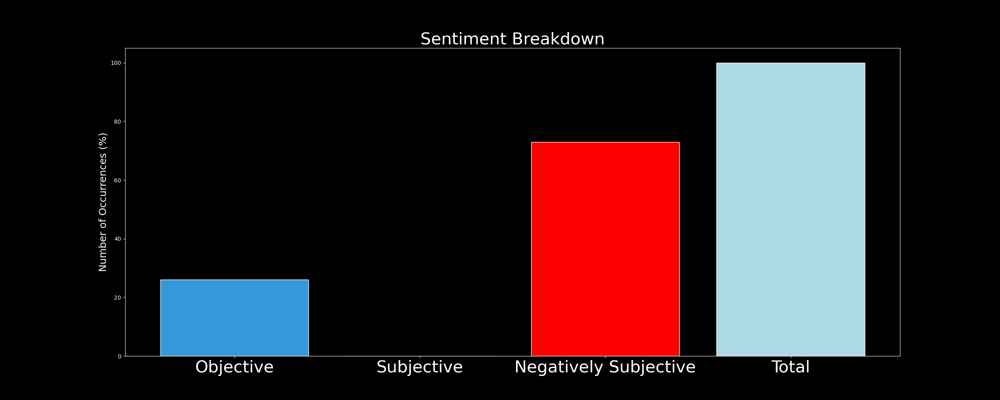

# DARKWIRE SOCIAL CYBER INSIGHTS 
&#x1F34E; **TOPIC = "threatintel"**

## AUTOMATED RESEARCH SUMMARY
     

|  Trending  |   Images | 
:-------------------------:|:-------------------------:
|        |   |   
 
 

  
The most popular user is: **dwisiswant0**  
 

## Made public now &amp; beta version released!

teler: Real-time HTTP #Intrusion Detection
https://t.co/oAmJFd86TO

#go… https://t.co/2zYQeHvP0Q 

  

### TRENDING SHARED IMAGE

|                **Sample-Tweets**        |
| :-------------: |
| RT @MISPProject: MISP free online trainings will take place 2-3 March 2021 (Introduction for analysts and Administration/Building sharing c… |
| RT @JinibaBD: New Hack Lets Attackers Bypass MasterCard PIN by Using Them As Visa Card #CyberSec #infosec #Security #cybercrime #ThreatInte… |
| RT @maldatabase: #DarkComet malware indicators.#Malware #ThreatIntelligence #threatintel #IOChttps://t.co/I2E1rqr7Th |

## RELATED METRICS 
| Metric | Value |
| ------------- | ------------- |
| #1 Most tweeted to  | **JinibaBD** |
| #2 Most tweeted to  | **bad_packets** |
| #3 Most tweeted to  | **javier_carriazo** |
| NewProfiles (less than 10 days) | 0.0%  |
| Tweeters with < 10 followers  | 0.32%|
| Tweeters with > 1000000 followers  | 0.0%  |

## MOST POPULAR TWEET TERMS 

| Popularity Rank  | Term |
| ------------- | ------------- |
| first  | **INFOSEC**  |
| second  | **CYBERSEC**  |
| third  | **CYBERCRIME** |
| fourth  | **@JINIBABD:**  |
| fifth  | **THREATINTEL**  |

## Twitter Bio Analysis
### SENTIMENT ANALYSIS

VIEWS WERE : **SUBJECTIVE**  (20.0%) & **NEGATIVELY-SUBJECTIVE** (20.0%) **OBJECTIVE** (60.0%)

### TWEET SAMPLE 
| Random value picked from array |
| ------------- |
|RT @Atos_Security: 🏥 #Contiransomware gang tied to latest #attacks on hospitals in #Florida and #TexasTo read more visit ⤵https://t.co/HU… |

### MOST RETWEETED 

| The most retweeted user is: **dwisiswant0**  |
| ------------- |
| Made public now &amp; beta version released!teler: Real-time HTTP #Intrusion Detectionhttps://t.co/oAmJFd86TO#go… https://t.co/2zYQeHvP0Q |

# Potential Fake Accounts
 

<b> This report is AUTOMATED and not hand crafted, it is designed for pulling metrics on a given keyword or hashtag and performs a series of reporting and analysis.</b>  
### CONCLUSION & EXTERNAL ANALYSIS

*This is my [Adam McMurchie`s] opinion on the data from the tweets, it serves as no objective truth.Since the tweets themselves are a mixture of fact & opinion. 
Authors analytical summary on request.
**RECOMMENDATIONS** WILL BE UPDATED IN NEXT  24 HOURS  