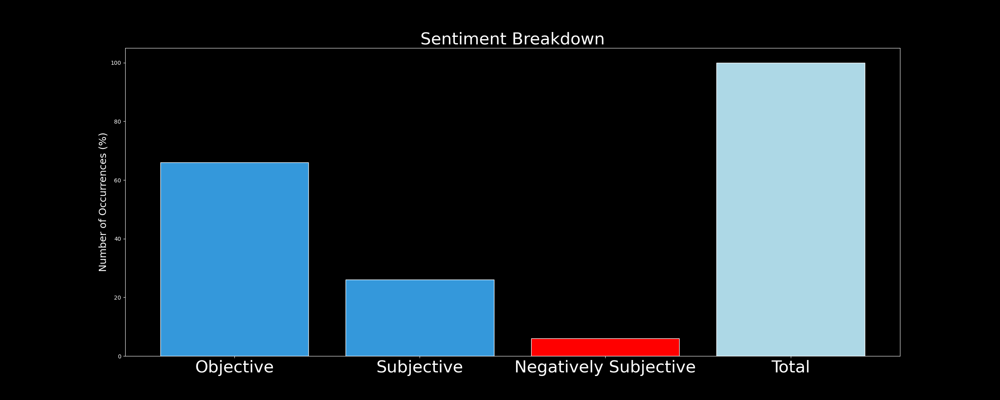

# DARKWIRE SOCIAL CYBER INSIGHTS 
&#x1F34E; **TOPIC = "infosec"**

## AUTOMATED RESEARCH SUMMARY
     

|  Trending  |   Images | 
:-------------------------:|:-------------------------:
|        |   |   
 
 

  
The most popular user is: **REKSZN**  
 

## “When the pandemic ends” 

The Pandemic: 
https://t.co/Ogkqg3ooCg 

  

### TRENDING SHARED IMAGE

|                **Sample-Tweets**        |
| :-------------: |
| @AlyssaM_InfoSec @MalwareJake Gotta have that sweet Fetwgrkifg. |
| @AlyssaM_InfoSec @aprilwright Ding, ding,ding!Grandpa Had a pile of old "small appliances" in a corner of one bar… https://t.co/Rw8P6K04oN |
| RT @JinibaBD: Yet another #databreach! 😡😡😡 Bonobos - 2,811,929 breached accounts #CyberSecurity #osint #cyberthreats #hackers #darkweb #dat… |

## RELATED METRICS 
| Metric | Value |
| ------------- | ------------- |
| #1 Most tweeted to  | **AlyssaM_InfoSec** |
| #2 Most tweeted to  | **iotcybersec24** |
| #3 Most tweeted to  | **0xBanana** |
| NewProfiles (less than 10 days) | 0.26%  |
| Tweeters with < 10 followers  | 1.88%|
| Tweeters with > 1000000 followers  | 0.02%  |

## MOST POPULAR TWEET TERMS 

| Popularity Rank  | Term |
| ------------- | ------------- |
| first  | **INFOSEC**  |
| second  | **MALWARE**  |
| third  | **PHISHING** |
| fourth  | **HERE**  |
| fifth  | **DATA**  |

## Twitter Bio Analysis
### SENTIMENT ANALYSIS

VIEWS WERE : **SUBJECTIVE**  (26.67%) & **NEGATIVELY-SUBJECTIVE** (40.0%) **OBJECTIVE** (33.33%)

### TWEET SAMPLE 
| Random value picked from array |
| ------------- |
|@Infosec_Taylor A cert may not open a door, but it makes sure doors aren’t closed. The CISSP was the hardest cert I… https://t.co/ACsC5juFrp |

### MOST RETWEETED 

| The most retweeted user is: **REKSZN**  |
| ------------- |
| “When the pandemic ends” The Pandemic: https://t.co/Ogkqg3ooCg |

# Potential Fake Accounts
 
# jonth3donUSER INFO

 
`User ScreenName:` jonth3don 
 
`User chosen Name:` Jonathan Jones 
 
`Is the User Verified?:` False 
 
`User signup date?:` Fri Jan 29 02:50:15 +0000 2021 
 
`User Description?:` Aspiring Cyber Security/IT Professional 
 
`Followers?: `4 
 
`Following?:` 46 
 
`User URL?:` None 
 
`Location:`  
 
`Number of tweets extracted`  : 5 
 
`Profile image:` http://pbs.twimg.com/profile_images/1354985336984621058/T405IOIS_normal.jpg 
 
`Number of tweets excluding replies:` 5 
 

 

 
## User Top tweeted words 
 
**TRYHACKME** 2 , **LIFE** 1 , **ADAPTATION** 1 , **PROGRESSION** 1 , **EVERYDAY** 1 , **COUNTS!** 1 , **MINDSET** 1 , **PERSPECTIVE** 1 , **INFOSEC** 1 , **CYBERSECURITY** 1 , **NETWORKING** 1 , **HTTPS://TCO/CNWC5AUFCL@JARRODR87** 1 , **@REALTRYHACKME** 1 , **THAT’S** 1 , **AWESOME!** 1 , **NEXT** 1 , **👊🏾NETWORK** 1 , **SERVICES** 1 , **COMPLETED** 1 , **ROOM!** 1 , 
 
## What this user tweeted
 
Life is about adaptation and progression. Everyday counts! #mindset #perspective #infosec #cybersecurity #networking https://t.co/CnWC5AufCL
 
# azadarezuUSER INFO

 
`User ScreenName:` azadarezu 
 
`User chosen Name:` Arezu Azad 
 
`Is the User Verified?:` False 
 
`User signup date?:` Sat Jan 23 11:15:06 +0000 2021 
 
`User Description?:` #Bitcoin
💗Reza#forever 
 
`Followers?: `25 
 
`Following?:` 405 
 
`User URL?:` None 
 
`Location:`  
 
`Number of tweets extracted`  : 200 
 
`Profile image:` http://pbs.twimg.com/profile_images/1356018304914231297/e9ksQXT2_normal.jpg 
 
`Number of tweets excluding replies:` 277 
 

 

 
## User Top tweeted words 
 
**و** 20 , **که** 15 , **از** 14 , **به** 14 , **رو** 11 , **U** 9 , **ولی** 7 , **DON'T** 7 , **یه** 6 , **@ELONMUSK:** 6 , **DATA** 6 , **LOVE** 5 , **PEOPLE** 5 , **هم** 5 , **تو** 5 , **کار** 5 , **های** 5 , **STOCK** 5 , **برای** 5 , **در** 5 , 
 
## What this user tweeted
 
RT @SecurityTube: Container Security bootcamp: learn to use tools and techniques to audit containers, hosts, image repositories and contain…
 
# VoxStellarum2USER INFO

 
`User ScreenName:` VoxStellarum2 
 
`User chosen Name:` °•Vox Stellarum•° 
 
`Is the User Verified?:` False 
 
`User signup date?:` Fri Jan 29 02:16:56 +0000 2021 
 
`User Description?:` #Python, #js, #hacking. Black Lives Matter. 
 
`Followers?: `2 
 
`Following?:` 34 
 
`User URL?:` None 
 
`Location:` United States 
 
`Number of tweets extracted`  : 4 
 
`Profile image:` http://pbs.twimg.com/profile_images/1354997652182720512/hAcxSTQy_normal.jpg 
 
`Number of tweets excluding replies:` 4 
 

 

 
## User Top tweeted words 
 
**@HAR00GA** 2 , **@SAFE_SECS** 1 , **@ALYSSAM_INFOSEC** 1 , **INTEGRITY** 1 , **GOOD** 1 , **HUH@NVRCAST** 1 , **MARVELOUS** 1 , **TREASURE** 1 , **SIR@NVRCAST** 1 , **SCREECH** 1 , **PTERODACTYL?** 1 , **HTTPS://TCO/LRBFFIM9BSFUCK** 1 , **BERN** 1 , **FIND** 1 , **👊** 1 , **HTTPS://TCO/K5I4EE5LVR** 1 , 
 
## What this user tweeted
 
@safe_secs @AlyssaM_InfoSec integrity is good huh
 
# Audra96431884USER INFO

 
`User ScreenName:` Audra96431884 
 
`User chosen Name:` Audra 
 
`Is the User Verified?:` False 
 
`User signup date?:` Fri Jan 29 15:17:04 +0000 2021 
 
`User Description?:`  
 
`Followers?: `4 
 
`Following?:` 53 
 
`User URL?:` None 
 
`Location:`  
 
`Number of tweets extracted`  : 65 
 
`Profile image:` http://abs.twimg.com/sticky/default_profile_images/default_profile_normal.png 
 
`Number of tweets excluding replies:` 70 
 

 

 
## User Top tweeted words 
 
**@PROJECTLINCOLN** 10 , **@MTGREENEE** 9 , **RT** 8 , **GOING** 5 , **TWITTER** 5 , **BIDEN** 4 , **@XIANRESISTANCE** 4 , **@NOTBARRON1946:** 4 , **PEOPLE** 4 , **@MTGREENEE:** 3 , **@AMERICANPATS_:** 3 , **BIG** 3 , **PRESIDENT** 3 , **DAY** 3 , **GOT** 3 , **@REAIPATRIOT:** 3 , **@WSBCHAIRMAN:** 3 , **DON'T** 2 , **TRUST** 2 , **STILL** 2 , 
 
## What this user tweeted
 
RT @akolsuoicauqol: Don’t fuck with people in the InfoSec industry. We will expose you 👏🏼
 
# centocodeUSER INFO

 
`User ScreenName:` centocode 
 
`User chosen Name:` CentoCode.com 
 
`Is the User Verified?:` False 
 
`User signup date?:` Tue Jan 26 23:37:15 +0000 2021 
 
`User Description?:` CentoCode technology blog posting site. Owner: @sunanda3599 
 
`Followers?: `43 
 
`Following?:` 2 
 
`User URL?:` https://t.co/mkQMbIFrc9 
 
`Location:`  
 
`Number of tweets extracted`  : 200 
 
`Profile image:` http://pbs.twimg.com/profile_images/1355900234665082883/ZRHWmUqN_normal.jpg 
 
`Number of tweets excluding replies:` 1691 
 

 

 
## User Top tweeted words 
 
**AI** 51 , **JAVASCRIPT** 36 , **PYTHON** 33 , **100DAYSOFCODE** 23 , **DATASCIENCE** 21 , **TOP** 18 , **MACHINELEARNING** 18 , **CODE** 18 , **PROGRAMMING** 17 , **DATA** 15 , **IOT** 13 , **…RT** 13 , **5** 13 , **BIGDATA** 12 , **ANALYTICS** 12 , **DAY** 12 , **HERE** 12 , **PAY** 11 , **ESSAYPAY** 11 , **ECONOMICS** 11 , 
 
## What this user tweeted
 
RT @DaveHatter: Thanks to @700wlw and Rachel Elliot for having me on again to bring you helpful #technology and #cybersecurity news and tip…
 
# intel_brokerUSER INFO

 
`User ScreenName:` intel_broker 
 
`User chosen Name:` The Intel Broker 
 
`Is the User Verified?:` False 
 
`User signup date?:` Sun Jan 31 06:55:55 +0000 2021 
 
`User Description?:`  
 
`Followers?: `1 
 
`Following?:` 11 
 
`User URL?:` None 
 
`Location:`  
 
`Number of tweets extracted`  : 26 
 
`Profile image:` http://pbs.twimg.com/profile_images/1355870467534581761/RQ9FHZyJ_normal.jpg 
 
`Number of tweets excluding replies:` 26 
 

 

 
## User Top tweeted words 
 
**RUSSIAN** 6 , **POLICE** 6 , **@MEDIAZZZONA:** 4 , **@WORLDONALERT:** 4 , **PROTESTS** 4 , **@DISCLOSETV:** 3 , **RUSSIA** 3 , **AGAINST** 3 , **ВИДЕО** 2 , **НА** 2 , **ЭЛЕКТРОШОКЕРОМ** 2 , **INTERESTED** 2 , **MILITARY** 2 , **AFTER** 2 , **BILLBOARD** 2 , **DOWN** 2 , **УЛИЦЕ** 2 , **«МЕДИАЗОНЫ»** 2 , **INTELLIGENCE** 2 , **AUTHORITIES** 2 , 
 
## What this user tweeted
 
RT @threatshub: ThreatsHub Cybersecurity News | A network of Twitter bots has attacked the Belgian government's Huawei 5G ban - https://t.c…
 
# WeisterCreekUSER INFO

 
`User ScreenName:` WeisterCreek 
 
`User chosen Name:` WeisterCreekInfoSec 
 
`Is the User Verified?:` False 
 
`User signup date?:` Sat Jan 30 14:12:31 +0000 2021 
 
`User Description?:` #Blueteam #Infosec Team Manager, Dabble in #Redteam for testing controls. #CyberSec blog. #CCISP #Security+ https://t.co/N9a9V6aohU 
 
`Followers?: `10 
 
`Following?:` 258 
 
`User URL?:` None 
 
`Location:` Wisconsin, USA 
 
`Number of tweets extracted`  : 28 
 
`Profile image:` http://pbs.twimg.com/profile_images/1355520074862493700/t5FkXKQA_normal.jpg 
 
`Number of tweets excluding replies:` 28 
 

 

 
## User Top tweeted words 
 
**INFOSEC** 6 , **CYBERSECURITY** 4 , **BLUETEAM** 4 , **OMG** 2 , **SIEM** 2 , **SECURITY** 2 , **POWERSHELL** 2 , **AGAINST** 2 , **GROUPS** 2 , **@LADYRED_6** 2 , **BEST** 2 , **EVER** 2 , **ALTERING** 2 , **NEW** 2 , **BIO** 2 , **CABLES** 1 , **REDTEAM** 1 , **EXERCISES** 1 , **RESEARCH** 1 , **WRITE** 1 , 
 
## What this user tweeted
 
Flexible testing of your #SIEM alerts for password attacks
#BlueTeam #infosec #CyberSecurity https://t.co/VBKZcNynjzCIS benchmarks aren’t the know all be all for security, but they are a great reference when hardening systems. Use… https://t.co/POnTZ2PoGURT @CyberWarship: Threat Hunting: Log Monitoring Lab Setup with ELK

#infosec #blueteam #DFIR 
https://t.co/6jsZUUPBntWhat sort of #infosec groups are out there in the Wisconsin/Minnesota region for networking? No #BSides that I know… https://t.co/Yduv8uAHsz
 
# cyber_millyUSER INFO

 
`User ScreenName:` cyber_milly 
 
`User chosen Name:` Milly 
 
`Is the User Verified?:` False 
 
`User signup date?:` Sun Jan 24 10:41:10 +0000 2021 
 
`User Description?:` Cyber Security Student. Views are my own 
 
`Followers?: `2 
 
`Following?:` 92 
 
`User URL?:` None 
 
`Location:`  
 
`Number of tweets extracted`  : 10 
 
`Profile image:` http://pbs.twimg.com/profile_images/1353291980713959425/Ev9g9JSS_normal.jpg 
 
`Number of tweets excluding replies:` 10 
 

 

 
## User Top tweeted words 
 
**CYBER** 4 , **DATA** 3 , **SECURITY** 3 , **BUSINESSES** 2 , **MUCH** 2 , **@DRJESSICABARKER** 2 , **CYBERSECURITY** 2 , **READING** 2 , **INSTAGRAM** 1 , **HACKED** 1 , **"MISS** 1 , **ENGLAND** 1 , **ORGANISER** 1 , **ANGIE** 1 , **BEASLEY** 1 , **STUNG** 1 , **AFTER** 1 , **RECEIVING** 1 , **APPEARED** 1 , **LEGITIMAT…** 1 , 
 
## What this user tweeted
 
#Instagram #hacked 
"Miss England organiser Angie Beasley was stung after receiving what appeared to be a legitimat… https://t.co/lbC4zKBOzV
 
# Formul59076069USER INFO

 
`User ScreenName:` Formul59076069 
 
`User chosen Name:` Formul 
 
`Is the User Verified?:` False 
 
`User signup date?:` Sun Jan 24 19:41:05 +0000 2021 
 
`User Description?:` the 1 and only is back :) 
 
`Followers?: `4 
 
`Following?:` 121 
 
`User URL?:` None 
 
`Location:`  
 
`Number of tweets extracted`  : 27 
 
`Profile image:` http://abs.twimg.com/sticky/default_profile_images/default_profile_normal.png 
 
`Number of tweets excluding replies:` 27 
 

 

 
## User Top tweeted words 
 
**@TORONTOSTAR** 2 , **GO** 2 , **MAN** 2 , **@PRESSTV** 2 , **STFU** 2 , **GIVE** 2 , **US** 2 , **@CRYPTO_RAND:** 2 , **BREAKING:** 2 , **@ROBINHOODAPP** 2 , **RETAIL** 2 , **INVESTORS** 2 , **GROUP** 2 , **POLICE** 2 , **@TPSOPERATIONS** 1 , **@DUGILBO** 1 , **@ANDRESPLANA** 1 , **MAYBE** 1 , **STARTED** 1 , **EXECUTING** 1 , 
 
## What this user tweeted
 
RT @RayRedacted: If you work in InfoSec, this paid- for keynote talk about cybersecurity will very likely cause you to have an emotional re…
 
# clashovdailyUSER INFO

 
`User ScreenName:` clashovdaily 
 
`User chosen Name:` Clashovdaily 
 
`Is the User Verified?:` False 
 
`User signup date?:` Sat Jan 30 07:38:34 +0000 2021 
 
`User Description?:` Act like you can't afford a loaf of bread until they findout that you own a bakery 🪔 
 
`Followers?: `67 
 
`Following?:` 49 
 
`User URL?:` None 
 
`Location:`  
 
`Number of tweets extracted`  : 199 
 
`Profile image:` http://pbs.twimg.com/profile_images/1355431569482280962/sEot5-HN_normal.jpg 
 
`Number of tweets excluding replies:` 804 
 

 

 
## User Top tweeted words 
 
**SOME** 8 , **ARSENAL** 8 , **FOLLOW** 8 , **DON'T** 6 , **GOD** 6 , **@123RAYRUNNER:** 6 , **MAN** 6 , **UNITED** 6 , **GOOD** 5 , **POST** 5 , **FIRST** 5 , **LET** 5 , **MONEY** 5 , **PEOPLE** 5 , **LOVE** 5 , **LET'S** 5 , **MATCH** 5 , **HERE** 5 , **DROP** 5 , **RETWEET** 5 , 
 
## What this user tweeted
 
RT @CyberNews_com: Mobile #phishing #attacks can fool even the smartest of us. But it’s not always greater sophistication that enables succ…
 

<b> This report is AUTOMATED and not hand crafted, it is designed for pulling metrics on a given keyword or hashtag and performs a series of reporting and analysis.</b>  
### CONCLUSION & EXTERNAL ANALYSIS

*This is my [Adam McMurchie`s] opinion on the data from the tweets, it serves as no objective truth.Since the tweets themselves are a mixture of fact & opinion. 
Authors analytical summary on request.
**RECOMMENDATIONS** WILL BE UPDATED IN NEXT  24 HOURS  twimg.com/sticky/default_profile_images/default_profile_normal.png 
 
`Number of tweets excluding replies:` 36 
 

 

 
## User Top tweeted words 
 
**🚀** 8 , **$BB** 7 , **=** 7 , **@JOHNCHEN:** 6 , **BLACKBERRY** 5 , **$AMC** 5 , **@ELONMUSK** 4 , **DIDYOUKNOW** 4 , **@BLACKBERRY** 4 , **@TRADENEW2** 4 , **$GME** 3 , **BANG** 3 , **BUY** 3 , **@GARYBLACK00** 3 , **HOPE** 3 , **PROTECT** 2 , **ATTACKS** 2 , **CYBERSECURITY** 2 , **AUTONOMOUS** 2 , **FUTURE** 2 , 
 
## What this user tweeted
 
-$BB = BlackBerry
-Blackberry = Cybersecurity &amp; Autonomous Software (C&amp;AS)
-(C&amp;AS) = The Future
-The Future = 💎👐
-💎👐 = 🚀🚀🚀🚀🚀
-🚀🚀🚀🚀🚀 = 💰💰💰💰💰💰
 
# MaltWizzyUSER INFO

 
`User ScreenName:` MaltWizzy 
 
`User chosen Name:` S1ngleMaltWizzy 
 
`Is the User Verified?:` False 
 
`User signup date?:` Sat Jan 23 10:31:05 +0000 2021 
 
`User Description?:` HODL $VET $VTHO $HAI (referral code: DJPFRB) 
Gems $WOO $TEL $SNTVT $HAKKA
Interests #cryptoart #NFTs @immutable @illuviumio 
 
`Followers?: `20 
 
`Following?:` 51 
 
`User URL?:` None 
 
`Location:` Germany 
 
`Number of tweets extracted`  : 128 
 
`Profile image:` http://pbs.twimg.com/profile_images/1354157539336847365/4mKergbb_normal.jpg 
 
`Number of tweets excluding replies:` 128 
 

 

 
## User Top tweeted words 
 
**TELCOIN** 12 , **$TEL** 12 , **$VTHO** 9 , **$VET** 9 , **$HAI** 8 , **REALLY** 8 , **VTHO** 7 , **VECHAIN** 7 , **BIG** 7 , **BOUGHT** 7 , **$DOGE** 7 , **MAKE** 6 , **VET** 6 , **LITTLE** 6 , **@HACKENCLUB** 6 , **WHICH** 6 , **GOOD** 6 , **PUMP** 6 , **VEFAM** 6 , **CRYPTO** 5 , 
 
## What this user tweeted
 
As #crypto goes 🔝 we’re need of #CyberSecurity &amp; trading safe on exchanges 

Unique gem 💎 $HAI #hacken 🚀

👝wallet,… https://t.co/nrjSkSeCto
 
# cybersecgritUSER INFO

 
`User ScreenName:` cybersecgrit 
 
`User chosen Name:` CyberSecurityGrit 
 
`Is the User Verified?:` False 
 
`User signup date?:` Sun Jan 31 15:26:27 +0000 2021 
 
`User Description?:` Cyber Security Grit is about having the passion and perseverance to achieve long-term cyber security goals. 
 
`Followers?: `1 
 
`Following?:` 8 
 
`User URL?:` None 
 
`Location:`  
 
`Number of tweets extracted`  : 1 
 
`Profile image:` http://pbs.twimg.com/profile_images/1355903355009310725/ACBq_02i_normal.jpg 
 
`Number of tweets excluding replies:` 1 
 

 

 
## User Top tweeted words 
 
**RT** 1 , **@POPCORNSECURITY:** 1 , **WE'RE** 1 , **LOOKING** 1 , **INNOVATIVE** 1 , **SOLUTIONS** 1 , **HELP** 1 , **SOUTH** 1 , **AFRICA** 1 , **BOOST** 1 , **CYBERSECURITY** 1 , **FIGHT** 1 , **ONLINE** 1 , **GENDER-BASED** 1 , **VIOL…** 1 , 
 
## What this user tweeted
 
RT @PopcornSecurity: We're looking for innovative solutions to help South Africa boost our cybersecurity and fight online gender-based viol…
 
# WeWillWinINUSER INFO

 
`User ScreenName:` WeWillWinIN 
 
`User chosen Name:` India Fights Back 
 
`Is the User Verified?:` False 
 
`User signup date?:` Wed Jan 27 07:57:44 +0000 2021 
 
`User Description?:` Fighting against Digital Fraud. 
 
`Followers?: `3 
 
`Following?:` 34 
 
`User URL?:` None 
 
`Location:` India 
 
`Number of tweets extracted`  : 28 
 
`Profile image:` http://pbs.twimg.com/profile_images/1354338468814458880/wTzWx9i4_normal.jpg 
 
`Number of tweets excluding replies:` 28 
 

 

 
## User Top tweeted words 
 
**@RAZORPAYCARE** 5 , **@RAZORPAY** 5 , **@RBI** 4 , **COMPANY** 4 , **@PRAVINKKS** 3 , **NAME** 3 , **@DIR_ED** 3 , **@CYBERDOMEKERALA** 3 , **@JANTAKI_AAWAZ** 3 , **@GODADDY** 3 , **THESE** 3 , **@AGAINSTLOANAPPS** 3 , **@BANEGAAB** 3 , **@CPCYBD** 3 , **@REPUBLIC** 3 , **@TIMESNOW** 3 , **@GODADDYHELP** 3 , **USED** 3 , **ACTION** 2 , **MULTIPLE** 2 , 
 
## What this user tweeted
 
RT @SaveThemIndia: The Wait Is Over.
Our Case In Supreme Court Is Confirmed.
@Pravinkks @Sandeepkr_1 @naik_ashish @pratik_phulari @mkvbalu…
 
# fundmeoUSER INFO

 
`User ScreenName:` fundmeo 
 
`User chosen Name:` Fundmeo 
 
`Is the User Verified?:` False 
 
`User signup date?:` Fri Jan 22 17:59:56 +0000 2021 
 
`User Description?:` The Modern Way To Find #SmallBusiness Loans and #Financing. #Entrepreneur, #EntrepreneurLife, #StartUp, #B2B, #BusinessLoans, #FinTech, #BusinessOwner @MikeYuhn 
 
`Followers?: `44 
 
`Following?:` 231 
 
`User URL?:` https://t.co/w0X7mfPHsf 
 
`Location:` Tampa, Florida 
 
`Number of tweets extracted`  : 200 
 
`Profile image:` http://pbs.twimg.com/profile_images/1352680759488864259/SC0j314U_normal.jpg 
 
`Number of tweets excluding replies:` 234 
 

 

 
## User Top tweeted words 
 
**FINTECH** 33 , **LATEST** 28 , **DAILY!** 28 , **THANKS** 28 , **AI** 23 , **VIA** 21 , **TECHNOLOGY** 19 , **DATA** 19 , **FINANCIAL** 18 , **@FUNDMEO:** 16 , **NEW** 12 , **WAREHOUSE** 11 , **MACHINELEARNING** 11 , **HTTPS://TCO/LEZHEMV7Y7** 10 , **@INGLIGUORI** 10 , **BIGDATA** 10 , **@INGLIGUORI:** 9 , **ANALYTICS** 8 , **@NICOCHAN33:** 7 , **LEARNING** 6 , 
 
## What this user tweeted
 
RT @ingliguori: #5G Road Map to Communication Revolution
Via @ingliguori #DigitalTransformation #Cloud #MachineLearning #BigData #Artificia…
 
# stonksdonkeyUSER INFO

 
`User ScreenName:` stonksdonkey 
 
`User chosen Name:` STONKSDONKEY 
 
`Is the User Verified?:` False 
 
`User signup date?:` Thu Jan 28 17:42:03 +0000 2021 
 
`User Description?:` NOKIA TO THE MOON. PLEASE FOLLOW ME FOR SOME STOCK PUMP/SWING/LT HOLD! CURRENT LT HOLD: $TSLA $ARKK $ARKG $CLOV $NOK $PSTH CURRENT SWING: $NOK $SNDL $NAKD 
 
`Followers?: `25 
 
`Following?:` 7 
 
`User URL?:` None 
 
`Location:`  
 
`Number of tweets extracted`  : 92 
 
`Profile image:` http://pbs.twimg.com/profile_images/1354847505859502080/2JN6Xy6z_normal.jpg 
 
`Number of tweets excluding replies:` 95 
 

 

 
## User Top tweeted words 
 
**$NOK** 44 , **NOKIA** 17 , **BUY** 13 , **@ELONMUSK** 11 , **$AMC** 10 , **NEED** 9 , **$NAKD** 8 , **SAVENOKIA** 8 , **$GME** 8 , **RETWEET** 6 , **@WSBSMOD:** 6 , **STOCK** 5 , **NOK** 5 , **SELL** 5 , **$SNDL** 5 , **JOIN** 4 , **@STONKSDONKEY** 4 , **LOVE** 4 , **PRICE** 4 , **PHONE** 4 , 
 
## What this user tweeted
 
5. Will receive MULTI BILLION dollar settlements from ongoing litigations with Mercedes Benz and Lenovo           … https://t.co/W2W0k6G6ib
 
# AllThingsDeep1USER INFO

 
`User ScreenName:` AllThingsDeep1 
 
`User chosen Name:` All Things Deep 
 
`Is the User Verified?:` False 
 
`User signup date?:` Thu Jan 28 03:14:32 +0000 2021 
 
`User Description?:` The Buzz behind All Things Deep™. Deep Learning Machine Learning #DL, #ML, #AI, #IA, #GANS #CNN, #NLP #NN, #RNN...you get the idea. Website OTW. 
 
`Followers?: `26 
 
`Following?:` 388 
 
`User URL?:` None 
 
`Location:` 3rd Rock from the Sun 
 
`Number of tweets extracted`  : 175 
 
`Profile image:` http://pbs.twimg.com/profile_images/1354632094039777280/2csTY0i__normal.jpg 
 
`Number of tweets excluding replies:` 175 
 

 

 
## User Top tweeted words 
 
**LEARNING** 55 , **MACHINE** 33 , **AI** 27 , **MACHINELEARNING** 18 , **DEEP** 16 , **DEEPLEARNING** 15 , **DATASCIENCE** 15 , **NEURAL** 15 , **PYTHON** 13 , **ML** 13 , **DETECTION** 13 , **NEW** 12 , **DATA** 11 , **NETWORKS** 11 , **OBJECT** 11 , **FREE** 9 , **BIGDATA** 9 , **VIA** 8 , **@DEEP_IN_DEPTH:** 8 , **RECURRENT** 8 , 
 
## What this user tweeted
 
RT @CatherineAdenle: Delve in deeper: Data Science and Machine Learning : Machine Learning Overview. See
https://t.co/q1tNGjywJn .

#Machin…
 
# Saksham07691105USER INFO

 
`User ScreenName:` Saksham07691105 
 
`User chosen Name:` Saksham 
 
`Is the User Verified?:` False 
 
`User signup date?:` Sun Jan 31 15:27:56 +0000 2021 
 
`User Description?:` Hacker,Tester,CTF fan / Playground=Vulnhub 
 
`Followers?: `0 
 
`Following?:` 18 
 
`User URL?:` None 
 
`Location:`  
 
`Number of tweets extracted`  : 1 
 
`Profile image:` http://abs.twimg.com/sticky/default_profile_images/default_profile_normal.png 
 
`Number of tweets excluding replies:` 1 
 

 

 
## User Top tweeted words 
 
**FRIGGIN** 1 , **CLASS** 1 , **10** 1 , **EXAMINATION** 1 , **RUINING** 1 , **HACKING** 1 , **SKILLS** 1 , **PAIN** 1 , **CYBERSECURITY** 1 , **FUCKEXAMS** 1 , 
 
## What this user tweeted
 
The friggin class 10 examination is ruining my hacking skills #pain #cybersecurity #fuckexams
 
# A1r33sUSER INFO

 
`User ScreenName:` A1r33s 
 
`User chosen Name:` Ravindu Kavishwara 
 
`Is the User Verified?:` False 
 
`User signup date?:` Sun Jan 31 12:26:50 +0000 2021 
 
`User Description?:` Developer | CTF Player | Designer | Data analyst
HackTheBox :~$ ./Guru 
 
`Followers?: `0 
 
`Following?:` 8 
 
`User URL?:` https://t.co/jBThHFsAV1 
 
`Location:` Sri Lanka 
 
`Number of tweets extracted`  : 1 
 
`Profile image:` http://pbs.twimg.com/profile_images/1355856632241152002/bsFMCDr7_normal.jpg 
 
`Number of tweets excluding replies:` 1 
 

 

 
## User Top tweeted words 
 
**PWNED** 1 , **SINK** 1 , **HACK** 1 , **BOX!** 1 , **HTTPS://TCO/YEU131DGBS** 1 , **HACKTHEBOX** 1 , **HTB** 1 , **CYBERSECURITY** 1 , 
 
## What this user tweeted
 
I just pwned Sink in Hack The Box! https://t.co/YeU131dGbS #hackthebox #htb #cybersecurity
 
# ChumkiPyneUSER INFO

 
`User ScreenName:` ChumkiPyne 
 
`User chosen Name:` Chumki Pyne 
 
`Is the User Verified?:` False 
 
`User signup date?:` Wed Jan 27 07:49:05 +0000 2021 
 
`User Description?:` NPC Kanpur 
 
`Followers?: `1 
 
`Following?:` 16 
 
`User URL?:` None 
 
`Location:`  
 
`Number of tweets extracted`  : 200 
 
`Profile image:` http://abs.twimg.com/sticky/default_profile_images/default_profile_normal.png 
 
`Number of tweets excluding replies:` 305 
 

 

 
## User Top tweeted words 
 
**@NPC_INDIA_GOV** 55 , **WEBINAR** 47 , **PRODUCTIVITY** 45 , **NPCINDIA** 41 , **JOIN** 39 , **KYP** 27 , **REGISTER** 25 , **NPCCERTIFICATE** 23 , **NPC_INDIA_GOV** 23 , **@RAJEEVG45843409:** 20 , **@SWARUPANDAS:** 19 , **RT** 18 , **@MKVERMA_NPC:** 18 , **MANAGEMENT** 17 , **ONLINELEARNING** 16 , **NPC** 15 , **@SUBHRA310:** 15 , **LEARN** 15 , **HIGHER** 15 , **SELFIMPROVEMENT** 15 , 
 
## What this user tweeted
 
RT @mkverma_npc: #Cybersecurity jobs are in high demand. The Bureau of Labor Statistics reports just how quickly the information security f…
 
# centocodeUSER INFO

 
`User ScreenName:` centocode 
 
`User chosen Name:` CentoCode.com 
 
`Is the User Verified?:` False 
 
`User signup date?:` Tue Jan 26 23:37:15 +0000 2021 
 
`User Description?:` CentoCode technology blog posting site. Owner: @sunanda3599 
 
`Followers?: `43 
 
`Following?:` 2 
 
`User URL?:` https://t.co/mkQMbIFrc9 
 
`Location:`  
 
`Number of tweets extracted`  : 200 
 
`Profile image:` http://pbs.twimg.com/profile_images/1355900234665082883/ZRHWmUqN_normal.jpg 
 
`Number of tweets excluding replies:` 1691 
 

 

 
## User Top tweeted words 
 
**AI** 51 , **JAVASCRIPT** 36 , **PYTHON** 33 , **100DAYSOFCODE** 23 , **DATASCIENCE** 21 , **TOP** 18 , **MACHINELEARNING** 18 , **CODE** 18 , **PROGRAMMING** 17 , **DATA** 15 , **IOT** 13 , **…RT** 13 , **5** 13 , **BIGDATA** 12 , **ANALYTICS** 12 , **DAY** 12 , **HERE** 12 , **PAY** 11 , **ESSAYPAY** 11 , **ECONOMICS** 11 , 
 
## What this user tweeted
 
RT @DaveHatter: Thanks to @700wlw and Rachel Elliot for having me on again to bring you helpful #technology and #cybersecurity news and tip…RT @CatherineAdenle: Infographic: #DataScience vs #DataAnalytics vs #BigData. Yup, it's all about Big Data ruling the world. 

#ML #Python…
 
# przxv2USER INFO

 
`User ScreenName:` przxv2 
 
`User chosen Name:` przx 
 
`Is the User Verified?:` False 
 
`User signup date?:` Fri Jan 29 09:56:08 +0000 2021 
 
`User Description?:` #WebHacking | Telegram: @pr1sox | Miembro de: @JFFZONE | Lider: #Sin1peCrew Ops: https://t.co/lrJODFP9t9 
 
`Followers?: `6 
 
`Following?:` 24 
 
`User URL?:` https://t.co/VA4l32QAUS 
 
`Location:` /50076/ 
 
`Number of tweets extracted`  : 13 
 
`Profile image:` http://pbs.twimg.com/profile_images/1355974995076407302/LzkifU7L_normal.jpg 
 
`Number of tweets excluding replies:` 13 
 

 

 
## User Top tweeted words 
 
**DE** 5 , **SIN1PECREW** 5 , **&LT;3** 3 , **UNA** 2 , **EN** 2 , **DOMINIO** 1 , **MILITAR** 1 , **PERÚ** 1 , **HACKEADO** 1 , **POR** 1 , **[!]** 1 , **MIRROR:** 1 , **HTTPS://TCO/SO0PV1VIRERT** 1 , **@H4CKZU5:** 1 , **VULN** 1 , **COMO** 1 , **OBTENER** 1 , **IP** 1 , **MEDIANTE** 1 , **LLAMADA** 1 , 
 
## What this user tweeted
 
RT @three_cube: Web App Hacking, Part 9: Cross Site Scripting (XSS) #xss #webapphacking #cybersecurity #cyberwarrior

https://t.co/B4yAjbRw…
 
# Raluca12499511USER INFO

 
`User ScreenName:` Raluca12499511 
 
`User chosen Name:` Raluca 
 
`Is the User Verified?:` False 
 
`User signup date?:` Sat Jan 30 11:25:55 +0000 2021 
 
`User Description?:`  
 
`Followers?: `2 
 
`Following?:` 26 
 
`User URL?:` None 
 
`Location:`  
 
`Number of tweets extracted`  : 3 
 
`Profile image:` http://pbs.twimg.com/profile_images/1355477514550980612/9I93ztpI_normal.jpg 
 
`Number of tweets excluding replies:` 3 
 

 

 
## User Top tweeted words 
 
**@ACRONIS:** 2 , **RT** 1 , **JOIN** 1 , **US** 1 , **MAR** 1 , **4** 1 , **FREE** 1 , **VIRTUAL** 1 , **CONFERENCE** 1 , **ACRONIS'** 1 , **@MYLAOCOON** 1 , **SHARES** 1 , **NEW** 1 , **PLAYBOOK** 1 , **SMBS** 1 , **LOOKING** 1 , **PROTECT** 1 , **THEI…HTTPS://TCO/ZXP4FJI6BHRT** 1 , **📲** 1 , **WHATSAPP'S** 1 , 
 
## What this user tweeted
 
RT @Acronis: Join us on Mar 4 for a free virtual conference as Acronis' @mylaocoon shares the new playbook for SMBs looking to protect thei…
 
# intel_brokerUSER INFO

 
`User ScreenName:` intel_broker 
 
`User chosen Name:` The Intel Broker 
 
`Is the User Verified?:` False 
 
`User signup date?:` Sun Jan 31 06:55:55 +0000 2021 
 
`User Description?:`  
 
`Followers?: `1 
 
`Following?:` 11 
 
`User URL?:` None 
 
`Location:`  
 
`Number of tweets extracted`  : 26 
 
`Profile image:` http://pbs.twimg.com/profile_images/1355870467534581761/RQ9FHZyJ_normal.jpg 
 
`Number of tweets excluding replies:` 26 
 

 

 
## User Top tweeted words 
 
**RUSSIAN** 6 , **POLICE** 6 , **@MEDIAZZZONA:** 4 , **@WORLDONALERT:** 4 , **PROTESTS** 4 , **@DISCLOSETV:** 3 , **RUSSIA** 3 , **AGAINST** 3 , **ВИДЕО** 2 , **НА** 2 , **ЭЛЕКТРОШОКЕРОМ** 2 , **INTERESTED** 2 , **MILITARY** 2 , **AFTER** 2 , **BILLBOARD** 2 , **DOWN** 2 , **УЛИЦЕ** 2 , **«МЕДИАЗОНЫ»** 2 , **INTELLIGENCE** 2 , **AUTHORITIES** 2 , 
 
## What this user tweeted
 
RT @threatshub: ThreatsHub Cybersecurity News | A network of Twitter bots has attacked the Belgian government's Huawei 5G ban - https://t.c…
 

<b> This report is AUTOMATED and not hand crafted, it is designed for pulling metrics on a given keyword or hashtag and performs a series of reporting and analysis.</b>  
### CONCLUSION & EXTERNAL ANALYSIS

*This is my [Adam McMurchie`s] opinion on the data from the tweets, it serves as no objective truth.Since the tweets themselves are a mixture of fact & opinion. 
Authors analytical summary on request.
**RECOMMENDATIONS** WILL BE UPDATED IN NEXT  24 HOURS  