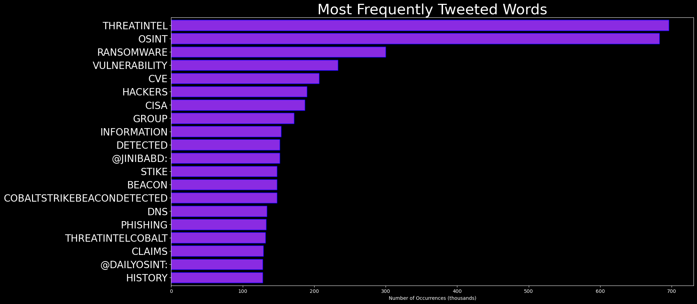

# DARKWIRE SOCIAL CYBER INSIGHTS 
&#x1F34E; **TOPIC = "threatintel"**

## AUTOMATED RESEARCH SUMMARY
     

|  Trending  |   Images | 
:-------------------------:|:-------------------------:
|        |   |   
 
 

  
The most popular user is: **BushidoToken**  
 

## The other day I was asked if I had a #CTI dictionary of terms for someone new looking to get into #threatintel. I d… https://t.co/GPjaKucjB2 

  

### TRENDING SHARED IMAGE

|                **Sample-Tweets**        |
| :-------------: |
| RT @JinibaBD: Here's how much your stolen personal data is worth on the dark web #DarkWeb #CyberSec #infosec #Security #cybercrime #Threat… |
| Bitcoin down: 51% attack? No, put the blame on Elon Musk - https://t.co/RQM18m5Gq5#Hacking #OSINT #Security #Threatintel #cybersecurity |
| RT @JinibaBD: Hackers use open source #Microsoft dev platform to deliver trojans  #DarkWeb #CyberSec #infosec #Security #cybercrime #Threat… |

## RELATED METRICS 
| Metric | Value |
| ------------- | ------------- |
| #1 Most tweeted to  | **JinibaBD** |
| #2 Most tweeted to  | **RedPacketSec** |
| #3 Most tweeted to  | **javier_carriazo** |
| NewProfiles (less than 10 days) | 0.2%  |
| Tweeters with < 10 followers  | 1.56%|
| Tweeters with > 1000000 followers  | 0.0%  |

## MOST POPULAR TWEET TERMS 

| Popularity Rank  | Term |
| ------------- | ------------- |
| first  | **DARKWEB**  |
| second  | **CYBERSEC**  |
| third  | **INFOSEC** |
| fourth  | **THREATINTEL**  |
| fifth  | **@JINIBABD:**  |

## Twitter Bio Analysis
### SENTIMENT ANALYSIS

VIEWS WERE : **SUBJECTIVE**  (46.67%) & **NEGATIVELY-SUBJECTIVE** (13.33%) **OBJECTIVE** (40.0%)

### TWEET SAMPLE 
| Random value picked from array |
| ------------- |
|RT @Certego_Intel: #Malware #Qakbot #BlocklistDomain: tpcsv[.neosj[.why3s[.twVirusTotal: https://t.co/lTnbapdD8F#CyberSecurity #ThreatIn… |

### MOST RETWEETED 

| The most retweeted user is: **BushidoToken**  |
| ------------- |
| The other day I was asked if I had a #CTI dictionary of terms for someone new looking to get into #threatintel. I d… https://t.co/GPjaKucjB2 |

# Potential Fake Accounts
 
# PinkyPeakerUSER INFO

 
`User ScreenName:` PinkyPeaker 
 
`User chosen Name:` Pinky 
 
`Is the User Verified?:` False 
 
`User signup date?:` Sat May 15 08:40:03 +0000 2021 
 
`User Description?:` Learning #CyberSecurity | Senior Engineer for https://t.co/afPaaL3oWh & https://t.co/ucCYfCcBUq | Software developer & BugHunter for @PlayStation | 👨‍💻 
 
`Followers?: `235 
 
`Following?:` 35 
 
`User URL?:` https://t.co/eU69StV7Zn 
 
`Location:` Tech Engineer 
 
`Number of tweets extracted`  : 12 
 
`Profile image:` http://pbs.twimg.com/profile_images/1393486938372460545/2b6YbVHl_normal.jpg 
 
`Number of tweets excluding replies:` 12 
 

 

 
## User Top tweeted words 
 
**@CYBERSECDN:** 4 , **VIA** 4 , **@VERIFIED:** 2 , **US** 2 , **BLUE** 2 , **BADGE** 2 , **~** 2 , **HACKERS** 2 , **UPLOADED** 2 , **FIXES** 2 , **FIND** 2 , **WORKING** 2 , **RT** 1 , **WE’RE** 1 , **BAAAAAAAAAACK** 1 , **FOLLOW** 1 , **THINGS** 1 , **BIRD** 1 , **APP** 1 , **HTTPS://TCO/EUI81QCRR7RT** 1 , 
 
## What this user tweeted
 
RT @CyberSecDN: Attackers can hide external sender warnings in phishing emails https://t.co/Lnga2YvY1t via @threatintel
 
# EmilianMuskUSER INFO

 
`User ScreenName:` EmilianMusk 
 
`User chosen Name:` Emilian Musk 
 
`Is the User Verified?:` False 
 
`User signup date?:` Tue May 11 08:05:14 +0000 2021 
 
`User Description?:` Technoking of Tesla, Imperator of Mars 😉 SNL 
 
`Followers?: `6 
 
`Following?:` 70 
 
`User URL?:` None 
 
`Location:`  
 
`Number of tweets extracted`  : 48 
 
`Profile image:` http://pbs.twimg.com/profile_images/1394559012260126721/48ML0z5i_normal.jpg 
 
`Number of tweets excluding replies:` 51 
 

 

 
## User Top tweeted words 
 
**$HOKK** 5 , **BITCOIN** 4 , **1** 3 , **SOME** 3 , **THEY'RE** 3 , **HELP** 3 , **@ELONMUSK** 3 , **📈** 3 , **BTC** 2 , **CREDIT** 2 , **MASTER** 2 , **COIN** 2 , **BUY** 2 , **DIP** 2 , **THEN** 2 , **CRYPTO** 2 , **ELON** 2 , **@DOGECOINRISE:** 2 , **SOMETHING** 2 , **LET'S** 2 , 
 
## What this user tweeted
 
RT @RecordedFuture: Disrupt your adversaries before they disrupt you. Recorded Future Express gives your team access to world-class securit…
 
# ne_worderUSER INFO

 
`User ScreenName:` ne_worder 
 
`User chosen Name:` neworder 
 
`Is the User Verified?:` False 
 
`User signup date?:` Thu May 13 13:12:23 +0000 2021 
 
`User Description?:` #CyberSecurity 
 
`Followers?: `0 
 
`Following?:` 12 
 
`User URL?:` https://t.co/BPq6w1QU1I 
 
`Location:` Pretoria, South Africa 
 
`Number of tweets extracted`  : 34 
 
`Profile image:` http://pbs.twimg.com/profile_images/1393273333945409536/glbu9ub0_normal.jpg 
 
`Number of tweets excluding replies:` 34 
 

 

 
## User Top tweeted words 
 
**SECURITY** 3 , **DIE** 3 , **DATA** 2 , **@SECURITYWEEK:** 2 , **HACK** 2 , **BEFORE** 2 , **WHATS** 2 , **WRONG** 2 , **CHEATING** 2 , **ACTUALLY** 2 , **NIE** 2 , **@KLAIRD281** 1 , **@SECURITYWEEK** 1 , **DISAGREE** 1 , **NEED** 1 , **BACK** 1 , **ELSE** 1 , **MUST** 1 , **DO?** 1 , **REALITY** 1 , 
 
## What this user tweeted
 
@threatintel Try making less spelling mistakes next time. Are you even QA-ing your articles? #domkop
 

<b> This report is AUTOMATED and not hand crafted, it is designed for pulling metrics on a given keyword or hashtag and performs a series of reporting and analysis.</b>  
### CONCLUSION & EXTERNAL ANALYSIS

*This is my [Adam McMurchie`s] opinion on the data from the tweets, it serves as no objective truth.Since the tweets themselves are a mixture of fact & opinion. 
Authors analytical summary on request.
**RECOMMENDATIONS** WILL BE UPDATED IN NEXT  24 HOURS  