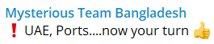

# DARKWIRE SOCIAL CYBER INSIGHTS 
🍎 **TOPIC = "threatintel"**

## AUTOMATED RESEARCH SUMMARY
     

|  Trending  |   Images | 
:-------------------------:|:-------------------------:
|        |   |   
 
 

  
The most popular user is: **DailyOsint**  
 

## Do you want to do a Google Drive #investigation but don't know how?

De Digger is the tool for you. It is a search… https://t.co/yzjI90Wbem 

  

### TRENDING SHARED IMAGE

|                **Sample-Tweets**        |
| :-------------: |
| RT @fr0gger_: 🤓If you're interested in seeing how I use @Jupyter notebooks to share code and workflow, I have a collection of public #infos… |
| RT @DailyCTI: What path should you follow in your Threat #Intelligence journey?https://t.co/m1WDSMPQSHChristopher Ahlberg, Ph.D.#Cybe… |
| RT @DailyOsint: Do you want to do a Google Drive #investigation but don't know how?De Digger is the tool for you. It is a search engine t… |

## RELATED METRICS 
| Metric | Value |
| ------------- | ------------- |
| #1 Most tweeted to  | **DailyOsint** |
| #2 Most tweeted to  | **RedPacketSec** |
| #3 Most tweeted to  | **fr0gger_** |
| NewProfiles (less than 10 days) | 0.0%  |
| Tweeters with < 10 followers  | 3.37%|
| Tweeters with > 1000000 followers  | 0.0%  |

## MOST POPULAR TWEET TERMS 

| Popularity Rank  | Term |
| ------------- | ------------- |
| first  | **OSINT**  |
| second  | **THREATINTEL**  |
| third  | **@DAILYOSINT:** |
| fourth  | **MALWARE**  |
| fifth  | **TOOL**  |

## Twitter Bio Analysis
### SENTIMENT ANALYSIS

VIEWS WERE : **SUBJECTIVE**  (36.36%) & **NEGATIVELY-SUBJECTIVE** (9.09%) **OBJECTIVE** (54.55%)

### TWEET SAMPLE 
| Random value picked from array |
| ------------- |
|Vice Society Ransomware Victim: Jammal Trust Bank - https://t.co/MajXQpXNdi#Vice #Ransomware #OSINT #ThreatIntel #darkweb #TOR |

### MOST RETWEETED 

| The most retweeted user is: **DailyOsint**  |
| ------------- |
| Do you want to do a Google Drive #investigation but don't know how?De Digger is the tool for you. It is a search… https://t.co/yzjI90Wbem |

# Potential Fake Accounts
 

<b> This report is AUTOMATED and not hand crafted, it is designed for pulling metrics on a given keyword or hashtag and performs a series of reporting and analysis.</b>  
### CONCLUSION & EXTERNAL ANALYSIS

*This is my [Adam McMurchie`s] opinion on the data from the tweets, it serves as no objective truth.Since the tweets themselves are a mixture of fact & opinion. 
Authors analytical summary on request.
**RECOMMENDATIONS** WILL BE UPDATED IN NEXT  24 HOURS  