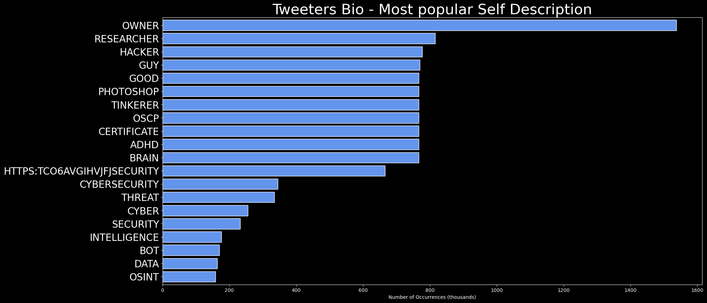

# DARKWIRE SOCIAL CYBER INSIGHTS 
🍎 **TOPIC = "threatintel"**

## AUTOMATED RESEARCH SUMMARY
     

|  Trending  |   Images | 
:-------------------------:|:-------------------------:
|        |   |   
 
 

  
The most popular user is: **bad_packets**  
 

## Mass scanning activity detected from multiple hosts checking for servers using Apache Log4j (Java logging library)… https://t.co/KSidsGeYwk 

  

### TRENDING SHARED IMAGE

|                **Sample-Tweets**        |
| :-------------: |
| iOS malware can fake iPhone shut downs to snoop on camera, microphone #OSINT  #DataBreaches #DarkWeb #CyberSec… https://t.co/GFhuCB2QGP |
| RT @CyberIQs_: Samsung's new Odyssey Neo G8 32-inch curved monitor features #infosec #infosecurity #cybersecurity #threatintel #threatintel… |
| RT @CyberIQs_: Security Recruiter Directory #infosec #infosecurity #cybersecurity #threatintel #threatintelligence #hacking #cybernews #cyb… |

## RELATED METRICS 
| Metric | Value |
| ------------- | ------------- |
| #1 Most tweeted to  | **CyberIQs_** |
| #2 Most tweeted to  | **JinibaBD** |
| #3 Most tweeted to  | **javier_carriazo** |
| NewProfiles (less than 10 days) | 0.03%  |
| Tweeters with < 10 followers  | 0.44%|
| Tweeters with > 1000000 followers  | 0.0%  |

## MOST POPULAR TWEET TERMS 

| Popularity Rank  | Term |
| ------------- | ------------- |
| first  | **INFOSEC**  |
| second  | **INFOSECURITY**  |
| third  | **THREATINTEL** |
| fourth  | **@CYBERIQS_:**  |
| fifth  | **THREATINTELLIGENCE**  |

## Twitter Bio Analysis
### SENTIMENT ANALYSIS

VIEWS WERE : **SUBJECTIVE**  (33.33%) & **NEGATIVELY-SUBJECTIVE** (26.67%) **OBJECTIVE** (40.0%)

### TWEET SAMPLE 
| Random value picked from array |
| ------------- |
|RT @JinibaBD: Nobody is inmune to #cyberattacks A good strategy? #assumebreach &amp; #preventbreach #socialengineering #DataBreaches #DarkWeb #… |

### MOST RETWEETED 

| The most retweeted user is: **bad_packets**  |
| ------------- |
| Mass scanning activity detected from multiple hosts checking for servers using Apache Log4j (Java logging library)… https://t.co/KSidsGeYwk |

# Potential Fake Accounts
 
# Tinok888hUSER INFO

 
`User ScreenName:` Tinok888h 
 
`User chosen Name:` Tinok 
 
`Is the User Verified?:` False 
 
`User signup date?:` Sun Jan 02 22:19:09 +0000 2022 
 
`User Description?:`  
 
`Followers?: `3 
 
`Following?:` 100 
 
`User URL?:` None 
 
`Location:`  
 
`Number of tweets extracted`  : 56 
 
`Profile image:` http://abs.twimg.com/sticky/default_profile_images/default_profile_normal.png 
 
`Number of tweets excluding replies:` 56 
 

 

 
## User Top tweeted words 
 
**و** 20 , **در** 17 , **به** 14 , **های** 10 , **که** 10 , **@VAHIDNAMENI:** 8 , **از** 7 , **این** 7 , **مورد** 5 , **می** 5 , **کتاب** 5 , **رو** 5 , **با** 4 , **برای** 4 , **را** 4 , **من** 4 , **ابلهانه** 4 , **BEST** 4 , **تو** 4 , **بازار** 4 , 
 
## What this user tweeted
 
RT @aw_osint: Now I can start my week with a good book 🤓📖😃
#OSINT #ThreatIntel https://t.co/P42xLBHlXa
 

<b> This report is AUTOMATED and not hand crafted, it is designed for pulling metrics on a given keyword or hashtag and performs a series of reporting and analysis.</b>  
### CONCLUSION & EXTERNAL ANALYSIS

*This is my [Adam McMurchie`s] opinion on the data from the tweets, it serves as no objective truth.Since the tweets themselves are a mixture of fact & opinion. 
Authors analytical summary on request.
**RECOMMENDATIONS** WILL BE UPDATED IN NEXT  24 HOURS  