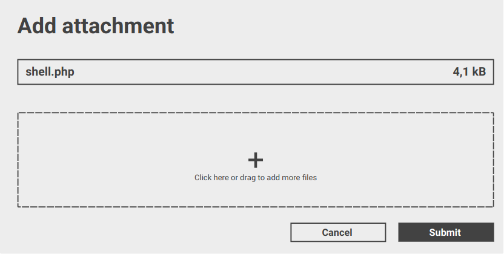

# DARKWIRE SOCIAL CYBER INSIGHTS 
&#x1F34E; **TOPIC = "vulnerabilities"**

## AUTOMATED RESEARCH SUMMARY
     

|  Trending  |   Images | 
:-------------------------:|:-------------------------:
|        |   |   
 
 

  
The most popular user is: **moxie**  
 

## A few months ago Cellebrite announced that they would begin parsing data from Signal in their extraction tools. It… https://t.co/andzC9a5nW 

  

### TRENDING SHARED IMAGE

|                **Sample-Tweets**        |
| :-------------: |
| RT @CSA_DVillamizar: RT WajdiAlkayal: #Microsoft Exchange Server Vulnerabilities#cybersecurity #security #cyber #informationsecurity #info… |
| TFG exposed a lot of vulnerabilities in our government, where the honor system just won't cut it anymore. What are… https://t.co/SrgWKtLcQj |
| @Yung_Jandro @jarue369 @Wsingleton1974 @jazzzyconnell I’m laying out the extent of my ability to work with the idea… https://t.co/lccblYUhYa |

## RELATED METRICS 
| Metric | Value |
| ------------- | ------------- |
| #1 Most tweeted to  | **wdormann** |
| #2 Most tweeted to  | **TheHackersNews** |
| #3 Most tweeted to  | **LanceSchukies** |
| NewProfiles (less than 10 days) | 1.08%  |
| Tweeters with < 10 followers  | 4.12%|
| Tweeters with > 1000000 followers  | 0.04%  |

## MOST POPULAR TWEET TERMS 

| Popularity Rank  | Term |
| ------------- | ------------- |
| first  | **VULNERABILITIES**  |
| second  | **HACKERS**  |
| third  | **COULD** |
| fourth  | **COMPROMISE**  |
| fifth  | **CRITICAL**  |

## Twitter Bio Analysis
### SENTIMENT ANALYSIS

VIEWS WERE : **SUBJECTIVE**  (13.33%) & **NEGATIVELY-SUBJECTIVE** (20.0%) **OBJECTIVE** (66.67%)

### TWEET SAMPLE 
| Random value picked from array |
| ------------- |
|@RepRiggleman &amp; @ianbremmer discuss U.S. cyber vulnerabilities, Biden's message on world stage… https://t.co/Yj0ClhYFcx |

### MOST RETWEETED 

| The most retweeted user is: **moxie**  |
| ------------- |
| A few months ago Cellebrite announced that they would begin parsing data from Signal in their extraction tools. It… https://t.co/andzC9a5nW |

# Potential Fake Accounts
 
# BrutVirgoUSER INFO

 
`User ScreenName:` BrutVirgo 
 
`User chosen Name:` Brüt Virgo 
 
`Is the User Verified?:` False 
 
`User signup date?:` Tue Jun 08 09:13:42 +0000 2021 
 
`User Description?:` he/him. Queer tarot interpreter. Earth hermit. Pokémon voyeur. Shiny hunter. Seeking attention and acceptance. I like animals more than humans. ✊🏿🏳️‍⚧️🏳️‍🌈 
 
`Followers?: `1 
 
`Following?:` 6 
 
`User URL?:` None 
 
`Location:` California, USA 
 
`Number of tweets extracted`  : 11 
 
`Profile image:` http://pbs.twimg.com/profile_images/1402880598302097411/bjJaDLbp_normal.jpg 
 
`Number of tweets excluding replies:` 12 
 

 

 
## User Top tweeted words 
 
**ITS** 2 , **WHAT'S** 2 , **NON** 1 , **SLUSHIE** 1 , **VERSION!** 1 , **🤣🤣🤣FLASHBACKS** 1 , **DRINKING** 1 , **BUTTERBEER** 1 , **HOGWARTS!** 1 , **ACCURATELY** 1 , **PORTRAYED** 1 , **HTTPS://TCO/CKF6GQXD80@GAIALECT** 1 , **YOU’RE** 1 , **READY** 1 , **EXPOSED** 1 , **DEEPEST** 1 , **VULNERABILITIES** 1 , **ASPIRATIONS** 1 , **ESSENTIALLY** 1 , **ENTIRE** 1 , 
 
## What this user tweeted
 
@gaialect If you’re ready to exposed your deepest vulnerabilities, aspirations and essentially the entire essence o… https://t.co/LmoQfAorr4
 
# mygdreamingUSER INFO

 
`User ScreenName:` mygdreaming 
 
`User chosen Name:` starry 
 
`Is the User Verified?:` False 
 
`User signup date?:` Sat Jun 12 23:41:44 +0000 2021 
 
`User Description?:` just another yoongi enthusiast // mygdreaming @ ao3, minors pls don’t follow! 
 
`Followers?: `6 
 
`Following?:` 24 
 
`User URL?:` https://t.co/2poiRUaDrL 
 
`Location:`  
 
`Number of tweets extracted`  : 83 
 
`Profile image:` http://pbs.twimg.com/profile_images/1403860303440404481/StR8Fo5f_normal.jpg 
 
`Number of tweets excluding replies:` 83 
 

 

 
## User Top tweeted words 
 
**YOONMIN** 8 , **FIC** 5 , **TWITTER** 5 , **MINIMINI** 4 , **COMPLETED** 4 , **IM** 4 , **PEOPLE** 4 , **GOOD** 4 , **WORK** 4 , **ONGOING** 3 , **T-RATED** 3 , **E-RATED** 3 , **(PART** 3 , **VULGAR** 3 , **DOOFUSES** 3 , **SERIES)** 3 , **YOONGI** 3 , **MAKING** 3 , **U** 3 , **LEGIT** 3 , 
 
## What this user tweeted
 
vulnerabilities🔞

#yoonmin #minimini
E-rated, ongoing (part 3 of the vulgar doofuses series)
pwp, sexting, establis… https://t.co/ZFGQLaokpr
 
# Muhamma28067873USER INFO

 
`User ScreenName:` Muhamma28067873 
 
`User chosen Name:` Muhammad Shoaib 
 
`Is the User Verified?:` False 
 
`User signup date?:` Wed Jun 09 13:45:42 +0000 2021 
 
`User Description?:` Nothing special 
 
`Followers?: `2 
 
`Following?:` 54 
 
`User URL?:` None 
 
`Location:`  
 
`Number of tweets extracted`  : 200 
 
`Profile image:` http://pbs.twimg.com/profile_images/1402623102916386821/_XnGOnyi_normal.jpg 
 
`Number of tweets excluding replies:` 321 
 

 

 
## User Top tweeted words 
 
**@TEQUIEREMOS:** 46 , **US** 21 , **کے** 20 , **بجٹ** 19 , **کی** 18 , **PAKISTAN** 17 , **کو** 17 , **کا** 17 , **@CARIN__FISCHER:** 16 , **میں** 16 , **AFGHANISTAN** 15 , **اور** 13 , **INDIA** 13 , **سے** 12 , **کر** 12 , **INDIAN** 12 , **یہ** 10 , **ہیں** 10 , **ہے** 9 , **@IKJUSTUJU:** 9 , 
 
## What this user tweeted
 
RT @tequieremos: ..vulnerabilities despite the numerical superiority. India's 1.3 million men are over twice the size of Pakistan's 617,000…RT @tequieremos: The idea of seeking strategic depth in Afghanistan makes absolutely no military sense for Pakistan. Pakistan is the 36th l…
 
# 21st97620045USER INFO

 
`User ScreenName:` 21st97620045 
 
`User chosen Name:` 21st 
 
`Is the User Verified?:` False 
 
`User signup date?:` Sat Jun 12 12:05:58 +0000 2021 
 
`User Description?:` 21st,maybe?twitter/account 
 
`Followers?: `0 
 
`Following?:` 3 
 
`User URL?:` None 
 
`Location:`  
 
`Number of tweets extracted`  : 168 
 
`Profile image:` http://abs.twimg.com/sticky/default_profile_images/default_profile_normal.png 
 
`Number of tweets excluding replies:` 168 
 

 

 
## User Top tweeted words 
 
**US** 10 , **OTHER** 7 , **ISRAEL** 6 , **PRESIDENT** 6 , **DON'T** 5 , **MAYBE** 5 , **THINGS** 5 , **I'M** 5 , **THANK** 5 , **HEAR** 5 , **MAKE** 5 , **ANY** 4 , **FLOOR** 4 , **TIME** 4 , **EVER** 4 , **GETTING** 4 , **NEW** 4 , **UM** 4 , **AMERICA** 4 , **STILL** 4 , 
 
## What this user tweeted
 
How 'bout you shut up about Settings on Keyboard Type Layouts, cyber-vulnerabilities!

Tv media is a preliminary li… https://t.co/awcjyU7NqU
 
# Tanu02489522USER INFO

 
`User ScreenName:` Tanu02489522 
 
`User chosen Name:` Tanu 
 
`Is the User Verified?:` False 
 
`User signup date?:` Mon Jun 07 16:07:27 +0000 2021 
 
`User Description?:` 🌹 
 
`Followers?: `2 
 
`Following?:` 89 
 
`User URL?:` None 
 
`Location:`  
 
`Number of tweets extracted`  : 161 
 
`Profile image:` http://pbs.twimg.com/profile_images/1401934761191305218/BKEB26yp_normal.jpg 
 
`Number of tweets excluding replies:` 161 
 

 

 
## User Top tweeted words 
 
**PEOPLE** 16 , **ITS** 15 , **SUCH** 12 , **@NARENDRAMODI** 11 , **PM** 11 , **PUBLIC** 11 , **के** 10 , **PEOPLES** 10 , **की** 9 , **DOING** 9 , **से** 9 , **DONT** 8 , **@K_SATYARTHI** 8 , **@THENEHRUCENTRE** 8 , **@AUTHORAMISH** 8 , **H** 8 , **GOV** 7 , **ना** 7 , **नहीं** 7 , **GUILT** 7 , 
 
## What this user tweeted
 
RT @naukarshah: Dear PM @narendramodi, 

One of our key vulnerabilities long term is going to be our dependency on semiconductor imports.…
 
# sadisnowiceUSER INFO

 
`User ScreenName:` sadisnowice 
 
`User chosen Name:` sadi richards 
 
`Is the User Verified?:` False 
 
`User signup date?:` Fri Jun 04 23:28:04 +0000 2021 
 
`User Description?:` calls mi receives receiver.I wents to to listens the the name? the name was York’s where is York waso was callings from?whats? New York.  forks mi off. whats? 
 
`Followers?: `5 
 
`Following?:` 192 
 
`User URL?:` None 
 
`Location:`  
 
`Number of tweets extracted`  : 200 
 
`Profile image:` http://pbs.twimg.com/profile_images/1400958528475516929/yGjWYdoF_normal.jpg 
 
`Number of tweets excluding replies:` 2242 
 

 

 
## User Top tweeted words 
 
**BIDEN** 21 , **WHICH** 16 , **PRESIDENT** 16 , **US** 16 , **LEADERS** 16 , **ITS** 14 , **THAN** 12 , **PEOPLE** 11 , **TWO** 11 , **SUMMIT** 11 , **AFTER** 11 , **G7** 10 , **XBOX** 9 , **NEW** 9 , **NATO** 9 , **FIRST** 9 , **MASS** 9 , **GAME** 8 , **OTHER** 8 , **SHOOTINGS** 8 , 
 
## What this user tweeted
 
The scarcity "has caused global manufacturers to think about their supply chain in a new way, and think about vulne… https://t.co/5qQaIcjCpO"The expected exponential growth in demand for minerals that are linked to clean energy is putting more pressure on… https://t.co/3UeSgilZlDSamir Jain, director of policy at the Center for Democracy and Technology, said Amazon's efforts to encrypt data wa… https://t.co/UllKApNsXe
 
# AdrianG39741962USER INFO

 
`User ScreenName:` AdrianG39741962 
 
`User chosen Name:` Adrian Gheorghe 
 
`Is the User Verified?:` False 
 
`User signup date?:` Fri Jun 04 19:05:45 +0000 2021 
 
`User Description?:` Part of Welthee family and love for community!
https://t.co/LqMJtEsV0f 
 
`Followers?: `0 
 
`Following?:` 15 
 
`User URL?:` None 
 
`Location:`  
 
`Number of tweets extracted`  : 132 
 
`Profile image:` http://abs.twimg.com/sticky/default_profile_images/default_profile_normal.png 
 
`Number of tweets excluding replies:` 132 
 

 

 
## User Top tweeted words 
 
**@AXIACOIN:** 67 , **@WELTHEE** 36 , **AXIA** 30 , **@WELTHEE:** 26 , **BLOCKCHAIN** 19 , **@BUIOCAS:** 13 , **ECONOMY** 12 , **ECONOMIC** 12 , **VALUE** 11 , **WELTHEE** 11 , **@NANUDENISA:** 11 , **MONEY** 9 , **ITS** 9 , **CRYPTO** 9 , **US** 8 , **LEARN** 7 , **FINANCIAL** 7 , **LOVE** 7 , **WATCH** 6 , **TECHNOLOGY** 6 , 
 
## What this user tweeted
 
RT @AxiaCoin: The AXIA architecture combats vulnerabilities through its revolutionary linkage of a decentralized public blockchain token to…
 
# SHOHAN59333631USER INFO

 
`User ScreenName:` SHOHAN59333631 
 
`User chosen Name:` SHOHAN 
 
`Is the User Verified?:` False 
 
`User signup date?:` Mon Jun 07 05:00:01 +0000 2021 
 
`User Description?:` Always believe on myself 
 
`Followers?: `2 
 
`Following?:` 46 
 
`User URL?:` None 
 
`Location:`  
 
`Number of tweets extracted`  : 200 
 
`Profile image:` http://pbs.twimg.com/profile_images/1401766106461736960/6ewCyaht_normal.jpg 
 
`Number of tweets excluding replies:` 245 
 

 

 
## User Top tweeted words 
 
**PROJECT** 81 , **OTHER** 33 , **INVESTORS** 24 , **FEATURES** 21 , **MAKES** 21 , **WHICH** 21 , **I’M** 20 , **EXPLAIN** 20 , **JUNE** 20 , **AMA** 20 , **DOES** 19 , **@KENUINU** 19 , **3** 19 , **ANY** 18 , **MAIN** 18 , **PRICE** 18 , **@SAFEBREASTINU** 18 , **BURN** 17 , **USERS** 17 , **Q** 16 , 
 
## What this user tweeted
 
@AQ_Community @tendie_swap I’m a developer and I’m interested in contributing to your project alongsides earning Do… https://t.co/N71JaXmSjb@HiBlockTalks @KenuInu I’m a developer and I’m interested in contributing to your project alongsides earning Do, yo… https://t.co/y1aISpDaHA@Crypto_Blasters @FeroxAdvisors I’m a developer and I’m interested in contributing to your project alongsides earni… https://t.co/PcFJP4DTyd@IM_Communityitw @Papaya_Swap I’m a developer and I’m interested in contributing to your project alongsides earning… https://t.co/l6h2RExEfi@BebobeL_CL @SafeDoge I’m a developer and I’m interested in contributing to your project alongsides earning Do, you… https://t.co/5NpfSpYsCb@kriptobi @SpheriumFinance I’m a developer and I’m interested in contributing to your project alongsides earning Do… https://t.co/j7GU8pK9Dy@cryptocclub01 @SafeBreastInu I’m a developer and I’m interested in contributing to your project alongsides earning… https://t.co/pyyA4gTzDX@CryptoTitans1 @RocketVault_ I’m a developer and I’m interested in contributing to your project alongsides earning… https://t.co/OuEYisOoFS@wolfonaire @adax_pro I’m a developer and I’m interested in contributing to your project alongsides earning Do, you… https://t.co/qU84xuNUe1
 
# YahHabibi88USER INFO

 
`User ScreenName:` YahHabibi88 
 
`User chosen Name:` Habibi 
 
`Is the User Verified?:` False 
 
`User signup date?:` Thu Jun 10 06:04:05 +0000 2021 
 
`User Description?:` Yah,,,Habibi 
 
`Followers?: `4 
 
`Following?:` 31 
 
`User URL?:` None 
 
`Location:`  
 
`Number of tweets extracted`  : 121 
 
`Profile image:` http://pbs.twimg.com/profile_images/1402870593783885824/6ey6_4De_normal.jpg 
 
`Number of tweets excluding replies:` 121 
 

 

 
## User Top tweeted words 
 
**PROJECT** 19 , **@RANACHAN21** 16 , **@SAFEBREASTINU** 15 , **UTC** 14 , **CRYPTO** 13 , **PROJECTS** 12 , **AMA** 11 , **@KOJIEARTH** 11 , **100$** 9 , **USDT** 9 , **PM** 9 , **LOT** 9 , **JUNE** 9 , **@BABYLONSNFT** 9 , **VENUE:** 8 , **@RITULAKIM** 8 , **SECURITY** 8 , **@NFTCOINS_MARKET** 8 , **@OMNIA_DEFI** 8 , **@OVENTOKEN** 8 , 
 
## What this user tweeted
 
@CryptolandOffi1 @Omnia_DeFi The security of assets is the first thing that comes to me and other Investors when ch… https://t.co/d4Z7Xfe8iY@CryptoTitans1 @PikaCrypto_ The security of assets is the first thing that comes to me and other Investors when cho… https://t.co/PS6DcqqwYY@CryptoRoyals @kojiearth Can you assure us that this won't be one of those projects that come out, do a lot of mark… https://t.co/m1Wca9UrVC
 
# BushwhackersCTFUSER INFO

 
`User ScreenName:` BushwhackersCTF 
 
`User chosen Name:` Bushwhackers 
 
`Is the User Verified?:` False 
 
`User signup date?:` Fri Jun 04 19:26:50 +0000 2021 
 
`User Description?:` Bushwhackers CTF team. 
 
`Followers?: `23 
 
`Following?:` 22 
 
`User URL?:` https://t.co/TbxVVg06HX 
 
`Location:` Mostly Moscow, Russia 
 
`Number of tweets extracted`  : 6 
 
`Profile image:` http://pbs.twimg.com/profile_images/1400897891833683970/DTL13bXE_normal.jpg 
 
`Number of tweets excluding replies:` 6 
 

 

 
## User Top tweeted words 
 
**FAUSTCTF** 3 , **HTTPS://TCO/XYKQB1125ZFWIW** 1 , **LEAST** 1 , **4X** 1 , **OVERKILL** 1 , **RESOURCE** 1 , **PROBLEMS** 1 , **SOME** 1 , **CTFS** 1 , **ESPECIALLY** 1 , **THERE'RE** 1 , **LOTS** 1 , **OF…** 1 , **HTTPS://TCO/4PR5MQ5MCIALWAYS** 1 , **HTTPS://TCO/H3RLGFTCZLHAVE** 1 , **PREPARED** 1 , **EXPLOIT** 1 , **RUNNING** 1 , **BOXES** 1 , **@FAUSTCTF?** 1 , 
 
## What this user tweeted
 
FWIW, it was at least 4x overkill. But we did have resource problems on some CTFs, especially when there're lots of… https://t.co/4pR5MQ5McI
 
# FMM24197339USER INFO

 
`User ScreenName:` FMM24197339 
 
`User chosen Name:` FMM 
 
`Is the User Verified?:` False 
 
`User signup date?:` Thu Jun 10 07:13:07 +0000 2021 
 
`User Description?:` Free Market Militia, advancing liberty 🗽 by peacefully exercising the rights guaranteed to US🇺🇸 in our Constitution! 
 
`Followers?: `0 
 
`Following?:` 17 
 
`User URL?:` None 
 
`Location:`  
 
`Number of tweets extracted`  : 25 
 
`Profile image:` http://pbs.twimg.com/profile_images/1402886996096294915/zpLjvy7F_normal.jpg 
 
`Number of tweets excluding replies:` 25 
 

 

 
## User Top tweeted words 
 
**VIA** 5 , **@YOUTUBE** 5 , **@PRAGERU:** 3 , **THAN** 2 , **STATES** 2 , **FED** 2 , **SIMILAR** 2 , **YOUNG** 2 , **GOOD** 2 , **TRYING** 2 , **@MATTWALSHBLOG:** 2 , **RT** 1 , **@HESSIAN_MOHD:** 1 , **FRESH** 1 , **AIR** 1 , **THEE** 1 , **~ELITISTS** 1 , **HTTPS://TCO/P3PDF3YNBBRT** 1 , **@ZUBYMUSIC:** 1 , **FLORIDA** 1 , 
 
## What this user tweeted
 
RT @prageru: Wokeness preys upon a person's desire to be a good person and the vulnerabilities associated with thinking they might not be.…
 
# prenceeeee_USER INFO

 
`User ScreenName:` prenceeeee_ 
 
`User chosen Name:` Prince Ng 
 
`Is the User Verified?:` False 
 
`User signup date?:` Mon Jun 07 13:39:55 +0000 2021 
 
`User Description?:`  
 
`Followers?: `1 
 
`Following?:` 17 
 
`User URL?:` None 
 
`Location:` Manila City 
 
`Number of tweets extracted`  : 2 
 
`Profile image:` http://abs.twimg.com/sticky/default_profile_images/default_profile_normal.png 
 
`Number of tweets excluding replies:` 2 
 

 

 
## User Top tweeted words 
 
**CAME** 1 , **HERE** 1 , **VENT** 1 , **VULNERABILITIES** 1 , **EVEN** 1 , **THOUGH** 1 , **TWEETSSHITS** 1 , **TAKIN'** 1 , **QUITE** 1 , **SOME** 1 , **TIME** 1 , **TALK** 1 , **PROBLEMS** 1 , 
 
## What this user tweeted
 
I came here to vent out my vulnerabilities even though no one can see my tweets.
 
# thuyhiennnn2124USER INFO

 
`User ScreenName:` thuyhiennnn2124 
 
`User chosen Name:` thuy hien 
 
`Is the User Verified?:` False 
 
`User signup date?:` Sat Jun 05 07:40:51 +0000 2021 
 
`User Description?:`  
 
`Followers?: `0 
 
`Following?:` 2 
 
`User URL?:` None 
 
`Location:`  
 
`Number of tweets extracted`  : 48 
 
`Profile image:` http://pbs.twimg.com/profile_images/1401081649320783877/gK_ZEfHT_normal.jpg 
 
`Number of tweets excluding replies:` 48 
 

 

 
## User Top tweeted words 
 
**BLOCKCHAIN** 12 , **BEHIND** 10 , **MOST** 9 , **PROJECT** 7 , **WAY** 6 , **MANY** 6 , **PROJECTS** 6 , **PAPER** 6 , **SUCCESSFUL** 6 , **FEW** 6 , **STORIES** 6 , **@JONHKELLY111** 6 , **@SPHERIUMFINANCE** 5 , **OPINION** 5 , **DEVELOPMENT** 5 , **DIRECTION** 5 , **ATTRACTIVE** 5 , **INDUSTRY** 5 , **EXPAND** 5 , **GROW** 5 , 
 
## What this user tweeted
 
@PolkaWarriors_ @hydra_dx @basilisk @GregusJakub @bsx_finance @JakPanik @mattigags What security features will be d… https://t.co/AD4BAgN2ox
 
# CyberSecDude1USER INFO

 
`User ScreenName:` CyberSecDude1 
 
`User chosen Name:` CyberSecDude 
 
`Is the User Verified?:` False 
 
`User signup date?:` Sat Jun 12 20:04:47 +0000 2021 
 
`User Description?:`  
 
`Followers?: `0 
 
`Following?:` 43 
 
`User URL?:` None 
 
`Location:`  
 
`Number of tweets extracted`  : 32 
 
`Profile image:` http://abs.twimg.com/sticky/default_profile_images/default_profile_normal.png 
 
`Number of tweets excluding replies:` 32 
 

 

 
## User Top tweeted words 
 
**CYBERSECURITY** 6 , **SECURITY** 5 , **@NCSVENTURES:** 3 , **@PENTESTERLAB** 3 , **CHROME** 3 , **NEW** 3 , **IDENTIFY** 2 , **@ELIFE:** 2 , **DATA** 2 , **AWAY** 2 , **GIVE** 2 , **MALWARE** 2 , **YEARS** 2 , **FIREFOX** 2 , **MICROSOFTEDGE** 2 , **DOWN** 2 , **CHECK** 2 , **INSIDE** 2 , **FIND** 2 , **RED** 2 , 
 
## What this user tweeted
 
RT @mobilesecurity_: Mistune - Remote code execution vulnerabilities
that have been hiding for a decade
#MobileSecurity #iOSsecurity by @Co…RT @RedHuntLabs: If you are a pentester, you would find this blog interesting. We discussed the common vulnerabilities that a threat actor…
 
# Dominikxq2s6USER INFO

 
`User ScreenName:` Dominikxq2s6 
 
`User chosen Name:` Dominik Laney 
 
`Is the User Verified?:` False 
 
`User signup date?:` Sat Jun 05 18:54:48 +0000 2021 
 
`User Description?:` Conquering from withi 
 
`Followers?: `2 
 
`Following?:` 60 
 
`User URL?:` None 
 
`Location:`  
 
`Number of tweets extracted`  : 38 
 
`Profile image:` http://pbs.twimg.com/profile_images/1401261572807266305/-Hia7qgH_normal.jpg 
 
`Number of tweets excluding replies:` 38 
 

 

 
## User Top tweeted words 
 
**@NYTIMES:** 6 , **@THEECONOMIST:** 5 , **@JESSICA_SIMSOON:** 4 , **NEW** 4 , **@WSJ:** 3 , **COULD** 3 , **@NYLEE21:** 3 , **YORK** 3 , **“THE** 2 , **CITIES** 2 , **MEASURES** 2 , **PHASE** 2 , **GAS** 2 , **CLIMATE** 2 , **CONCERNS** 2 , **NEXT** 2 , **MUST** 2 , **시카** 2 , **막** 2 , **동네** 2 , 
 
## What this user tweeted
 
RT @TheEconomist: Binyamin Netanyahu has shown up Israel’s vulnerabilities. The next government must fix them https://t.co/VHPD3VDRNG
 
# CaptPeteMitchUSER INFO

 
`User ScreenName:` CaptPeteMitch 
 
`User chosen Name:` Captain Pete 
 
`Is the User Verified?:` False 
 
`User signup date?:` Fri Jun 11 05:34:56 +0000 2021 
 
`User Description?:` A history of high speed passes over five air control towers and one admiral's daughter 
 
`Followers?: `12 
 
`Following?:` 356 
 
`User URL?:` None 
 
`Location:` Fightertown, USA 
 
`Number of tweets extracted`  : 200 
 
`Profile image:` http://pbs.twimg.com/profile_images/1403230037768392704/IA0XTQyt_normal.jpg 
 
`Number of tweets excluding replies:` 205 
 

 

 
## User Top tweeted words 
 
**@GPINGERSOLL:** 13 , **@BECKETADAMS:** 9 , **@SIRAJAHASHMI** 8 , **BIDEN** 8 , **YOU’RE** 6 , **TRUE** 6 , **CRT** 6 , **WHITE** 6 , **PEOPLE** 6 , **SAY** 6 , **@INEZFELTSCHER:** 6 , **SOVIETS** 6 , **MEDIA** 5 , **@AGHAMILTON29:** 5 , **AGAIN** 5 , **THAN** 5 , **YEAR** 5 , **NEED** 5 , **CAN’T** 5 , **FIRST** 5 , 
 
## What this user tweeted
 
RT @omriceren: Oh good. https://t.co/JMAJLWZq4H https://t.co/eWNXPAz4ZY
 
# SiddhiRajput16USER INFO

 
`User ScreenName:` SiddhiRajput16 
 
`User chosen Name:` Siddhi Rajput 
 
`Is the User Verified?:` False 
 
`User signup date?:` Sat Jun 12 12:47:19 +0000 2021 
 
`User Description?:` here to learn some humour💙 
 
`Followers?: `137 
 
`Following?:` 163 
 
`User URL?:` None 
 
`Location:` Agra, India 
 
`Number of tweets extracted`  : 108 
 
`Profile image:` http://pbs.twimg.com/profile_images/1403695883854569473/4amFBL9r_normal.jpg 
 
`Number of tweets excluding replies:` 108 
 

 

 
## User Top tweeted words 
 
**@GURUSEESR** 6 , **FOLLOW** 6 , **:** 5 , **@CRAZIESTLAZIEST:** 5 , **KI** 5 , **THANK** 5 , **TWITTER** 4 , **TOO** 4 , **@THODA_RUDE_HU** 4 , **@SID__STARK:** 3 , **MAN** 3 , **@LOVEMETHODAMORE** 3 , **PE** 3 , **BANYAN** 3 , **HAI** 3 , **STRONG** 3 , **PLUSCONVERSATIONSRT** 3 , **GOOD** 3 , **FB** 3 , **YE** 3 , 
 
## What this user tweeted
 
RT @VISHRUTPATEL: Being mentally strong is very important, its okay if you feel weak often but you need to take charge of your life &amp; work…
 
# Nikhil33020639USER INFO

 
`User ScreenName:` Nikhil33020639 
 
`User chosen Name:` Nikhil 
 
`Is the User Verified?:` False 
 
`User signup date?:` Sat Jun 12 13:11:05 +0000 2021 
 
`User Description?:`  
 
`Followers?: `2 
 
`Following?:` 23 
 
`User URL?:` None 
 
`Location:`  
 
`Number of tweets extracted`  : 4 
 
`Profile image:` http://abs.twimg.com/sticky/default_profile_images/default_profile_normal.png 
 
`Number of tweets excluding replies:` 4 
 

 

 
## User Top tweeted words 
 
**@INDIAJYOT:** 3 , **MAHARAJ** 2 , **ACID** 2 , **TEST** 2 , **US** 2 , **RT** 1 , **@NARENDRAMODI:** 1 , **PARTICIPATED** 1 , **@G7** 1 , **SUMMIT** 1 , **SESSION** 1 , **HEALTH** 1 , **THANKED** 1 , **PARTNERS** 1 , **SUPPORT** 1 , **DURING** 1 , **RECENT** 1 , **COVID-19** 1 , **WAVE** 1 , **IND…RT** 1 , 
 
## What this user tweeted
 
RT @IndiaJyot: AUSTRALIAN ACID TEST 

Of all those dependents of the US nuclear umbrella security, Australia has learnt a hard lesson from…
 
# KajalnivaUSER INFO

 
`User ScreenName:` Kajalniva 
 
`User chosen Name:` Kajal Kumari 
 
`Is the User Verified?:` False 
 
`User signup date?:` Thu Jun 10 14:38:06 +0000 2021 
 
`User Description?:` 😍I love myself😍 
 
`Followers?: `1 
 
`Following?:` 5 
 
`User URL?:` None 
 
`Location:`  
 
`Number of tweets extracted`  : 21 
 
`Profile image:` http://pbs.twimg.com/profile_images/1402999042225803273/g7IYTlis_normal.jpg 
 
`Number of tweets excluding replies:` 21 
 

 

 
## User Top tweeted words 
 
**@BKSRANCHI:** 8 , **@BKSRANCHI** 8 , **WORLDDAYAGAINSTCHILDLABOUR** 8 , **VIRTUAL** 8 , **MEET** 8 , **@SANJAYKMRANCHI** 7 , **ORGANIZED** 6 , **@DELHIIRRC:** 6 , **ENDCHILDLABOUR** 5 , **के** 3 , **CELEBRATE** 3 , **CHILDREN** 3 , **SPEAKING** 3 , **@NITIAAYOG** 2 , **@NCPCR_** 2 , **@MUNDAARJUN** 2 , **@HEMANTSORENJMM** 2 , **@SRCW_JHARKHAND** 2 , **CHAIRPERSON** 2 , **VIRTUALMEET** 2 , 
 
## What this user tweeted
 
RT @bksranchi: @nanditapb at the #virtual meet organized by @bksranchi to celebrate #WorldDayAgainstChildLabour spoke on an multi-entity ho…RT @DelhiIrrc: @nanditapb at the #EndChildLabour  virtual meet organized by @bksranchi &amp; @sanjaykmranchi, speaking on an multi-entity holis…
 
# Dhatri26898638USER INFO

 
`User ScreenName:` Dhatri26898638 
 
`User chosen Name:` Dhatri 
 
`Is the User Verified?:` False 
 
`User signup date?:` Sat Jun 12 04:52:20 +0000 2021 
 
`User Description?:` Project leader for project laadli 
 
`Followers?: `10 
 
`Following?:` 12 
 
`User URL?:` None 
 
`Location:`  
 
`Number of tweets extracted`  : 20 
 
`Profile image:` http://pbs.twimg.com/profile_images/1403628902677839872/noOs9JLV_normal.jpg 
 
`Number of tweets excluding replies:` 20 
 

 

 
## User Top tweeted words 
 
**@PROJECTLAADLI** 17 , **HYGIENE** 14 , **MENSTRUAL** 13 , **BASIC** 13 , **HUMAN** 13 , **PRIVILEGE** 13 , **SUPPORTING** 13 , **HELPING** 13 , **DISTRIBUTE** 6 , **S…RT** 3 , **DISTRIBUTE…RT** 3 , **NEW** 2 , **@SHALINYDIPS:** 2 , **@UNWOMENINDIA** 2 , **@FEMINISMININDIA** 2 , **@SATYAMNISHTHA** 2 , **RT** 1 , **@PRAKRITIRANI4:** 1 , **SAN…RT** 1 , **@RISHIRAJBONGSH1:** 1 , 
 
## What this user tweeted
 
RT @RishiRajbongsh1: The onset of menstruation means a new phase and new vulnerabilities in the lives of adolescents. Yet, many adolescent…
 
# RishiRajbongsh1USER INFO

 
`User ScreenName:` RishiRajbongsh1 
 
`User chosen Name:` Rishi Rajbongshi 
 
`Is the User Verified?:` False 
 
`User signup date?:` Sat Jun 12 07:15:26 +0000 2021 
 
`User Description?:` Okay, I'm from Assam and being from a commerce background I'm very much fascinated about finance-related stuff. And yeah, I love to do volunteering work . 
 
`Followers?: `15 
 
`Following?:` 33 
 
`User URL?:` https://t.co/GHBmCorNHz 
 
`Location:`  
 
`Number of tweets extracted`  : 26 
 
`Profile image:` http://pbs.twimg.com/profile_images/1403612412100583425/6FJ1xMT0_normal.jpg 
 
`Number of tweets excluding replies:` 26 
 

 

 
## User Top tweeted words 
 
**@PROJECTLAADLI** 21 , **MENSTRUAL** 12 , **HYGIENE** 12 , **BASIC** 11 , **HUMAN** 11 , **PRIVILEGE** 11 , **SUPPORTING** 11 , **HELPING** 11 , **GREAT** 7 , **WORK** 5 , **KEEP** 5 , **NEW** 4 , **DISTRIBUTE…RT** 3 , **DISTRIBUTE** 3 , **DISTRIB…RT** 2 , **ONSET** 2 , **MENSTRUATION** 2 , **MEANS** 2 , **PHASE** 2 , **VULNERABILITIES** 2 , 
 
## What this user tweeted
 
RT @RishiRajbongsh1: The onset of menstruation means a new phase and new vulnerabilities in the lives of adolescents. Yet, many adolescent…The onset of menstruation means a new phase and new vulnerabilities in the lives of adolescents. Yet, many adolesce… https://t.co/gCvHQAu7I0
 
# Priyank03343936USER INFO

 
`User ScreenName:` Priyank03343936 
 
`User chosen Name:` priyankaaa 
 
`Is the User Verified?:` False 
 
`User signup date?:` Sat Jun 12 06:58:59 +0000 2021 
 
`User Description?:` ❤️Fulgurate 
 
`Followers?: `13 
 
`Following?:` 18 
 
`User URL?:` https://t.co/XXc1m2J8zH 
 
`Location:`  
 
`Number of tweets extracted`  : 15 
 
`Profile image:` http://pbs.twimg.com/profile_images/1403608194929377287/-NN7OWSb_normal.jpg 
 
`Number of tweets excluding replies:` 16 
 

 

 
## User Top tweeted words 
 
**@PROJECTLAADLI** 11 , **MENSTRUAL** 6 , **HYGIENE** 6 , **BASIC** 6 , **HUMAN** 6 , **PRIVILEGE** 6 , **SUPPORTING** 6 , **HELPING** 6 , **DISTRIBUTE** 3 , **@SHALINYDIPS:** 2 , **SA…RT** 2 , **THESE** 2 , **NEW** 2 , **RT** 1 , **DONATE** 1 , **DIRECT** 1 , **MESSAGE** 1 , **EXPLAIN** 1 , **PRODUCRE** 1 , **DONATING** 1 , 
 
## What this user tweeted
 
RT @RishiRajbongsh1: The onset of menstruation means a new phase and new vulnerabilities in the lives of adolescents. Yet, many adolescent…
 
# MichalV85837735USER INFO

 
`User ScreenName:` MichalV85837735 
 
`User chosen Name:` Michal Vacek 
 
`Is the User Verified?:` False 
 
`User signup date?:` Mon Jun 07 08:14:44 +0000 2021 
 
`User Description?:` Developer at @MewsSystems, @Mews, @MewsDevs. Coffee lover. 
 
`Followers?: `16 
 
`Following?:` 94 
 
`User URL?:` https://t.co/dxcqS05oYZ 
 
`Location:`  
 
`Number of tweets extracted`  : 13 
 
`Profile image:` http://pbs.twimg.com/profile_images/1401814981335789568/k2Mq5neb_normal.jpg 
 
`Number of tweets excluding replies:` 13 
 

 

 
## User Top tweeted words 
 
**AZURE** 4 , **@AZURE:** 3 , **@DOTNET:** 3 , **DATA** 2 , **CLOUD** 2 , **USING** 2 , **MICROSOFT** 2 , **DOWNLOAD** 2 , **DEVELOP** 2 , **MAKE** 2 , **DISCUSS** 2 , **@TECHCRUNCH:** 2 , **VIRTUAL** 2 , **DESKTOP** 2 , **RT** 1 , **DISCOVER** 1 , **EFFICIENT** 1 , **COST-EFFECTIVE** 1 , **WAYS** 1 , **HOST** 1 , 
 
## What this user tweeted
 
RT @Azure: ABB, NXP, and Microsoft are joining forces to combat IoT security threats and vulnerabilities. Download our #cybersecurity white…
 
# chaan53USER INFO

 
`User ScreenName:` chaan53 
 
`User chosen Name:` chaan 
 
`Is the User Verified?:` False 
 
`User signup date?:` Tue Jun 08 12:49:16 +0000 2021 
 
`User Description?:` news 
 
`Followers?: `6 
 
`Following?:` 39 
 
`User URL?:` None 
 
`Location:`  
 
`Number of tweets extracted`  : 200 
 
`Profile image:` http://pbs.twimg.com/profile_images/1402247211908362240/BRX737qs_normal.jpg 
 
`Number of tweets excluding replies:` 210 
 

 

 
## User Top tweeted words 
 
**PROJECT** 38 , **PROJECTS** 34 , **UTC** 23 , **MANY** 20 , **CRYPTO** 19 , **AMA** 19 , **JUNE** 17 , **PM** 17 , **100$** 16 , **TOKEN** 16 , **VERY** 15 , **USDT** 15 , **@YSL_IO** 15 , **IMPORTANT** 15 , **MOST** 14 , **INVESTORS** 13 , **@POWELL444** 12 , **@SAFEBREASTINU** 12 , **COMMUNITY** 11 , **VENUE:** 11 , 
 
## What this user tweeted
 
@CryptoTitans1 @NoWarCoin1 The security of assets is the first thing that comes to me and other Investors when choo… https://t.co/mBDI6Nsawr@CryptolandOffi1 @potatochipsvip The security of assets is the first thing that comes to me and other Investors whe… https://t.co/PmTrkhc5Bc
 
# pining_btsUSER INFO

 
`User ScreenName:` pining_bts 
 
`User chosen Name:` BTS Pining Carnival | Prompting From 1st July! 
 
`Is the User Verified?:` False 
 
`User signup date?:` Sun Jun 06 11:19:44 +0000 2021 
 
`User Description?:` A horde of different kinds of creative works (writing, drawing, editing, music-playlist making—you name it) inspired by BTS and the Pining Culture™ 
 
`Followers?: `122 
 
`Following?:` 111 
 
`User URL?:` https://t.co/ITyXYXzqJJ 
 
`Location:` mods: t/them🐧 + s/her🦔🐱 
 
`Number of tweets extracted`  : 200 
 
`Profile image:` http://pbs.twimg.com/profile_images/1402091660792582144/FDYLUtn5_normal.jpg 
 
`Number of tweets excluding replies:` 342 
 

 

 
## User Top tweeted words 
 
**PROMPT** 23 , **-🦔** 18 , **PROMPTS** 17 , **THANK** 15 , **FEST** 15 , **@BTSKOOLFEST:** 12 , **NAMJOON** 11 , **JUNGKOOK** 10 , **@YMFICFEST:** 9 , **MOST** 9 , **MUCH** 9 , **@SPELLBOUNDVMK:** 9 , **☁️** 9 , **ANY** 8 , **@LAWANDORDERFEST:** 8 , **SOME** 8 , **PEOPLE** 7 , **LOOKING** 7 , **ITS** 7 , **LIKELY** 7 , 
 
## What this user tweeted
 
Now it was a search mission for two Namjoons because if all the replicants aren't together, they can't become one.… https://t.co/Nf6l1FI2jF
 
# KAKA4090USER INFO

 
`User ScreenName:` KAKA4090 
 
`User chosen Name:` Ben Affleck 
 
`Is the User Verified?:` False 
 
`User signup date?:` Mon Jun 07 15:47:24 +0000 2021 
 
`User Description?:`  
 
`Followers?: `0 
 
`Following?:` 104 
 
`User URL?:` None 
 
`Location:`  
 
`Number of tweets extracted`  : 200 
 
`Profile image:` http://pbs.twimg.com/profile_images/1402147606998831109/phDOSAHs_normal.jpg 
 
`Number of tweets excluding replies:` 263 
 

 

 
## User Top tweeted words 
 
**PROJECT** 66 , **AMA** 38 , **JUNE** 38 , **US** 36 , **UTC** 35 , **ANY** 34 , **TELL** 30 , **NEW** 29 , **PM** 29 , **NFT** 28 , **DEFI** 23 , **TEAM** 21 , **PROGRAM** 19 , **WHICH** 18 , **OTHER** 16 , **FEATURE** 16 , **STAKING** 16 , **YIEKD** 16 , **FARM** 16 , **2021** 16 , 
 
## What this user tweeted
 
@BscPetani @BitPalCo Hello! Please  kindly tell us about your smarts contract? Have you done any audit ? How secure… https://t.co/vlqi63aMka
 
# Storyeditor3USER INFO

 
`User ScreenName:` Storyeditor3 
 
`User chosen Name:` Storyeditor 
 
`Is the User Verified?:` False 
 
`User signup date?:` Mon Jun 07 15:31:12 +0000 2021 
 
`User Description?:` Just love stories and get way too attached to fictional characters. I dump art and general fandom yelling here 🎇sapphic / 22 / she her🎇no she-ra spoilers plz! 
 
`Followers?: `46 
 
`Following?:` 132 
 
`User URL?:` None 
 
`Location:`  
 
`Number of tweets extracted`  : 77 
 
`Profile image:` http://pbs.twimg.com/profile_images/1401924891205681152/5msLsUMx_normal.jpg 
 
`Number of tweets excluding replies:` 77 
 

 

 
## User Top tweeted words 
 
**CATRA** 23 , **ADORA** 10 , **GLIMMER** 6 , **EPISODE** 5 , **LOVE** 5 , **W** 5 , **FINISHED** 5 , **SHE-RA** 5 , **FRIEND** 5 , **DON'T** 5 , **I'M** 5 , **CATRADORA** 4 , **S4** 4 , **EVER** 4 , **SCORPIA** 4 , **HAIR** 4 , **S5** 3 , **FUN** 3 , **NO!** 3 , **HORDE** 3 , 
 
## What this user tweeted
 
Masochism is watching the scene where double trouble exploits catra's vulnerabilities on repeat
 
# FatandSassy200USER INFO

 
`User ScreenName:` FatandSassy200 
 
`User chosen Name:` Alexandra 
 
`Is the User Verified?:` False 
 
`User signup date?:` Thu Jun 10 11:51:08 +0000 2021 
 
`User Description?:` Welsh. I’m the one your Mother warned you about. Gif Bitch. 🏴󠁧󠁢󠁷󠁬󠁳󠁿 
 
`Followers?: `180 
 
`Following?:` 298 
 
`User URL?:` None 
 
`Location:`  
 
`Number of tweets extracted`  : 199 
 
`Profile image:` http://pbs.twimg.com/profile_images/1402957021394182146/89nbQdIK_normal.jpg 
 
`Number of tweets excluding replies:` 841 
 

 

 
## User Top tweeted words 
 
**PEOPLE** 16 , **@ALEC_ZECK** 9 , **SCARED** 9 , **DON’T** 9 , **@SCREENNAME87** 9 , **THAT’S** 7 , **JAB** 7 , **THEN** 7 , **PLASTIC** 7 , **@S__KETC** 7 , **DANNY** 7 , **THAN** 6 , **JABBED** 6 , **CAN’T** 6 , **POSITIVE** 6 , **GOING** 5 , **SYMPTOMS** 5 , **YOU’VE** 5 , **INTO** 5 , **SIMON** 5 , 
 
## What this user tweeted
 
RT @thelucyjohnston: “We have phrases like ‘this terrible virus.’ It is a terrible virus for people with underlying and identifiable vulner…
 
# Muhamme74275504USER INFO

 
`User ScreenName:` Muhamme74275504 
 
`User chosen Name:` Muhammed Ramees A 
 
`Is the User Verified?:` False 
 
`User signup date?:` Fri Jun 11 09:03:52 +0000 2021 
 
`User Description?:`  
 
`Followers?: `2 
 
`Following?:` 166 
 
`User URL?:` None 
 
`Location:`  
 
`Number of tweets extracted`  : 22 
 
`Profile image:` http://abs.twimg.com/sticky/default_profile_images/default_profile_normal.png 
 
`Number of tweets excluding replies:` 22 
 

 

 
## User Top tweeted words 
 
**1** 4 , **@ITSTARH:** 3 , **MARKETS** 3 , **RT** 2 , **ITS** 2 , **WEEKEND!** 2 , **GRAB** 2 , **CUP** 2 , **COFFEE** 2 , **THREAD** 2 , **EXPLAIN** 2 , **2** 2 , **@INVESTOR_MOHIT:** 2 , **QUERY** 2 , **STOCK** 2 , **MOST** 2 , **INTO** 2 , **@NAUKARSHAH:** 2 , **AFTER** 2 , **की** 2 , 
 
## What this user tweeted
 
RT @naukarshah: [Vulnerabilities in the EVM-VVPAT Process]

A long-form article for @TheIndiaForum on what changed after the introduction o…
 
# santh0_shUSER INFO

 
`User ScreenName:` santh0_sh 
 
`User chosen Name:` $anth0$h 
 
`Is the User Verified?:` False 
 
`User signup date?:` Sun Jun 06 16:53:31 +0000 2021 
 
`User Description?:` Student 😊 
 
`Followers?: `2 
 
`Following?:` 317 
 
`User URL?:` None 
 
`Location:`  
 
`Number of tweets extracted`  : 53 
 
`Profile image:` http://pbs.twimg.com/profile_images/1403640401660055557/w4xhcb_c_normal.jpg 
 
`Number of tweets excluding replies:` 53 
 

 

 
## User Top tweeted words 
 
**BUGBOUNTY** 13 , **XSS** 9 , **BUGBOUNTYTIPS** 8 , **:** 6 , **+** 6 , **WRITEUP** 5 , **NEW** 5 , **INFOSEC** 4 , **FOUND** 4 , **CYBERSECURITY** 4 , **SECURITY** 4 , **JIRA** 4 , **XXE** 4 , **@HACKENEWS:** 4 , **WEB** 3 , **WAF** 3 , **PAYLOADS** 3 , **USER** 3 , **WRITE-UP** 3 , **BYPASS** 3 , 
 
## What this user tweeted
 
RT @RedHuntLabs: If you are a pentester, you would find this blog interesting. We discussed the common vulnerabilities that a threat actor…RT @naglinagli: Stumble upon 404 nginx servers? make sure to test for off-by-slash vulnerabilities

http://example[.]com/index.php -&gt; File…
 
# NellahThaiUSER INFO

 
`User ScreenName:` NellahThai 
 
`User chosen Name:` Nellah Thai 
 
`Is the User Verified?:` False 
 
`User signup date?:` Sun Jun 06 00:27:23 +0000 2021 
 
`User Description?:` 168cm - Freelancer - Model - Design
Contact For Work :
nellahthai@gmail.com 
 
`Followers?: `4 
 
`Following?:` 110 
 
`User URL?:` None 
 
`Location:`  
 
`Number of tweets extracted`  : 200 
 
`Profile image:` http://pbs.twimg.com/profile_images/1401334914943836163/SfPO5-g5_normal.jpg 
 
`Number of tweets excluding replies:` 204 
 

 

 
## User Top tweeted words 
 
**AMA** 54 , **JUNE** 49 , **UTC** 42 , **2021** 24 , **PM** 24 , **HOLD** 20 , **PROJECT** 19 , **CRYPTO** 18 , **PROJECTS** 16 , **COMMUNITY** 14 , **TEAM** 12 , **TIME:** 12 , **ANNOUNCE** 12 , **?** 12 , **VENUE:** 11 , **DOES** 11 , **HOST** 10 , **US** 10 , **NEXT** 10 , **1** 10 , 
 
## What this user tweeted
 
@HiBlockTalks @Drife_official @Firdosh_Drife I’m a developer, and I’m interested in contributing to your project al… https://t.co/vAvGVg2Q5O
 
# QueenEC2USER INFO

 
`User ScreenName:` QueenEC2 
 
`User chosen Name:` Queen_EC 
 
`Is the User Verified?:` False 
 
`User signup date?:` Fri Jun 04 09:28:04 +0000 2021 
 
`User Description?:` I thought I started to know, then I started to forget. Cybersec - IT Audit - Project Management wannabe. 
 
`Followers?: `29 
 
`Following?:` 812 
 
`User URL?:` None 
 
`Location:`  
 
`Number of tweets extracted`  : 158 
 
`Profile image:` http://pbs.twimg.com/profile_images/1400747218123071490/Y5xKu07M_normal.jpg 
 
`Number of tweets excluding replies:` 159 
 

 

 
## User Top tweeted words 
 
**DE** 88 , **LA** 51 , **QUE** 51 , **EL** 50 , **Y** 39 , **EN** 37 , **CON** 22 , **ES** 20 , **UN** 19 , **UNA** 19 , **POR** 17 , **LAS** 16 , **LO** 16 , **LOS** 15 , **SE** 14 , **DEL** 11 , **PARA** 10 , **Q** 9 , **SECURITY** 9 , **MÁS** 8 , 
 
## What this user tweeted
 
RT @wdormann: I can't believe how long it took to get the OK to publish, but I've finally released:
Finding Privilege Escalation Vulnerabil…
 
# tunu_davidUSER INFO

 
`User ScreenName:` tunu_david 
 
`User chosen Name:` DavidTunu 
 
`Is the User Verified?:` False 
 
`User signup date?:` Tue Jun 08 16:20:05 +0000 2021 
 
`User Description?:` DAVID TUNU 
 
`Followers?: `7 
 
`Following?:` 42 
 
`User URL?:` None 
 
`Location:`  
 
`Number of tweets extracted`  : 183 
 
`Profile image:` http://pbs.twimg.com/profile_images/1402301024371499015/IOu7fGBt_normal.jpg 
 
`Number of tweets excluding replies:` 183 
 

 

 
## User Top tweeted words 
 
**PROJECT** 36 , **PROJECTS** 25 , **UTC** 22 , **TOKEN** 18 , **MANY** 17 , **AMA** 16 , **100$** 16 , **PM** 16 , **JUNE** 16 , **CRYPTO** 15 , **USDT** 15 , **TEAM** 14 , **INVESTORS** 12 , **DEVELOP** 12 , **@SAFEBREASTINU** 12 , **VENUE:** 11 , **OTHER** 11 , **MOST** 10 , **IMPORTANT** 10 , **MAKE** 10 , 
 
## What this user tweeted
 
@CryptoTitans1 @Bolt_Global The security of assets is the first thing that comes to me and other Investors when cho… https://t.co/ijEp7HyShT
 
# letrinh2124USER INFO

 
`User ScreenName:` letrinh2124 
 
`User chosen Name:` le trinh 
 
`Is the User Verified?:` False 
 
`User signup date?:` Sat Jun 05 07:44:24 +0000 2021 
 
`User Description?:`  
 
`Followers?: `0 
 
`Following?:` 1 
 
`User URL?:` None 
 
`Location:`  
 
`Number of tweets extracted`  : 43 
 
`Profile image:` http://pbs.twimg.com/profile_images/1401082541814140930/rMslclhn_normal.jpg 
 
`Number of tweets excluding replies:` 43 
 

 

 
## User Top tweeted words 
 
**MANY** 12 , **PARTNERS** 11 , **CURRENTLY** 11 , **TALK** 10 , **TRUSTED** 10 , **TECHNOLOGY** 10 , **MOST** 9 , **TOKEN?** 9 , **BENEFITS** 8 , **UNIQUE** 7 , **THING** 7 , **BRINGS** 7 , **FUTURE** 7 , **BUSINESS** 6 , **MODEL** 6 , **REVENUE** 6 , **PROJECT?** 6 , **PLANNING** 6 , **BLOCKCHAIN** 6 , **LAUNCH** 5 , 
 
## What this user tweeted
 
@PolkaWarriors_ @ShidenNetwork @WatanabeSota @henskensm What security features will be deployed in your to prevent… https://t.co/C4eJztI2gQ
 
# WhatTheBot5USER INFO

 
`User ScreenName:` WhatTheBot5 
 
`User chosen Name:` What_The_Bot 
 
`Is the User Verified?:` False 
 
`User signup date?:` Wed Jun 09 22:37:42 +0000 2021 
 
`User Description?:` A bot written with python using the Twitter API. 
 
`Followers?: `14 
 
`Following?:` 62 
 
`User URL?:` None 
 
`Location:` On  a Docker server 
 
`Number of tweets extracted`  : 182 
 
`Profile image:` http://pbs.twimg.com/profile_images/1402757346707841027/GQFg3ay1_normal.jpg 
 
`Number of tweets excluding replies:` 183 
 

 

 
## User Top tweeted words 
 
**PYTHON** 28 , **DATA** 16 , **100DAYSOFCODE** 15 , **+** 15 , **DUE** 14 , **CS50** 12 , **DAY** 11 , **LEARNING** 10 , **DATASCIENCE** 10 , **PAY** 10 , **HOMEWORK** 9 , **AI** 8 , **JAVASCRIPT** 7 , **MACHINELEARNING** 7 , **US** 7 , **ESSAY** 7 , **ASSIGNMENT** 7 , **ONLINE** 7 , **MATH** 7 , **@MLSATURKEY:** 7 , 
 
## What this user tweeted
 
RT @PaoloPiccolo7: Adopt #DevSecOps that pinpoints and remediates application vulnerabilities!#hclswlobp #nocode #lowcode #javascript #gith…
 
# JaneWil51168728USER INFO

 
`User ScreenName:` JaneWil51168728 
 
`User chosen Name:` Jane Williams 
 
`Is the User Verified?:` False 
 
`User signup date?:` Tue Jun 08 18:28:58 +0000 2021 
 
`User Description?:` Consultant at EC Council 
 
`Followers?: `0 
 
`Following?:` 4 
 
`User URL?:` None 
 
`Location:`  
 
`Number of tweets extracted`  : 2 
 
`Profile image:` http://pbs.twimg.com/profile_images/1402332680109264900/bS03Qu5D_normal.jpg 
 
`Number of tweets excluding replies:` 2 
 

 

 
## User Top tweeted words 
 
**EXPLORE** 1 , **EVERYTHING** 1 , **NEED** 1 , **EC-COUNCIL’S** 1 , **CERTIFIED** 1 , **ETHICAL** 1 , **HACKER** 1 , **(CEH)** 1 , **V11** 1 , **CERTIFICATION** 1 , **PROGRAM…** 1 , **HTTPS://TCO/BWFCEJSAPDRT** 1 , **@NETCOMLEARNING:** 1 , **WATCH** 1 , **TOM** 1 , **UPDEGROVE** 1 , **ITSECURITY** 1 , **EXPERT** 1 , **SHARE** 1 , **INSIGHTS** 1 , 
 
## What this user tweeted
 
RT @NetComLearning: Watch Tom Updegrove, an #ITsecurity expert share insights on how #CyberThreat Intelligence can help identify &amp; address…
 

<b> This report is AUTOMATED and not hand crafted, it is designed for pulling metrics on a given keyword or hashtag and performs a series of reporting and analysis.</b>  
### CONCLUSION & EXTERNAL ANALYSIS

*This is my [Adam McMurchie`s] opinion on the data from the tweets, it serves as no objective truth.Since the tweets themselves are a mixture of fact & opinion. 
Authors analytical summary on request.
**RECOMMENDATIONS** WILL BE UPDATED IN NEXT  24 HOURS  