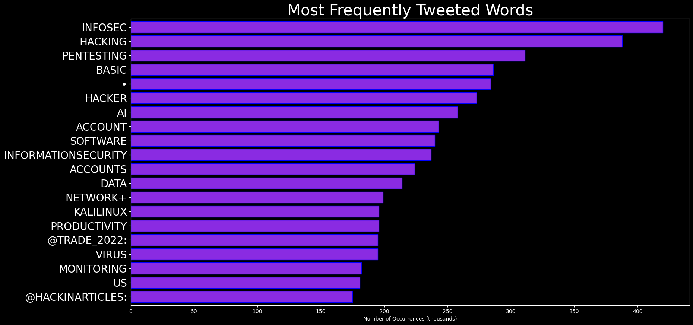

# DARKWIRE SOCIAL CYBER INSIGHTS 
&#x1F34E; **TOPIC = "cybersecurity"**

## AUTOMATED RESEARCH SUMMARY
     

|  Trending  |   Images | 
:-------------------------:|:-------------------------:
|        |   |   
 
 

  
The most popular user is: **ValaAfshar**  
 

## 17 tech of next decade:

1 AI
2 IoT⌚️
3 blockchain⛓
4 3D print🖨
5 5G📡
6 autonomous EV🚗
7 WiFi power🔋
8 robotics🤖
9… https://t.co/5wSq3KwNz7 

  

### TRENDING SHARED IMAGE

|                **Sample-Tweets**        |
| :-------------: |
| RT @HarbRimah: Top Skills that Marketers Need in 2021 https://t.co/nhiAcNK2cv#MachineLearning #DataScience #Python #AI #100DaysOfCode #IoT… |
| RT @WisePaxCat: Fired DHS cybersecurity head says Trump should be convicted for inciting insurrection https://t.co/sRptVbdneY |
| RT @Lago72: #IoT #Security Thread Map #Infographic  HT @ingliguori @thinksysinc#DigitalTransformation #Cloud #MachineLearning #BigData #… |

## RELATED METRICS 
| Metric | Value |
| ------------- | ------------- |
| #1 Most tweeted to  | **HarbRimah** |
| #2 Most tweeted to  | **iotcybersec24** |
| #3 Most tweeted to  | **KevinClarity** |
| NewProfiles (less than 10 days) | 0.2%  |
| Tweeters with < 10 followers  | 1.36%|
| Tweeters with > 1000000 followers  | 0.0%  |

## MOST POPULAR TWEET TERMS 

| Popularity Rank  | Term |
| ------------- | ------------- |
| first  | **MACHINELEARNING**  |
| second  | **AI**  |
| third  | **DATA** |
| fourth  | **DATASCIENCE**  |
| fifth  | **INFOSEC**  |

## Twitter Bio Analysis
### SENTIMENT ANALYSIS

VIEWS WERE : **SUBJECTIVE**  (40.0%) & **NEGATIVELY-SUBJECTIVE** (13.33%) **OBJECTIVE** (46.67%)

### TWEET SAMPLE 
| Random value picked from array |
| ------------- |
|RT @ingliguori: Cognitive #CyberSecurity Framework by @Atos ht @antgrasso via @ingliguori #CognitiveComputing #AI #BigData #DataScience #in… |

### MOST RETWEETED 

| The most retweeted user is: **ValaAfshar**  |
| ------------- |
| 17 tech of next decade:1 AI2 IoT⌚️3 blockchain⛓4 3D print🖨5 5G📡6 autonomous EV🚗7 WiFi power🔋8 robotics🤖9… https://t.co/5wSq3KwNz7 |

# Potential Fake Accounts
 
# C00011011USER INFO

 
`User ScreenName:` C00011011 
 
`User chosen Name:` Cyber_00011011 
 
`Is the User Verified?:` False 
 
`User signup date?:` Wed Jan 20 16:24:04 +0000 2021 
 
`User Description?:` Cybersecurity Advocate | These are my personal tweets. 
 
`Followers?: `1 
 
`Following?:` 18 
 
`User URL?:` None 
 
`Location:`  
 
`Number of tweets extracted`  : 2 
 
`Profile image:` http://pbs.twimg.com/profile_images/1351933848402206724/ua5urNhi_normal.jpg 
 
`Number of tweets excluding replies:` 2 
 

 

 
## User Top tweeted words 
 
**USING** 2 , **CYBERCHEF** 2 , **GREAT** 1 , **WALKTHROUGH** 1 , **VERY** 1 , **HANDY** 1 , **TOOL** 1 , **CYBERSECURITY** 1 , **FOLKS** 1 , **FIRST** 1 , **TIME** 1 , **W…** 1 , **HTTPS://TCO/NGSIUDYQFOJOINING** 1 , **TWITTER!** 1 , 
 
## What this user tweeted
 
Great walkthrough of using CyberChef, a very handy tool for cybersecurity folks. My first time using CyberChef. I w… https://t.co/NGsIudYQfo
 
# realBastionOpsUSER INFO

 
`User ScreenName:` realBastionOps 
 
`User chosen Name:` Z 
 
`Is the User Verified?:` False 
 
`User signup date?:` Mon Jan 11 11:23:59 +0000 2021 
 
`User Description?:`  
 
`Followers?: `1 
 
`Following?:` 88 
 
`User URL?:` None 
 
`Location:`  
 
`Number of tweets extracted`  : 12 
 
`Profile image:` http://abs.twimg.com/sticky/default_profile_images/default_profile_normal.png 
 
`Number of tweets excluding replies:` 12 
 

 

 
## User Top tweeted words 
 
**LINUX** 3 , **@SANSOFFENSIVE:** 2 , **🔴** 2 , **REPOSITORY** 2 , **REDTEAM** 2 , **ANY** 2 , **SOME** 2 , **HACKING** 2 , **USE** 2 , **RT** 1 , **FREE** 1 , **TOOL** 1 , **🛠️** 1 , **SLINGSHOT** 1 , **UBUNTU-BASED** 1 , **DISTRIBUTION** 1 , **CONTAINING** 1 , **40** 1 , **PENTEST** 1 , **TOOLS!** 1 , 
 
## What this user tweeted
 
RT @SANSOffensive: 🔴 Free tool 🔴

🛠️ Slingshot
An Ubuntu-based Linux distribution containing over 40 #pentest tools!

Download here: https:…
 
# CourseBeliUSER INFO

 
`User ScreenName:` CourseBeli 
 
`User chosen Name:` Beli_S 
 
`Is the User Verified?:` False 
 
`User signup date?:` Wed Jan 20 21:15:03 +0000 2021 
 
`User Description?:`  
 
`Followers?: `0 
 
`Following?:` 5 
 
`User URL?:` None 
 
`Location:`  
 
`Number of tweets extracted`  : 3 
 
`Profile image:` http://pbs.twimg.com/profile_images/1352002018739691520/IYLUDoYi_normal.jpg 
 
`Number of tweets excluding replies:` 3 
 

 

 
## User Top tweeted words 
 
**TOOL** 2 , **SN4JS** 1 , **HTTPS://TCO/AVY1JPVOJLRT** 1 , **@ATTCYBER:** 1 , **RECENTLY** 1 , **THREAT** 1 , **ACTORS** 1 , **UTILIZING** 1 , **GOLANG** 1 , **AVOID** 1 , **ANTIVIRUS** 1 , **DETECTION** 1 , **ACT** 1 , **MALWARE** 1 , **LOADER** 1 , **ATT…RT** 1 , **@THECYBERMENTOR:** 1 , **TRACKS** 1 , **PASSWORDS** 1 , **YOU'VE** 1 , 
 
## What this user tweeted
 
RT @attcyber: Recently, threat actors have been utilizing a Golang tool to avoid antivirus detection and act as a #malware loader. Our #ATT…
 
# mottasec_USER INFO

 
`User ScreenName:` mottasec_ 
 
`User chosen Name:` MottaSec 
 
`Is the User Verified?:` False 
 
`User signup date?:` Thu Jan 14 16:10:57 +0000 2021 
 
`User Description?:` A cyber security company based in Greece. Focused on Penetration Testing, Awareness Campaigns and OSINT. 
 
`Followers?: `1 
 
`Following?:` 13 
 
`User URL?:` https://t.co/Mjzm64sOVE 
 
`Location:` Greece 
 
`Number of tweets extracted`  : 4 
 
`Profile image:` http://pbs.twimg.com/profile_images/1349770710659563520/ButYmjbt_normal.jpg 
 
`Number of tweets excluding replies:` 4 
 

 

 
## User Top tweeted words 
 
**CYBER** 1 , **SECURITY** 1 , **DEVICE** 1 , **(MONITORS** 1 , **HOT** 1 , **WATER** 1 , **CONSUMPTION)** 1 , **PUT** 1 , **UNSECURED** 1 , **APARTMENT** 1 , **H…** 1 , **HTTPS://TCO/TFHKVKOD0QPLAYING** 1 , **AROUND** 1 , **AVM** 1 , **ROUTER** 1 , **PLUGGED** 1 , **3** 1 , **CABLES** 1 , **UART** 1 , **PORT** 1 , 
 
## What this user tweeted
 
Cyber security is like this device (monitors hot water consumption)
If you put it unsecured in the apartment, you h… https://t.co/TFhKvkOd0Q
 
# shromannUSER INFO

 
`User ScreenName:` shromann 
 
`User chosen Name:` Shromann Majumder 
 
`Is the User Verified?:` False 
 
`User signup date?:` Tue Jan 19 21:06:52 +0000 2021 
 
`User Description?:`  
 
`Followers?: `1 
 
`Following?:` 8 
 
`User URL?:` None 
 
`Location:`  
 
`Number of tweets extracted`  : 1 
 
`Profile image:` http://pbs.twimg.com/profile_images/1351637391602114560/lJ-I3PPo_normal.jpg 
 
`Number of tweets excluding replies:` 1 
 

 

 
## User Top tweeted words 
 
**RT** 1 , **@OUMGLOBAL:** 1 , **EVOLUTION** 1 , **DATASCIENCE** 1 , **DATASCIENTIST** 1 , **DATAANALYTICS** 1 , **CYBERSECURITY** 1 , **BIGDATA** 1 , **DATAMINING** 1 , **BITCOIN** 1 , **TECH** 1 , **T…** 1 , 
 
## What this user tweeted
 
RT @oumglobal: Evolution Of #Datascience 

When &amp; How 

#DataScientist #DataAnalytics #cybersecurity #bigdata #datamining #bitcoin #tech #t…
 
# YourBusiness60USER INFO

 
`User ScreenName:` YourBusiness60 
 
`User chosen Name:` YourBusinessHour 
 
`Is the User Verified?:` False 
 
`User signup date?:` Sat Jan 16 22:17:35 +0000 2021 
 
`User Description?:` Business Made Easy
Ideas, guides, and information to better your business.
https://t.co/zzfACIt6aj 
 
`Followers?: `17 
 
`Following?:` 3 
 
`User URL?:` https://t.co/HDV6ImLgs2 
 
`Location:`  
 
`Number of tweets extracted`  : 200 
 
`Profile image:` http://pbs.twimg.com/profile_images/1350569136167018497/Eosr-LvU_normal.png 
 
`Number of tweets excluding replies:` 535 
 

 

 
## User Top tweeted words 
 
**BUSINESS** 99 , **ESSAY** 11 , **PAY** 11 , **SUCCESS** 11 , **MARKETING** 11 , **ENTREPRENEUR** 11 , **2021** 9 , **MONEY** 9 , **LAW** 9 , **ONLINE** 8 , **DUE** 8 , **…RT** 8 , **SALES** 8 , **FINANCE** 7 , **MAKE** 7 , **JOIN** 7 , **NEW** 7 , **BIOLOGY** 7 , **LEARN** 7 , **FREE** 7 , 
 
## What this user tweeted
 
RT @PasswordCoach: Browser isolation provides is a fail-safe for those organisations that already have an active program of cybersecurity t…
 
# SendtoJeffSmithUSER INFO

 
`User ScreenName:` SendtoJeffSmith 
 
`User chosen Name:` Jeff Smith 
 
`Is the User Verified?:` False 
 
`User signup date?:` Tue Jan 19 18:15:58 +0000 2021 
 
`User Description?:` IT, Networking, Penetration Testing, Programming 
 
`Followers?: `1 
 
`Following?:` 25 
 
`User URL?:` None 
 
`Location:`  
 
`Number of tweets extracted`  : 3 
 
`Profile image:` http://abs.twimg.com/sticky/default_profile_images/default_profile_normal.png 
 
`Number of tweets excluding replies:` 3 
 

 

 
## User Top tweeted words 
 
**HACKER** 2 , **@DAVIDBOMBAL** 1 , **@ITJUNKIE** 1 , **EXTREMELY** 1 , **USEFUL** 1 , **INFORMATION** 1 , **LEARNED** 1 , **LOTRT** 1 , **@DAVIDBOMBAL:** 1 , **EX-NSA** 1 , **TELLS** 1 , **US** 1 , **INTO** 1 , **HACKING!** 1 , **PATH** 1 , **BECOMING** 1 , **YOUTUBE:** 1 , **HTTPS://TCO/HX0ZMJRMZY…RT** 1 , **@ANGUSREDBLUE:** 1 , **CURRENTLY** 1 , 
 
## What this user tweeted
 
RT @davidbombal: Ex-NSA hacker tells us how to get into hacking! 

This is the path to becoming a hacker.

YouTube: https://t.co/HX0ZmjRMZy…
 
# picknuppenniesUSER INFO

 
`User ScreenName:` picknuppennies 
 
`User chosen Name:` Picknuppennies 
 
`Is the User Verified?:` False 
 
`User signup date?:` Tue Jan 19 03:13:34 +0000 2021 
 
`User Description?:` Penny Stocks R US 
 
`Followers?: `0 
 
`Following?:` 2 
 
`User URL?:` None 
 
`Location:`  
 
`Number of tweets extracted`  : 7 
 
`Profile image:` http://abs.twimg.com/sticky/default_profile_images/default_profile_normal.png 
 
`Number of tweets excluding replies:` 7 
 

 

 
## User Top tweeted words 
 
**✅** 5 , **$CEOS** 2 , **UPDATED** 2 , **COMEING** 2 , **NEW** 2 , **@CRABBERMIKE:** 2 , **$WRFX** 2 , **$UAPC** 2 , **RT** 1 , **@CINDERELLAMAN07:** 1 , **SHROOM** 1 , **PLAY** 1 , **ACTIVE** 1 , **TWITTER** 1 , **AFTER** 1 , **CURRENT** 1 , **SOON** 1 , **MANAGEME…RT** 1 , **PROOF** 1 , **FOLKS** 1 , 
 
## What this user tweeted
 
RT @crabbermike: $WRFX Proof folks, that this monster Management team, with huge experience and connections, is about to tell the story. #C…
 
# Chinmay42200135USER INFO

 
`User ScreenName:` Chinmay42200135 
 
`User chosen Name:` Chinmayee 
 
`Is the User Verified?:` False 
 
`User signup date?:` Wed Jan 20 18:50:28 +0000 2021 
 
`User Description?:`  
 
`Followers?: `1 
 
`Following?:` 3 
 
`User URL?:` None 
 
`Location:`  
 
`Number of tweets extracted`  : 6 
 
`Profile image:` http://pbs.twimg.com/profile_images/1351966128977821697/-YxfUHxa_normal.jpg 
 
`Number of tweets excluding replies:` 6 
 

 

 
## User Top tweeted words 
 
**@HEPTAGONTECH:** 6 , **INFOGRAPHIC** 4 , **AI** 3 , **10** 2 , **DEVOPS** 2 , **IOT** 2 , **VIA** 2 , **DATASCIENCE** 2 , **&GT;&GT;&GT;** 2 , **RT** 1 , **CHECK** 1 , **THESE** 1 , **METRICS** 1 , **NODEJS** 1 , **SOFTWAREDEVELOPER** 1 , **KUBERNETES** 1 , **SOFTWAREDEVELO…RT** 1 , **MOVE** 1 , **CLOUDCOMPUTING?** 1 , **[** 1 , 
 
## What this user tweeted
 
RT @HeptagonTech: #IoT #Security Thread Map #Infographic
Via @ingliguori #Analytics #AI #IIoT #DataScience #IoTPL #DigitalTransformation #C…
 
# tamarapp28USER INFO

 
`User ScreenName:` tamarapp28 
 
`User chosen Name:` tamarapp 
 
`Is the User Verified?:` False 
 
`User signup date?:` Wed Jan 13 17:56:40 +0000 2021 
 
`User Description?:` out of boredom, i made this account😔 
 
`Followers?: `2 
 
`Following?:` 80 
 
`User URL?:` None 
 
`Location:`  
 
`Number of tweets extracted`  : 63 
 
`Profile image:` http://pbs.twimg.com/profile_images/1349425154208661504/B9x93yBK_normal.jpg 
 
`Number of tweets excluding replies:` 65 
 

 

 
## User Top tweeted words 
 
**AKU** 9 , **GAK** 7 , **INI** 6 , **ANAK** 5 , **HARI** 5 , **@SQUIDWARDFESS** 4 , **DI** 4 , **ADA** 4 , **@TWELVIFEBRINA** 4 , **BISA** 3 , **MAU** 3 , **YG** 3 , **BGT** 3 , **KASIH** 3 , **PERCAYA** 3 , **YANG** 3 , **KARENA** 3 , **BIKIN** 3 , **KLO** 2 , **UNTUK** 2 , 
 
## What this user tweeted
 
RT @truecolossus: @Phil_Lewis_ The basis of Cybersecurity really is......'ya'll talk too much'.
 

<b> This report is AUTOMATED and not hand crafted, it is designed for pulling metrics on a given keyword or hashtag and performs a series of reporting and analysis.</b>  
### CONCLUSION & EXTERNAL ANALYSIS

*This is my [Adam McMurchie`s] opinion on the data from the tweets, it serves as no objective truth.Since the tweets themselves are a mixture of fact & opinion. 
Authors analytical summary on request.
**RECOMMENDATIONS** WILL BE UPDATED IN NEXT  24 HOURS  