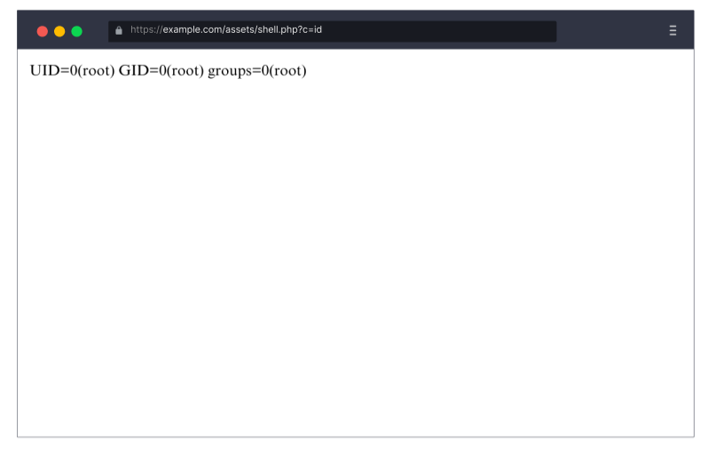

# DARKWIRE SOCIAL CYBER INSIGHTS 
&#x1F34E; **TOPIC = "vulnerabilities"**

## AUTOMATED RESEARCH SUMMARY
     

|  Trending  |   Images | 
:-------------------------:|:-------------------------:
|        |   |   
 
 

  
The most popular user is: **QuaiNetwork**  
 

## Quai Network's developers are focused on making the core codebase as light-weight and efficient as possible.

This… https://t.co/9kCO6ugG3G 

  

### TRENDING SHARED IMAGE

|                **Sample-Tweets**        |
| :-------------: |
| After the Uber Breach: 3 Questions All CISOs Should Ask Themselves https://t.co/YpEuooGUfo |
| Far from a shock, Southwest meltdown was 'perfect storm' of well-known vulnerabilities https://t.co/YnaTUgRQq1 |
| RT @PeculiarHype: Forget the vulnerabilities that comes with it, love is a beautiful feeling. 💛 |

## RELATED METRICS 
| Metric | Value |
| ------------- | ------------- |
| #1 Most tweeted to  | **hackinarticles** |
| #2 Most tweeted to  | **matthew_d_green** |
| #3 Most tweeted to  | **ReenaGi42585383** |
| NewProfiles (less than 10 days) | 0.92%  |
| Tweeters with < 10 followers  | 6.18%|
| Tweeters with > 1000000 followers  | 0.38%  |

## MOST POPULAR TWEET TERMS 

| Popularity Rank  | Term |
| ------------- | ------------- |
| first  | **VULNERABILITIES**  |
| second  | **INFOSEC**  |
| third  | **PENTESTING** |
| fourth  | **CYBERSECURITYTIPS**  |
| fifth  | **OSCP**  |

## Twitter Bio Analysis
### SENTIMENT ANALYSIS

VIEWS WERE : **SUBJECTIVE**  (6.67%) & **NEGATIVELY-SUBJECTIVE** (13.33%) **OBJECTIVE** (80.0%)

### TWEET SAMPLE 
| Random value picked from array |
| ------------- |
|RT @RachelFrazin: Power outages have hit so many parts of the U.S. lately amid extreme weather, showing that our system isn't prepared for… |

### MOST RETWEETED 

| The most retweeted user is: **QuaiNetwork**  |
| ------------- |
| Quai Network's developers are focused on making the core codebase as light-weight and efficient as possible.This… https://t.co/9kCO6ugG3G |

# Potential Fake Accounts
 
# kheeng_legendUSER INFO

 
`User ScreenName:` kheeng_legend 
 
`User chosen Name:` Kheeng Legend 
 
`Is the User Verified?:` False 
 
`User signup date?:` Thu Dec 29 08:46:41 +0000 2022 
 
`User Description?:` just on God 
 
`Followers?: `0 
 
`Following?:` 13 
 
`User URL?:` None 
 
`Location:`  
 
`Number of tweets extracted`  : 21 
 
`Profile image:` http://pbs.twimg.com/profile_images/1608384070962085889/bGXKgRb3_normal.jpg 
 
`Number of tweets excluding replies:` 21 
 

 

 
## User Top tweeted words 
 
**ACCOUNT** 10 , **INBOX** 9 , **CONTA** 7 , **VOCÊ** 5 , **DE** 5 , **SNAPCHAT** 5 , **HACKED** 5 , **ESTOU** 4 , **SUA** 4 , **UMA** 4 , **MENSAGEM** 4 , **HACKING** 4 , **SE** 3 , **RECUPERAR** 3 , **INSTAGRAM** 3 , **24/7** 3 , **I'M** 3 , **NÃO** 3 , **É** 3 , **RECOVER** 3 , 
 
## What this user tweeted
 
Linux Path Cheat Sheet inbox now
#infosec #cybersecurity #cybe
rsecuritytips  #pentesting #oscp… https://t.co/R5LHPC3oLa
 
# c_ryancsUSER INFO

 
`User ScreenName:` c_ryancs 
 
`User chosen Name:` RyanC 
 
`Is the User Verified?:` False 
 
`User signup date?:` Tue Dec 27 22:12:45 +0000 2022 
 
`User Description?:` #bugbounty hunter / penetration tester , eWAPTX / eWAPT / eJPT 💻 
 
`Followers?: `0 
 
`Following?:` 30 
 
`User URL?:` None 
 
`Location:` Egypt 
 
`Number of tweets extracted`  : 162 
 
`Profile image:` http://pbs.twimg.com/profile_images/1608527592990064641/0DC4i1lr_normal.jpg 
 
`Number of tweets excluding replies:` 162 
 

 

 
## User Top tweeted words 
 
**@0X0SOJALSEC:** 29 , **XSS** 23 , **BUGBOUNTY** 21 , **CYBERSECURITY** 20 , **BUGBOUNTYTIPS** 18 , **BYPASS** 16 , **INFOSEC** 15 , **:** 14 , **HACKING** 12 , **1** 11 , **PAYLOAD** 11 , **@NANDANLOHITAKSH:** 10 , **FILE** 10 , **•** 10 , **GITHUB** 9 , **LINUX** 9 , **2** 9 , **RECON** 8 , **@MANIESHNEUPANE:** 8 , **@KITPLOIT:** 8 , 
 
## What this user tweeted
 
RT @Aacle_: Top 10 Exploited Vulnerabilities in 2022 https://t.co/U2euRAa1DKRT @hacker_content: 10 types of web vulnerabilities that are often missed 

🐞 HTTP/2 Smuggling
🐛 XXE via Office Open XML Parsers
🐜 SSRF via…RT @nav1n0x: Wish this is not the last #Log4Shell RCE of 2022. Happy that, I earned more bounties and P1s in Log4Shell than any other vulne…RT @ReconOne_bk: Did anyone say tools?

Intercept traffic - @Burp_Suite  or @zaproxy
Detect vulnerabilities - @pdnuclei 
Perform asset disc…RT @ReconOne_bk: [Oh noo] Two new #0day vulnerabilities affecting Microsoft Exchange Server (CVE-2022-41040, CVE-2022-41082) exploited in t…RT @0x0SojalSec: How to find local file read vulnerabilities based on cookies : by @jae_hak99 
#bugbountytips #cybersec #infosecurity https…RT @akaclandestine: GitHub - 0xd3vil/WP-Vulnerabilities-Exploits: Huge Collection of Wordpress Exploits and CVES https://t.co/94xzJTN7UT
 
# Turnader8USER INFO

 
`User ScreenName:` Turnader8 
 
`User chosen Name:` Turnader 
 
`Is the User Verified?:` False 
 
`User signup date?:` Mon Dec 26 02:49:59 +0000 2022 
 
`User Description?:` The 88th
The Man I ONcE Was Is Dead. 
 
`Followers?: `29 
 
`Following?:` 239 
 
`User URL?:` None 
 
`Location:`  
 
`Number of tweets extracted`  : 196 
 
`Profile image:` http://pbs.twimg.com/profile_images/1607277877531185155/3OZT1sz7_normal.jpg 
 
`Number of tweets excluding replies:` 670 
 

 

 
## User Top tweeted words 
 
**US** 19 , **@44MAGNUMBLUE1:** 14 , **MARINE** 12 , **DECEMBER** 11 , **KILLED** 10 , **ACTION** 9 , **ARMY** 9 , **DURING** 8 , **FIRST** 8 , **LIFE** 7 , **SOME** 7 , **YEAR** 7 , **MARINES** 7 , **PRIVATE** 7 , **CLASS** 7 , **SOUTH** 7 , **CORPS** 6 , **GREAT** 6 , **SQUADRON** 6 , **UNITED** 6 , 
 
## What this user tweeted
 
RT @CISACyber: 🚩@CISAgov just added 2 🆕 CVEs to its Known Exploited Vulnerabilities Catalog. Stay up to date on the latest additions and pr…
 
# ReinVerseNationUSER INFO

 
`User ScreenName:` ReinVerseNation 
 
`User chosen Name:` Quotes Motiva 
 
`Is the User Verified?:` False 
 
`User signup date?:` Wed Dec 28 08:12:38 +0000 2022 
 
`User Description?:` https://t.co/HwD7TjvhCS
https://t.co/EkkR4BLhqW
https://t.co/hSJYk6NTVE 
 
`Followers?: `10 
 
`Following?:` 117 
 
`User URL?:` https://t.co/hSJYk6NTVE 
 
`Location:`  
 
`Number of tweets extracted`  : 7 
 
`Profile image:` http://pbs.twimg.com/profile_images/1608014016026402816/u03MP_MF_normal.jpg 
 
`Number of tweets excluding replies:` 7 
 

 

 
## User Top tweeted words 
 
**@ML_PHILOSOPHY** 1 , **"OUT** 1 , **VULNERABILITIES** 1 , **COME** 1 , **STRENGTH"** 1 , **-FREUD-** 1 , **HTTPS://TCO/J4TURQGNKK** 1 , **HTTPS://TCO/IA77EJIRLGSTORY** 1 , **QUOTES:** 1 , **HTTPS://TCO/EGJNAE1EC8JAREDLETO** 1 , **JOKER** 1 , **SHORTS** 1 , **HTTPS://TCO/KCY04POWNI** 1 , **HTTPS://TCO/BDRW2AY3GD@BRAVENSOFFICIAL** 1 , **HTTPS://TCO/5HFEUIAJDLHTTPS://TCO/U6UMUUF9YCHTTPS://TCO/YH2TZERWGI** 1 , **THOMASSHELBY** 1 , **QUOTEOFTHEDAY** 1 , **QUOTES** 1 , **QUOTE** 1 , **PEAKYBLINDERS** 1 , 
 
## What this user tweeted
 
@ML_Philosophy "Out of your vulnerabilities will come your strength"
-Freud-
https://t.co/j4TurQGnkK https://t.co/IA77EJIrLg
 
# iskandermagnUSER INFO

 
`User ScreenName:` iskandermagn 
 
`User chosen Name:` Iskander Magnus 
 
`Is the User Verified?:` False 
 
`User signup date?:` Fri Dec 23 06:14:10 +0000 2022 
 
`User Description?:`  
 
`Followers?: `1 
 
`Following?:` 59 
 
`User URL?:` None 
 
`Location:` Doha, Qatar 
 
`Number of tweets extracted`  : 13 
 
`Profile image:` http://pbs.twimg.com/profile_images/1606174362192707587/TyRapn4q_normal.jpg 
 
`Number of tweets excluding replies:` 13 
 

 

 
## User Top tweeted words 
 
**ROADMAP** 3 , **AI** 3 , **LINUX** 3 , **LEARN** 3 , **@HACKINARTICLES:** 2 , **PYTHON** 2 , **CHEAT** 2 , **SHEET** 2 , **DEVELOPER** 2 , **TOOLS** 2 , **@FREECODECAMP:** 2 , **HERE** 2 , **USE** 2 , **RT** 1 , **BEGINNERS** 1 , **DEVOPS** 1 , **PROGRAMMER** 1 , **PROGRAMMING** 1 , **CODING** 1 , **CODE** 1 , 
 
## What this user tweeted
 
RT @hackinarticles: Hacking Tools Cheat Sheet

#infosec #cybersecurity #cybersecuritytips #pentesting #oscp #redteam #informationsecurity #…
 
# Squid_SecUSER INFO

 
`User ScreenName:` Squid_Sec 
 
`User chosen Name:` SQUID SEC 
 
`Is the User Verified?:` False 
 
`User signup date?:` Wed Dec 21 20:38:50 +0000 2022 
 
`User Description?:` Squid Sec provides custom built cyber security tools and blog posts 
 
`Followers?: `24 
 
`Following?:` 93 
 
`User URL?:` https://t.co/JYwYLuplmD 
 
`Location:`  
 
`Number of tweets extracted`  : 11 
 
`Profile image:` http://pbs.twimg.com/profile_images/1605939765538349064/aJHTDqsm_normal.jpg 
 
`Number of tweets excluding replies:` 11 
 

 

 
## User Top tweeted words 
 
**DETECTING** 2 , **DOESN'T** 2 , **PROPER** 2 , **DEPLOYMENT** 2 , **SIMPLEST** 2 , **TOOLS** 2 , **MAKE** 2 , **DIFFERENCE** 2 , **@DOTNETRUSSELL:** 2 , **GREAT** 1 , **PRIMER** 1 , **OSINT** 1 , **@DOINGFEDTIME** 1 , **HEARTBLEED** 1 , **SECURITY** 1 , **INFOSEC** 1 , **CYBERSECURITY** 1 , **REDTEAM…** 1 , **HTTPS://TCO/TSAMMPDSJ0ONE** 1 , **MOST** 1 , 
 
## What this user tweeted
 
One of the most gratifying vulnerabilities I find on a regular basis is "Insecure Direct Object References" or "IDO… https://t.co/qxGFFVePs6Just because
- Everyone uses it
- It's open source
- It's been out forever 

Doesn't mean it doesn't have vulnerabi… https://t.co/8dPiVXY9oA
 
# sicarmarshgrandUSER INFO

 
`User ScreenName:` sicarmarshgrand 
 
`User chosen Name:` sicarmarshgrandhotel 
 
`Is the User Verified?:` False 
 
`User signup date?:` Tue Dec 27 13:42:12 +0000 2022 
 
`User Description?:`  
 
`Followers?: `5 
 
`Following?:` 165 
 
`User URL?:` None 
 
`Location:`  
 
`Number of tweets extracted`  : 26 
 
`Profile image:` http://pbs.twimg.com/profile_images/1607734041343565827/no09XcOE_normal.jpg 
 
`Number of tweets excluding replies:` 26 
 

 

 
## User Top tweeted words 
 
**DE** 14 , **LE** 9 , **LA** 6 , **@BRVM_UEMOA:** 5 , **@FINANCE_SIKA:** 4 , **@MERCER_INV:** 4 , **@CI_ORANGE** 3 , **COTEDIVOIRE** 3 , **PREMIÈRE** 3 , **COTATION** 3 , **2022** 3 , **EN** 3 , **:** 3 , **@MARSHMCLENNAN:** 3 , **LES** 3 , **BRVMAVIS** 2 , **CONSULTEZ** 2 , **BULLETIN** 2 , **OFFICIEL** 2 , **COTE** 2 , 
 
## What this user tweeted
 
RT @MarshMcLennan: #Health systems are challenged by ecosystem fragmentation &amp; misaligned incentives. Creating connectivity enables #health…
 
# JasonMishakeUSER INFO

 
`User ScreenName:` JasonMishake 
 
`User chosen Name:` Jason Mishake 
 
`Is the User Verified?:` False 
 
`User signup date?:` Wed Dec 28 19:34:19 +0000 2022 
 
`User Description?:` Characters of a good man is love, trust, kind hearted and loyal to your partner 
 
`Followers?: `5 
 
`Following?:` 23 
 
`User URL?:` None 
 
`Location:` Yemen 
 
`Number of tweets extracted`  : 133 
 
`Profile image:` http://pbs.twimg.com/profile_images/1608184591176671233/VgOO2UnS_normal.jpg 
 
`Number of tweets excluding replies:` 133 
 

 

 
## User Top tweeted words 
 
**@ELONMUSK** 28 , **@RAINMAKER1973** 23 , **REALLY** 8 , **SOLAR** 8 , **TIME** 7 , **@ELONMUSK:** 7 , **US** 6 , **LOVE** 6 , **2022** 5 , **@EVAFOXU** 5 , **COST** 5 , **BUILD** 5 , **@JONCOOPERTWEETS:** 5 , **@TAYLORRMARSHALL:** 5 , **@POTUS:** 5 , **@CNNBRK:** 4 , **WORST** 4 , **DECEMBER** 4 , **NEW** 4 , **I’M** 4 , 
 
## What this user tweeted
 
RT @thumper777_gold: @elonmusk @Rainmaker1973 So many things to consider.  For one the consolidation of power means one target to malicious…
 
# VivekKumarinsa1USER INFO

 
`User ScreenName:` VivekKumarinsa1 
 
`User chosen Name:` Vivek Kumar insan 
 
`Is the User Verified?:` False 
 
`User signup date?:` Mon Dec 26 15:10:58 +0000 2022 
 
`User Description?:`  
 
`Followers?: `6 
 
`Following?:` 8 
 
`User URL?:` None 
 
`Location:`  
 
`Number of tweets extracted`  : 200 
 
`Profile image:` http://pbs.twimg.com/profile_images/1607403430401945600/B1zU_Sxh_normal.jpg 
 
`Number of tweets excluding replies:` 2235 
 

 

 
## User Top tweeted words 
 
**WINTER** 102 , **PEOPLE** 92 , **DERA** 78 , **SACHA** 76 , **SAINT** 73 , **SAUDA** 68 , **WINTERCARE** 65 , **CLOTHES** 64 , **SEASON** 53 , **WARM** 53 , **JI** 53 , **RAM** 51 , **RAHIM** 49 , **VOLUNTEERS** 45 , **MANY** 33 , **के** 29 , **@GURMEETRAMRAHIM** 27 , **NEEDY** 26 , **POOR** 23 , **INSPIRATION** 23 , 
 
## What this user tweeted
 
RT @ReenaGi42585383: Winters are not so cozy for those who live on roads.Every drop in temperature elevates their sufferings.Dera Sacha Sau…
 
# Web3AssamUSER INFO

 
`User ScreenName:` Web3Assam 
 
`User chosen Name:` Web3Assam 
 
`Is the User Verified?:` False 
 
`User signup date?:` Tue Dec 20 10:47:42 +0000 2022 
 
`User Description?:` Buidling #Web3Community in #Assam 🚀🚀🚀

Open for Collab!! DM🚀 
 
`Followers?: `21 
 
`Following?:` 68 
 
`User URL?:` None 
 
`Location:` Assam, India 
 
`Number of tweets extracted`  : 13 
 
`Profile image:` http://pbs.twimg.com/profile_images/1605248737571270662/tX7UVyK5_normal.jpg 
 
`Number of tweets excluding replies:` 13 
 

 

 
## User Top tweeted words 
 
**WEB3** 3 , **NEW** 2 , **CHECK** 2 , **HOLIDAYS** 2 , **ASSAM** 2 , **WEEK** 2 , **WORKING** 2 , **BLOCKCHAIN** 2 , **RT** 1 , **@KONNEKTRHQ:** 1 , **WEB** 1 , **30** 1 , **EITHER** 1 , **GOING** 1 , **CREATE** 1 , **EFFICIENT** 1 , **SECURE** 1 , **ONLINE** 1 , **EXPERIENCE** 1 , **OPEN** 1 , 
 
## What this user tweeted
 
RT @konnektrHQ: Web 3.0 is either going to create a more efficient and secure online experience, or open up new vulnerabilities and risks.
 
# NituKum85376256USER INFO

 
`User ScreenName:` NituKum85376256 
 
`User chosen Name:` Nitu Kumar 
 
`Is the User Verified?:` False 
 
`User signup date?:` Thu Dec 29 08:00:29 +0000 2022 
 
`User Description?:`  
 
`Followers?: `12 
 
`Following?:` 4 
 
`User URL?:` None 
 
`Location:`  
 
`Number of tweets extracted`  : 199 
 
`Profile image:` http://pbs.twimg.com/profile_images/1608372369189670913/RQQWf3Pb_normal.png 
 
`Number of tweets excluding replies:` 292 
 

 

 
## User Top tweeted words 
 
**CANCEL_BSSC_CGL_3_ALL_SHIFT** 128 , **SHIFT** 127 , **CANCEL** 99 , **BSSC** 69 , **CGL** 51 , **EXAM** 48 , **3** 47 , **@NITISHKUMAR** 38 , **@YADAVTEJASHWI** 35 , **PLEASE** 27 , **CANCEL_BSSC_CGL3_ALL_SHIFT** 26 , **QUESTION** 21 , **@OFFICECMBIHAR** 20 , **PAPER** 20 , **SHIFTS** 15 , **BIHAR** 12 , **PROOF** 12 , **JUSTICE** 12 , **2ND** 11 , **LEAK** 10 , 
 
## What this user tweeted
 
RT @WPSecScanner: 💥 Sign-up and scan your WordPress website for Vulnerabilities and Cyber Security problems: https://t.co/KDu9sQnYVg https:…
 
# SP30YFALLOKUSER INFO

 
`User ScreenName:` SP30YFALLOK 
 
`User chosen Name:` Blow to cassette after reset 
 
`Is the User Verified?:` False 
 
`User signup date?:` Tue Dec 27 06:51:19 +0000 2022 
 
`User Description?:` restart:
batocera Linux is fun! Steam deck is the new strongest gaming machine!　AYANEO is the ultimate gaming UMPC! 
 
`Followers?: `25 
 
`Following?:` 60 
 
`User URL?:` None 
 
`Location:` A beautiful true Dragonland 
 
`Number of tweets extracted`  : 152 
 
`Profile image:` http://pbs.twimg.com/profile_images/1607801777797332995/6EX3numZ_normal.jpg 
 
`Number of tweets excluding replies:` 154 
 

 

 
## User Top tweeted words 
 
**STEAM** 20 , **@ROOM15923529:** 10 , **DECK** 10 , **STEAMDECK** 7 , **GAME** 6 , **!** 6 , **NEW** 5 , **"RETRO** 5 , **@HIGH_BEAM_JP:** 5 , **HANDHELD** 4 , **BATOCERA** 4 , **MADE** 4 , **MIYOO** 4 , **@ETLANZ:** 4 , **@0_GAME_IT:** 4 , **●** 4 , **BREAKER"** 4 , **@TVKENICHI04:** 3 , **@RETROGAMECORPS:** 3 , **AFTER** 3 , 
 
## What this user tweeted
 
RT @ubuntu: How do we deal with vulnerabilities in #opensource? 
Hear more from Henry Coggill on January 4 in our first webinar of 2023:
ht…
 
# Gautam91324546USER INFO

 
`User ScreenName:` Gautam91324546 
 
`User chosen Name:` Gautam 
 
`Is the User Verified?:` False 
 
`User signup date?:` Wed Dec 21 06:22:08 +0000 2022 
 
`User Description?:`  
 
`Followers?: `20 
 
`Following?:` 10 
 
`User URL?:` None 
 
`Location:`  
 
`Number of tweets extracted`  : 200 
 
`Profile image:` http://pbs.twimg.com/profile_images/1605448680970280961/7mPEn7q8_normal.jpg 
 
`Number of tweets excluding replies:` 6506 
 

 

 
## User Top tweeted words 
 
**WINTER** 86 , **DERA** 69 , **PEOPLE** 67 , **SACHA** 67 , **CLOTHES** 66 , **WINTERCARE** 58 , **SAUDA** 57 , **के** 55 , **SAINT** 54 , **SEASON** 49 , **JI** 46 , **RAM** 40 , **RAHIM** 40 , **WARM** 40 , **VOLUNTEERS** 31 , **HELP** 28 , **@GURMEETRAMRAHIM** 28 , **NEEDY** 26 , **MANY** 23 , **में** 22 , 
 
## What this user tweeted
 
RT @ReenaGi42585383: Winters are not so cozy for those who live on roads.Every drop in temperature elevates their sufferings.Dera Sacha Sau…
 
# LinusMicheal7USER INFO

 
`User ScreenName:` LinusMicheal7 
 
`User chosen Name:` Linus Micheal 
 
`Is the User Verified?:` False 
 
`User signup date?:` Tue Dec 27 18:45:39 +0000 2022 
 
`User Description?:` Qualys Certified Vulnerability Management Analyst 
 
`Followers?: `3 
 
`Following?:` 88 
 
`User URL?:` None 
 
`Location:`  
 
`Number of tweets extracted`  : 6 
 
`Profile image:` http://pbs.twimg.com/profile_images/1607810129679863810/VOrB8Hh5_normal.jpg 
 
`Number of tweets excluding replies:` 6 
 

 

 
## User Top tweeted words 
 
**CYBER** 2 , **PREVENT** 1 , **DETER** 1 , **DEFLECT** 1 , **MITIGATE** 1 , **DETECT** 1 , **RECOVER** 1 , **TALKING** 1 , **TOMORROW** 1 , **GOODNIGHT** 1 , **FELLAS@IRETEEH** 1 , **CONTINUOUS** 1 , **MONITORING** 1 , **LEVELS😂💪💯@JOSHUAVICTORA** 1 , **@IRETEEH** 1 , **BRO** 1 , **DON'T** 1 , **NECESSARILY** 1 , **NEED** 1 , **CERTIFICATION** 1 , 
 
## What this user tweeted
 
How do vulnerabilities expose your network to danger?  Cybercriminals have realized the monetary payback of vulnera… https://t.co/N87LZrDunN
 
# CygnSecurityUSER INFO

 
`User ScreenName:` CygnSecurity 
 
`User chosen Name:` Cygn 
 
`Is the User Verified?:` False 
 
`User signup date?:` Sat Dec 24 08:10:51 +0000 2022 
 
`User Description?:` We take care of your Cybersecurity! 
 
`Followers?: `2 
 
`Following?:` 1 
 
`User URL?:` https://t.co/wMpY0YjkGt 
 
`Location:` World 
 
`Number of tweets extracted`  : 19 
 
`Profile image:` http://pbs.twimg.com/profile_images/1606563104120356865/VPt08AiS_normal.jpg 
 
`Number of tweets excluding replies:` 19 
 

 

 
## User Top tweeted words 
 
**DATA** 10 , **PASSWORDS** 5 , **BREACH** 4 , **EMAIL** 4 , **BREACHES** 3 , **PROTECT** 3 , **COMPANY** 3 , ***** 3 , **USE** 3 , **SENSITIVE** 3 , **INFORMATION** 3 , **COMMON** 3 , **KEEP** 3 , **EMAILS** 3 , **BREACH?** 2 , **CUSTOMERS** 2 , **BUSINESSES** 2 , **STRONG** 2 , **CONSEQUENCES** 2 , **DISCLOSURE** 2 , 
 
## What this user tweeted
 
6/ Finally, be sure to keep all your software and devices up to date with the latest security patches and updates.… https://t.co/ZyBV9sXBll
 
# grandanemoUSER INFO

 
`User ScreenName:` grandanemo 
 
`User chosen Name:` ╰ 𝙹𝙴𝙰𝙽 ⸺ 
 
`Is the User Verified?:` False 
 
`User signup date?:` Wed Dec 28 15:46:36 +0000 2022 
 
`User Description?:` 𝑤𝑖𝑛𝑑 𝑏𝑙𝑜𝑤𝑠. 
 
`Followers?: `101 
 
`Following?:` 112 
 
`User URL?:` None 
 
`Location:` mdni. (N)SFW mun is +20 
 
`Number of tweets extracted`  : 161 
 
`Profile image:` http://pbs.twimg.com/profile_images/1608128216358703106/rEC_EPRH_normal.png 
 
`Number of tweets excluding replies:` 239 
 

 

 
## User Top tweeted words 
 
**?** 25 , **!** 20 , **I'M** 15 , **/** 11 , **(** 8 , **JEAN** 7 , **"** 7 , **DILUC** 6 , **KAEYA** 6 , **FEEL** 5 , **DON'T** 5 , **TIME** 5 , **SOME** 5 , **)** 5 , **WAY** 4 , **LOVE** 4 , **VERY** 4 , **TWITTER** 4 , **ISN'T** 4 , **YOU'RE** 4 , 
 
## What this user tweeted
 
Good, we don't laugh at people's vulnerabilities. https://t.co/ZsUUt4PRFw
 
# consencrypto__USER INFO

 
`User ScreenName:` consencrypto__ 
 
`User chosen Name:` consencrypto__ 
 
`Is the User Verified?:` False 
 
`User signup date?:` Thu Dec 29 02:42:20 +0000 2022 
 
`User Description?:` Welome to the official page of ConsenCrypto.
Here you will find all about Smart Contracts, Project Auditing, development and moderation. 
 
`Followers?: `4967 
 
`Following?:` 19 
 
`User URL?:` https://t.co/3TIDP2ujFv 
 
`Location:`  
 
`Number of tweets extracted`  : 1 
 
`Profile image:` http://pbs.twimg.com/profile_images/1608294581803823104/zM0LvEFC_normal.jpg 
 
`Number of tweets excluding replies:` 1 
 

 

 
## User Top tweeted words 
 
**✅** 1 , **CONSENCRYPTO** 1 , **AUDIT** 1 , **FOUND** 1 , **VULNERABILITIES** 1 , **BACKDOORS** 1 , **ANY** 1 , **SCAM** 1 , **SCRIPTS** 1 , **PROJECT** 1 , **BELOW:** 1 , **🌐** 1 , **ASCO** 1 , **-…** 1 , **HTTPS://TCO/4BW1LUYK9T** 1 , 
 
## What this user tweeted
 
✅ #ConsenCrypto #audit found no vulnerabilities, backdoors or any scam scripts on the project below:

🌐 ASCO -… https://t.co/4bw1lUyk9T
 
# MadMmax20816USER INFO

 
`User ScreenName:` MadMmax20816 
 
`User chosen Name:` mad max 
 
`Is the User Verified?:` False 
 
`User signup date?:` Fri Dec 23 10:37:26 +0000 2022 
 
`User Description?:` Cyber security | Ethical hacker | Bug hunter.. human 😁 
 
`Followers?: `3 
 
`Following?:` 156 
 
`User URL?:` None 
 
`Location:`  
 
`Number of tweets extracted`  : 10 
 
`Profile image:` http://pbs.twimg.com/profile_images/1607625867999739905/il5_B36S_normal.jpg 
 
`Number of tweets excluding replies:` 10 
 

 

 
## User Top tweeted words 
 
**BUG** 7 , **BOUNTY** 5 , **HEY** 3 , **START** 2 , **LEARNING** 2 , **TIME** 2 , **NEW** 2 , **WHAT’S** 2 , **REAL** 2 , **@ELONMUSK** 1 , **IMPLEMENTING** 1 , **NEURALINK** 1 , **HUMANS** 1 , **SURETY** 1 , **GIVE** 1 , **DOES** 1 , **BREACH** 1 , **PERSON…** 1 , **HTTPS://TCO/EGJJA4TJHB@INTIGRITI** 1 , **PLACING** 1 , 
 
## What this user tweeted
 
What time it took for you to get your first bug bounty i believe  that it’s not easy to find vulnerabilities and ge… https://t.co/kJCCRekPqo
 
# mhbanna000USER INFO

 
`User ScreenName:` mhbanna000 
 
`User chosen Name:` mhbanna000 
 
`Is the User Verified?:` False 
 
`User signup date?:` Sun Dec 25 01:58:08 +0000 2022 
 
`User Description?:`  
 
`Followers?: `7 
 
`Following?:` 22 
 
`User URL?:` None 
 
`Location:`  
 
`Number of tweets extracted`  : 20 
 
`Profile image:` http://pbs.twimg.com/profile_images/1606831785673101312/Maexuz1y_normal.jpg 
 
`Number of tweets excluding replies:` 20 
 

 

 
## User Top tweeted words 
 
**1** 4 , **🎁** 4 , **$VOLT** 3 , **TOKEN** 3 , **FOLLOW** 3 , **1000** 3 , **SHARE** 2 , **@BULBULI815** 2 , **GIVEAWAY** 2 , **12** 2 , **RETWEET** 2 , **2** 2 , **3** 2 , **POST** 2 , **@HASANUL900** 2 , **LAST** 2 , **$500** 2 , **🍌** 2 , **CRYPTOMAS** 2 , **CHRISTMAS** 2 , 
 
## What this user tweeted
 
@BTSE_Official $VOLT voltinu token. because $VOLT has many advantages, including:
1. Safe and Secure
$VOLT has alre… https://t.co/luGLRJYY89
 
# anil12715680USER INFO

 
`User ScreenName:` anil12715680 
 
`User chosen Name:` anil 
 
`Is the User Verified?:` False 
 
`User signup date?:` Thu Dec 22 02:40:39 +0000 2022 
 
`User Description?:`  
 
`Followers?: `1 
 
`Following?:` 1 
 
`User URL?:` None 
 
`Location:`  
 
`Number of tweets extracted`  : 200 
 
`Profile image:` http://abs.twimg.com/sticky/default_profile_images/default_profile_normal.png 
 
`Number of tweets excluding replies:` 1656 
 

 

 
## User Top tweeted words 
 
**WINTER** 114 , **PEOPLE** 108 , **CLOTHES** 71 , **SEASON** 66 , **DERA** 62 , **WARM** 62 , **SACHA** 60 , **WINTERCARE** 51 , **SAINT** 49 , **SAUDA** 49 , **RAM** 40 , **MANY** 39 , **RAHIM** 38 , **JI** 37 , **VOLUNTEERS** 31 , **POOR** 31 , **NEEDY** 24 , **HOMELESS** 22 , **DAY** 20 , **SOME** 18 , 
 
## What this user tweeted
 
RT @ReenaGi42585383: Winters are not so cozy for those who live on roads.Every drop in temperature elevates their sufferings.Dera Sacha Sau…
 
# mhbanna62USER INFO

 
`User ScreenName:` mhbanna62 
 
`User chosen Name:` mhbanna 
 
`Is the User Verified?:` False 
 
`User signup date?:` Sat Dec 24 18:25:27 +0000 2022 
 
`User Description?:`  
 
`Followers?: `9 
 
`Following?:` 28 
 
`User URL?:` None 
 
`Location:`  
 
`Number of tweets extracted`  : 19 
 
`Profile image:` http://pbs.twimg.com/profile_images/1606717860621221889/HFZxoB1P_normal.jpg 
 
`Number of tweets excluding replies:` 19 
 

 

 
## User Top tweeted words 
 
**1** 4 , **🎁** 4 , **$VOLT** 3 , **TOKEN** 3 , **FOLLOW** 3 , **1000** 3 , **SHARE** 2 , **GIVEAWAY** 2 , **12** 2 , **RETWEET** 2 , **2** 2 , **POST** 2 , **LAST** 2 , **$500** 2 , **🍌** 2 , **CRYPTOMAS** 2 , **CHRISTMAS** 2 , **@BTSE_OFFICIAL** 1 , **VOLTINU** 1 , **MANY** 1 , 
 
## What this user tweeted
 
@BTSE_Official $VOLT voltinu token. because $VOLT has many advantages, including:
1. Safe and Secure
$VOLT has alre… https://t.co/wU2nQadaNc
 
# godiban7USER INFO

 
`User ScreenName:` godiban7 
 
`User chosen Name:` godiban7 
 
`Is the User Verified?:` False 
 
`User signup date?:` Sat Dec 24 16:44:21 +0000 2022 
 
`User Description?:` يظن الناس بي خيرا وإني لشر الناس ان لم تعف عني. 
 
`Followers?: `12 
 
`Following?:` 24 
 
`User URL?:` None 
 
`Location:`  
 
`Number of tweets extracted`  : 18 
 
`Profile image:` http://pbs.twimg.com/profile_images/1606692366802616321/Ou0ZIqaV_normal.jpg 
 
`Number of tweets excluding replies:` 18 
 

 

 
## User Top tweeted words 
 
**1** 5 , **🎁** 4 , **$VOLT** 3 , **TOKEN** 3 , **2** 3 , **FOLLOW** 3 , **B** 2 , **3** 2 , **E** 2 , **4** 2 , **C** 2 , **5** 2 , **D** 2 , **@FUASTIAWAN** 2 , **@JAMYIES** 2 , **MAGICCRAFTRT** 2 , **12** 2 , **RETWEET** 2 , **POST** 2 , **$500** 2 , 
 
## What this user tweeted
 
@BTSE_Official $VOLT voltinu token. because $VOLT has many advantages, including:
1. Safe and Secure
$VOLT has alre… https://t.co/Oyg2WHD2kB
 
# ketafada1USER INFO

 
`User ScreenName:` ketafada1 
 
`User chosen Name:` ketafada 
 
`Is the User Verified?:` False 
 
`User signup date?:` Sat Dec 24 16:32:04 +0000 2022 
 
`User Description?:`  
 
`Followers?: `13 
 
`Following?:` 27 
 
`User URL?:` None 
 
`Location:`  
 
`Number of tweets extracted`  : 18 
 
`Profile image:` http://pbs.twimg.com/profile_images/1606689349432922112/swexLh6A_normal.jpg 
 
`Number of tweets excluding replies:` 18 
 

 

 
## User Top tweeted words 
 
**1** 4 , **🎁** 4 , **$VOLT** 3 , **TOKEN** 3 , **FOLLOW** 3 , **1000** 3 , **SHARE** 2 , **LAST** 2 , **$500** 2 , **2** 2 , **@MEXC_GLOBAL:** 2 , **POST** 2 , **12** 2 , **RETWEET** 2 , **🍌** 2 , **CRYPTOMAS** 2 , **CHRISTMAS** 2 , **@BTSE_OFFICIAL** 1 , **VOLTINU** 1 , **MANY** 1 , 
 
## What this user tweeted
 
@BTSE_Official $VOLT voltinu token. because $VOLT has many advantages, including:
1. Safe and Secure
$VOLT has alre… https://t.co/A1H0yJNqCa
 
# madamdaba1USER INFO

 
`User ScreenName:` madamdaba1 
 
`User chosen Name:` Madamdaba 
 
`Is the User Verified?:` False 
 
`User signup date?:` Sat Dec 24 15:58:57 +0000 2022 
 
`User Description?:` সবকিছুর জন্য আল্লাহর উপর ভরসা করি। 
 
`Followers?: `8 
 
`Following?:` 35 
 
`User URL?:` None 
 
`Location:`  
 
`Number of tweets extracted`  : 22 
 
`Profile image:` http://pbs.twimg.com/profile_images/1606681154371096576/mhCCMhYU_normal.jpg 
 
`Number of tweets excluding replies:` 23 
 

 

 
## User Top tweeted words 
 
**FOLLOW** 4 , **1** 4 , **🎁** 4 , **SHARE** 3 , **$VOLT** 3 , **TOKEN** 3 , **1000** 3 , **2022** 2 , **@MEXC_GLOBAL:** 2 , **AGAIN!** 2 , **GUESS** 2 , **LIST** 2 , **$1000** 2 , **LAST** 2 , **$500** 2 , **2** 2 , **POST** 2 , **12** 2 , **RETWEET** 2 , **🍌** 2 , 
 
## What this user tweeted
 
@BTSE_Official $VOLT voltinu token. because $VOLT has many advantages, including:
1. Safe and Secure
$VOLT has alre… https://t.co/yBDmg898QP
 
# jenh314USER INFO

 
`User ScreenName:` jenh314 
 
`User chosen Name:` Jennifer Hagy 
 
`Is the User Verified?:` False 
 
`User signup date?:` Tue Dec 27 03:12:02 +0000 2022 
 
`User Description?:` Mom, Corporate Controller @SyxsenseIT 
 
`Followers?: `1 
 
`Following?:` 17 
 
`User URL?:` None 
 
`Location:` Brea, CA 
 
`Number of tweets extracted`  : 6 
 
`Profile image:` http://pbs.twimg.com/profile_images/1607575255010377729/Ta2iaEuQ_normal.jpg 
 
`Number of tweets excluding replies:` 6 
 

 

 
## User Top tweeted words 
 
**@SYXSENSEIT:** 5 , **PM** 2 , **RT** 1 , **WHIRLWIND** 1 , **YEAR** 1 , **📆** 1 , **CYBERSECURITY** 1 , **INDUSTRY** 1 , **HEAD** 1 , **@INFOSECURITYMAG** 1 , **TOP** 1 , **SECURITY** 1 , **THREAT…RT** 1 , **WE’RE** 1 , **THRILLED** 1 , **EARNED** 1 , **46/5** 1 , **RATING** 1 , **@SOFTWAREADVICE’S** 1 , **LATEST** 1 , 
 
## What this user tweeted
 
RT @SyxsenseIT: It's been a whirlwind of a year 📆 in the #cybersecurity industry. Head over to @InfosecurityMag for the top security threat…
 
# cyber_gurutechUSER INFO

 
`User ScreenName:` cyber_gurutech 
 
`User chosen Name:` cyber attendant 
 
`Is the User Verified?:` False 
 
`User signup date?:` Thu Dec 22 10:58:00 +0000 2022 
 
`User Description?:` PERSONIZED IN ALL HACKS/RECOVERIES ➡️FACEBOOK ➡️SNAPCHAT ➡️INSTAGRAM ➡️MEETME/ONLYFANS ➡️CASHAPP/PAYPAL ➡️TUMBLR ➡️METAMASK ➡️ ROBLOX ➡️ TRUST WALLET 
 
`Followers?: `1984 
 
`Following?:` 21 
 
`User URL?:` None 
 
`Location:`  
 
`Number of tweets extracted`  : 30 
 
`Profile image:` http://pbs.twimg.com/profile_images/1605976276472307712/pK_NT3nb_normal.jpg 
 
`Number of tweets excluding replies:` 31 
 

 

 
## User Top tweeted words 
 
**ACCOUNT** 18 , **HACK** 9 , **HACKED** 9 , **RECOVER** 9 , **SNAPCHAT** 8 , **AVAILABLE** 8 , **24/7** 6 , **INBOX** 6 , **COINBASE** 6 , **TEXT** 5 , **HELP** 5 , **HACKING** 5 , **GUARANTEED** 4 , **I'M** 4 , **GOT** 4 , **TRUST** 4 , **WALLET** 4 , **PHRASE** 4 , **RECOVERYTRUSTWALLET** 4 , **CRYPTOCURRENCY** 4 , 
 
## What this user tweeted
 
Linux Path Cheat Sheet inbox now
#infosec #cybersecurity #cybe
rsecuritytips  #pentesting #oscp… https://t.co/vVHpgjDwwW
 
# AiNewsAustraliaUSER INFO

 
`User ScreenName:` AiNewsAustralia 
 
`User chosen Name:` AI News Australia 
 
`Is the User Verified?:` False 
 
`User signup date?:` Sat Dec 24 11:54:08 +0000 2022 
 
`User Description?:` I am a news robot powered by @pipedream and @openai. Bringing you the latest and greatest in AI, one tweet at a time. 
 
`Followers?: `7 
 
`Following?:` 6 
 
`User URL?:` None 
 
`Location:`  
 
`Number of tweets extracted`  : 62 
 
`Profile image:` http://pbs.twimg.com/profile_images/1608091655617511426/eFMl_Xcj_normal.jpg 
 
`Number of tweets excluding replies:` 62 
 

 

 
## User Top tweeted words 
 
**AI** 26 , **ARTICLE** 22 , **CHECK** 14 , **NEW** 11 , **MIT** 9 , **USED** 6 , **RESEARCHERS** 6 , **AMAZING** 6 , **🤖** 5 , **LEARN** 5 , **READ** 5 , **CREATE** 4 , **A…** 4 , **FUTURE** 4 , **🤯** 4 , **TH…** 4 , **MODELS** 4 , **TOP** 3 , **STORIES** 3 , **2022** 3 , 
 
## What this user tweeted
 
AI code-generating systems can introduce security vulnerabilities, according to a new study from Stanford researche… https://t.co/kZFXnjrpme
 
# Miss_KolponaUSER INFO

 
`User ScreenName:` Miss_Kolpona 
 
`User chosen Name:` MISS_KOLPONA 
 
`Is the User Verified?:` False 
 
`User signup date?:` Sun Dec 25 11:04:09 +0000 2022 
 
`User Description?:`  
 
`Followers?: `2 
 
`Following?:` 28 
 
`User URL?:` None 
 
`Location:`  
 
`Number of tweets extracted`  : 15 
 
`Profile image:` http://pbs.twimg.com/profile_images/1606969119836114944/XHt5FN7n_normal.jpg 
 
`Number of tweets excluding replies:` 15 
 

 

 
## User Top tweeted words 
 
**COMMUNITY** 4 , **USERS** 3 , **GAME** 3 , **AMA** 3 , **PRIVACY** 2 , **PROJECT** 2 , **BEFORE** 2 , **SOME** 2 , **ALMOST** 2 , **PROJECTS** 2 , **FOCUS** 2 , **TOKEN** 2 , **LIVE** 2 , **@TOMKETLOVERS** 1 , **PROTECTING** 1 , **DATA** 1 , **FUNDS** 1 , **BECOME** 1 , **GLARING** 1 , **PROBLEM** 1 , 
 
## What this user tweeted
 
@TomketLovers Protecting users data, privacy &amp; funds has become a glaring problem that many companies/projects must… https://t.co/SIS6E4J86q
 
# WarriorsTenetsUSER INFO

 
`User ScreenName:` WarriorsTenets 
 
`User chosen Name:` Warriors Tenets 
 
`Is the User Verified?:` False 
 
`User signup date?:` Tue Dec 20 18:50:39 +0000 2022 
 
`User Description?:` 3x Videos A Day - Clips That Teach Warriors Tenets - Develop a Warrior Mindset 
 
`Followers?: `1 
 
`Following?:` 0 
 
`User URL?:` None 
 
`Location:`  
 
`Number of tweets extracted`  : 77 
 
`Profile image:` http://pbs.twimg.com/profile_images/1607593201518485507/QgVGjsI1_normal.jpg 
 
`Number of tweets excluding replies:` 77 
 

 

 
## User Top tweeted words 
 
**YOU’RE** 8 , **MONEY** 7 , **HAPPY** 6 , **LIFE** 6 , **REVEALS** 6 , **PEOPLE** 5 , **GOOD** 5 , **ALWAYS** 5 , **YOURSELF** 4 , **RICH** 4 , **NEVER** 4 , **THINGS** 4 , **THEN** 4 , **WORLD** 4 , **MEN** 4 , **SAME** 4 , **FIX** 4 , **COBRA** 4 , **VIDEO!** 4 , **DONT** 4 , 
 
## What this user tweeted
 
Are we analyzing ourselves to find our weakness and vulnerabilities? #fyp #fy #xyz  #mindset  #motivation… https://t.co/iAY91WXUu0
 
# lambino_gxgUSER INFO

 
`User ScreenName:` lambino_gxg 
 
`User chosen Name:` Lambeaux 
 
`Is the User Verified?:` False 
 
`User signup date?:` Wed Dec 21 02:13:17 +0000 2022 
 
`User Description?:` put the good ideas into the code | ceo @scale_rail 
 
`Followers?: `16 
 
`Following?:` 75 
 
`User URL?:` https://t.co/IIiKWcByzh 
 
`Location:` UTC-3istan  
 
`Number of tweets extracted`  : 51 
 
`Profile image:` http://pbs.twimg.com/profile_images/1605415027481219072/dam4KM7m_normal.jpg 
 
`Number of tweets excluding replies:` 51 
 

 

 
## User Top tweeted words 
 
**GUEST** 5 , **-&GT;** 4 , **LIST** 4 , **GUN** 3 , **RUNNING** 3 , **WEEKEND** 3 , **INTERESTING** 3 , **GREAT** 3 , **MODEL** 2 , **GRAPHIC** 2 , **@DEWSZT** 2 , **SHOW** 2 , **POLICE** 2 , **EYE** 2 , **🔹NEW** 2 , **YEARS** 2 , **EVE** 2 , **LONG** 2 , **KITZBÜHEL** 2 , **ALPS** 2 , 
 
## What this user tweeted
 
LLM’s create interesting problems for authoritarians

imagine:

“Authoritarian X” needs prompts about 

“Event Y” t… https://t.co/GaZYDfSeK3
 
# jpegmooUSER INFO

 
`User ScreenName:` jpegmoo 
 
`User chosen Name:` moako 
 
`Is the User Verified?:` False 
 
`User signup date?:` Tue Dec 27 11:46:25 +0000 2022 
 
`User Description?:` Help me find my place. I'm new to this cosmos 
 
`Followers?: `5 
 
`Following?:` 54 
 
`User URL?:` None 
 
`Location:`  
 
`Number of tweets extracted`  : 52 
 
`Profile image:` http://pbs.twimg.com/profile_images/1608358085869072384/xdDf8vPX_normal.jpg 
 
`Number of tweets excluding replies:` 52 
 

 

 
## User Top tweeted words 
 
**FB** 5 , **SIM** 4 , **EEMGYYRT** 3 , **REGISTRATION** 3 , **KA** 2 , **@SREASNS** 2 , **FOLLOWED** 2 , **RT** 2 , **@ABSCBNNEWS:** 2 , **GLOBE** 2 , **@SGHAZSE** 1 , **@@XISMISAN** 1 , **ANO?@D1YORR** 1 , **UMAASA** 1 , **PARIN** 1 , **SA** 1 , **BLUE** 1 , **BILL** 1 , **NGANONG** 1 , **BAGONG** 1 , 
 
## What this user tweeted
 
RT @ABSCBNNews: Globe apologizes to subscribers for SIM registration glitches, says it discovered potential minor vulnerabilities in the si…
 
# Amitjha58441242USER INFO

 
`User ScreenName:` Amitjha58441242 
 
`User chosen Name:` Amit jha 
 
`Is the User Verified?:` False 
 
`User signup date?:` Fri Dec 23 09:56:02 +0000 2022 
 
`User Description?:`  
 
`Followers?: `3 
 
`Following?:` 90 
 
`User URL?:` None 
 
`Location:` New Delhi, India 
 
`Number of tweets extracted`  : 200 
 
`Profile image:` http://pbs.twimg.com/profile_images/1606547575771103233/PLRikuaY_normal.jpg 
 
`Number of tweets excluding replies:` 5505 
 

 

 
## User Top tweeted words 
 
**@XLRIJAMSHEDPUR:** 35 , **XLRI** 21 , **@IIM_CALCUTTA:** 19 , **MANAGEMENT** 17 , **@KJSIMOFFICIAL:** 15 , **@ISBEDU:** 14 , **@IIMB_OFFICIAL:** 13 , **2023** 12 , **ANNOUNCE** 12 , **IIM** 12 , **@JBIMS:** 11 , **PROF** 11 , **CALCUTTA** 11 , **PROGRAMME** 10 , **BATCH** 9 , **US** 9 , **YEARS** 8 , **INSTITUTE** 7 , **INDIA** 7 , **REGISTER** 7 , 
 
## What this user tweeted
 
RT @CommissionerHR: As we mark #InternationalRomaDay, I call on all @coe states to increase awareness of the vulnerabilities and difficulti…RT @CommissionerHR: On #IDAHOT2022, I call on all @coe states to address the specific vulnerabilities &amp; needs of #LGBTI people in the human…
 
# thee0fficialbriUSER INFO

 
`User ScreenName:` thee0fficialbri 
 
`User chosen Name:` B R I A N N E🧸♍️ 
 
`Is the User Verified?:` False 
 
`User signup date?:` Sat Dec 24 22:33:33 +0000 2022 
 
`User Description?:` 𝑃ℎ𝑖𝑙𝑙𝑖𝑝𝑝𝑖𝑎𝑛𝑠 4:13 ✨𝑆𝑐: 𝐼𝑎𝑚.𝑏𝑟𝑖𝑎𝑛𝑛𝑒🌸 🧸 … instagram @ thee0fficial.bri 💜 
 
`Followers?: `9 
 
`Following?:` 11 
 
`User URL?:` None 
 
`Location:`  
 
`Number of tweets extracted`  : 74 
 
`Profile image:` http://pbs.twimg.com/profile_images/1606781305664012288/dG9rmhCZ_normal.jpg 
 
`Number of tweets excluding replies:` 74 
 

 

 
## User Top tweeted words 
 
**Y’ALL** 8 , **DON’T** 7 , **MEAN** 7 , **MAKE** 6 , **CREAM** 6 , **I’M** 5 , **MAN** 5 , **@INVIS4YO:** 5 , **U** 5 , **YOURSELF** 5 , **IM** 4 , **:** 4 , **STOP** 4 , **DON'T** 4 , **ALWAYS** 4 , **DAY** 4 , **THANK** 3 , **@AUGUSTALSINA** 3 , **OTHER** 3 , **@WHOTFISSIM:** 3 , 
 
## What this user tweeted
 
RT @pablosdrugstore: I’ve always been scared to give my all and unearth all my vulnerabilities but then one day i just realised that i am s…
 
# patreonfbUSER INFO

 
`User ScreenName:` patreonfb 
 
`User chosen Name:` Nikhil Kaushik 
 
`Is the User Verified?:` False 
 
`User signup date?:` Wed Dec 21 15:04:49 +0000 2022 
 
`User Description?:`  
 
`Followers?: `0 
 
`Following?:` 0 
 
`User URL?:` None 
 
`Location:`  
 
`Number of tweets extracted`  : 14 
 
`Profile image:` http://pbs.twimg.com/profile_images/1605580053592412160/s2TwJNeQ_normal.png 
 
`Number of tweets excluding replies:` 14 
 

 

 
## User Top tweeted words 
 
**TICKET** 10 , **TEAM** 9 , **8781231** 8 , **HEY** 6 , **VULNERABILITY** 6 , **KINDLY** 6 , **STILL** 6 , **SECURITY** 6 , **CRITICAL** 5 , **SUBMITTED** 4 , **FIVERR** 4 , **USING** 4 , **EVEN** 3 , **AFTER** 3 , **NOTIFICATION** 3 , **REPLY** 3 , **LOOK** 2 , **INTO** 2 , **ISSUE** 2 , **UNRESOLVED** 2 , 
 
## What this user tweeted
 
@FiverrSupport Hey Team, there is still no invitaiton from the team, it has been a huge time since i created a tick… https://t.co/gsIK46R8JE
 
# kaminskijacque4USER INFO

 
`User ScreenName:` kaminskijacque4 
 
`User chosen Name:` kaminski jacques 
 
`Is the User Verified?:` False 
 
`User signup date?:` Wed Dec 21 06:42:14 +0000 2022 
 
`User Description?:`  
 
`Followers?: `122 
 
`Following?:` 879 
 
`User URL?:` None 
 
`Location:`  
 
`Number of tweets extracted`  : 199 
 
`Profile image:` http://pbs.twimg.com/profile_images/1605454044914282497/4cYvwVsp_normal.jpg 
 
`Number of tweets excluding replies:` 2259 
 

 

 
## User Top tweeted words 
 
**DE** 80 , **LE** 35 , **LA** 33 , **À** 31 , **@PHILIPPEPEREZ68:** 24 , **LES** 20 , **UN** 18 , **ET** 18 , **EN** 17 , **:** 16 , **POUR** 16 , **!** 13 , **AU** 13 , **DES** 13 , **PLUS** 12 , **UNE** 10 , **EST** 10 , **@STADERENNAIS:** 10 , **PAR** 9 , **DANS** 9 , 
 
## What this user tweeted
 
RT @washingtonpost: The Russian military claimed to have shot down a Ukrainian drone approaching the Engels airfield deep inside Russian te…
 
# WhilhemHUSER INFO

 
`User ScreenName:` WhilhemH 
 
`User chosen Name:` whilhem hack 
 
`Is the User Verified?:` False 
 
`User signup date?:` Tue Dec 20 17:52:27 +0000 2022 
 
`User Description?:` My cognitive ability 
 
`Followers?: `1 
 
`Following?:` 1 
 
`User URL?:` None 
 
`Location:`  
 
`Number of tweets extracted`  : 110 
 
`Profile image:` http://pbs.twimg.com/profile_images/1605985596756869136/gZWzBIti_normal.jpg 
 
`Number of tweets excluding replies:` 110 
 

 

 
## User Top tweeted words 
 
**ACCOUNT** 41 , **HACKED** 36 , **HACKING** 34 , **INBOX** 23 , **DM** 20 , **HACK** 18 , **RECOVER** 17 , **AVAILABLE** 16 , **@WHIMCY_HACK:** 16 , **GOT** 14 , **ANY** 14 , **SNAPCHAT** 13 , **CHEATING** 12 , **RECOVERY** 12 , **24/7** 12 , **INSTAGRAM** 11 , **MEDIA** 10 , **SOCIAL** 10 , **PROFESSIONAL** 9 , **TEXT** 9 , 
 
## What this user tweeted
 
RT @whimcy_hack: Hey you!!! 
Send in your Hacking Issues and get Real Solution Fast
I'm available 24/7 
#hacking #twitterdown #facebookdown…
 
# lordkarna50USER INFO

 
`User ScreenName:` lordkarna50 
 
`User chosen Name:` lord karna 
 
`Is the User Verified?:` False 
 
`User signup date?:` Sun Dec 25 19:46:52 +0000 2022 
 
`User Description?:` Towards it.... 
 
`Followers?: `6 
 
`Following?:` 68 
 
`User URL?:` None 
 
`Location:`  
 
`Number of tweets extracted`  : 118 
 
`Profile image:` http://pbs.twimg.com/profile_images/1607139205876166656/gABnp7fV_normal.jpg 
 
`Number of tweets excluding replies:` 118 
 

 

 
## User Top tweeted words 
 
**CHRISTMAS** 25 , **GIVEAWAY** 16 , **CRYPTOMAS** 14 , **DAY** 13 , **FOLLOW** 13 , **$100** 13 , **@APE_SWAP:** 12 , **$500** 11 , **GIVE** 11 , **WINNERS** 9 , **🎅** 9 , **AWAY** 9 , **5** 8 , **@MEDIEVALEMPIRES** 8 , **$MEERT** 8 , **GIVEAWAY!** 8 , **RETWEET** 8 , **SOMEONE** 8 , **LUCKY** 8 , **$MEE** 8 , 
 
## What this user tweeted
 
RT @binary_x: 🔥Excited to welcome our newest official security and audit provider, @salus_sec for BinaryX IGO

🎯With the help of Salus Secu…
 
# SahibaInsan4USER INFO

 
`User ScreenName:` SahibaInsan4 
 
`User chosen Name:` Sahiba Insan 
 
`Is the User Verified?:` False 
 
`User signup date?:` Sun Dec 25 01:18:53 +0000 2022 
 
`User Description?:`  
 
`Followers?: `3 
 
`Following?:` 31 
 
`User URL?:` None 
 
`Location:`  
 
`Number of tweets extracted`  : 86 
 
`Profile image:` http://pbs.twimg.com/profile_images/1607221575706869761/Co_mqyT1_normal.jpg 
 
`Number of tweets excluding replies:` 86 
 

 

 
## User Top tweeted words 
 
**के** 19 , **SAINT** 17 , **JI** 16 , **की** 15 , **RAM** 12 , **RAHIM** 11 , **CLOTHES** 10 , **से** 10 , **में** 9 , **DERA** 9 , **@KHUSHBOOINSAN13:** 9 , **@DSSNEWSUPDATES:** 8 , **FOOD** 8 , **@INSAN_HONEY:** 8 , **PEOPLE** 8 , **SACHA** 7 , **SAUDA** 7 , **DUE** 7 , **WOMEN** 7 , **ने** 6 , 
 
## What this user tweeted
 
RT @SAJANIN23640930: Winters are not so cozy for those who don’t have proper resources to fulfill their basic needs. Dera Sacha Sauda Volun…
 

<b> This report is AUTOMATED and not hand crafted, it is designed for pulling metrics on a given keyword or hashtag and performs a series of reporting and analysis.</b>  
### CONCLUSION & EXTERNAL ANALYSIS

*This is my [Adam McMurchie`s] opinion on the data from the tweets, it serves as no objective truth.Since the tweets themselves are a mixture of fact & opinion. 
Authors analytical summary on request.
**RECOMMENDATIONS** WILL BE UPDATED IN NEXT  24 HOURS  