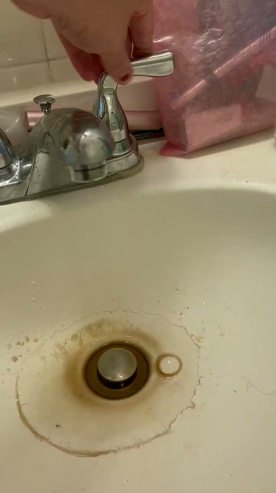

# DARKWIRE SOCIAL CYBER INSIGHTS 
&#x1F34E; **TOPIC = "ukraine"**

## AUTOMATED RESEARCH SUMMARY
     

|  Trending  |   Images | 
:-------------------------:|:-------------------------:
|        |   |   
 
 

  
The most popular user is: **RikhardHusu**  
 

## Finnish prime minister Sanna Marin was asked about a potential off-ramp for Russia to end the war in Ukraine. Her r… https://t.co/9wKpEVesxb 

  

### TRENDING SHARED IMAGE

|                **Sample-Tweets**        |
| :-------------: |
| @mysticmeance @ChrisBeee123 @CiganyNigger @LvivTyler You can ignore the fact that the 2010 Ukraine electoral map lo… https://t.co/ddPfl24p0f |
| RT @Kasparov63: I wish everyone could visit Ukraine for even a day. A country larger than France, a population nearly that of Spain, being… |
| @JKatowski4 @KOGDefence Correct me if I'm wrong, but I was under the impression that US purchases of Piorun was for… https://t.co/0w20ynChMY |

## RELATED METRICS 
| Metric | Value |
| ------------- | ------------- |
| #1 Most tweeted to  | **POTUS** |
| #2 Most tweeted to  | **rising_serpent** |
| #3 Most tweeted to  | **SenTedCruz** |
| NewProfiles (less than 10 days) | 2.24%  |
| Tweeters with < 10 followers  | 9.22%|
| Tweeters with > 1000000 followers  | 0.12%  |

## MOST POPULAR TWEET TERMS 

| Popularity Rank  | Term |
| ------------- | ------------- |
| first  | **UKRAINE**  |
| second  | **PRESIDENT**  |
| third  | **BIDEN** |
| fourth  | **RUSSIAN**  |
| fifth  | **WAR**  |

## Twitter Bio Analysis
### SENTIMENT ANALYSIS

VIEWS WERE : **SUBJECTIVE**  (53.33%) & **NEGATIVELY-SUBJECTIVE** (26.67%) **OBJECTIVE** (20.0%)

### TWEET SAMPLE 
| Random value picked from array |
| ------------- |
|RT @DefenceU: What We Are Fighting For@MFA_Ukraine https://t.co/1j5LXGpMNL |

### MOST RETWEETED 

| The most retweeted user is: **RikhardHusu**  |
| ------------- |
| Finnish prime minister Sanna Marin was asked about a potential off-ramp for Russia to end the war in Ukraine. Her r… https://t.co/9wKpEVesxb |

# Potential Fake Accounts
 
# Stunnedagain11USER INFO

 
`User ScreenName:` Stunnedagain11 
 
`User chosen Name:` Lee Brown 
 
`Is the User Verified?:` False 
 
`User signup date?:` Sun Nov 20 21:35:29 +0000 2022 
 
`User Description?:`  
 
`Followers?: `71 
 
`Following?:` 347 
 
`User URL?:` None 
 
`Location:`  
 
`Number of tweets extracted`  : 199 
 
`Profile image:` http://pbs.twimg.com/profile_images/1594444345200893952/JTEVvFp7_normal.png 
 
`Number of tweets excluding replies:` 1133 
 

 

 
## User Top tweeted words 
 
**NEW** 20 , **FLORIDA** 17 , **@1JAYSC:** 17 , **HURRICANE** 16 , **@BARRONSONLINE:** 13 , **PEOPLE** 11 , **NICOLE** 10 , **TRUMP** 9 , **AFTER** 9 , **US** 9 , **TWITTER** 9 , **FIRST** 8 , **DEMOCRATIC** 8 , **FRIENDS** 8 , **MAKE** 8 , **MEET** 7 , **UP!** 7 , **KEEP** 7 , **BUILDING** 7 , **🌊** 7 , 
 
## What this user tweeted
 
RT @lindyli: Trump attacked Lieutenant Colonel Alexander Vindman for exposing the truth about Trump’s extortion of Ukraine

Elon Musk attac…
 
# trent_riddleUSER INFO

 
`User ScreenName:` trent_riddle 
 
`User chosen Name:` Trent Riddle 
 
`Is the User Verified?:` False 
 
`User signup date?:` Wed Nov 23 04:03:30 +0000 2022 
 
`User Description?:`  
 
`Followers?: `2 
 
`Following?:` 79 
 
`User URL?:` None 
 
`Location:`  
 
`Number of tweets extracted`  : 122 
 
`Profile image:` http://pbs.twimg.com/profile_images/1595266927277899776/HXMIP8iu_normal.jpg 
 
`Number of tweets excluding replies:` 122 
 

 

 
## User Top tweeted words 
 
**PRESIDENT** 13 , **BIDEN** 12 , **TWITTER** 11 , **@LUKEWEARECHANGE:** 11 , **@ELONMUSK:** 10 , **JOE** 8 , **@DBONGINO:** 8 , **US** 8 , **@TIMCAST:** 7 , **@ELONMUSK** 6 , **CHILD** 6 , **NOVEMBER** 6 , **2022** 6 , **WORST** 6 , **ARIZONA** 6 , **NEED** 5 , **@CATTURD2:** 5 , **PEOPLE** 5 , **HISTORYRT** 5 , **GOING** 5 , 
 
## What this user tweeted
 
RT @SenTedCruz: I have serious concerns about corruption by Joe Biden during his time as Vice President and now as President.
 
The Biden f…
 
# AZlibertykpUSER INFO

 
`User ScreenName:` AZlibertykp 
 
`User chosen Name:` Krista Pendergast 
 
`Is the User Verified?:` False 
 
`User signup date?:` Mon Nov 28 22:41:06 +0000 2022 
 
`User Description?:`  
 
`Followers?: `2 
 
`Following?:` 201 
 
`User URL?:` None 
 
`Location:` Chandler, AZ 
 
`Number of tweets extracted`  : 24 
 
`Profile image:` http://pbs.twimg.com/profile_images/1597365657409974273/1-w0ht0q_normal.jpg 
 
`Number of tweets excluding replies:` 24 
 

 

 
## User Top tweeted words 
 
**ELECTION** 8 , **ARIZONA** 4 , **@KARILAKEWARROOM:** 3 , **MARICOPA** 3 , **DOING** 3 , **🚨** 3 , **AMERICANS** 2 , **@AZGOP:** 2 , **MEDIA** 2 , **WATCH** 2 , **CONFIDENCE** 2 , **MANY** 2 , **EVEN** 2 , **STOP** 2 , **VOTING** 2 , **ATTORNEY** 2 , **GENERAL** 2 , **CHOOSE** 2 , **FREE** 2 , **SPEECH** 2 , 
 
## What this user tweeted
 
RT @RepGosar: We should not send another dime to Ukraine and we should audit the money already sent there.

We must put Americans first.
 
# PoorKevenUSER INFO

 
`User ScreenName:` PoorKeven 
 
`User chosen Name:` Keven Poor 
 
`Is the User Verified?:` False 
 
`User signup date?:` Mon Nov 28 23:46:17 +0000 2022 
 
`User Description?:`  
 
`Followers?: `1 
 
`Following?:` 13 
 
`User URL?:` None 
 
`Location:`  
 
`Number of tweets extracted`  : 21 
 
`Profile image:` http://abs.twimg.com/sticky/default_profile_images/default_profile_normal.png 
 
`Number of tweets excluding replies:` 21 
 

 

 
## User Top tweeted words 
 
**@ELONMUSK:** 10 , **TWITTER** 4 , **AMERICA** 3 , **ITS** 3 , **APPLE** 3 , **BIDEN** 2 , **PRESIDENT** 2 , **@LIBSOFTIKTOK:** 2 , **APP** 2 , **BILLION** 2 , **VERY** 2 , **SAY** 2 , **BATTLE** 2 , **FREE** 2 , **SPEECH** 2 , **@HAWLEYMO:** 2 , **@APPLE** 2 , **TESLA** 2 , **RT** 1 , **@SENTEDCRUZ:** 1 , 
 
## What this user tweeted
 
RT @SenTedCruz: I have serious concerns about corruption by Joe Biden during his time as Vice President and now as President.
 
The Biden f…
 
# KimWill24414947USER INFO

 
`User ScreenName:` KimWill24414947 
 
`User chosen Name:` Kim Williams 
 
`Is the User Verified?:` False 
 
`User signup date?:` Sat Nov 26 09:04:35 +0000 2022 
 
`User Description?:`  
 
`Followers?: `8 
 
`Following?:` 48 
 
`User URL?:` None 
 
`Location:`  
 
`Number of tweets extracted`  : 91 
 
`Profile image:` http://pbs.twimg.com/profile_images/1596430103185162241/bFGqfj4j_normal.jpg 
 
`Number of tweets excluding replies:` 91 
 

 

 
## User Top tweeted words 
 
**DE** 11 , **UKRAINE** 5 , **@NATO** 5 , **FORMIN_BUCHAREST** 5 , **@ALIVIA_RUSU:** 5 , **LA** 5 , **IMPORTANT** 4 , **JOIN** 3 , **GREAT** 3 , **THESE** 3 , **LESS** 3 , **GOOD** 3 , **VERY** 3 , **DIE** 3 , **DON'T** 3 , **ES** 3 , **BEFORE** 3 , **@LETYUCHA_RYBA:** 2 , **SECURITY** 2 , **ADENAUER** 2 , 
 
## What this user tweeted
 
RT @MFA_Ukraine: Do not forget the price #Ukraine pays 💔🇺🇦

Glory to the heroes!🇺🇦
#SlavaUkraini
🎥@MriyaReport https://t.co/NzmBn1AcYHRT @Letyucha_Ryba: Was pleased to join @KASonline security workshop at marvelous Adenauer villa in Italy. 
Adenauer once turned down Stalin…RT @Letyucha_Ryba: 💭 🤔Thinking about villas of Peskov and Solovyov in Como…
Such a great asset they would be for Ukraine reconstruction☺️😅💰…
 
# lucasol37695540USER INFO

 
`User ScreenName:` lucasol37695540 
 
`User chosen Name:` lucas oliver 
 
`Is the User Verified?:` False 
 
`User signup date?:` Fri Nov 25 21:19:18 +0000 2022 
 
`User Description?:`  
 
`Followers?: `0 
 
`Following?:` 1 
 
`User URL?:` None 
 
`Location:`  
 
`Number of tweets extracted`  : 69 
 
`Profile image:` http://pbs.twimg.com/profile_images/1596256984117936128/gQBA87O7_normal.jpg 
 
`Number of tweets excluding replies:` 69 
 

 

 
## User Top tweeted words 
 
**@POTUS:** 25 , **–** 6 , **I’M** 4 , **RHODES** 4 , **GUILTY** 4 , **SEDITIOUS** 4 , **ELON** 4 , **APPLE** 4 , **THAN** 4 , **I'M** 4 , **WIN** 3 , **LAST** 3 , **AMERICA** 3 , **STEWART** 3 , **ADMINISTRATION** 3 , **CONSPIRACY** 3 , **MUSK** 3 , **GAY** 3 , **BETTER** 3 , **FREE** 3 , 
 
## What this user tweeted
 
RT @POTUS: Finding common ground is crucial to funding the government, COVID, and the war in Ukraine – and resolving the train strike.
 
Th…RT @POTUS: Our releases from the Strategic Petroleum Reserve – and my call for global partners to release reserves of their own – have help…
 
# KennardVarnUSER INFO

 
`User ScreenName:` KennardVarn 
 
`User chosen Name:` Kennard Varn 
 
`Is the User Verified?:` False 
 
`User signup date?:` Tue Nov 22 18:31:13 +0000 2022 
 
`User Description?:`  
 
`Followers?: `9 
 
`Following?:` 56 
 
`User URL?:` None 
 
`Location:`  
 
`Number of tweets extracted`  : 200 
 
`Profile image:` http://abs.twimg.com/sticky/default_profile_images/default_profile_normal.png 
 
`Number of tweets excluding replies:` 1028 
 

 

 
## User Top tweeted words 
 
**COUNTY** 23 , **BIDEN** 22 , **ELECTION** 22 , **@KARILAKEWARROOM:** 17 , **MARICOPA** 16 , **CHINA** 15 , **@NEWSMAX:** 14 , **PRESIDENT** 13 , **@BENNYJOHNSON:** 12 , **CCP** 11 , **COVID** 11 , **PEOPLE** 10 , **TRUMP** 10 , **PROTESTS** 9 , **SUPERVISORS** 9 , **@KARILAKE:** 9 , **BOARD** 8 , **INTO** 7 , **@TEDCRUZ:** 7 , **@SEANHANNITY:** 7 , 
 
## What this user tweeted
 
RT @SenTedCruz: I have serious concerns about corruption by Joe Biden during his time as Vice President and now as President.
 
The Biden f…
 
# swingguideUSER INFO

 
`User ScreenName:` swingguide 
 
`User chosen Name:` Gary Scheid 
 
`Is the User Verified?:` False 
 
`User signup date?:` Mon Nov 21 14:59:41 +0000 2022 
 
`User Description?:`  
 
`Followers?: `6 
 
`Following?:` 70 
 
`User URL?:` None 
 
`Location:`  
 
`Number of tweets extracted`  : 200 
 
`Profile image:` http://pbs.twimg.com/profile_images/1594707376464076800/0dTA-3Ba_normal.jpg 
 
`Number of tweets excluding replies:` 546 
 

 

 
## User Top tweeted words 
 
**FREE** 23 , **@ELONMUSK** 22 , **TWITTER** 22 , **APPLE** 21 , **SPEECH** 20 , **BIDEN** 15 , **@ELONMUSK:** 14 , **ELON** 14 , **PEOPLE** 12 , **CHINA** 11 , **@MZHEMINGWAY:** 11 , **@TOMFITTON:** 11 , **AGAINST** 9 , **APP** 9 , **HOUSE** 9 , **MUSK** 9 , **@JORDANBPETERSON:** 8 , **@ACTBRIGITTE:** 7 , **ITS** 7 , **AMERICA** 7 , 
 
## What this user tweeted
 
RT @SenTedCruz: I have serious concerns about corruption by Joe Biden during his time as Vice President and now as President.
 
The Biden f…
 
# Blagica69836436USER INFO

 
`User ScreenName:` Blagica69836436 
 
`User chosen Name:` BLLA💚🕊️🦉🦅🐝🐝 
 
`Is the User Verified?:` False 
 
`User signup date?:` Fri Nov 25 09:02:59 +0000 2022 
 
`User Description?:` 3️⃣6️⃣9️⃣⚛️💙💚🔭🌬️💨☄️🕊️🫧AE Love AE Binnenland 
 
`Followers?: `326 
 
`Following?:` 730 
 
`User URL?:` None 
 
`Location:`  
 
`Number of tweets extracted`  : 200 
 
`Profile image:` http://pbs.twimg.com/profile_images/1596209569008697345/RH8_IyCK_normal.jpg 
 
`Number of tweets excluding replies:` 342 
 

 

 
## User Top tweeted words 
 
**НА** 28 , **DA** 27 , **И** 25 , **E** 23 , **ВО** 18 , **Е** 17 , **СЕ** 16 , **ЗА** 15 , **ДА** 15 , **NE** 15 , **NA** 15 , **LI** 14 , **ZA** 13 , **SE** 12 , **ОД** 12 , **IST** 9 , **НЕ** 9 , **DU** 9 , **@ELONMUSK** 9 , **TOSEPROESKI** 9 , 
 
## What this user tweeted
 
RT @SpriterMonitor1: Not Ukraine. This is Serbia 1999 in time to NATO aggression https://t.co/lzIsjJLdT9
 
# CTPatriot17USER INFO

 
`User ScreenName:` CTPatriot17 
 
`User chosen Name:` CTPatriot 
 
`Is the User Verified?:` False 
 
`User signup date?:` Mon Nov 21 01:55:48 +0000 2022 
 
`User Description?:`  
 
`Followers?: `2 
 
`Following?:` 62 
 
`User URL?:` None 
 
`Location:`  
 
`Number of tweets extracted`  : 119 
 
`Profile image:` http://pbs.twimg.com/profile_images/1594510112101654529/FG_hfuE9_normal.jpg 
 
`Number of tweets excluding replies:` 119 
 

 

 
## User Top tweeted words 
 
**TWITTER** 13 , **BIDEN** 12 , **THAN** 10 , **TRUMP** 8 , **@ELONMUSK** 7 , **ELECTION** 7 , **DAY** 7 , **GREAT** 7 , **@REALMARKFINCHEM:** 6 , **RESET** 6 , **@REALDONALDTRUMP:** 6 , **ELON** 5 , **KLAUS** 5 , **VOTES** 4 , **JOE** 4 , **CAN’T** 4 , **EVEN** 4 , **US** 4 , **NEED** 4 , **MUSK** 4 , 
 
## What this user tweeted
 
RT @esoryelsnya: How come they can track and tax my Venmo and Cash App transactions for $600 but we can’t know where our $20 billion went i…
 

<b> This report is AUTOMATED and not hand crafted, it is designed for pulling metrics on a given keyword or hashtag and performs a series of reporting and analysis.</b>  
### CONCLUSION & EXTERNAL ANALYSIS

*This is my [Adam McMurchie`s] opinion on the data from the tweets, it serves as no objective truth.Since the tweets themselves are a mixture of fact & opinion. 
Authors analytical summary on request.
**RECOMMENDATIONS** WILL BE UPDATED IN NEXT  24 HOURS  