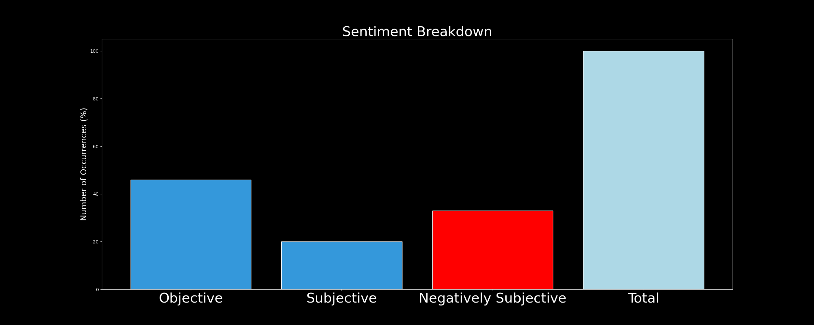

# DARKWIRE SOCIAL CYBER INSIGHTS 
&#x1F34E; **TOPIC = "ukraine"**

## AUTOMATED RESEARCH SUMMARY
     

|  Trending  |   Images | 
:-------------------------:|:-------------------------:
|        |   |   
 
 

  
The most popular user is: **elonmusk**  
 

## Starlink has been told by some governments (not Ukraine) to block Russian news sources. We will not do so unless at… https://t.co/iD0sAP7azl 

  

### TRENDING SHARED IMAGE

|                **Sample-Tweets**        |
| :-------------: |
| RT @mtracey: Navy admiral Mike Franken, Democrat running for Senate in Iowa against Chuck Grassley, declares that the US must prevent the e… |
| RT @DmytroKuleba: Today, I received a call from Iranian Foreign Minister Hossein Amir Abdollahian, during which I demanded Iran to immediat… |
| RT @ninaturner: It’s possible to support Ukraine’s sovereignty, denounce Putin’s actions, all while calling for proactive diplomacy. https:… |

## RELATED METRICS 
| Metric | Value |
| ------------- | ------------- |
| #1 Most tweeted to  | **RepMTG** |
| #2 Most tweeted to  | **elonmusk** |
| #3 Most tweeted to  | **KyivIndependent** |
| NewProfiles (less than 10 days) | 2.1%  |
| Tweeters with < 10 followers  | 8.46%|
| Tweeters with > 1000000 followers  | 0.2%  |

## MOST POPULAR TWEET TERMS 

| Popularity Rank  | Term |
| ------------- | ------------- |
| first  | **UKRAINE**  |
| second  | **RUSSIA**  |
| third  | **WAR** |
| fourth  | **TWITTER**  |
| fifth  | **RUSSIAN**  |

## Twitter Bio Analysis
### SENTIMENT ANALYSIS

VIEWS WERE : **SUBJECTIVE**  (33.33%) & **NEGATIVELY-SUBJECTIVE** (26.67%) **OBJECTIVE** (40.0%)

### TWEET SAMPLE 
| Random value picked from array |
| ------------- |
|RT @FreeCiviliansUA: 🛡️🇺🇦🚀And the "car of the day" prize goes to... someone in Virginia 🏆👏👏👏https://t.co/7jUUlQpYVR#WARINUKRAINE #UKRA… |

### MOST RETWEETED 

| The most retweeted user is: **elonmusk**  |
| ------------- |
| Starlink has been told by some governments (not Ukraine) to block Russian news sources. We will not do so unless at… https://t.co/iD0sAP7azl |

# Potential Fake Accounts
 
# John989110711USER INFO

 
`User ScreenName:` John989110711 
 
`User chosen Name:` John 
 
`Is the User Verified?:` False 
 
`User signup date?:` Fri Oct 28 10:52:49 +0000 2022 
 
`User Description?:`  
 
`Followers?: `4 
 
`Following?:` 94 
 
`User URL?:` None 
 
`Location:`  
 
`Number of tweets extracted`  : 70 
 
`Profile image:` http://pbs.twimg.com/profile_images/1585947964090253314/pPrjx7F4_normal.jpg 
 
`Number of tweets excluding replies:` 70 
 

 

 
## User Top tweeted words 
 
**@HODGETWINS** 16 , **@ABRAHAMHAMADEH** 11 , **@SMG9779** 9 , **@KRISMAYES** 9 , **@CFORCERTX** 7 , **SHOT** 6 , **PEOPLE** 6 , **@ELIJAHSCHAFFER** 5 , **MOST** 4 , **LIVE** 4 , **BIDEN** 4 , **MEAN** 4 , **@REPMTG** 3 , **OTHER** 3 , **ATTACKS** 3 , **GOING** 3 , **@MICHELEPINO1978** 3 , **OFFICER** 3 , **DOESN’T** 3 , **LEFT** 3 , 
 
## What this user tweeted
 
RT @RepMTG: There are more Democrat conspiracy theories &amp; theorists on Twitter than Qanon ever produced.

Most have blue check marks, post…
 
# MrSimpleJack604USER INFO

 
`User ScreenName:` MrSimpleJack604 
 
`User chosen Name:` Simple Jack 
 
`Is the User Verified?:` False 
 
`User signup date?:` Thu Oct 27 22:45:37 +0000 2022 
 
`User Description?:` Hi guys! 
 
`Followers?: `3 
 
`Following?:` 113 
 
`User URL?:` None 
 
`Location:` Vancouver, British Columbia 
 
`Number of tweets extracted`  : 51 
 
`Profile image:` http://pbs.twimg.com/profile_images/1585767770570256384/Zh4uoAc2_normal.jpg 
 
`Number of tweets excluding replies:` 51 
 

 

 
## User Top tweeted words 
 
**@STEELETALK** 7 , **LET** 4 , **@TAYLORLORENZ** 4 , **DOESN’T** 4 , **FREE** 3 , **@ELONMUSK** 3 , **TRUDEAU** 3 , **JUSTIN** 3 , **@YOUTUBE** 3 , **@CHEK_MEDIA** 3 , **LIBERALS** 3 , **HE’S** 3 , **DEMOCRAT** 2 , **CONSPIRACY** 2 , **THAN** 2 , **MOST** 2 , **@CTVVANCOUVER** 2 , **@FOXNEWS** 2 , **EXTREME** 2 , **LEFT** 2 , 
 
## What this user tweeted
 
RT @RepMTG: There are more Democrat conspiracy theories &amp; theorists on Twitter than Qanon ever produced.

Most have blue check marks, post…
 
# Kermitting1USER INFO

 
`User ScreenName:` Kermitting1 
 
`User chosen Name:` Kermit 
 
`Is the User Verified?:` False 
 
`User signup date?:` Thu Oct 27 23:28:31 +0000 2022 
 
`User Description?:`  
 
`Followers?: `0 
 
`Following?:` 55 
 
`User URL?:` None 
 
`Location:` United States 
 
`Number of tweets extracted`  : 5 
 
`Profile image:` http://pbs.twimg.com/profile_images/1585799981373456385/cYsnwB27_normal.jpg 
 
`Number of tweets excluding replies:` 5 
 

 

 
## User Top tweeted words 
 
**RT** 1 , **@REPMTG:** 1 , **DEMOCRAT** 1 , **CONSPIRACY** 1 , **THEORIES** 1 , **THEORISTS** 1 , **TWITTER** 1 , **THAN** 1 , **QANON** 1 , **EVER** 1 , **PRODUCED** 1 , **MOST** 1 , **BLUE** 1 , **CHECK** 1 , **MARKS** 1 , **POST…@KARENHARDWICKOT** 1 , **@JIM_JORDAN** 1 , **CALIFORNIA** 1 , **NEW** 1 , **YORK** 1 , 
 
## What this user tweeted
 
RT @RepMTG: There are more Democrat conspiracy theories &amp; theorists on Twitter than Qanon ever produced.

Most have blue check marks, post…
 
# JklRa2USER INFO

 
`User ScreenName:` JklRa2 
 
`User chosen Name:` RA2-JKL 
 
`Is the User Verified?:` False 
 
`User signup date?:` Fri Oct 21 23:33:25 +0000 2022 
 
`User Description?:`  
 
`Followers?: `0 
 
`Following?:` 1 
 
`User URL?:` None 
 
`Location:`  
 
`Number of tweets extracted`  : 16 
 
`Profile image:` http://pbs.twimg.com/profile_images/1583604134598832128/pEnQx0Dk_normal.jpg 
 
`Number of tweets excluding replies:` 16 
 

 

 
## User Top tweeted words 
 
**CHINA** 5 , **ALIGNED** 2 , **HIMSELF** 2 , **ITS** 2 , **SURVEILLANCE** 2 , **RT** 1 , **@NOAHBARKIN:** 1 , **TAIWAN** 1 , **MUSK** 1 , **UKRAINE** 1 , **RUSSIA** 1 , **CONFLICTED** 1 , **OF…@GEOALLISON** 1 , **SMALL** 1 , **CASE** 1 , **LOOK** 1 , **NEW** 1 , **ELECTED** 1 , **VANCOUVER** 1 , **MAYORRT** 1 , 
 
## What this user tweeted
 
RT @noahbarkin: On Taiwan, Musk has aligned himself with China. On Ukraine, he has aligned himself with Russia. He is conflicted because of…
 
# Alan47516521USER INFO

 
`User ScreenName:` Alan47516521 
 
`User chosen Name:` Alan 
 
`Is the User Verified?:` False 
 
`User signup date?:` Sat Oct 22 10:11:59 +0000 2022 
 
`User Description?:`  
 
`Followers?: `134 
 
`Following?:` 318 
 
`User URL?:` None 
 
`Location:`  
 
`Number of tweets extracted`  : 200 
 
`Profile image:` http://pbs.twimg.com/profile_images/1583946756672331776/AkOAPtGI_normal.jpg 
 
`Number of tweets excluding replies:` 1831 
 

 

 
## User Top tweeted words 
 
**TWITTER** 15 , **PEOPLE** 14 , **💩RT** 12 , **ELON** 10 , **MUSK** 9 , **@MASTHAHH1:** 9 , **UK** 8 , **ILLEGAL** 8 , **MANY** 7 , **INTO** 7 , **EVER** 7 , **CLIMATE** 6 , **SUNAK** 6 , **GO** 6 , **COUNTRY** 5 , **AFTER** 5 , **YEARS** 5 , **FREE** 5 , **EVERYONE** 5 , **GOVERNMENT** 5 , 
 
## What this user tweeted
 
RT @BernieSpofforth: PRAGUE - The people are growing in numbers all across the West, wanting peace with Russia. They are no longer prepared…
 
# UN_doctor65USER INFO

 
`User ScreenName:` UN_doctor65 
 
`User chosen Name:` John 
 
`Is the User Verified?:` False 
 
`User signup date?:` Fri Oct 28 22:33:31 +0000 2022 
 
`User Description?:`  
 
`Followers?: `0 
 
`Following?:` 2 
 
`User URL?:` None 
 
`Location:`  
 
`Number of tweets extracted`  : 114 
 
`Profile image:` http://abs.twimg.com/sticky/default_profile_images/default_profile_normal.png 
 
`Number of tweets excluding replies:` 114 
 

 

 
## User Top tweeted words 
 
**@POTUS:** 114 , **PRICES** 15 , **COSTS** 14 , **FAMILIES** 14 , **RELIEF** 13 , **STUDENT** 12 , **DEBT** 12 , **LOAN** 11 , **LOWER** 11 , **DELIVER** 10 , **AMERICAN** 10 , **REPUBLICANS** 10 , **WE'RE** 9 , **DOWN** 9 , **GOING** 9 , **COVID** 9 , **TUNE** 9 , **REMARKS** 9 , **MADE** 9 , **–** 9 , 
 
## What this user tweeted
 
RT @POTUS: Congratulations to Rishi Sunak on becoming Prime Minister of the United Kingdom.

Together, I look forward to enhancing our coop…RT @POTUS: I thank Prime Minister Liz Truss for her partnership on a range of issues including holding Russia accountable for its war again…
 
# JasonWalker2022USER INFO

 
`User ScreenName:` JasonWalker2022 
 
`User chosen Name:` Jason Walker 
 
`Is the User Verified?:` False 
 
`User signup date?:` Fri Oct 28 02:23:34 +0000 2022 
 
`User Description?:`  
 
`Followers?: `4 
 
`Following?:` 48 
 
`User URL?:` None 
 
`Location:`  
 
`Number of tweets extracted`  : 114 
 
`Profile image:` http://pbs.twimg.com/profile_images/1585819714978201601/JL79vfN5_normal.jpg 
 
`Number of tweets excluding replies:` 114 
 

 

 
## User Top tweeted words 
 
**@ELONMUSK** 17 , **@TWITTER** 13 , **@KARILAKE** 11 , **@HODGETWINS** 8 , **FREE** 7 , **TWITTER** 6 , **SPEECH** 6 , **I’M** 5 , **MELTDOWN** 4 , **MELT** 4 , **DON’T** 4 , **MEAN** 4 , **SEEMS** 4 , **SAME** 4 , **WATCHING** 3 , **HATE** 3 , **NEW** 3 , **PEOPLE** 3 , **GOT** 3 , **GOOD** 3 , 
 
## What this user tweeted
 
@RedaMor_ Where?  From China?  From Russia?  From Ukraine?
 
# Igor22ItaUSER INFO

 
`User ScreenName:` Igor22Ita 
 
`User chosen Name:` Itah Igor22 
 
`Is the User Verified?:` False 
 
`User signup date?:` Sat Oct 22 09:42:54 +0000 2022 
 
`User Description?:` Ukrainian fighting for democracy in 🇺🇦 #StandWithUkraine #CombatEngineer 
 
`Followers?: `14 
 
`Following?:` 36 
 
`User URL?:` None 
 
`Location:` Ukraine 
 
`Number of tweets extracted`  : 200 
 
`Profile image:` http://pbs.twimg.com/profile_images/1583756117842198528/1rYWqGG7_normal.jpg 
 
`Number of tweets excluding replies:` 474 
 

 

 
## User Top tweeted words 
 
**@NEXTA_TV:** 55 , **@WALTER_REPORT:** 52 , **RUSSIAN** 48 , **UKRAINE** 45 , **@GERASHCHENKO_EN:** 37 , **UKRAINIAN** 33 , **MILITARY** 17 , **RUSSIA** 15 , **@DEFENCEU:** 14 , **WAR** 10 , **RUSSIANS** 9 , **REGION** 9 , **BAKHMUT** 8 , **FIRST** 8 , **DEFENDERS** 8 , **ITS** 7 , **FIGHTING** 7 , **NEW** 7 , **ARMORED** 6 , **TWO** 6 , 
 
## What this user tweeted
 
RT @walter_report: Wreckage of russian MSTA-S self-propelled howitzer, hit and destroyed by Ukrainian artillery and also what little remain…RT @walter_report: A nice fire show after destruction and detonation of russian MRLS and its rocket ammo.
#Ukraine 
#russiaInvadedUkraine
#…RT @nexta_tv: #Iran's position on the events in #Ukraine is based on the principle of not sending weapons to the conflicting parties, the c…RT @walter_report: Ukrainian Mi-8 helicopters on a combat sortie.
East of Ukraine, late October. https://t.co/lxL86iFnR5RT @nexta_tv: In #Poland, the simplified procedure for employment for Russian citizens has been canceled

The decision was made in connecti…
 
# BubbaHillbilly3USER INFO

 
`User ScreenName:` BubbaHillbilly3 
 
`User chosen Name:` Bubba Hillbilly 
 
`Is the User Verified?:` False 
 
`User signup date?:` Tue Oct 25 00:24:02 +0000 2022 
 
`User Description?:` Conservative politicians get rich from giving the left wins.  
Left wins = more donations to fight them.
Marxism is the real virus!
8K followers back to zero 
 
`Followers?: `14 
 
`Following?:` 80 
 
`User URL?:` None 
 
`Location:`  
 
`Number of tweets extracted`  : 189 
 
`Profile image:` http://pbs.twimg.com/profile_images/1584709321702653954/zKnSJgm0_normal.jpg 
 
`Number of tweets excluding replies:` 189 
 

 

 
## User Top tweeted words 
 
**TWITTER** 12 , **PAUL** 12 , **PELOSI** 9 , **@ELONMUSK** 8 , **TRUMP** 8 , **AGAINST** 7 , **@STILLGRAY:** 7 , **THAN** 6 , **MUST** 6 , **INTO** 6 , **ELON** 6 , **CAN’T** 5 , **GOT** 5 , **PEOPLE** 5 , **MUCH** 5 , **BETTER** 5 , **@JACKPOSOBIEC:** 5 , **POLICE** 5 , **CENSORSHIP** 5 , **BACK** 5 , 
 
## What this user tweeted
 
RT @RepMTG: There are more Democrat conspiracy theories &amp; theorists on Twitter than Qanon ever produced.

Most have blue check marks, post…
 
# IanCraigHiltonUSER INFO

 
`User ScreenName:` IanCraigHilton 
 
`User chosen Name:` Ian Craig Hilton 
 
`Is the User Verified?:` False 
 
`User signup date?:` Fri Oct 28 01:23:22 +0000 2022 
 
`User Description?:`  
 
`Followers?: `4 
 
`Following?:` 80 
 
`User URL?:` None 
 
`Location:`  
 
`Number of tweets extracted`  : 101 
 
`Profile image:` http://pbs.twimg.com/profile_images/1585822035212746753/UMkm8OCm_normal.jpg 
 
`Number of tweets excluding replies:` 101 
 

 

 
## User Top tweeted words 
 
**RUSSIA** 10 , **UKRAINE** 9 , **IRAN** 8 , **WAR** 6 , **PEOPLE** 5 , **OBLAST** 4 , **WORLD** 4 , **DISTRICT** 4 , **THAN** 4 , **WOMEN** 4 , **NEW** 4 , **TWO** 4 , **PROTESTS** 4 , **MOTHER** 3 , **INDIA** 3 , **RUSSIAN** 3 , **FORCES** 3 , **KHERSON** 3 , **OCCUPIED** 3 , **PRESIDENT** 3 , 
 
## What this user tweeted
 
It's true Ukraine is an oblast or province of Mother Russia https://t.co/s8wZncEIko
 

<b> This report is AUTOMATED and not hand crafted, it is designed for pulling metrics on a given keyword or hashtag and performs a series of reporting and analysis.</b>  
### CONCLUSION & EXTERNAL ANALYSIS

*This is my [Adam McMurchie`s] opinion on the data from the tweets, it serves as no objective truth.Since the tweets themselves are a mixture of fact & opinion. 
Authors analytical summary on request.
**RECOMMENDATIONS** WILL BE UPDATED IN NEXT  24 HOURS  