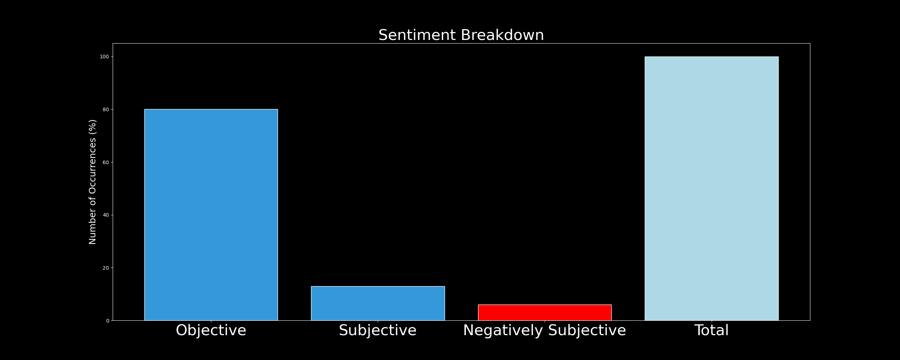

# DARKWIRE SOCIAL CYBER INSIGHTS 
&#x1F34E; **TOPIC = "vulnerabilities"**

## AUTOMATED RESEARCH SUMMARY
     

|  Trending  |   Images | 
:-------------------------:|:-------------------------:
|        |   |   
 
 

  
The most popular user is: **QuaiNetwork**  
 

## Quai Network's developers are focused on making the core codebase as light-weight and efficient as possible.

This… https://t.co/9kCO6ugG3G 

  

### TRENDING SHARED IMAGE

|                **Sample-Tweets**        |
| :-------------: |
| RT @krakenfx: 🏧 Bitcoin ATMs are a convenient way to purchase crypto - but are they safe?🕵️‍♂️ Kraken Security Labs discovered flaws in o… |
| RT @ahmedhankir: Therapy can help to heal wounds. But therapy can also help to identify your vulnerabilities &amp; what rendered you susceptibl… |
| RT @nickygumbel: We may impress people by our strengths; but we connect with people through our vulnerabilities. |

## RELATED METRICS 
| Metric | Value |
| ------------- | ------------- |
| #1 Most tweeted to  | **magpiexyz_io** |
| #2 Most tweeted to  | **immunefi** |
| #3 Most tweeted to  | **MendlovitzMark** |
| NewProfiles (less than 10 days) | 0.2%  |
| Tweeters with < 10 followers  | 13.22%|
| Tweeters with > 1000000 followers  | 0.02%  |

## MOST POPULAR TWEET TERMS 

| Popularity Rank  | Term |
| ------------- | ------------- |
| first  | **VULNERABILITIES**  |
| second  | **MAKE**  |
| third  | **EVEN** |
| fourth  | **NEWS**  |
| fifth  | **PROGRAM**  |

## Twitter Bio Analysis
### SENTIMENT ANALYSIS

VIEWS WERE : **SUBJECTIVE**  (33.33%) & **NEGATIVELY-SUBJECTIVE** (6.67%) **OBJECTIVE** (60.0%)

### TWEET SAMPLE 
| Random value picked from array |
| ------------- |
|RT @realsiff: These dangerous tendencies of men exist due to the way men evolved. They have to compete for sex &amp; they dislike other men &amp; l… |

### MOST RETWEETED 

| The most retweeted user is: **QuaiNetwork**  |
| ------------- |
| Quai Network's developers are focused on making the core codebase as light-weight and efficient as possible.This… https://t.co/9kCO6ugG3G |

# Potential Fake Accounts
 
# HOSAN1590USER INFO

 
`User ScreenName:` HOSAN1590 
 
`User chosen Name:` HRIDOY KHAN 
 
`Is the User Verified?:` False 
 
`User signup date?:` Sat Feb 18 18:10:06 +0000 2023 
 
`User Description?:` AMA 
 
`Followers?: `21 
 
`Following?:` 153 
 
`User URL?:` None 
 
`Location:`  
 
`Number of tweets extracted`  : 44 
 
`Profile image:` http://pbs.twimg.com/profile_images/1627705841196609536/Bb3gs2id_normal.jpg 
 
`Number of tweets excluding replies:` 44 
 

 

 
## User Top tweeted words 
 
**AMA** 19 , **UTC** 13 , **FEB** 11 , **PM** 10 , **NEXT** 8 , **2023** 8 , **FEBRUARY** 8 , **🎁** 7 , **@GAMEFI_OFFICIAL** 7 , **ANNOUNCE** 7 , **⏰** 6 , **USDT** 5 , **LIVE** 5 , **$100** 4 , **🏨** 4 , **TEXT** 4 , **@MINARIONFT** 4 , **@LITCRAFT_IO** 4 , **COMMUNITY** 4 , **HOLD** 4 , 
 
## What this user tweeted
 
@IM_Communityitw @LitCraft_io At "#LitCraft" do you consider security and user-satisfaction an important concern. M… https://t.co/NkFrT8WlFS
 
# balkanssecUSER INFO

 
`User ScreenName:` balkanssec 
 
`User chosen Name:` Bumble Bee 
 
`Is the User Verified?:` False 
 
`User signup date?:` Mon Feb 20 16:24:26 +0000 2023 
 
`User Description?:`  
 
`Followers?: `0 
 
`Following?:` 13 
 
`User URL?:` None 
 
`Location:`  
 
`Number of tweets extracted`  : 16 
 
`Profile image:` http://pbs.twimg.com/profile_images/1627736765783019525/O5S8E-Bh_normal.jpg 
 
`Number of tweets excluding replies:` 16 
 

 

 
## User Top tweeted words 
 
**ISPS** 7 , **ZOMBIE** 5 , **HACKING** 5 , **TALK** 5 , **HONEYPOT** 4 , **IP** 4 , **ADDRESS** 4 , **DOING** 4 , **NOTHING** 4 , **STOP** 3 , **WELL** 3 , **SCANNING** 3 , **NETWORK** 3 , **COMPUTERS** 3 , **BALKANS** 3 , **LET'S** 3 , **HIT** 2 , **DAYS** 2 , **MANY** 2 , **CAN'T** 2 , 
 
## What this user tweeted
 
This IP address is being used for hacking and exploiting network and software vulnerabilities on computers in the B… https://t.co/Uuffuyssoa
 
# eriequoteUSER INFO

 
`User ScreenName:` eriequote 
 
`User chosen Name:` 👋 
 
`Is the User Verified?:` False 
 
`User signup date?:` Mon Feb 20 00:26:48 +0000 2023 
 
`User Description?:` self indulgent bot w the purpose of sharing stuff the adm loves 
 
`Followers?: `6 
 
`Following?:` 1 
 
`User URL?:` None 
 
`Location:`  
 
`Number of tweets extracted`  : 42 
 
`Profile image:` http://pbs.twimg.com/profile_images/1627465754609082368/EIHPnE89_normal.jpg 
 
`Number of tweets excluding replies:` 42 
 

 

 
## User Top tweeted words 
 
**DE** 9 , **NÃO** 5 , **QUE** 5 , **I'M** 3 , **WAY** 3 , **MAKE** 3 , **O** 3 , **SER** 3 , **ELA** 3 , **NA** 3 , **E** 3 , **RHYTHM** 3 , **ROUND** 3 , **NECK** 3 , **TOUCH-TONE** 2 , **GO** 2 , **ARMS** 2 , **HEAR** 2 , **DREAMS** 2 , **HE'LL** 2 , 
 
## What this user tweeted
 
I understand how Natsuki feels. Sharing that level of writing takes more than just confidence. The truest form of w… https://t.co/zWzTAkMI8B
 
# AshoShikhiUSER INFO

 
`User ScreenName:` AshoShikhi 
 
`User chosen Name:` Asho Shikhi 
 
`Is the User Verified?:` False 
 
`User signup date?:` Fri Feb 17 21:01:56 +0000 2023 
 
`User Description?:`  
 
`Followers?: `2 
 
`Following?:` 47 
 
`User URL?:` None 
 
`Location:`  
 
`Number of tweets extracted`  : 21 
 
`Profile image:` http://pbs.twimg.com/profile_images/1626688419752734720/ha6du4Bn_normal.png 
 
`Number of tweets excluding replies:` 21 
 

 

 
## User Top tweeted words 
 
**@XZSBEST** 5 , **@SDELLAVI** 4 , **WEB3** 3 , **PROGRAM** 3 , **X** 3 , **LUCKY** 3 , **WINNERS** 3 , **NFT** 3 , **@HELIO_MONEY:** 3 , **VALENTINE'S** 3 , **DAY** 3 , **HTTPS://TCO/SY9XTTE9KS** 2 , **@ISLANDSXYZRT** 2 , **USDT** 2 , **15** 2 , **FOLLOW** 2 , **HELIO** 2 , **CELEBRATE** 2 , **PROTOCOL** 2 , **250** 2 , 
 
## What this user tweeted
 
RT @magpiexyz_io: Exciting news Magpies!😍

We're launching our #BugBounty program in partnership with @immunefi to make Magpie even more se…
 
# Jubaidhossain36USER INFO

 
`User ScreenName:` Jubaidhossain36 
 
`User chosen Name:` Jubaid hossain 
 
`Is the User Verified?:` False 
 
`User signup date?:` Sun Feb 12 13:57:24 +0000 2023 
 
`User Description?:` Cyber Security Specialist and wordpress security Expert 
 
`Followers?: `11 
 
`Following?:` 260 
 
`User URL?:` None 
 
`Location:` Bangladesh 
 
`Number of tweets extracted`  : 23 
 
`Profile image:` http://pbs.twimg.com/profile_images/1624769645034246145/6DAdvzwn_normal.jpg 
 
`Number of tweets excluding replies:` 23 
 

 

 
## User Top tweeted words 
 
**PLEASE** 31 , **JOB** 31 , **GIVE** 16 , **KINDS** 15 , **WORK** 15 , **MESSAGE** 15 , **INBOX😓😓😓@LAURENPARTIST** 4 , **@LAURENPARTIST** 3 , **PEN** 3 , **TEST** 3 , **WEB** 3 , **APPLICATION** 3 , **WEBSITE** 3 , **VULNERABILITIES** 3 , **FIX** 2 , **HACKED** 2 , **WORDPRESS** 2 , **WEBSITES** 2 , **MALWARE** 2 , **REMOVE** 2 , 
 
## What this user tweeted
 
Check out my Gig on Fiverr: I will pen test your web application or website for vulnerabilities https://t.co/ZR1awEJHE2
 
# lightofthecovenUSER INFO

 
`User ScreenName:` lightofthecoven 
 
`User chosen Name:` I Am Your Karma 
 
`Is the User Verified?:` False 
 
`User signup date?:` Sun Feb 19 11:06:41 +0000 2023 
 
`User Description?:` you don't know me but I know you.
What goes around comes around.
I can be a loyal friend or your worst enemy.
I detest liars with a passion.
NOT A BOT. 
 
`Followers?: `1 
 
`Following?:` 31 
 
`User URL?:` None 
 
`Location:` England, United Kingdom 
 
`Number of tweets extracted`  : 68 
 
`Profile image:` http://pbs.twimg.com/profile_images/1627266137351241729/NvxpJK1d_normal.jpg 
 
`Number of tweets excluding replies:` 68 
 

 

 
## User Top tweeted words 
 
**@LANCSPOLICE** 7 , **PEOPLE** 6 , **SCAMMER** 6 , **FAMILY** 5 , **NICOLABULLEY** 5 , **POLICE** 5 , **BEING** 4 , **PRESS** 4 , **FRIEND** 4 , **MANY** 4 , **US** 4 , **LIFE** 4 , **@MENNEWSDESK:** 3 , **SOMEONE** 3 , **STILL** 3 , **THESE** 3 , **@COLDJUSTICE_:** 3 , **NICOLA** 3 , **@POSITIVELY4THS** 3 , **PARTNER** 3 , 
 
## What this user tweeted
 
RT @EmmaDalts82: Can everyone back TF off @peter_faulding He searched where he was TOLD to search by @LancsPolice He's already said if he k…
 
# xuancai999USER INFO

 
`User ScreenName:` xuancai999 
 
`User chosen Name:` 炫彩|xuancai.bnb 
 
`Is the User Verified?:` False 
 
`User signup date?:` Wed Feb 15 09:21:43 +0000 2023 
 
`User Description?:` ez speasy @spice_finance 
 
`Followers?: `2 
 
`Following?:` 65 
 
`User URL?:` None 
 
`Location:`  
 
`Number of tweets extracted`  : 34 
 
`Profile image:` http://pbs.twimg.com/profile_images/1625843542319939588/E3GDOIcw_normal.jpg 
 
`Number of tweets excluding replies:` 34 
 

 

 
## User Top tweeted words 
 
**@GOSLEEP01** 3 , **NFT** 3 , **X** 3 , **🔥** 2 , **POWERED** 2 , **@GALXE** 2 , **@HOOLILABWEB3** 2 , **冲RT** 2 , **@JIANANSZCC:** 2 , **@YLM5573:** 2 , **超治愈画风的小卧室，FORESIGHT** 2 , **RT** 2 , **WL** 2 , **DESIDER** 2 , **SPACE** 2 , **RANGER** 2 , **@DJYOYO_NFT** 2 , **🌟** 2 , **EARLY** 2 , **BIRD** 2 , 
 
## What this user tweeted
 
RT @magpiexyz_io: Exciting news Magpies!😍

We're launching our #BugBounty program in partnership with @immunefi to make Magpie even more se…
 
# UdeyKotakUSER INFO

 
`User ScreenName:` UdeyKotak 
 
`User chosen Name:` Udey Kotak 
 
`Is the User Verified?:` False 
 
`User signup date?:` Sun Feb 19 00:46:49 +0000 2023 
 
`User Description?:` CEO, kotak Mahindra Bank 
 
`Followers?: `0 
 
`Following?:` 30 
 
`User URL?:` None 
 
`Location:` mubai, India 
 
`Number of tweets extracted`  : 47 
 
`Profile image:` http://pbs.twimg.com/profile_images/1627107981681889282/VBjDLNVX_normal.jpg 
 
`Number of tweets excluding replies:` 47 
 

 

 
## User Top tweeted words 
 
**@UDAYKOTAK:** 44 , **INFLATION** 8 , **GLOBAL** 7 , **MONEY** 7 , **YEAR** 7 , **US** 7 , **CENTRAL** 5 , **WORLD** 5 , **INDIA** 5 , **BANK** 4 , **FINANCIAL** 4 , **FED** 4 , **INDIAN** 3 , **ECONOMIC** 3 , **RUSSIA** 3 , **CHINA** 3 , **1** 3 , **DOES** 3 , **STOCK** 3 , **UK** 3 , 
 
## What this user tweeted
 
RT @udaykotak: I do not see systemic risk to Indian financial system from recent events. However,large Indian corporates rely more on globa…
 
# CKingtestUSER INFO

 
`User ScreenName:` CKingtest 
 
`User chosen Name:` chec kingtest 
 
`Is the User Verified?:` False 
 
`User signup date?:` Sat Feb 18 16:08:27 +0000 2023 
 
`User Description?:`  
 
`Followers?: `1 
 
`Following?:` 32 
 
`User URL?:` None 
 
`Location:`  
 
`Number of tweets extracted`  : 1 
 
`Profile image:` http://pbs.twimg.com/profile_images/1626976953382363136/AVCxc6fm_normal.png 
 
`Number of tweets excluding replies:` 1 
 

 

 
## User Top tweeted words 
 
**RT** 1 , **@MAGPIEXYZ_IO:** 1 , **EXCITING** 1 , **NEWS** 1 , **MAGPIES!😍** 1 , **WE'RE** 1 , **LAUNCHING** 1 , **BUGBOUNTY** 1 , **PROGRAM** 1 , **PARTNERSHIP** 1 , **@IMMUNEFI** 1 , **MAKE** 1 , **MAGPIE** 1 , **EVEN** 1 , **SE…** 1 , 
 
## What this user tweeted
 
RT @magpiexyz_io: Exciting news Magpies!😍

We're launching our #BugBounty program in partnership with @immunefi to make Magpie even more se…
 
# minhha48265956USER INFO

 
`User ScreenName:` minhha48265956 
 
`User chosen Name:` minh ha 
 
`Is the User Verified?:` False 
 
`User signup date?:` Wed Feb 15 05:06:15 +0000 2023 
 
`User Description?:`  
 
`Followers?: `0 
 
`Following?:` 18 
 
`User URL?:` None 
 
`Location:`  
 
`Number of tweets extracted`  : 3 
 
`Profile image:` http://pbs.twimg.com/profile_images/1625723140830789632/WvSm_hNM_normal.png 
 
`Number of tweets excluding replies:` 3 
 

 

 
## User Top tweeted words 
 
**TRENDS** 2 , **RT** 1 , **@JAPANNFTMUSEUM:** 1 , **🎊FREEMINT** 1 , **FESTIVAL🎊** 1 , **3D** 1 , **NFT** 1 , **NEO** 1 , **BABY** 1 , **BORN!** 1 , **FREE** 1 , **MINT** 1 , **AL?** 1 , **LET** 1 , **FESTIVITIES** 1 , **BEGIN!** 1 , **☑** 1 , **FOLLOW** 1 , **@NEOBA…RT** 1 , **@ANT_CAPITAL:** 1 , 
 
## What this user tweeted
 
RT @magpiexyz_io: Exciting news Magpies!😍

We're launching our #BugBounty program in partnership with @immunefi to make Magpie even more se…
 

<b> This report is AUTOMATED and not hand crafted, it is designed for pulling metrics on a given keyword or hashtag and performs a series of reporting and analysis.</b>  
### CONCLUSION & EXTERNAL ANALYSIS

*This is my [Adam McMurchie`s] opinion on the data from the tweets, it serves as no objective truth.Since the tweets themselves are a mixture of fact & opinion. 
Authors analytical summary on request.
**RECOMMENDATIONS** WILL BE UPDATED IN NEXT  24 HOURS  