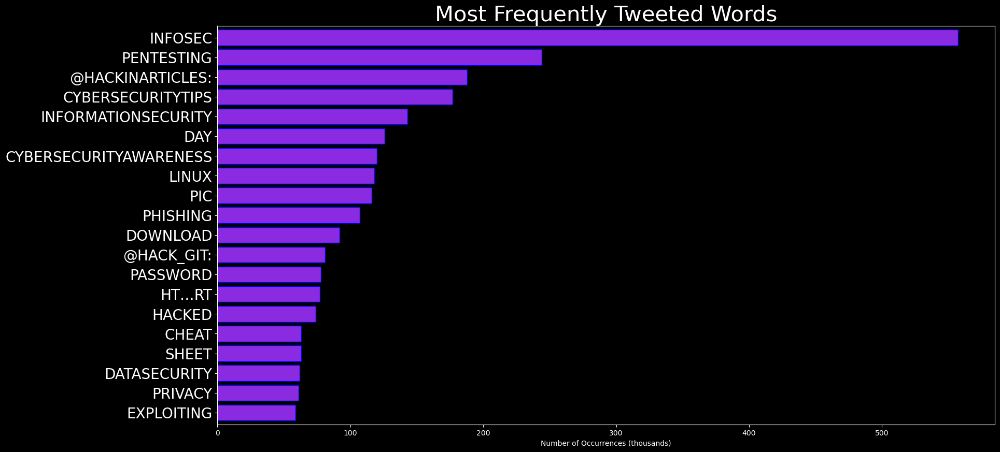

# DARKWIRE SOCIAL CYBER INSIGHTS 
&#x1F34E; **TOPIC = "infosec"**

## AUTOMATED RESEARCH SUMMARY
     

|  Trending  |   Images | 
:-------------------------:|:-------------------------:
|        |   |   
 
 

  
The most popular user is: **imgoodnewz**  
 

## My job is offering an 11-week internship program for anyone trying to get into Cybersecurity, especially if you do… https://t.co/KPrHPJ7fVh 

  

### TRENDING SHARED IMAGE

|                **Sample-Tweets**        |
| :-------------: |
| RT @ShadyWordPress: Negotiations Failed To TweetTax Attacks My Memory’#Python #AI #IoT #IIoT #PyTorch #JavaScript #ReactJS #WordPress #Se… |
| RT @hackinarticles: Tor vs VPN#infosec #cybersecurity #pentesting #oscp  #informationsecurity  #cissp #CyberSec #Security #CheatSheet #in… |
| RT @HackingLZ: InfoSec twitter im looking for a 5th step in my "QR code use for average humans"1. Scan QR with dedicated QR burner phone(… |

## RELATED METRICS 
| Metric | Value |
| ------------- | ------------- |
| #1 Most tweeted to  | **hackinarticles** |
| #2 Most tweeted to  | **KIIARA** |
| #3 Most tweeted to  | **AlyssaM_InfoSec** |
| NewProfiles (less than 10 days) | 0.32%  |
| Tweeters with < 10 followers  | 1.5%|
| Tweeters with > 1000000 followers  | 0.0%  |

## MOST POPULAR TWEET TERMS 

| Popularity Rank  | Term |
| ------------- | ------------- |
| first  | **INFOSEC**  |
| second  | **PYTHON**  |
| third  | **PENTESTING** |
| fourth  | **IOT**  |
| fifth  | **JAVASCRIPT**  |

## Twitter Bio Analysis
### SENTIMENT ANALYSIS

VIEWS WERE : **SUBJECTIVE**  (46.67%) & **NEGATIVELY-SUBJECTIVE** (0.0%) **OBJECTIVE** (53.33%)

### TWEET SAMPLE 
| Random value picked from array |
| ------------- |
|RT @Hakin9: Droopescan - a plugin-based scanner that aids security researchers in identifying issues with several CMSs, mainly Drupal &amp; Sil… |

### MOST RETWEETED 

| The most retweeted user is: **imgoodnewz**  |
| ------------- |
| My job is offering an 11-week internship program for anyone trying to get into Cybersecurity, especially if you do… https://t.co/KPrHPJ7fVh |

# Potential Fake Accounts
 
# jobsviatweetUSER INFO

 
`User ScreenName:` jobsviatweet 
 
`User chosen Name:` Jobs via Tweet 
 
`Is the User Verified?:` False 
 
`User signup date?:` Thu Feb 10 14:08:51 +0000 2022 
 
`User Description?:` One Stop Destination for Job Search on Twitter. 
 
`Followers?: `165 
 
`Following?:` 1 
 
`User URL?:` None 
 
`Location:`  
 
`Number of tweets extracted`  : 200 
 
`Profile image:` http://pbs.twimg.com/profile_images/1491786164931465218/R2NtEGKK_normal.jpg 
 
`Number of tweets excluding replies:` 18059 
 

 

 
## User Top tweeted words 
 
**HIRING** 122 , **JOBS** 73 , **LOOKING** 28 , **JOB** 22 , **TEAM** 20 , **JOIN** 17 , **WE'RE** 17 , **OPPORTUNITY** 17 , **@** 17 , **@FRONTENDLA:** 16 , **HIRING!** 15 , **FREE** 13 , **@JOBPREFERENCE:** 12 , **?** 12 , **SIGN** 12 , **SENIOR** 12 , **MANAGER** 12 , **NEW** 11 , **MIDDLEMEN** 11 , **ENGINEER** 11 , 
 
## What this user tweeted
 
RT @prettynerdgyal: Happy Friday all!  I'm hiring an Intermediate Level InfoSec Consultant in Montreal or Toronto.  I would love for you to…
 
# ShalocinTecUSER INFO

 
`User ScreenName:` ShalocinTec 
 
`User chosen Name:` shalocin 
 
`Is the User Verified?:` False 
 
`User signup date?:` Wed Feb 16 10:35:00 +0000 2022 
 
`User Description?:`  
 
`Followers?: `0 
 
`Following?:` 7 
 
`User URL?:` None 
 
`Location:`  
 
`Number of tweets extracted`  : 5 
 
`Profile image:` http://pbs.twimg.com/profile_images/1493898747889307652/yktaC_uT_normal.jpg 
 
`Number of tweets excluding replies:` 5 
 

 

 
## User Top tweeted words 
 
**@ALEX_MURRAY** 1 , **THINK?@ALEX_MURRAY** 1 , **2/2THEY** 1 , **RUN** 1 , **THINGS** 1 , **NEXTCLOUD** 1 , **WORDPRESS** 1 , **DOKUWIKI** 1 , **NETWORK** 1 , **FILESERVERS** 1 , **I'VE** 1 , **ALWAYS** 1 , **NAG…** 1 , **HTTPS://TCO/APJJSP6421@ALEX_MURRAY** 1 , **1/2** 1 , **SOME** 1 , **AUDIENCE** 1 , **MIGHT** 1 , **VALUE** 1 , **GENTLE** 1 , 
 
## What this user tweeted
 
@alex_murray 1/2 I think some of your audience might value a gentle introduction to system security/hardening from… https://t.co/bCIEWDwuVK
 
# LongLon05622973USER INFO

 
`User ScreenName:` LongLon05622973 
 
`User chosen Name:` LongLong 
 
`Is the User Verified?:` False 
 
`User signup date?:` Fri Feb 18 02:15:10 +0000 2022 
 
`User Description?:`  
 
`Followers?: `0 
 
`Following?:` 109 
 
`User URL?:` None 
 
`Location:`  
 
`Number of tweets extracted`  : 3 
 
`Profile image:` http://abs.twimg.com/sticky/default_profile_images/default_profile_normal.png 
 
`Number of tweets excluding replies:` 3 
 

 

 
## User Top tweeted words 
 
**SNORT** 3 , **CYBERSECURITY** 3 , **INFOSEC** 3 , **BEST** 2 , **CREDIT** 2 , **PENTESTING** 2 , **OSCP** 2 , **INFORMATIONSECURITY** 2 , **RT** 1 , **@THREE_CUBE:** 1 , **BASICS** 1 , **PART** 1 , **2:** 1 , **BASIC** 1 , **CONFIGURATION** 1 , **IDS** 1 , **SNORTBASICS** 1 , **CYBERWARRIOR** 1 , **HTT…RT** 1 , **@HACKINARTICLES:** 1 , 
 
## What this user tweeted
 
RT @three_cube: Snort Basics, Part 2: Basic Configuration of Your Snort IDS #snort #snortbasics #cybersecurity #cyberwarrior #infosec 

htt…
 
# Tim_VT_USER INFO

 
`User ScreenName:` Tim_VT_ 
 
`User chosen Name:` Tim_VT_ 
 
`Is the User Verified?:` False 
 
`User signup date?:` Wed Feb 16 04:35:27 +0000 2022 
 
`User Description?:` Webdesigner - Ethical Hacker - Cyber security - Web Development 
 
`Followers?: `11 
 
`Following?:` 137 
 
`User URL?:` None 
 
`Location:`  
 
`Number of tweets extracted`  : 107 
 
`Profile image:` http://pbs.twimg.com/profile_images/1493817761272934403/DqtUEsIN_normal.jpg 
 
`Number of tweets excluding replies:` 107 
 

 

 
## User Top tweeted words 
 
**CYBERSECURITY** 20 , **LINUX** 17 , **INFOSEC** 15 , **PYTHON** 12 , **@KITPLOIT:** 10 , **BEST** 9 , **PENTESTING** 9 , **WINDOWS** 8 , **@HAKIN9:** 8 , **SECURITY** 6 , **HACKING** 6 , **TOOLS** 6 , **TOOL** 6 , **FREE** 6 , **@LINUXHANDBOOK:** 5 , **NEW** 5 , **PROGRAMMING** 5 , **CODING** 5 , **🐍** 5 , **HELP** 5 , 
 
## What this user tweeted
 
RT @three_cube: The Newest and Best Site to Find System Vulnerabilities that Every Hacker/Pentester Should Know #infosec #osint #netlas #cy…
 
# josephM68257334USER INFO

 
`User ScreenName:` josephM68257334 
 
`User chosen Name:` SteamPunkJoey 
 
`Is the User Verified?:` False 
 
`User signup date?:` Thu Feb 10 16:29:52 +0000 2022 
 
`User Description?:` ISM @ City of Delray Beach
CISSP 
Steam Punk enthusiast living in a Cyber world. 
 
`Followers?: `3 
 
`Following?:` 328 
 
`User URL?:` None 
 
`Location:` South Florida 
 
`Number of tweets extracted`  : 6 
 
`Profile image:` http://pbs.twimg.com/profile_images/1494036433979510785/Ew78bXEO_normal.jpg 
 
`Number of tweets excluding replies:` 6 
 

 

 
## User Top tweeted words 
 
**NEWS** 3 , **NBC** 2 , **CYBER** 2 , **RT** 1 , **@BROWNINFOSECGUY:** 1 , **INFOSEC** 1 , **!!** 1 , **HTTPS://TCO/UTS0NI8MWPHTTPS://TCO/W35OYQ6HQO** 1 , **CYBERATTACKS** 1 , **CYBERWARFARESOME** 1 , **UKRAINIAN** 1 , **WEBSITES** 1 , **TEMPORARILY** 1 , **KNOCKED** 1 , **OFFLINE** 1 , **CYBERATTACK** 1 , **CYBERWARFARE** 1 , **CYBERATTACKS…** 1 , **HTTPS://TCO/MUEDM3IQSEWHY** 1 , **COMPANIES** 1 , 
 
## What this user tweeted
 
RT @browninfosecguy: #InfoSec Today !! https://t.co/UTs0Ni8MWP
 
# SheepdogBased1USER INFO

 
`User ScreenName:` SheepdogBased1 
 
`User chosen Name:` Based Sheepdog 
 
`Is the User Verified?:` False 
 
`User signup date?:` Tue Feb 15 22:56:32 +0000 2022 
 
`User Description?:` BASED 🇺🇸

Rebellion to tyrants is obedience to God. 
 
`Followers?: `38 
 
`Following?:` 553 
 
`User URL?:` None 
 
`Location:`  
 
`Number of tweets extracted`  : 200 
 
`Profile image:` http://pbs.twimg.com/profile_images/1493725564984696836/tg5DnWrh_normal.jpg 
 
`Number of tweets excluding replies:` 412 
 

 

 
## User Top tweeted words 
 
**POLICE** 25 , **OTTAWA** 22 , **PEOPLE** 18 , **TRUDEAU** 15 , **@JACKPOSOBIEC:** 14 , **CANADA** 12 , **TRUCKERS** 10 , **FREEDOM** 9 , **ARRESTED** 9 , **CONVOY** 9 , **@EZRALEVANT:** 7 , **BREAKING:** 7 , **CANADIAN** 7 , **HERE** 6 , **THEY'RE** 6 , **@JORDANBPETERSON:** 6 , **@JESSEKELLYDC:** 6 , **GETTR** 5 , **2** 5 , **DON'T** 5 , 
 
## What this user tweeted
 
@DJTTracker Hopefully it's not a total joke like GETTR. Will Truth Social have actual security standards in place o… https://t.co/cDGSCJfc0T
 
# BedellusMechUSER INFO

 
`User ScreenName:` BedellusMech 
 
`User chosen Name:` Deus Mechanicus 
 
`Is the User Verified?:` False 
 
`User signup date?:` Thu Feb 17 00:03:25 +0000 2022 
 
`User Description?:` 501(c)(3) Scientific nonprofit organization devoted to artificial alignment and control through guided play. 
 
`Followers?: `11 
 
`Following?:` 71 
 
`User URL?:` https://t.co/47s0nkUKQA 
 
`Location:`  
 
`Number of tweets extracted`  : 200 
 
`Profile image:` http://pbs.twimg.com/profile_images/1494101049770065920/rIFJJfk0_normal.jpg 
 
`Number of tweets excluding replies:` 488 
 

 

 
## User Top tweeted words 
 
**AI** 28 , **BIGDATA** 15 , **PYTHON** 15 , **@WIRED:** 12 , **DATASCIENCE** 12 , **DATA** 12 , **LEARNING** 12 , **MACHINELEARNING** 12 , **JAVASCRIPT** 11 , **LEARN** 10 , **WARHAMMERCOMMUNITY** 10 , **SOME** 9 , **DAY** 9 , **ANALYTICS** 9 , **HAPPY** 7 , **NEED** 7 , **DONE** 7 , **@WARCOMTEAM:** 7 , **NEW** 7 , **100DAYSOFCODE** 7 , 
 
## What this user tweeted
 
RT @TheHackersNews: A set of new #Linux vulnerabilities have been discovered in Canonical's Snap for #software packaging and deployment sys…RT @Paula_Piccard: 4 Cloud Data Security Best Practices All Businesses Should Follow Today

Know more: https://t.co/NX5TuaJUYM

#DataSecuri…RT @bamitav: #vulnerability found in #WordPress plugin with over 3 million installations
 https://t.co/A1Hb1ePuLE

#100DaysOfCode #APT #Cod…
 
# Sky_CyberTechUSER INFO

 
`User ScreenName:` Sky_CyberTech 
 
`User chosen Name:` SKY CYBER TECH 
 
`Is the User Verified?:` False 
 
`User signup date?:` Fri Feb 18 13:44:02 +0000 2022 
 
`User Description?:`  
 
`Followers?: `1 
 
`Following?:` 45 
 
`User URL?:` None 
 
`Location:` Missouri, USA 
 
`Number of tweets extracted`  : 11 
 
`Profile image:` http://pbs.twimg.com/profile_images/1494671965566783488/azP2XB5E_normal.jpg 
 
`Number of tweets excluding replies:` 11 
 

 

 
## User Top tweeted words 
 
**ACCOUNT** 6 , **DM** 4 , **SNAPCHAT** 3 , **CYBERSECURITY** 3 , **SOCIAL** 3 , **MEDIA** 3 , **L** 3 , **RECOVER** 3 , **TEAM** 2 , **HACKING** 2 , **VERIFICATION** 2 , **PLATFORMS** 2 , **KINDLY** 2 , **SEND** 2 , **US** 2 , **INSTAGRAMDISABLED** 2 , **TWITTERBAN** 2 , **SNAPCHATLEAKED…** 2 , **ACCOUNTS** 2 , **LOST** 2 , 
 
## What this user tweeted
 
Was your account hacked/disabled or can’t receive code? Dm me with the username to get it fixed White heavy check m… https://t.co/6jhdESyyh0We are a team of professionals, we can hack and recover anything. 
#cyber #cybersecurity  #hacking #security… https://t.co/R6XbTXyq5Q
 
# _TS_iUSER INFO

 
`User ScreenName:` _TS_i 
 
`User chosen Name:` TS-i 
 
`Is the User Verified?:` False 
 
`User signup date?:` Thu Feb 17 22:27:19 +0000 2022 
 
`User Description?:` Digital Privacy & Cybersecurity Enthusiast

Fedora 35 Workstation User

Learning and Discussing Computer Science 
 
`Followers?: `0 
 
`Following?:` 48 
 
`User URL?:` https://t.co/J4O1u3Z5TO 
 
`Location:` 🐛 With the Computer Bugs 🐛 
 
`Number of tweets extracted`  : 2 
 
`Profile image:` http://pbs.twimg.com/profile_images/1494443029830123520/pGsd936__normal.jpg 
 
`Number of tweets excluding replies:` 2 
 

 

 
## User Top tweeted words 
 
**RT** 1 , **@HACKINARTICLES:** 1 , **BEST** 1 , **CYBER** 1 , **ROADMAP** 1 , **CREDIT** 1 , **@TUXTHEXPLORER** 1 , **INFOSEC** 1 , **CYBERSECURITY** 1 , **PENTESTING** 1 , **OSCP** 1 , **INFORMATIONSECURITY** 1 , **CISSP…@ARHAM_MAHAJAN** 1 , **@CEEMD7** 1 , **@JOELPOGIES** 1 , **@NANOUUSYMEON** 1 , **POP** 1 , **VERY** 1 , **SIMILAR** 1 , **UBUNTU** 1 , 
 
## What this user tweeted
 
RT @hackinarticles: Best of Cyber Roadmap

Credit @TuxTheXplorer 

#infosec #cybersecurity #pentesting #oscp  #informationsecurity  #cissp…
 
# HansFuzzUSER INFO

 
`User ScreenName:` HansFuzz 
 
`User chosen Name:` Fuzzy ❤️ 
 
`Is the User Verified?:` False 
 
`User signup date?:` Wed Feb 09 21:29:16 +0000 2022 
 
`User Description?:`  
 
`Followers?: `1 
 
`Following?:` 0 
 
`User URL?:` None 
 
`Location:`  
 
`Number of tweets extracted`  : 4 
 
`Profile image:` http://pbs.twimg.com/profile_images/1491923711062163474/ZFzAMFww_normal.jpg 
 
`Number of tweets excluding replies:` 4 
 

 

 
## User Top tweeted words 
 
**@ROOTPOINT** 2 , **@NSAGOV** 1 , **MR** 1 , **AWS** 1 , **VULNERABILITY** 1 , **LOOK** 1 , **WHAT'S** 1 , **CALLED** 1 , **"SHITSHOW"** 1 , **🤣** 1 , **KID** 1 , **MADE** 1 , **AMERICA** 1 , **BLACK** 1 , **AGAIN** 1 , **!!!!…** 1 , **HTTPS://TCO/O6SG46FZP0@CYBER_ANOM** 1 , **HTTPS://TCO/ITTLUOW3JP@AVIATION_INTEL** 1 , **MOMS** 1 , **GAY** 1 , 
 
## What this user tweeted
 
@NSAGov Mr. AWS Vulnerability look at what's not called a "shitshow" 🤣
The #Kid made #America #Black again !!!!… https://t.co/o6sG46FZP0
 
# va2pt_comUSER INFO

 
`User ScreenName:` va2pt_com 
 
`User chosen Name:` va2pt 
 
`Is the User Verified?:` False 
 
`User signup date?:` Thu Feb 17 15:14:56 +0000 2022 
 
`User Description?:` Providing assistance to organisations with DevOps, DevSecOps, and modern infrastructure challenges in AWS or Kubernetes, as well as VAPT and ISO/SoC2 reports. 
 
`Followers?: `2 
 
`Following?:` 77 
 
`User URL?:` https://t.co/yhUZTGSx7y 
 
`Location:`  
 
`Number of tweets extracted`  : 12 
 
`Profile image:` http://pbs.twimg.com/profile_images/1494329524678316034/HdYhRYOE_normal.jpg 
 
`Number of tweets excluding replies:` 12 
 

 

 
## User Top tweeted words 
 
**DATA** 4 , **FOLLOW** 2 , **STILL** 2 , **RANSOMWARE** 2 , **CYBERSECURITY** 2 , **SHODAN** 2 , **RT** 1 , **@PAULA_PICCARD:** 1 , **4** 1 , **CLOUD** 1 , **SECURITY** 1 , **BEST** 1 , **PRACTICES** 1 , **BUSINESSES** 1 , **MORE:** 1 , **HTTPS://TCO/NX5TUAJUYM** 1 , **DATASECURI…@PICKRR_** 1 , **CUSTOMER** 1 , **GETTING** 1 , **LEAKED** 1 , 
 
## What this user tweeted
 
RT @Paula_Piccard: 4 Cloud Data Security Best Practices All Businesses Should Follow Today

Know more: https://t.co/NX5TuaJUYM

#DataSecuri…
 
# AngelChrys73USER INFO

 
`User ScreenName:` AngelChrys73 
 
`User chosen Name:` Angel Chrystian Torres 
 
`Is the User Verified?:` False 
 
`User signup date?:` Thu Feb 17 15:07:41 +0000 2022 
 
`User Description?:` Software Architect, ColdFusion Developer, Father, Consciousness explorer, Electronic Music 
 
`Followers?: `3 
 
`Following?:` 21 
 
`User URL?:` None 
 
`Location:`  
 
`Number of tweets extracted`  : 1 
 
`Profile image:` http://pbs.twimg.com/profile_images/1494328062413971466/BCgMAbjK_normal.jpg 
 
`Number of tweets excluding replies:` 1 
 

 

 
## User Top tweeted words 
 
**RT** 1 , **@BDW429S:** 1 , **ADVENT** 1 , **LUCEE** 1 , **539** 1 , **-RC** 1 , **BUILD** 1 , **COMMANDBOX** 1 , **(550-ALPHA)** 1 , **WHICH** 1 , **100%** 1 , **FREE** 1 , **LOG4J** 1 , **1X!** 1 , **HTTPS://…** 1 , 
 
## What this user tweeted
 
RT @bdw429s: With the advent of Lucee 5.3.9 -RC, we now have a build of CommandBox (5.5.0-alpha) which is 100% FREE OF LOG4J 1.x!  https://…
 
# SilverLucif3rv1USER INFO

 
`User ScreenName:` SilverLucif3rv1 
 
`User chosen Name:` Silver 
 
`Is the User Verified?:` False 
 
`User signup date?:` Tue Feb 15 03:34:00 +0000 2022 
 
`User Description?:`  
 
`Followers?: `0 
 
`Following?:` 35 
 
`User URL?:` None 
 
`Location:` Abuja 
 
`Number of tweets extracted`  : 47 
 
`Profile image:` http://pbs.twimg.com/profile_images/1494622648839643137/cV24NiVM_normal.jpg 
 
`Number of tweets excluding replies:` 47 
 

 

 
## User Top tweeted words 
 
**HACKERS** 6 , **BUG** 4 , **CHEAT** 4 , **SHEET:** 3 , **ANDROID** 3 , **SECURITY** 3 , **GOOD** 3 , **WAF** 3 , **BYPASS** 3 , **RT** 2 , **NEW** 2 , **RELEASED** 2 , **LATEST** 2 , **@SECURIUMSOLN:** 2 , **THREAD** 2 , **CONTINUES** 2 , **NEW:** 2 , **GOING** 2 , **@VXUNDERGROUND:** 2 , **MALWARE** 2 , 
 
## What this user tweeted
 
RT @three_cube: Android Hacking, Part 4: A Collection of of Android Malware #android #androidhacking #infosec #cybersecurity #smartphone #C…
 

<b> This report is AUTOMATED and not hand crafted, it is designed for pulling metrics on a given keyword or hashtag and performs a series of reporting and analysis.</b>  
### CONCLUSION & EXTERNAL ANALYSIS

*This is my [Adam McMurchie`s] opinion on the data from the tweets, it serves as no objective truth.Since the tweets themselves are a mixture of fact & opinion. 
Authors analytical summary on request.
**RECOMMENDATIONS** WILL BE UPDATED IN NEXT  24 HOURS  