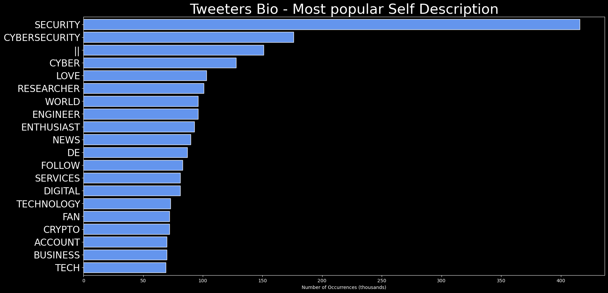

# DARKWIRE SOCIAL CYBER INSIGHTS 
&#x1F34E; **TOPIC = "vulnerabilities"**

## AUTOMATED RESEARCH SUMMARY
     

|  Trending  |   Images | 
:-------------------------:|:-------------------------:
|        |   |   
 
 

  
The most popular user is: **BeschlossDC**  
 

## Donald Trump and his entourage have illuminated crucial vulnerabilities in our political system that will probably… https://t.co/9xsiaHI67M 

  

### TRENDING SHARED IMAGE

|                **Sample-Tweets**        |
| :-------------: |
| RT @simonroses: Analyze in depth any file from one to thousands easily: vulnerabilities, malware indicators, IOC, YARA, MITRE ATT&amp;CK, simil… |
| RT @redhillsummers: Apple pays huge sums to hackers who can find exploitations in there systems and report them. Massively incentivizing ha… |
| RT @jack_turban: Senior psychiatrists think a doctor with pink hair and no tie is “unprofessional.”They fail to realize that minoritized… |

## RELATED METRICS 
| Metric | Value |
| ------------- | ------------- |
| #1 Most tweeted to  | **jack_turban** |
| #2 Most tweeted to  | **TheHackersNews** |
| #3 Most tweeted to  | **allinwithchris** |
| NewProfiles (less than 10 days) | 2.22%  |
| Tweeters with < 10 followers  | 5.76%|
| Tweeters with > 1000000 followers  | 0.04%  |

## MOST POPULAR TWEET TERMS 

| Popularity Rank  | Term |
| ------------- | ------------- |
| first  | **VULNERABILITIES**  |
| second  | **SENIOR**  |
| third  | **REALIZE** |
| fourth  | **HAIR**  |
| fifth  | **@JACK_TURBAN:**  |

## Twitter Bio Analysis
### SENTIMENT ANALYSIS

VIEWS WERE : **SUBJECTIVE**  (40.0%) & **NEGATIVELY-SUBJECTIVE** (13.33%) **OBJECTIVE** (46.67%)

### TWEET SAMPLE 
| Random value picked from array |
| ------------- |
|Need a good read? @OptivSourceZero explains step-by-step how they discovered identified Ivy framework fileless atta… https://t.co/6Belln7Nbt |

### MOST RETWEETED 

| The most retweeted user is: **BeschlossDC**  |
| ------------- |
| Donald Trump and his entourage have illuminated crucial vulnerabilities in our political system that will probably… https://t.co/9xsiaHI67M |

# Potential Fake Accounts
 
# _AboutCRYPTO_USER INFO

 
`User ScreenName:` _AboutCRYPTO_ 
 
`User chosen Name:` AboutCrypto Official 
 
`Is the User Verified?:` False 
 
`User signup date?:` Sat Feb 05 19:35:37 +0000 2022 
 
`User Description?:` Run by the People for the PEOPLE 🧍‍♂️ #ABOUTCRYPTO
About: AboutCryptocurrency@hotmail.com

SHARE!          | 📋
LIKE!               | 🧡
RETWEET!     | 🔃 
 
`Followers?: `0 
 
`Following?:` 7 
 
`User URL?:` https://t.co/CXrD6ZcICa 
 
`Location:` CURRENCY 
 
`Number of tweets extracted`  : 6 
 
`Profile image:` http://pbs.twimg.com/profile_images/1490052214152474626/0uNaNPXF_normal.jpg 
 
`Number of tweets excluding replies:` 6 
 

 

 
## User Top tweeted words 
 
**BITCOIN** 3 , **MILLION** 2 , **SOME** 2 , **10%** 2 , **RT** 1 , **@ECOBEEZOFFICIAL:** 1 , **RECYCLE?"THIS** 1 , **WEEK’S** 1 , **$320** 1 , **DEFI** 1 , **HACK** 1 , **INDICATOR** 1 , **CRYPTO'S** 1 , **VULNERABILITIES** 1 , **TANTALIZING** 1 , **HI…** 1 , **HTTPS://TCO/H0XOYBCD1P70000+** 1 , **‘BEARS’** 1 , **LIQUIDATED** 1 , **$270** 1 , 
 
## What this user tweeted
 
"This week’s $320 million DeFi hack is an indicator of some of crypto's vulnerabilities. It's also a tantalizing hi… https://t.co/H0XOYbCd1P
 
# qi35350161USER INFO

 
`User ScreenName:` qi35350161 
 
`User chosen Name:` qi 
 
`Is the User Verified?:` False 
 
`User signup date?:` Fri Feb 04 15:49:00 +0000 2022 
 
`User Description?:` New York. A woman who loves crypto travel. 
 
`Followers?: `6 
 
`Following?:` 65 
 
`User URL?:` None 
 
`Location:`  
 
`Number of tweets extracted`  : 16 
 
`Profile image:` http://pbs.twimg.com/profile_images/1490047174255996928/qbBQoEjB_normal.jpg 
 
`Number of tweets excluding replies:` 16 
 

 

 
## User Top tweeted words 
 
**@BTCTN:** 5 , **BITCOIN** 5 , **CRYPTO** 3 , **@COINTELEGRAPH:** 3 , **@BITCOINMAGAZINE:** 3 , **"THIS** 2 , **METAVERSE** 2 , **BILLION** 2 , **CRYPTOCURRENCY** 2 , **@COINDESK:** 2 , **NFTS** 2 , **FRIDAY** 2 , **RT** 1 , **RUSSIAN** 1 , **ELECTRICITY** 1 , **SUPPLIERS** 1 , **PROPOSE** 1 , **MEASURES** 1 , **CURB** 1 , **MINING** 1 , 
 
## What this user tweeted
 
RT @crypto: "This week’s $320 million DeFi hack is an indicator of some of crypto's vulnerabilities. It's also a tantalizing hint at just h…
 
# jonathandata0USER INFO

 
`User ScreenName:` jonathandata0 
 
`User chosen Name:` Jonathan Scatt 
 
`Is the User Verified?:` False 
 
`User signup date?:` Sun Jan 30 16:00:01 +0000 2022 
 
`User Description?:` Great American Hacker Hero! I’m smarter than you. Mom says I’m the #1 hacker. I’m a parody of myself. Grifter’s rights. 🇨🇳 “I’m very litigious” 
 
`Followers?: `677 
 
`Following?:` 557 
 
`User URL?:` None 
 
`Location:` Boring Texas  
 
`Number of tweets extracted`  : 152 
 
`Profile image:` http://pbs.twimg.com/profile_images/1488711791618129922/Yvy7kn0S_normal.jpg 
 
`Number of tweets excluding replies:` 152 
 

 

 
## User Top tweeted words 
 
**@JONATHANDATA1** 52 , **I’M** 18 , **DON’T** 17 , **PEOPLE** 11 , **TWITTER** 8 , **I’VE** 8 , **BULLSHIT** 8 , **BACK** 8 , **@EDBUTLER2** 8 , **STOP** 7 , **TIME** 7 , **1** 6 , **CHINA** 6 , **THAN** 6 , **BEING** 6 , **WELL** 6 , **CODE** 6 , **THEN** 5 , **IP** 5 , **DOESN’T** 5 , 
 
## What this user tweeted
 
@GraFfiX_221211 @jonathandata1 Don’t you see it’s “critical” in red text! I’ve submitted a thousand bullshit vulner… https://t.co/NaPt8XYi4t
 
# ashcatchuUSER INFO

 
`User ScreenName:` ashcatchu 
 
`User chosen Name:` Ash 
 
`Is the User Verified?:` False 
 
`User signup date?:` Thu Feb 03 07:48:07 +0000 2022 
 
`User Description?:`  
 
`Followers?: `1 
 
`Following?:` 3 
 
`User URL?:` None 
 
`Location:`  
 
`Number of tweets extracted`  : 41 
 
`Profile image:` http://pbs.twimg.com/profile_images/1489145148030205953/d67oQNfA_normal.jpg 
 
`Number of tweets excluding replies:` 41 
 

 

 
## User Top tweeted words 
 
**@EDBUTLER2** 18 , **@S1GUZA** 15 , **@ZUDASWORLD** 10 , **WEBSITE** 5 , **EVEN** 5 , **RCE** 5 , **ZUDA** 4 , **GIVE** 4 , **CVSS** 4 , **DEVICE** 4 , **DOESN'T** 4 , **NEED** 4 , **THESE** 4 , **CLEARLY** 4 , **@PAUL34853253** 4 , **CLAIMS** 4 , **SEEMS** 3 , **VERY** 3 , **DON'T** 3 , **VULNERABILITY** 3 , 
 
## What this user tweeted
 
@zudasworld @Paul34853253 @s1guza @edbutler2 You haven't even been able to describe the attack clearly, or the vuln… https://t.co/XM3FErSA1j@Paul34853253 @zudasworld @s1guza @edbutler2 At least he makes himself clearly known. I tried to give Zuda the bene… https://t.co/mDZCMfzt4P
 
# NickkGomezz_USER INFO

 
`User ScreenName:` NickkGomezz_ 
 
`User chosen Name:` Nick Gomez 
 
`Is the User Verified?:` False 
 
`User signup date?:` Fri Feb 04 21:55:56 +0000 2022 
 
`User Description?:` Entrepreneur,Investor,Crypto expert💶💶
The world is forever evolving and I think you should too🤷‍♂️
Dm now to know how 👍👍 
 
`Followers?: `12 
 
`Following?:` 88 
 
`User URL?:` None 
 
`Location:` Atlanta, GA 
 
`Number of tweets extracted`  : 200 
 
`Profile image:` http://pbs.twimg.com/profile_images/1489719960192655370/RkHSh3Gw_normal.jpg 
 
`Number of tweets excluding replies:` 233 
 

 

 
## User Top tweeted words 
 
**@BUSINESS:** 58 , **DE** 17 , **@BIESPANA:** 15 , **CRYPTO** 14 , **@BIPOLSKA:** 14 , **QUE** 13 , **@BUSINESSINSIDER:** 13 , **@CRYPTO:** 12 , **EN** 11 , **BITCOIN** 10 , **LA** 10 , **LOS** 9 , **@BTCTN:** 9 , **NFT** 9 , **JOBS** 8 , **US** 8 , **AFTER** 8 , **MILLION** 8 , **@BIINDIA:** 8 , **GREAT** 8 , 
 
## What this user tweeted
 
RT @crypto: "This week’s $320 million DeFi hack is an indicator of some of crypto's vulnerabilities. It's also a tantalizing hint at just h…RT @BTCTN: The decision has caused a massive uproar as #Gofundme’s decision has exposed the vulnerabilities of centralized crowdfunding app…
 
# VorkBryanUSER INFO

 
`User ScreenName:` VorkBryan 
 
`User chosen Name:` Bryan Vork 
 
`Is the User Verified?:` False 
 
`User signup date?:` Tue Feb 01 20:05:08 +0000 2022 
 
`User Description?:`  
 
`Followers?: `0 
 
`Following?:` 25 
 
`User URL?:` None 
 
`Location:`  
 
`Number of tweets extracted`  : 21 
 
`Profile image:` http://pbs.twimg.com/profile_images/1488604350909980672/qy2i1Vaz_normal.png 
 
`Number of tweets excluding replies:` 21 
 

 

 
## User Top tweeted words 
 
**@FLOOZ_INC:** 18 , **ACTIONS** 7 , **COMMUNITY** 4 , **WE’VE** 4 , **LESSON** 3 , **STOLEN** 3 , **NFTS** 3 , **EACH** 3 , **OTHER** 3 , **DISCORD** 3 , **HAPPENED?** 3 , **INCIDENT** 2 , **US** 2 , **BOUGHT** 2 , **BACK** 2 , **WHERE** 2 , **FLOOZ** 2 , **MOD** 2 , **TIME** 2 , **SECURITY** 2 , 
 
## What this user tweeted
 
RT @flooz_inc: RESPONSE TIME (1/1)

The issue was detected within 8 mins of the breach. Our hero, @jeancarlosxyz, was able to identify and…
 
# STN_SylviaUSER INFO

 
`User ScreenName:` STN_Sylvia 
 
`User chosen Name:` Sylvia🌸 
 
`Is the User Verified?:` False 
 
`User signup date?:` Thu Jan 27 03:22:52 +0000 2022 
 
`User Description?:` 29 years old •  Mother👩‍👧 • 🇬🇭 • Previous background in Early years • 1st-year CYP Student Nurse 🧸 • Neurodiverse 🧠 • All views are my own 💬 
 
`Followers?: `18 
 
`Following?:` 109 
 
`User URL?:` None 
 
`Location:`  
 
`Number of tweets extracted`  : 15 
 
`Profile image:` http://pbs.twimg.com/profile_images/1486540560848543748/zjDRy5Vg_normal.jpg 
 
`Number of tweets excluding replies:` 15 
 

 

 
## User Top tweeted words 
 
**PLACEMENT** 6 , **NURSING** 3 , **BEING** 3 , **FINISHED** 2 , **FIRST** 2 , **TEAM** 2 , **@LIVCOMLEY:** 2 , **I’M** 2 , **INTERESTED** 2 , **@WEAHPS:** 2 , **PEOPLE** 2 , **LEARN** 2 , **NEW** 2 , **GREAT** 2 , **PLAN** 2 , **USING** 2 , **STUDENT** 2 , **RT** 1 , **@CHRIS_DLAMINI:** 1 , **DOUBT** 1 , 
 
## What this user tweeted
 
RT @chris_dlamini: Nursing will no doubt expose you to the sheer vulnerabilities of the human condition. What greater honour is there than…
 
# Bodak_ToolsUSER INFO

 
`User ScreenName:` Bodak_Tools 
 
`User chosen Name:` BodakHacks 
 
`Is the User Verified?:` False 
 
`User signup date?:` Wed Feb 02 04:56:32 +0000 2022 
 
`User Description?:` WHAT WE DO:DARK WEB HACKING * CYBER SECURITY ADVISORY * HACKING TRAINING SERVICES*SOCIAL MEDIA RECOVERY SUCH AS:INSTAGRAM/SNAPCHAT/TWITTER/FACEBOOK & Lots more 
 
`Followers?: `9 
 
`Following?:` 39 
 
`User URL?:` None 
 
`Location:` South Carolina, USA 
 
`Number of tweets extracted`  : 200 
 
`Profile image:` http://pbs.twimg.com/profile_images/1489526457558777862/KeRCN1Jm_normal.jpg 
 
`Number of tweets excluding replies:` 400 
 

 

 
## User Top tweeted words 
 
**DM** 35 , **CYBERSECURITY** 31 , **TEAM** 29 , **HELP** 26 , **RECOVERY** 26 , **HACKING** 24 , **SERVICES** 22 , **HACKER** 21 , **SKILLS** 18 , **FACEBOOK** 18 , **TRAINING** 16 , **OFFER** 16 , **SERVICE** 16 , **PARTNER** 15 , **PHONE** 15 , **ACCOUNT** 15 , **GUARANTEE** 14 , **SECURITY** 13 , **US** 13 , **PERSONAL** 12 , 
 
## What this user tweeted
 
4 Steps Toward Knowing Your Exploitable Attack Surface - https://t.co/Fs6x4WuHJt #security #ITsecurity… https://t.co/VeYo2DyyIZMicrosoft Defender now detects Android and iOS vulnerabilities

Link in bio or if you are on Facebook click on Cont… https://t.co/KzbHwwsjf4Detecting, investigating and mitigating privilege escalation vulnerabilities to prevent full Active Directory contr… https://t.co/FkU6Pp4Nci
 
# Mary_jack05USER INFO

 
`User ScreenName:` Mary_jack05 
 
`User chosen Name:` Mary_jack_ 
 
`Is the User Verified?:` False 
 
`User signup date?:` Sat Feb 05 11:03:03 +0000 2022 
 
`User Description?:` Keep on moving no matter what happens📉📈 
 
`Followers?: `11 
 
`Following?:` 28 
 
`User URL?:` None 
 
`Location:` Moon 
 
`Number of tweets extracted`  : 24 
 
`Profile image:` http://pbs.twimg.com/profile_images/1489934267463487495/FuQS9bqN_normal.jpg 
 
`Number of tweets excluding replies:` 24 
 

 

 
## User Top tweeted words 
 
**CONTACT** 9 , **@BRYAN_BECK0** 9 , **HELP** 9 , **HELPED** 9 , **RECOVER** 9 , **LOST** 7 , **@BINANCE:** 6 , **@BTCTN:** 6 , **CRYPTO** 2 , **MAKE** 2 , **COINRT** 2 , **GOVERNMENT** 2 , **FUNDS** 2 , **UNTIL** 2 , **DECISION** 2 , **USE** 2 , **RT** 1 , **DOESRT** 1 , **"CAN'T** 1 , **TONIGHT** 1 , 
 
## What this user tweeted
 
RT @BTCTN: The decision has caused a massive uproar as #Gofundme’s decision has exposed the vulnerabilities of centralized crowdfunding app…
 
# Jakia12702168USER INFO

 
`User ScreenName:` Jakia12702168 
 
`User chosen Name:` Jakia 
 
`Is the User Verified?:` False 
 
`User signup date?:` Thu Feb 03 14:41:03 +0000 2022 
 
`User Description?:` Crypto man 
 
`Followers?: `4 
 
`Following?:` 26 
 
`User URL?:` None 
 
`Location:`  
 
`Number of tweets extracted`  : 200 
 
`Profile image:` http://pbs.twimg.com/profile_images/1489248027038478349/R-TC_Tsr_normal.jpg 
 
`Number of tweets excluding replies:` 212 
 

 

 
## User Top tweeted words 
 
**@CRYPTO37007105** 90 , **PROJECT** 35 , **@VERADEFI** 30 , **@METAGRAIL_** 30 , **@GALAXY_SIDUS** 26 , **@NFT4PLAY** 21 , **@SMAUGSNFT** 21 , **NFT** 20 , **@UNIQUE_NFTCHAIN** 19 , **MOST** 16 , **TELL** 13 , **US** 12 , **MANY** 12 , **PROJECTS** 11 , **ANY** 11 , **IMPORTANT** 10 , **DOES** 10 , **VERY** 10 , **TOKEN** 10 , **PLANS** 10 , 
 
## What this user tweeted
 
@CryptoFun_ID @MetaGrail_ Can you assure us that this won't be one of those projects that come out, do a lot of mar… https://t.co/RNg1htmxUR@CryptoFight24 @Millionstarter1 Recently, the majority of initiatives in the Crypto currency field have been plague… https://t.co/vDy26QxEJ2@CryptoHustle21 @MinipadSpace Audit is so important to find out vulnerabilities of smart contracts. Could you show… https://t.co/KkDp4DyBTf
 
# LetsHackUKUSER INFO

 
`User ScreenName:` LetsHackUK 
 
`User chosen Name:` LetsHack 
 
`Is the User Verified?:` False 
 
`User signup date?:` Sat Feb 05 02:21:15 +0000 2022 
 
`User Description?:`  
 
`Followers?: `2 
 
`Following?:` 6 
 
`User URL?:` None 
 
`Location:`  
 
`Number of tweets extracted`  : 11 
 
`Profile image:` http://pbs.twimg.com/profile_images/1489793852538081284/d-3E2SQQ_normal.png 
 
`Number of tweets excluding replies:` 11 
 

 

 
## User Top tweeted words 
 
**@THEHACKERSNEWS:** 6 , **VULNERABILITIES** 3 , **PYTHON** 2 , **RUSSIAN** 2 , **GROUP** 2 , **GAMAREDON** 2 , **D3FEND** 2 , **@USCERT_GOV:** 2 , **RT** 1 , **@THREE_CUBE:** 1 , **BASICS** 1 , **HACKERS** 1 , **PART** 1 , **4:** 1 , **FINDING** 1 , **EXACT** 1 , **LOCATION** 1 , **ANY** 1 , **IP** 1 , **ADDRESS** 1 , 
 
## What this user tweeted
 
RT @TheHackersNews: A technique to semi-automatically find vulnerabilities in #WordPress plugins.

Read: https://t.co/NfejgI7D6F

[105 vuln…RT @TheHackersNews: CISA warns of multiple vulnerabilities in Airspan Networks' Mimosa equipment that could be abused to execute remote cod…RT @USCERT_gov: 🚨 Check out @CISAgov's latest Known Exploited Vulnerabilities Catalog update! We recommend federal enterprises and private…
 
# Xazidhasan2005USER INFO

 
`User ScreenName:` Xazidhasan2005 
 
`User chosen Name:` Wasim 
 
`Is the User Verified?:` False 
 
`User signup date?:` Sat Feb 05 13:46:22 +0000 2022 
 
`User Description?:`  
 
`Followers?: `1 
 
`Following?:` 19 
 
`User URL?:` None 
 
`Location:`  
 
`Number of tweets extracted`  : 44 
 
`Profile image:` http://pbs.twimg.com/profile_images/1489961145699950594/coyYbGJo_normal.jpg 
 
`Number of tweets excluding replies:` 44 
 

 

 
## User Top tweeted words 
 
**@LIDIAMGA** 19 , **PROJECT** 10 , **UTC** 8 , **IMPORTANT** 7 , **PROJECTS** 7 , **AMA** 7 , **:** 7 , **@NFT4PLAY** 7 , **@SAZID_HASAN2005** 7 , **FEBRUARY** 6 , **2022** 6 , **@HARMONYLAUNCHER** 6 , **COULD** 5 , **USDT** 5 , **TOKEN** 5 , **PM** 5 , **$100** 4 , **INVESTORS** 4 , **PRICE** 4 , **@CUDDLENFT** 4 , 
 
## What this user tweeted
 
@IM_Communityitw @Lidiamga @itsdappsy Can you assure us that this won't be one of those projects that come out, do… https://t.co/Vs5vmkNyKY@crown_community @Nft4Play Can you assure us that this won't be one of those projects that come out, do a lot of ma… https://t.co/jSqRrYeeDU
 
# Galaxy_Heroes11USER INFO

 
`User ScreenName:` Galaxy_Heroes11 
 
`User chosen Name:` Galaxy Heroes 
 
`Is the User Verified?:` False 
 
`User signup date?:` Sun Jan 30 02:27:22 +0000 2022 
 
`User Description?:`  
 
`Followers?: `5 
 
`Following?:` 10 
 
`User URL?:` None 
 
`Location:`  
 
`Number of tweets extracted`  : 200 
 
`Profile image:` http://pbs.twimg.com/profile_images/1488465051434504192/1FLKyxXQ_normal.jpg 
 
`Number of tweets excluding replies:` 420 
 

 

 
## User Top tweeted words 
 
**@BSCNEW_** 93 , **NEXT** 61 , **@BSCNEW_:** 50 , **SHIB** 37 , **@GALAXYHEROESGHC** 36 , **@CRYPTO_NIGAR** 36 , **@INUKISHU_1:** 34 , **$GHC** 32 , **READY** 32 , **@GALAXY_HEROES11:** 31 , **ATH** 29 , **💹🚀** 29 , **DON'T** 27 , **GAINING** 26 , **HISTORY** 24 , **DM** 22 , **MISS** 21 , **RT** 20 , **📩RT** 20 , **PAY** 20 , 
 
## What this user tweeted
 
RT @Galaxy_Heroes11: @BscNew_ When you don’t pay attention to the borders of your country, the enemy can sneak in. That's the situation of…RT @Inukishu_1: @BscNew_ @PancakeSwap @GalaxyHeroesGHC When you don’t pay attention to the borders of your country, the enemy can sneak in.…@BscNew_ When you don’t pay attention to the borders of your country, the enemy can sneak in. That's the situation… https://t.co/xacneVddx0RT @Inukishu_1: @Galaxy_Heroes11 @BscNew_ @demonic_doge @GalaxyHeroesGHC When you don’t pay attention to the borders of your country, the e…RT @Galaxy_Heroes11: @Inukishu_1 @Vanogives @BscNew_ @GalaxyHeroesGHC When you don’t pay attention to the borders of your country, the enem…RT @Galaxy_Heroes11: @Inukishu_1 @BscNew_ @ExPopulus When you don’t pay attention to the borders of your country, the enemy can sneak in. T…RT @Galaxy_Heroes11: @Inukishu_1 @Vanogives @GalaxyHeroesGHC When you don’t pay attention to the borders of your country, the enemy can sne…RT @Galaxy_Heroes11: @Inukishu_1 @BscNew_ @GalaxyHeroesGHC When you don’t pay attention to the borders of your country, the enemy can sneak…RT @Galaxy_Heroes11: @Inukishu_1 @BscNew_ @PancakeSwap @GalaxyHeroesGHC When you don’t pay attention to the borders of your country, the en…@Inukishu_1 @Vanogives @BscNew_ @GalaxyHeroesGHC When you don’t pay attention to the borders of your country, the e… https://t.co/OiODWJulzk@Inukishu_1 @BscNew_ @GalaxyHeroesGHC When you don’t pay attention to the borders of your country, the enemy can sn… https://t.co/xG4kEq4DmGRT @Inukishu_1: @BscNew_ @Johancarlos111 @deficonnect When you don’t pay attention to the borders of your country, the enemy can sneak in.…@Inukishu_1 @BscNew_ @PancakeSwap @GalaxyHeroesGHC When you don’t pay attention to the borders of your country, the… https://t.co/bXHtYEUqM4@Inukishu_1 @Vanogives @GalaxyHeroesGHC When you don’t pay attention to the borders of your country, the enemy can… https://t.co/2J0wEZ7ede@Inukishu_1 @BscNew_ @ExPopulus When you don’t pay attention to the borders of your country, the enemy can sneak in… https://t.co/ds50muZlaLRT @Inukishu_1: @BscNew_ @ExPopulus When you don’t pay attention to the borders of your country, the enemy can sneak in. That's the situati…RT @Inukishu_1: @BscNew_ @ExPopulus When you don’t pay attention to the borders of your country, the enemy can sneak in. That's the situati…RT @Inukishu_1: @Vanogives @BscNew_ When you don’t pay attention to the borders of your country, the enemy can sneak in. That's the situati…RT @Inukishu_1: @Galaxy_Heroes11 @BscNew_ @ExPopulus When you don’t pay attention to the borders of your country, the enemy can sneak in. T…
 
# Inukishu_1USER INFO

 
`User ScreenName:` Inukishu_1 
 
`User chosen Name:` Kishu 
 
`Is the User Verified?:` False 
 
`User signup date?:` Sat Jan 29 11:52:56 +0000 2022 
 
`User Description?:` I am crypto promoter and investor 
 
`Followers?: `3 
 
`Following?:` 10 
 
`User URL?:` None 
 
`Location:`  
 
`Number of tweets extracted`  : 200 
 
`Profile image:` http://pbs.twimg.com/profile_images/1487731427789574145/bsLW6oQT_normal.jpg 
 
`Number of tweets excluding replies:` 291 
 

 

 
## User Top tweeted words 
 
**@BSCNEW_** 103 , **NEXT** 84 , **@INUKISHU_1:** 49 , **$GHC** 45 , **READY** 44 , **SHIB** 44 , **ATH** 43 , **💹🚀** 43 , **DON'T** 40 , **@GALAXYHEROESGHC** 38 , **@CRYPTO_NIGAR** 38 , **GAINING** 34 , **HISTORY** 33 , **MISS** 32 , **@BSCNEW_:** 30 , **@GALAXY_HEROES11:** 30 , **PAY** 29 , **ATTENTION** 29 , **DON’T** 28 , **BORDERS** 28 , 
 
## What this user tweeted
 
RT @Inukishu_1: @BscNew_ @PancakeSwap @GalaxyHeroesGHC When you don’t pay attention to the borders of your country, the enemy can sneak in.…RT @Galaxy_Heroes11: @BscNew_ When you don’t pay attention to the borders of your country, the enemy can sneak in. That's the situation of…RT @Inukishu_1: @Johancarlos111 @BscNew_ @DessertSwap When you don’t pay attention to the borders of your country, the enemy can sneak in.…RT @Galaxy_Heroes11: @Inukishu_1 @BscNew_ @ExPopulus When you don’t pay attention to the borders of your country, the enemy can sneak in. T…RT @Galaxy_Heroes11: @Inukishu_1 @Vanogives @GalaxyHeroesGHC When you don’t pay attention to the borders of your country, the enemy can sne…RT @Galaxy_Heroes11: @Inukishu_1 @BscNew_ @PancakeSwap @GalaxyHeroesGHC When you don’t pay attention to the borders of your country, the en…RT @Galaxy_Heroes11: @Inukishu_1 @BscNew_ @GalaxyHeroesGHC When you don’t pay attention to the borders of your country, the enemy can sneak…RT @Galaxy_Heroes11: @Inukishu_1 @Vanogives @BscNew_ @GalaxyHeroesGHC When you don’t pay attention to the borders of your country, the enem…RT @Inukishu_1: @Galaxy_Heroes11 @BscNew_ @demonic_doge @GalaxyHeroesGHC When you don’t pay attention to the borders of your country, the e…@Galaxy_Heroes11 @BscNew_ @demonic_doge @GalaxyHeroesGHC When you don’t pay attention to the borders of your countr… https://t.co/ZYUZFfkEVA@Johancarlos111 @BscNew_ @DessertSwap When you don’t pay attention to the borders of your country, the enemy can sn… https://t.co/aHa1l7Bd2M@BscNew_ @PancakeSwap @GalaxyHeroesGHC When you don’t pay attention to the borders of your country, the enemy can s… https://t.co/KVGRtxSceqRT @Inukishu_1: @BscNew_ @Johancarlos111 @deficonnect When you don’t pay attention to the borders of your country, the enemy can sneak in.…RT @Inukishu_1: @Galaxy_Heroes11 @BscNew_ @ExPopulus When you don’t pay attention to the borders of your country, the enemy can sneak in. T…@BscNew_ @Johancarlos111 @deficonnect When you don’t pay attention to the borders of your country, the enemy can sn… https://t.co/QlvnJXL6Kv@Galaxy_Heroes11 @BscNew_ @ExPopulus When you don’t pay attention to the borders of your country, the enemy can sne… https://t.co/j9JhCgkbZhRT @Galaxy_Heroes11: @BscNew_ @ExPopulus When you don’t pay attention to the borders of your country, the enemy can sneak in. That's the si…RT @Inukishu_1: @BscNew_ @ExPopulus When you don’t pay attention to the borders of your country, the enemy can sneak in. That's the situati…RT @Inukishu_1: @BscNew_ @ExPopulus When you don’t pay attention to the borders of your country, the enemy can sneak in. That's the situati…@BscNew_ @ExPopulus When you don’t pay attention to the borders of your country, the enemy can sneak in. That's the… https://t.co/DpJ2IFHEAd@BscNew_ @ExPopulus When you don’t pay attention to the borders of your country, the enemy can sneak in. That's the… https://t.co/SopxfLM4JbRT @Inukishu_1: @BscNew_ @ExPopulus When you don’t pay attention to the borders of your country, the enemy can sneak in. That's the situati…RT @Inukishu_1: @kishuarmyMOD @InuKishu When you don’t pay attention to the borders of your country, the enemy can sneak in. That's the sit…RT @Inukishu_1: @Vanogives @BscNew_ When you don’t pay attention to the borders of your country, the enemy can sneak in. That's the situati…@kishuarmyMOD @InuKishu When you don’t pay attention to the borders of your country, the enemy can sneak in. That's… https://t.co/24zShOKuOj@Vanogives @BscNew_ When you don’t pay attention to the borders of your country, the enemy can sneak in. That's the… https://t.co/S72ijgUn9D@BscNew_ @ExPopulus When you don’t pay attention to the borders of your country, the enemy can sneak in. That's the… https://t.co/z76SitiXgeRT @Inukishu_1: @BscNew_ @ExPopulus When you don’t pay attention to the borders of your country, the enemy can sneak in. That's the situati…@BscNew_ @ExPopulus When you don’t pay attention to the borders of your country, the enemy can sneak in. That's the… https://t.co/0xVVMQTsHbRT @Inukishu_1: @BscNew_ @ExPopulus When you don’t pay attention to the borders of your country, the enemy can sneak in. That's the situati…
 
# Johancarlos111USER INFO

 
`User ScreenName:` Johancarlos111 
 
`User chosen Name:` johan 
 
`Is the User Verified?:` False 
 
`User signup date?:` Sat Jan 29 12:42:05 +0000 2022 
 
`User Description?:` Investor 
 
`Followers?: `4 
 
`Following?:` 6 
 
`User URL?:` None 
 
`Location:`  
 
`Number of tweets extracted`  : 200 
 
`Profile image:` http://pbs.twimg.com/profile_images/1488462994136784896/wP03SFqL_normal.jpg 
 
`Number of tweets excluding replies:` 469 
 

 

 
## User Top tweeted words 
 
**@BSCNEW_** 88 , **@JOHANCARLOS111:** 49 , **DM** 48 , **LET'S** 44 , **COLLABORATE** 43 , **@BSCNEW_:** 42 , **NEXT** 34 , **📩RT** 29 , **@INUKISHU_1** 24 , **@GALAXYHEROESGHC** 20 , **@GALAXY_HEROES11:** 19 , **@CRYPTO_NIGAR** 19 , **RT** 16 , **HOURS** 16 , **$GHC** 16 , **SHIB** 16 , **24** 15 , **📩@BSCNEW_** 15 , **EXCHANGE** 15 , **SNEAK** 14 , 
 
## What this user tweeted
 
RT @Galaxy_Heroes11: @BscNew_ When you don’t pay attention to the borders of your country, the enemy can sneak in. That's the situation of…RT @Inukishu_1: @BscNew_ @PancakeSwap @GalaxyHeroesGHC When you don’t pay attention to the borders of your country, the enemy can sneak in.…RT @Galaxy_Heroes11: @Inukishu_1 @Vanogives @GalaxyHeroesGHC When you don’t pay attention to the borders of your country, the enemy can sne…RT @Galaxy_Heroes11: @Inukishu_1 @BscNew_ @ExPopulus When you don’t pay attention to the borders of your country, the enemy can sneak in. T…RT @Galaxy_Heroes11: @Inukishu_1 @BscNew_ @PancakeSwap @GalaxyHeroesGHC When you don’t pay attention to the borders of your country, the en…RT @Galaxy_Heroes11: @Inukishu_1 @Vanogives @BscNew_ @GalaxyHeroesGHC When you don’t pay attention to the borders of your country, the enem…RT @Galaxy_Heroes11: @Inukishu_1 @BscNew_ @GalaxyHeroesGHC When you don’t pay attention to the borders of your country, the enemy can sneak…RT @Inukishu_1: @Johancarlos111 @BscNew_ @DessertSwap When you don’t pay attention to the borders of your country, the enemy can sneak in.…RT @Inukishu_1: @BscNew_ @Johancarlos111 @deficonnect When you don’t pay attention to the borders of your country, the enemy can sneak in.…
 
# Rany88162189USER INFO

 
`User ScreenName:` Rany88162189 
 
`User chosen Name:` Rany 
 
`Is the User Verified?:` False 
 
`User signup date?:` Fri Jan 28 09:18:53 +0000 2022 
 
`User Description?:` Raj Rany student 
 
`Followers?: `9 
 
`Following?:` 98 
 
`User URL?:` None 
 
`Location:`  
 
`Number of tweets extracted`  : 200 
 
`Profile image:` http://pbs.twimg.com/profile_images/1486992376396926976/UCz5tTZ-_normal.jpg 
 
`Number of tweets excluding replies:` 1187 
 

 

 
## User Top tweeted words 
 
**@SANGAKA01289673** 77 , **PROJECT** 46 , **@VERADEFI** 29 , **@GALAXY_SIDUS** 27 , **@INVCLECRYPTO** 21 , **@SMAUGSNFT** 20 , **@SUBQUERYNETWORK** 20 , **@NFT4PLAY** 19 , **NFT** 16 , **ITS** 15 , **MANY** 15 , **@UNIQUE_NFTCHAIN** 15 , **PROJECTS** 14 , **US** 13 , **@METAGRAIL_** 12 , **TELL** 11 , **NFTS** 11 , **WHICH** 11 , **GAME** 11 , **ANY** 10 , 
 
## What this user tweeted
 
@CryptoJMS0 @Sangaka01289673 Protecting users data, privacy &amp; funds has become a glaring problem that many companie… https://t.co/YbcmuOMuvp@GlobalCrypto12 @Sangaka01289673 @Genesismetaswap Protecting users data, privacy &amp; funds has become a glaring probl… https://t.co/8X1vXz2S54@LandoCommunity @Sangaka01289673 @ShremHouse Protecting users data, privacy &amp; funds has become a glaring problem th… https://t.co/SFO7al3BXb
 
# MartyNorthstarrUSER INFO

 
`User ScreenName:` MartyNorthstarr 
 
`User chosen Name:` Marty Tatro 
 
`Is the User Verified?:` False 
 
`User signup date?:` Sat Feb 05 12:07:44 +0000 2022 
 
`User Description?:` Cybersecurity Engineer working for Northstarr System Solutions, Ltd. 
 
`Followers?: `0 
 
`Following?:` 1 
 
`User URL?:` None 
 
`Location:`  
 
`Number of tweets extracted`  : 12 
 
`Profile image:` http://pbs.twimg.com/profile_images/1489933844400721925/yMltlheQ_normal.png 
 
`Number of tweets excluding replies:` 12 
 

 

 
## User Top tweeted words 
 
**@NORTHSTARR_LTD:** 12 , **SECURITY** 4 , **CYBERSECURITY** 4 , **FAMILIAR** 2 , **PROTECT** 2 , **CYBER** 2 , **ALWAYS** 2 , **SURE** 2 , **WE'VE** 2 , **NEW** 2 , **BLOG** 2 , **READ** 2 , **TAGS:** 2 , **COMPUTERSCIENCE** 2 , **COMPUTERENGINEERING** 2 , **IOT** 2 , **AI** 2 , **RT** 1 , **RANSOMWARE?** 1 , **VERY** 1 , 
 
## What this user tweeted
 
RT @northstarr_ltd: IN CASE YOU MISSED IT: Researchers find serious vulnerabilities in medical equipment. And one way to protect your syste…
 
# surajsilwal991USER INFO

 
`User ScreenName:` surajsilwal991 
 
`User chosen Name:` Surajsilwal991 
 
`Is the User Verified?:` False 
 
`User signup date?:` Thu Feb 03 17:18:21 +0000 2022 
 
`User Description?:` Researcher, Student 
 
`Followers?: `9 
 
`Following?:` 320 
 
`User URL?:` None 
 
`Location:`  
 
`Number of tweets extracted`  : 66 
 
`Profile image:` http://pbs.twimg.com/profile_images/1489288194181189632/waZBsRvN_normal.jpg 
 
`Number of tweets excluding replies:` 66 
 

 

 
## User Top tweeted words 
 
**@GLOBALTIMESNEWS** 16 , **INDIA** 12 , **@OFFICIALDGISPR** 10 , **MODEE** 9 , **@RAMUNASLVZS** 9 , **MAKE** 8 , **WEAKER…HOW?** 7 , **DIVISION** 7 , **ASSAM** 7 , **MIZORAM** 7 , **NAGALAND** 7 , **@SURYARACHARYA** 6 , **ITS** 6 , **KO** 5 , **CHINA** 5 , **MANIPUR…** 4 , **TOO** 4 , **THESE** 4 , **AFRAID** 4 , **@ASHOSWAI** 4 , 
 
## What this user tweeted
 
@JAYESH_UP65 @OfficialDGISPR Yes Pakistan is not Economically Superior than you but you got many vulnerabilities…wake up before its too late
 
# ZebraSolZAUSER INFO

 
`User ScreenName:` ZebraSolZA 
 
`User chosen Name:` SolanaZebra 
 
`Is the User Verified?:` False 
 
`User signup date?:` Sat Feb 05 05:23:17 +0000 2022 
 
`User Description?:`  
 
`Followers?: `13 
 
`Following?:` 282 
 
`User URL?:` None 
 
`Location:`  
 
`Number of tweets extracted`  : 17 
 
`Profile image:` http://pbs.twimg.com/profile_images/1489833659557425155/Fnc0Spz-_normal.jpg 
 
`Number of tweets excluding replies:` 17 
 

 

 
## User Top tweeted words 
 
**SOLANA** 3 , **@WCLEMENTEIII:** 3 , **$BTC** 3 , **RALLY** 2 , **BITCOIN** 2 , **SOME** 2 , **DIAGONAL** 2 , **STILL** 2 , **KEY** 2 , **SHORT** 2 , **RT** 1 , **@TXMCTRADES:** 1 , **STRONGEST** 1 , **BUYING** 1 , **DELTAS** 1 , **BINANCE** 1 , **PERP** 1 , **FUTURES** 1 , **BEGAN** 1 , **OCTOBER** 1 , 
 
## What this user tweeted
 
RT @fintechfrank: Some takeaways from Anatoly’s AMA
- This bug was an obvious "blind spot"
- If Wormhole were using Soteria  - a security s…
 
# Chris60767391USER INFO

 
`User ScreenName:` Chris60767391 
 
`User chosen Name:` Chris 
 
`Is the User Verified?:` False 
 
`User signup date?:` Tue Feb 01 09:16:17 +0000 2022 
 
`User Description?:` I love Progress 
 
`Followers?: `4 
 
`Following?:` 41 
 
`User URL?:` None 
 
`Location:`  
 
`Number of tweets extracted`  : 37 
 
`Profile image:` http://pbs.twimg.com/profile_images/1488441179091963905/cjDXfuCM_normal.jpg 
 
`Number of tweets excluding replies:` 37 
 

 

 
## User Top tweeted words 
 
**@MOTIVATIONAL:** 14 , **@PATRICKBETDAVID:** 4 , **PEOPLE** 3 , **OTHER** 3 , **"THE** 3 , **@ALVIN_INVESTOR:** 3 , **@LEXFRIDMAN:** 2 , **JOE** 2 , **ROGAN** 2 , **KEEP** 2 , **STOP** 2 , **WAY** 2 , **@PATRICKBETDAVID** 2 , **POOR** 2 , **WORK** 2 , **MONEY** 2 , **MAKE** 2 , **ROBERT** 2 , **FREEDOM** 2 , **PAST** 2 , 
 
## What this user tweeted
 
RT @Hakin9: Bluescan - A powerful Bluetooth scanner for scanning BR/LE devices, LMP, SDP, GATT and vulnerabilities! https://t.co/gUwnY3fAu6…
 
# overcryptocalUSER INFO

 
`User ScreenName:` overcryptocal 
 
`User chosen Name:` Overcryptocal 
 
`Is the User Verified?:` False 
 
`User signup date?:` Wed Feb 02 16:29:31 +0000 2022 
 
`User Description?:` Marketer | 2022 is the year of #DeFi insurance 🚀 | 📍🇪🇸 | 🏴󠁧󠁢󠁥󠁮󠁧󠁿🇦🇹 | @insurace_io $INSUR | More…🔜 
 
`Followers?: `149 
 
`Following?:` 36 
 
`User URL?:` None 
 
`Location:` Barcelona, Spain 
 
`Number of tweets extracted`  : 26 
 
`Profile image:` http://pbs.twimg.com/profile_images/1489011796576985094/KVBYfVRB_normal.jpg 
 
`Number of tweets excluding replies:` 26 
 

 

 
## User Top tweeted words 
 
**🚀** 7 , **@DARKDORMN** 6 , **DEFI** 5 , **BUY** 4 , **DAY** 4 , **NFT** 4 , **@INSURACE_IO** 4 , **I’LL** 3 , **DAN** 3 , **@NEARPROTOCOL** 2 , **START** 2 , **0XF9300AD74D882244BBF01641BE634805BBB31185** 2 , **@INSURACE_IO:** 2 , **CMO** 2 , **EXPLAINS** 2 , **EXCITED** 2 , **@PEEKYPANDAS** 2 , **INSURANCE** 2 , **WORK** 2 , **VERY** 1 , 
 
## What this user tweeted
 
Who protects their #DeFi assets against smart contract vulnerabilities? 

If not, why not?
 
# Maryjan89132982USER INFO

 
`User ScreenName:` Maryjan89132982 
 
`User chosen Name:` Maryjan 
 
`Is the User Verified?:` False 
 
`User signup date?:` Fri Feb 04 08:30:50 +0000 2022 
 
`User Description?:` Mery love 
 
`Followers?: `2 
 
`Following?:` 19 
 
`User URL?:` None 
 
`Location:`  
 
`Number of tweets extracted`  : 67 
 
`Profile image:` http://pbs.twimg.com/profile_images/1489516913567109124/CR3d-U0F_normal.jpg 
 
`Number of tweets excluding replies:` 67 
 

 

 
## User Top tweeted words 
 
**@NFT4PLAY** 21 , **@BULLIEVERSE** 19 , **@SHANTURYT** 15 , **NFT** 14 , **@SUBQUERYNETWORK** 9 , **GAMING** 8 , **AMA** 8 , **PROJECT** 8 , **UTC** 7 , **USERS** 7 , **NFT4PLAY** 6 , **ANY** 6 , **FEBRUARY** 6 , **@UNFETTEREDGAME** 6 , **GAMES** 5 , **BLOCKCHAIN** 5 , **2022** 5 , **@MILLIONSTARTER1** 5 , **SECURITY** 4 , **GAME** 4 , 
 
## What this user tweeted
 
@CryptoAviators @SubQueryNetwork SubQuery is a really interesting platform. How do you ensure that your performance… https://t.co/UICnOkWlHY
 
# Cyber0wl_USER INFO

 
`User ScreenName:` Cyber0wl_ 
 
`User chosen Name:` CDev 
 
`Is the User Verified?:` False 
 
`User signup date?:` Sat Feb 05 02:43:51 +0000 2022 
 
`User Description?:`  
 
`Followers?: `0 
 
`Following?:` 19 
 
`User URL?:` None 
 
`Location:`  
 
`Number of tweets extracted`  : 18 
 
`Profile image:` http://pbs.twimg.com/profile_images/1489798980443590656/nNKopAaZ_normal.jpg 
 
`Number of tweets excluding replies:` 18 
 

 

 
## User Top tweeted words 
 
**@_WALD0:** 3 , **WEBINAR** 3 , **@DARKREADING:** 3 , **SECURITY** 3 , **BLOODHOUND** 2 , **USED** 2 , **FEBRUARY** 2 , **ORGANIZATIONS** 2 , **USE** 2 , **@THREATPOST:** 2 , **LEARN** 2 , **CITY** 2 , **COLLECTION** 2 , **RESOURCES** 2 , **CYBERSECURITY** 2 , **RT** 1 , **FRIDAY** 1 , **WHICH** 1 , **MEANS** 1 , **BLOODHOUNDBASICS** 1 , 
 
## What this user tweeted
 
RT @USCERT_gov: 📢 @CISAgov has updated its catalog of known exploited vulnerabilities that federal civilian executive branch agencies must…
 
# RepoTrekUSER INFO

 
`User ScreenName:` RepoTrek 
 
`User chosen Name:` Repo Trek 
 
`Is the User Verified?:` False 
 
`User signup date?:` Sat Feb 05 00:42:18 +0000 2022 
 
`User Description?:` How do you know if that code library is what you need? Is it maintained? We can help. 

(We'll have a real logo once we can get our PM, Devs, and UX to agree) 
 
`Followers?: `8 
 
`Following?:` 136 
 
`User URL?:` None 
 
`Location:`  
 
`Number of tweets extracted`  : 38 
 
`Profile image:` http://pbs.twimg.com/profile_images/1489792355242807299/VuIfJZtL_normal.jpg 
 
`Number of tweets excluding replies:` 38 
 

 

 
## User Top tweeted words 
 
**LINUX** 6 , **OPEN** 5 , **SOURCE** 4 , **SOFTWARE** 4 , **DON'T** 4 , **PYTHON** 4 , **OPENSOURCE** 3 , **USED** 3 , **KUBERNETES** 3 , **WEEK** 3 , **@ITSFOSS2:** 2 , **BLOCKCHAIN** 2 , **YOUTUBE** 2 , **CHANNELS** 2 , **DEVELOPMENT** 2 , **HERE'S** 2 , **L…RT** 2 , **TOOL** 2 , **STARTED** 2 , **CREATE** 2 , 
 
## What this user tweeted
 
RT @secur1ty1samyth: #BugBountyTips

How can you find Open Redirect Vulnerabilities faster?

echo "https://domainname/" | waybackurls | htt…
 
# LoftonAdeleUSER INFO

 
`User ScreenName:` LoftonAdele 
 
`User chosen Name:` Adele Lofton 
 
`Is the User Verified?:` False 
 
`User signup date?:` Fri Feb 04 00:54:58 +0000 2022 
 
`User Description?:`  
 
`Followers?: `2 
 
`Following?:` 69 
 
`User URL?:` None 
 
`Location:`  
 
`Number of tweets extracted`  : 5 
 
`Profile image:` http://pbs.twimg.com/profile_images/1489402066141331457/bdoYlMdW_normal.jpg 
 
`Number of tweets excluding replies:` 5 
 

 

 
## User Top tweeted words 
 
**CYBERSECURITY** 2 , **UPLOAD** 1 , **VULNERABILITIES** 1 , **COMPLETED** 1 , **ROOM!** 1 , **CHECK** 1 , **OUT:** 1 , **HTTPS://TCO/ZSXXFOAA8L** 1 , **TRYHACKME** 1 , **FILE-U…** 1 , **HTTPS://TCO/KQ47BWSGPX&LT;IFRAME** 1 , **SRC="HTTPS://TCO/CE0HXJKN7H"** 1 , **HEIGHT="619"** 1 , **WIDTH="504"** 1 , **FRAMEBORDER="0"** 1 , **ALLOWFULLSCREEN=""** 1 , **TITLE="EMBEDDED** 1 , **POST"&GT;&LT;/IFRAME&GT;A** 1 , **ROLE** 1 , **TOPPED** 1 , 
 
## What this user tweeted
 
Upload Vulnerabilities - I have just completed this room! Check it out:  https://t.co/ZSxxfOaa8l #tryhackme #file-u… https://t.co/kQ47bWSGpX
 
# ARCPKadunaUSER INFO

 
`User ScreenName:` ARCPKaduna 
 
`User chosen Name:` ARC-P Kaduna State 
 
`Is the User Verified?:` False 
 
`User signup date?:` Tue Feb 01 17:53:19 +0000 2022 
 
`User Description?:` Creating partnerships and linkages that accelerate the inclusion of At-Risk Children and Young Adults in Kaduna State 
 
`Followers?: `19 
 
`Following?:` 19 
 
`User URL?:` None 
 
`Location:` Kaduna, Nigeria 
 
`Number of tweets extracted`  : 7 
 
`Profile image:` http://pbs.twimg.com/profile_images/1489600216940564482/vRtV7msj_normal.jpg 
 
`Number of tweets excluding replies:` 7 
 

 

 
## User Top tweeted words 
 
**VULNERABLE** 2 , **CHILDREN** 2 , **YOUNG** 2 , **STAKEHOLDERS** 1 , **THANKED** 1 , **@GOVKADUNA** 1 , **@ELRUFAI** 1 , **SUPPORT** 1 , **FUND** 1 , **EARMARKED** 1 , **SUCCESSFUL** 1 , **IMPLEMENTATION** 1 , **TH…** 1 , **HTTPS://TCO/NIMH81T5DPPARTICIPANTS** 1 , **DRAWN** 1 , **GOV'T** 1 , **DEVELOPMENT** 1 , **PARTNERS** 1 , **PRIVATE** 1 , **SECTOR** 1 , 
 
## What this user tweeted
 
ARC-P is designed to enhance the living conditions of vulnerable children and young persons; people who are less li… https://t.co/w2srQUJcoY
 
# MiniBoredApeUSER INFO

 
`User ScreenName:` MiniBoredApe 
 
`User chosen Name:` Mini Bored Ape Club 
 
`Is the User Verified?:` False 
 
`User signup date?:` Sun Jan 30 12:00:56 +0000 2022 
 
`User Description?:` Mini Bored Ape Club 🐒🚀 |
10.000 unique NFT collection |
Get your own Mini Bored Ape 🐒💰 🚀🌙 
 
`Followers?: `20 
 
`Following?:` 168 
 
`User URL?:` https://t.co/P3GpETS2GA 
 
`Location:` Metaverse 
 
`Number of tweets extracted`  : 200 
 
`Profile image:` http://pbs.twimg.com/profile_images/1488887450869153799/WSIm2JaS_normal.jpg 
 
`Number of tweets excluding replies:` 405 
 

 

 
## User Top tweeted words 
 
**NFT** 31 , **NEW** 16 , **SALE** 13 , **ITEMS** 13 , **🐒🚀** 13 , **AVAILABLE** 12 , **OPENSEA** 11 , **ETHEREUM** 11 , **HTTPS://TCO/O2TSA1AFRL** 11 , **NFTCOMMUNITY** 10 , **BOREDAPE** 10 , **@BOREDAPEYC** 9 , **CHECK** 8 , **@REYEDEKUNFT** 8 , **COLLECTION** 6 , **BORED** 5 , **GREAT** 5 , **APE** 5 , **NFTS** 5 , **@OPENSEA** 5 , 
 
## What this user tweeted
 
@ap3father @0xFrame Vulnerabilities of frame are not known yet, I'd prefer #Metamask and co.
 
# LeolaCalzUSER INFO

 
`User ScreenName:` LeolaCalz 
 
`User chosen Name:` Leola Calzolai-Stewart 
 
`Is the User Verified?:` False 
 
`User signup date?:` Thu Feb 03 22:24:04 +0000 2022 
 
`User Description?:` Director. Editor. Co-Founder @flowstatefilms
Watch THE AMERICAN DIPLOMAT airing on @AmExperiencePBS February 15th 9PM ET 
 
`Followers?: `18 
 
`Following?:` 98 
 
`User URL?:` https://t.co/wZj5dqTStH 
 
`Location:` Ottawa and Virginia 
 
`Number of tweets extracted`  : 21 
 
`Profile image:` http://pbs.twimg.com/profile_images/1489366201071452170/9gdC2CUt_normal.jpg 
 
`Number of tweets excluding replies:` 21 
 

 

 
## User Top tweeted words 
 
**AMERICAN** 6 , **HISTORY** 3 , **MAKING** 2 , **AWARD-WINNING** 2 , **AFRICAN** 2 , **FACE** 2 , **@AMEXPERIENCEPBS:** 2 , **BLACK** 2 , **DIPLOMACY** 2 , **ABROAD** 2 , **KEEP** 2 , **@BLKPUBLICMEDIA:** 2 , **ALWAYS** 2 , **COUNTRY** 2 , **@FIRELIGHTMEDIA** 2 , **PBS** 2 , **CAREER** 2 , **DOCUMENTARY** 2 , **WATCH** 2 , **AMBASSADOR** 2 , 
 
## What this user tweeted
 
Check out this upcoming event hosted by @TheAAPSS on the vulnerabilities in American democracy with… https://t.co/5dZ67bXehu
 
# Undr1tUSER INFO

 
`User ScreenName:` Undr1t 
 
`User chosen Name:` Undrit 
 
`Is the User Verified?:` False 
 
`User signup date?:` Tue Feb 01 11:36:31 +0000 2022 
 
`User Description?:` bit by bit 
 
`Followers?: `29 
 
`Following?:` 166 
 
`User URL?:` None 
 
`Location:`  
 
`Number of tweets extracted`  : 37 
 
`Profile image:` http://pbs.twimg.com/profile_images/1488477823580921858/RB-EldDF_normal.jpg 
 
`Number of tweets excluding replies:` 37 
 

 

 
## User Top tweeted words 
 
**@KALILINUX** 5 , **NEVER** 4 , **DON'T** 3 , **SOMETHING** 3 , **QUALITY** 2 , **TIME** 2 , **PEOPLE** 2 , **STOP** 2 , **PERSONAL** 2 , **FREEDOM** 2 , **SAY** 2 , **ACTUALLY** 2 , **ISP** 2 , **ALTHOUGH** 2 , **I'LL** 2 , **^^** 2 , **WOULDN'T** 2 , **SOME** 2 , **PRETTY** 2 , **EVERYTIME** 2 , 
 
## What this user tweeted
 
@Snubs I'm not one of these.

But i think the vast majority of people underestimate how vulnerable they are, and ho… https://t.co/LL6bNuzEmL
 
# logx10101USER INFO

 
`User ScreenName:` logx10101 
 
`User chosen Name:` ah(mad) 
 
`Is the User Verified?:` False 
 
`User signup date?:` Fri Feb 04 18:55:08 +0000 2022 
 
`User Description?:` People like me ensure your packets get delivered unsniffed. 
 
`Followers?: `2 
 
`Following?:` 44 
 
`User URL?:` None 
 
`Location:` Doesn’t exist 
 
`Number of tweets extracted`  : 22 
 
`Profile image:` http://pbs.twimg.com/profile_images/1490111699881705473/93Q4LCB1_normal.jpg 
 
`Number of tweets excluding replies:` 22 
 

 

 
## User Top tweeted words 
 
**@WHOLESOMEMEME:** 4 , **?** 3 , **@MAHAM_AZEEM32:** 2 , **YE** 2 , **KI** 2 , **HAI** 2 , **CAN’T** 2 , **ANY** 2 , **ATTENTION** 2 , **RT** 1 , **@JON_BOTTARINI:** 1 , **GREAT** 1 , **RESEARCH** 1 , **ONCE** 1 , **AGAIN** 1 , **RYAN** 1 , **PICKREN** 1 , **LOOKING** 1 , **APPLE** 1 , **BUGS:** 1 , 
 
## What this user tweeted
 
CISA adds 8 vulnerabilities to list of actively exploited bugs https://t.co/iQW3lcz68d
 
# Janet_james3USER INFO

 
`User ScreenName:` Janet_james3 
 
`User chosen Name:` Janet_james 
 
`Is the User Verified?:` False 
 
`User signup date?:` Fri Feb 04 18:32:02 +0000 2022 
 
`User Description?:` crypto trader 📉 fashion lover #Usdt #Bnb #Btc #Eth 
 
`Followers?: `0 
 
`Following?:` 0 
 
`User URL?:` None 
 
`Location:` New Orleans, LA 
 
`Number of tweets extracted`  : 41 
 
`Profile image:` http://pbs.twimg.com/profile_images/1489668284236640257/Q0IUktuI_normal.jpg 
 
`Number of tweets excluding replies:` 41 
 

 

 
## User Top tweeted words 
 
**@COINBASEEXCH:** 11 , **HELP** 8 , **CASE** 7 , **ORDER** 7 , **HTTPS://TCO/KUQAUNNOHB** 6 , **@BINANCE:** 6 , **I'LL** 5 , **ADVISE** 5 , **REPORT** 5 , **CRYPTO** 5 , **BOOKS** 5 , **MODE** 5 , **ISSUE** 4 , **ENTER** 4 , **LIMIT** 4 , **SAME** 3 , **DM** 3 , **RECOVER** 3 , **US** 3 , **@CRYPTO:** 3 , 
 
## What this user tweeted
 
RT @crypto: "This week’s $320 million DeFi hack is an indicator of some of crypto's vulnerabilities. It's also a tantalizing hint at just h…
 
# ArghaDesignXUSER INFO

 
`User ScreenName:` ArghaDesignX 
 
`User chosen Name:` Argha Chakraborty 
 
`Is the User Verified?:` False 
 
`User signup date?:` Thu Feb 03 10:25:30 +0000 2022 
 
`User Description?:` Hi my name is Argha Chakraborty I am a web developer, Web designer UI or UX designer, bug hunter and penetration tester. I am a student of computer science. 
 
`Followers?: `2 
 
`Following?:` 44 
 
`User URL?:` None 
 
`Location:` West Bengal, India 
 
`Number of tweets extracted`  : 26 
 
`Profile image:` http://pbs.twimg.com/profile_images/1489183254745808904/J2Brj-5Y_normal.jpg 
 
`Number of tweets excluding replies:` 26 
 

 

 
## User Top tweeted words 
 
**WEB** 2 , **LOVE** 2 , **HAI** 2 , **LOGO** 2 , **HARE** 1 , **KRISHNA** 1 , **EVERYBODYHTTPS://TCO/HMEQA0V9DU@UNSUNG_GUY** 1 , **@STOKFREDRIK** 1 , **ETHICAL** 1 , **HACKING** 1 , **DEVELOPMENT** 1 , **TRULY** 1 , **EQUAL** 1 , **D…** 1 , **HTTPS://TCO/ZHZID44QVW@STOKFREDRIK** 1 , **EVENLY** 1 , **TRACK** 1 , **DOWN** 1 , **HACKER(IDIOTS** 1 , **STOLE** 1 , 
 
## What this user tweeted
 
@stokfredrik My incarnation is different, at day I am a developer, while at night I become a hacker, I love to hack… https://t.co/eapkjgkWGr
 
# mahadi22344USER INFO

 
`User ScreenName:` mahadi22344 
 
`User chosen Name:` MAHADI HASAN 
 
`Is the User Verified?:` False 
 
`User signup date?:` Mon Jan 31 15:14:43 +0000 2022 
 
`User Description?:`  
 
`Followers?: `0 
 
`Following?:` 6 
 
`User URL?:` None 
 
`Location:`  
 
`Number of tweets extracted`  : 62 
 
`Profile image:` http://pbs.twimg.com/profile_images/1488168877351915520/DVwFowCp_normal.png 
 
`Number of tweets excluding replies:` 62 
 

 

 
## User Top tweeted words 
 
**@LAN_NETWORK** 38 , **PROJECT** 32 , **VERY** 14 , **@LAN_NETWORK:** 12 , **GREAT** 11 , **LAN** 11 , **TEAM** 10 , **EXCELLENT** 9 , **BLOCKCHAIN** 9 , **DEDICATION** 8 , **AIRDROP** 7 , **FANTASTIC** 7 , **SUPPORT** 7 , **GOOD** 7 , **STRONG** 6 , **CRYPTO** 6 , **TEAM'S** 6 , **INGENUITY** 6 , **FAN** 6 , **CLEAR** 5 , 
 
## What this user tweeted
 
RT @crypto: "This week’s $320 million DeFi hack is an indicator of some of crypto's vulnerabilities. It's also a tantalizing hint at just h…
 
# m_sehdevaUSER INFO

 
`User ScreenName:` m_sehdeva 
 
`User chosen Name:` Meera Sehdeva 
 
`Is the User Verified?:` False 
 
`User signup date?:` Fri Feb 04 15:34:32 +0000 2022 
 
`User Description?:`  
 
`Followers?: `1 
 
`Following?:` 3 
 
`User URL?:` None 
 
`Location:`  
 
`Number of tweets extracted`  : 22 
 
`Profile image:` http://abs.twimg.com/sticky/default_profile_images/default_profile_normal.png 
 
`Number of tweets excluding replies:` 22 
 

 

 
## User Top tweeted words 
 
**LIFE** 4 , **TIME** 4 , **MOMENT** 3 , **THINGS** 3 , **YOURSELF** 3 , **MUCH** 2 , **COME** 2 , **SOME** 2 , **WEEK** 2 , **MINUTES** 2 , **MAY** 2 , **NEXT** 2 , **HTTPS://TCO/GRO33JV4LRIT** 1 , **EASY** 1 , **RUSH** 1 , **THROUGH** 1 , **WITHOUT** 1 , **STOPPING** 1 , **NOTICE** 1 , **PAYING** 1 , 
 
## What this user tweeted
 
Out of your vulnerabilities, will come your strength- Sigmund Freud
 
# Zyad0o0oUSER INFO

 
`User ScreenName:` Zyad0o0o 
 
`User chosen Name:` Zyad0 
 
`Is the User Verified?:` False 
 
`User signup date?:` Fri Jan 28 10:51:47 +0000 2022 
 
`User Description?:`  
 
`Followers?: `1 
 
`Following?:` 72 
 
`User URL?:` None 
 
`Location:`  
 
`Number of tweets extracted`  : 57 
 
`Profile image:` http://abs.twimg.com/sticky/default_profile_images/default_profile_normal.png 
 
`Number of tweets excluding replies:` 57 
 

 

 
## User Top tweeted words 
 
**من** 8 , **FIND** 8 , **BUGBOUNTY** 7 , **XSS** 6 , **-&GT;** 6 , **BUGBOUNTYTIPS** 6 , **SUBDOMAIN** 5 , **@0X_ROOD:** 5 , **على** 5 , **@STEINER254:** 4 , **عن** 4 , **JAVASCRIPT** 4 , **في** 4 , **و** 4 , **RECON** 4 , **METHODOLOGY** 4 , **HTTPX** 3 , **الثغرات** 3 , **اللي** 3 , **1-** 3 , 
 
## What this user tweeted
 
RT @naglinagli: In January, I submitted 153 vulnerabilities to 73 programs on @Hacker0x01 and 67 vulnerabilities to 22 programs on @Bugcrow…
 
# BiscuitConelyUSER INFO

 
`User ScreenName:` BiscuitConely 
 
`User chosen Name:` Conely Biscuit 
 
`Is the User Verified?:` False 
 
`User signup date?:` Fri Jan 28 14:17:09 +0000 2022 
 
`User Description?:`  
 
`Followers?: `6 
 
`Following?:` 82 
 
`User URL?:` None 
 
`Location:`  
 
`Number of tweets extracted`  : 198 
 
`Profile image:` http://pbs.twimg.com/profile_images/1489256782526488586/y0qjGXop_normal.png 
 
`Number of tweets excluding replies:` 537 
 

 

 
## User Top tweeted words 
 
**PEOPLE** 20 , **BORIS** 12 , **JIMMY** 12 , **CARR** 10 , **SOME** 9 , **DAY** 9 , **ENERGY** 9 , **JOHNSON** 8 , **🟥** 8 , **LAST** 7 , **HERE** 7 , **MAKE** 7 , **INTO** 6 , **JOKE** 6 , **ALWAYS** 6 , **VERY** 6 , **BEING** 6 , **THESE** 6 , **HELP** 5 , **TIME** 5 , 
 
## What this user tweeted
 
RT @drjennings: @ProfJaneGreen So Labour is leading on crime, immigration and foreign affairs not because they have significantly changed p…
 
# Rija_OTUSER INFO

 
`User ScreenName:` Rija_OT 
 
`User chosen Name:` Rija 
 
`Is the User Verified?:` False 
 
`User signup date?:` Thu Feb 03 00:28:10 +0000 2022 
 
`User Description?:` Occupational Therapist working in MH - Reablement Team. MSc OT from @uniofbrighton. Passionate about mental health, social justice, and naps. Views are my own. 
 
`Followers?: `71 
 
`Following?:` 138 
 
`User URL?:` None 
 
`Location:` West London 
 
`Number of tweets extracted`  : 15 
 
`Profile image:` http://pbs.twimg.com/profile_images/1489033016404058114/Ugh2jkY5_normal.jpg 
 
`Number of tweets excluding replies:` 15 
 

 

 
## User Top tweeted words 
 
**ALWAYS** 3 , **OT** 3 , **@JACK_TURBAN** 2 , **FIRST** 2 , **@LAURENOSBORNEOT** 1 , **SORRY** 1 , **LOSS** 1 , **:(** 1 , **DEFINITELY** 1 , **SEND** 1 , **CARD** 1 , **ABSOLUTELY** 1 , **NOTHING** 1 , **INAP…** 1 , **HTTPS://TCO/RHZY6RQXKKRT** 1 , **@BALA_MATANGI:** 1 , **@DISTANCE_THIS** 1 , **PROFESSIONALISM** 1 , **KINDNESS** 1 , **COMPASSION** 1 , 
 
## What this user tweeted
 
RT @jack_turban: Senior psychiatrists think a doctor with pink hair and no tie is “unprofessional.”

They fail to realize that minoritized…
 
# Sanny30ioUSER INFO

 
`User ScreenName:` Sanny30io 
 
`User chosen Name:` Sanny 
 
`Is the User Verified?:` False 
 
`User signup date?:` Fri Jan 28 11:10:59 +0000 2022 
 
`User Description?:` Sanny30io 
 
`Followers?: `0 
 
`Following?:` 14 
 
`User URL?:` None 
 
`Location:`  
 
`Number of tweets extracted`  : 132 
 
`Profile image:` http://pbs.twimg.com/profile_images/1489526824115654660/1eg7RQwn_normal.jpg 
 
`Number of tweets excluding replies:` 132 
 

 

 
## User Top tweeted words 
 
**PROJECT** 27 , **@KD96IO** 23 , **@NUR96IO** 23 , **TOKEN** 17 , **PROJECTS** 15 , **MANY** 12 , **@UNITYTRUSTTOKEN** 11 , **COMMUNITY** 10 , **@MILLIONSTARTER1** 10 , **@CRYPTOIRONS** 10 , **@LACUCINA_DEFI** 10 , **@HIRA96IO@CRYPTOCLASH1** 10 , **@ESCACRYPTO** 10 , **INVESTORS** 9 , **IMPORTANT** 9 , **DOES** 8 , **ANY** 8 , **MINIPAD** 8 , **CRYPTO** 7 , **STAKING** 7 , 
 
## What this user tweeted
 
@CryptoCrowd2011 @Millionstarter1 Can you assure us that this won't be one of those projects that come out, do a lo… https://t.co/bNYtb6StU5
 
# xs_xsikurUSER INFO

 
`User ScreenName:` xs_xsikur 
 
`User chosen Name:` Eila 
 
`Is the User Verified?:` False 
 
`User signup date?:` Tue Feb 01 15:20:22 +0000 2022 
 
`User Description?:` Honesty is best 
 
`Followers?: `4 
 
`Following?:` 36 
 
`User URL?:` None 
 
`Location:`  
 
`Number of tweets extracted`  : 200 
 
`Profile image:` http://pbs.twimg.com/profile_images/1488532790085836810/2z-PAKIH_normal.jpg 
 
`Number of tweets excluding replies:` 835 
 

 

 
## User Top tweeted words 
 
**@UNITYTRUSTTOKEN** 195 , **@XSIKUR** 100 , **@XS_KHAN2** 73 , **@NAZMUN7311** 72 , **@XSIKUR2@CRYPTOSUMATRA** 69 , **PROJECT** 25 , **@MDAKILHOSSAIN** 23 , **@NAZMUN7311@INVESTORSCRYPT** 18 , **UNITYTRUSTTOKEN** 15 , **MANY** 14 , **PROJECTS** 12 , **TELL** 10 , **TOKEN** 10 , **PLANS** 8 , **FARM** 8 , **@ALITASTECH** 7 , **IMPORTANT** 7 , **STAKING** 7 , **STAKE** 7 , **SPEAKING** 7 , 
 
## What this user tweeted
 
@coinmuhendisim @xs_khan2 @SolvProtocol Audit is so important to find out vulnerabilities of smart contracts. Could… https://t.co/DW5BOYZMJS
 
# teresa_alitaUSER INFO

 
`User ScreenName:` teresa_alita 
 
`User chosen Name:` Teresa (Alita) Verdial 
 
`Is the User Verified?:` False 
 
`User signup date?:` Thu Feb 03 11:54:41 +0000 2022 
 
`User Description?:` EVAW Pogramme Analyst at @unwomenTL
~ Opportunities don’t happen. You create them ~ 
 
`Followers?: `9 
 
`Following?:` 69 
 
`User URL?:` None 
 
`Location:` Dili, East Timor 
 
`Number of tweets extracted`  : 15 
 
`Profile image:` http://pbs.twimg.com/profile_images/1489207402293460995/dyYFRVZo_normal.jpg 
 
`Number of tweets excluding replies:` 15 
 

 

 
## User Top tweeted words 
 
**IHA** 3 , **PEOPLE** 3 , **INTERNET** 2 , **SPACE** 2 , **EVERYONE** 2 , **ESPECIALLY** 2 , **WOMEN** 2 , **ACCESS** 2 , **CLEAN** 2 , **WATER** 2 , **HUMAN** 2 , **INVESTING** 2 , **COMMUNITY** 2 , **@UNWOMENTL** 2 , **IDA** 2 , **MAKE** 1 , **SAFER** 1 , **GIRLS** 1 , **@HELIOMI29960816** 1 , **KEEP** 1 , 
 
## What this user tweeted
 
RT @UNTimorLeste: #HumanRights Working Group meeting🇹🇱 

'We've entered 2022 with renewed spirits but with several challenges ahead, incl #…
 
# cyberannounceUSER INFO

 
`User ScreenName:` cyberannounce 
 
`User chosen Name:` Cyber Announce 
 
`Is the User Verified?:` False 
 
`User signup date?:` Thu Jan 27 03:48:31 +0000 2022 
 
`User Description?:`  
 
`Followers?: `9 
 
`Following?:` 1 
 
`User URL?:` https://t.co/A3nQQLwHQO 
 
`Location:`  
 
`Number of tweets extracted`  : 39 
 
`Profile image:` http://pbs.twimg.com/profile_images/1487983283501936640/7QerDZnP_normal.jpg 
 
`Number of tweets excluding replies:` 39 
 

 

 
## User Top tweeted words 
 
**LINK** 39 , **BIO** 39 , **FACEBOOK** 37 , **CLICK** 29 , **MALWARE** 6 , **C…** 5 , **NEW** 5 , **CONT…** 5 , **ON…** 5 , **WARNS** 4 , **RANSOMWARE** 4 , **HACKERS** 4 , **USE** 3 , **EXPOSED** 3 , **O…** 3 , **ATTACK** 3 , **CONTACT** 3 , **US…** 3 , **RISKS** 3 , **BUG** 3 , 
 
## What this user tweeted
 
Microsoft Defender now detects Android and iOS vulnerabilities

Link in bio or if you are on Facebook click on Cont… https://t.co/A5tF23vtyQ
 
# nareshkharb567USER INFO

 
`User ScreenName:` nareshkharb567 
 
`User chosen Name:` naresh kumar 
 
`Is the User Verified?:` False 
 
`User signup date?:` Thu Jan 27 08:58:28 +0000 2022 
 
`User Description?:`  
 
`Followers?: `1 
 
`Following?:` 39 
 
`User URL?:` None 
 
`Location:`  
 
`Number of tweets extracted`  : 4 
 
`Profile image:` http://pbs.twimg.com/profile_images/1486624637710602244/tihIGgzB_normal.jpg 
 
`Number of tweets excluding replies:` 4 
 

 

 
## User Top tweeted words 
 
**@HIVEWISSEN:** 3 , **NEW** 3 , **RT** 1 , **MANY** 1 , **23** 1 , **HIGH-SEVERITY** 1 , **VULNERABILITIES** 1 , **UNCOVERED** 1 , **VARIOUS** 1 , **IMPLEMENTATIONS** 1 , **UEFIFIRMWARE** 1 , **NUMER…RT** 1 , **MICROSOFT** 1 , **WARNS** 1 , **USERS** 1 , **VARIANT** 1 , **"UPDATEAGENT"** 1 , **MALWARE** 1 , **INFECTS** 1 , **MAC** 1 , 
 
## What this user tweeted
 
RT @HiveWissen: As many as 23 new high-severity #vulnerabilities have been uncovered in various implementations of #UEFIfirmware from numer…
 
# AdityaM12446817USER INFO

 
`User ScreenName:` AdityaM12446817 
 
`User chosen Name:` Aditya Mukherjee 
 
`Is the User Verified?:` False 
 
`User signup date?:` Thu Jan 27 20:15:12 +0000 2022 
 
`User Description?:`  
 
`Followers?: `22 
 
`Following?:` 30 
 
`User URL?:` None 
 
`Location:`  
 
`Number of tweets extracted`  : 199 
 
`Profile image:` http://pbs.twimg.com/profile_images/1486940750357041157/xuSKKcM4_normal.jpg 
 
`Number of tweets excluding replies:` 472 
 

 

 
## User Top tweeted words 
 
**KI** 14 , **TOH** 13 , **WOMEN** 11 , **HAI** 10 , **KE** 8 , **KA** 8 , **KAR** 7 , **NAHI** 7 , **BHAI** 7 , **U** 7 , **LOVE** 7 , **BHI** 6 , **SE** 5 , **MERE** 5 , **ATTRACTIVE** 5 , **MAE** 5 , **MEN** 5 , **HO** 5 , **MATTER** 5 , **GIRLS** 5 , 
 
## What this user tweeted
 
@HeyCBU Big mistake most guys commit:

They tell women ALL their secrets and vulnerabilities.

It conveys:

- you p… https://t.co/aq2qRAs3Y0
 
# defnotbekaUSER INFO

 
`User ScreenName:` defnotbeka 
 
`User chosen Name:` b3ka v4lent1ne 
 
`Is the User Verified?:` False 
 
`User signup date?:` Sun Jan 30 18:30:40 +0000 2022 
 
`User Description?:` social media criminal 
 
`Followers?: `381 
 
`Following?:` 907 
 
`User URL?:` None 
 
`Location:` underground 
 
`Number of tweets extracted`  : 200 
 
`Profile image:` http://pbs.twimg.com/profile_images/1487862554172919808/tbYMKhk6_normal.jpg 
 
`Number of tweets excluding replies:` 470 
 

 

 
## User Top tweeted words 
 
**SOME** 16 , **PEOPLE** 15 , **WEB** 13 , **90S** 13 , **THING** 12 , **TIME** 11 , **BESPOKE** 10 , **WORLD** 10 , **MAKE** 10 , **NEWS** 10 , **NEW** 9 , **THINGS** 9 , **COMPANIES** 9 , **REALLY** 9 , **MORAL** 9 , **EVERYTHING** 8 , **WELL** 8 , **OH** 8 , **--** 8 , **TECH** 7 , 
 
## What this user tweeted
 
@krismicinski @lindsey @TaliaRinger @_joaogui1 @rtfeldman @typeswitch @daviddarais @lambda_calculus @DrDeeGlaze inc… https://t.co/ym2DZvLZbW
 
# sports_china2USER INFO

 
`User ScreenName:` sports_china2 
 
`User chosen Name:` Sports-China 
 
`Is the User Verified?:` False 
 
`User signup date?:` Thu Jan 27 02:27:27 +0000 2022 
 
`User Description?:` No Love😱 
 
`Followers?: `12 
 
`Following?:` 145 
 
`User URL?:` None 
 
`Location:`  
 
`Number of tweets extracted`  : 200 
 
`Profile image:` http://pbs.twimg.com/profile_images/1486526333572116482/KpHCykxP_normal.jpg 
 
`Number of tweets excluding replies:` 994 
 

 

 
## User Top tweeted words 
 
**@FARHA92559113RJ** 89 , **@MINIPADSPACE** 48 , **PROJECT** 31 , **@APEIRONNFT** 26 , **@HIJABIRANI1** 23 , **@METAPLANGAME** 20 , **VERY** 18 , **IMPORTANT** 17 , **MANY** 17 , **PROJECTS** 16 , **@HIJABIRANI1@CRYPTO_NEW_TEXT** 15 , **MARKET** 14 , **UTC** 13 , **COULD** 13 , **AMA** 12 , **SOME** 12 , **CRYPTO** 11 , **TOKEN** 11 , **GAMES** 11 , **ALMOST** 10 , 
 
## What this user tweeted
 
@newBullCrypto00 @Farha92559113Rj @MinipadSpace Audit is so important to find out vulnerabilities of smart contract… https://t.co/Hd5X6lX8Vd
 

<b> This report is AUTOMATED and not hand crafted, it is designed for pulling metrics on a given keyword or hashtag and performs a series of reporting and analysis.</b>  
### CONCLUSION & EXTERNAL ANALYSIS

*This is my [Adam McMurchie`s] opinion on the data from the tweets, it serves as no objective truth.Since the tweets themselves are a mixture of fact & opinion. 
Authors analytical summary on request.
**RECOMMENDATIONS** WILL BE UPDATED IN NEXT  24 HOURS  