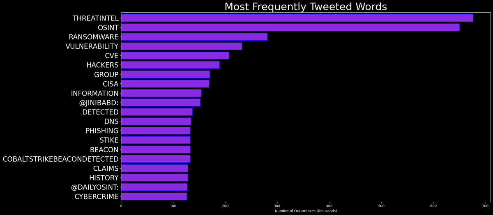

# DARKWIRE SOCIAL CYBER INSIGHTS 
🍎 **TOPIC = "threatintel"**

## AUTOMATED RESEARCH SUMMARY
     

|  Trending  |   Images | 
:-------------------------:|:-------------------------:
|        |   |   
 
 

  
The most popular user is: **bad_packets**  
 

## Mass scanning activity detected from multiple hosts checking for servers using Apache Log4j (Java logging library)… https://t.co/KSidsGeYwk 

  

### TRENDING SHARED IMAGE

|                **Sample-Tweets**        |
| :-------------: |
| RT @Malwar3Ninja: [https://t.co/otlIKKsWhQ ] 🔥 Our latest collection on #virustotal using telemetry gathered through our proactive hunter "… |
| Joe's team was adjacent to mine during the layoffs yesterday. I don't know that I've ever seen such a concentration… https://t.co/dtcItzaHVK |
| RT @DailyOsint: Do you need to detect the technologies behind a website?Try BuiltWith, which also has a browser extension.https://t.co/… |

## RELATED METRICS 
| Metric | Value |
| ------------- | ------------- |
| #1 Most tweeted to  | **DailyOsint** |
| #2 Most tweeted to  | **RedPacketSec** |
| #3 Most tweeted to  | **fr0gger_** |
| NewProfiles (less than 10 days) | 0.0%  |
| Tweeters with < 10 followers  | 2.5%|
| Tweeters with > 1000000 followers  | 0.0%  |

## MOST POPULAR TWEET TERMS 

| Popularity Rank  | Term |
| ------------- | ------------- |
| first  | **OSINT**  |
| second  | **MALWARE**  |
| third  | **THREATINTEL** |
| fourth  | **@DAILYOSINT:**  |
| fifth  | **ANALYSIS**  |

## Twitter Bio Analysis
### SENTIMENT ANALYSIS

VIEWS WERE : **SUBJECTIVE**  (27.27%) & **NEGATIVELY-SUBJECTIVE** (18.18%) **OBJECTIVE** (54.55%)

### TWEET SAMPLE 
| Random value picked from array |
| ------------- |
|RT @Malwar3Ninja: [https://t.co/otlIKKsosi ] 🔥 Our latest collection on #virustotal using telemetry gathered through our proactive hunter "… |

### MOST RETWEETED 

| The most retweeted user is: **bad_packets**  |
| ------------- |
| Mass scanning activity detected from multiple hosts checking for servers using Apache Log4j (Java logging library)… https://t.co/KSidsGeYwk |

# Potential Fake Accounts
 

<b> This report is AUTOMATED and not hand crafted, it is designed for pulling metrics on a given keyword or hashtag and performs a series of reporting and analysis.</b>  
### CONCLUSION & EXTERNAL ANALYSIS

*This is my [Adam McMurchie`s] opinion on the data from the tweets, it serves as no objective truth.Since the tweets themselves are a mixture of fact & opinion. 
Authors analytical summary on request.
**RECOMMENDATIONS** WILL BE UPDATED IN NEXT  24 HOURS  