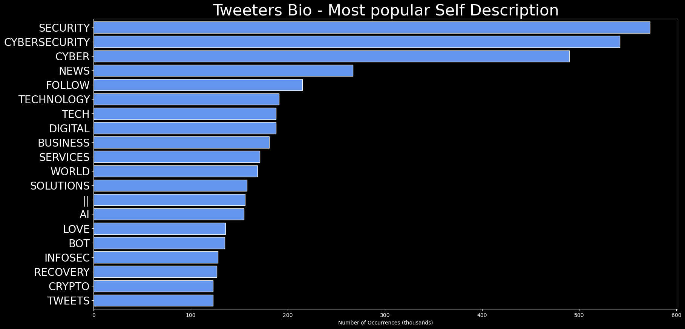

# DARKWIRE SOCIAL CYBER INSIGHTS 
&#x1F34E; **TOPIC = "cybersecurity"**

## AUTOMATED RESEARCH SUMMARY
     

|  Trending  |   Images | 
:-------------------------:|:-------------------------:
|        |   |   
 
 

  
The most popular user is: **JoeBiden**  
 

## This cybersecurity attack happened on Donald Trump’s watch. But rest assured that even if he does not take it serio… https://t.co/WfYn2KVixh 

  

### TRENDING SHARED IMAGE

|                **Sample-Tweets**        |
| :-------------: |
| RT @thinksysinc: Python–The Perfect Language for Machine LearningHere is how? https://t.co/sImojpOSgW#MachineLearning #DataScience #Pyt… |
| The new Cybersecurity Trending Dashboard (beta) https://t.co/uoaROLa5L8 #feedly |
| RT @groong: Conversation with @RubenMuradyan -1st hand experience being called up and serving in the war in #Artsakh -CyberSecurity incid… |

## RELATED METRICS 
| Metric | Value |
| ------------- | ------------- |
| #1 Most tweeted to  | **Paula_Piccard** |
| #2 Most tweeted to  | **ocean20182018** |
| #3 Most tweeted to  | **thehill** |
| NewProfiles (less than 10 days) | 0.62%  |
| Tweeters with < 10 followers  | 1.88%|
| Tweeters with > 1000000 followers  | 0.02%  |

## MOST POPULAR TWEET TERMS 

| Popularity Rank  | Term |
| ------------- | ------------- |
| first  | **AI**  |
| second  | **MACHINELEARNING**  |
| third  | **DATA** |
| fourth  | **PYTHON**  |
| fifth  | **DATASCIENCE**  |

## Twitter Bio Analysis
### SENTIMENT ANALYSIS

VIEWS WERE : **SUBJECTIVE**  (7.69%) & **NEGATIVELY-SUBJECTIVE** (7.69%) **OBJECTIVE** (84.62%)

### TWEET SAMPLE 
| Random value picked from array |
| ------------- |
|RT @arnabch01: @chantalsimonato @sminaev2015 @FriseSally @angelicagallegs @YukariKingdom18 @mhall55nine @eoff_sylvia @semicvet50 @BrindusaB… |

### MOST RETWEETED 

| The most retweeted user is: **JoeBiden**  |
| ------------- |
| This cybersecurity attack happened on Donald Trump’s watch. But rest assured that even if he does not take it serio… https://t.co/WfYn2KVixh |

# Potential Fake Accounts
 
# EdgarAp84614838USER INFO

 
`User ScreenName:` EdgarAp84614838 
 
`User chosen Name:` Edgar Aponte 
 
`Is the User Verified?:` False 
 
`User signup date?:` Thu Jan 28 19:15:14 +0000 2021 
 
`User Description?:` integrity honor loyalty with a little bit of crazy 
 
`Followers?: `6 
 
`Following?:` 309 
 
`User URL?:` None 
 
`Location:`  
 
`Number of tweets extracted`  : 200 
 
`Profile image:` http://pbs.twimg.com/profile_images/1354870940191088648/uyS4Uw0u_normal.jpg 
 
`Number of tweets excluding replies:` 494 
 

 

 
## User Top tweeted words 
 
**@EDGARAP84614838:** 47 , **GOING** 29 , **EVIDENCE** 28 , **COMMUNIST** 26 , **PEOPLE** 26 , **FRAUD** 25 , **GOVERNMENT** 24 , **NEED** 24 , **VOTER** 22 , **CRIMINAL** 20 , **THAT'S** 16 , **BIDEN** 16 , **YOU'RE** 15 , **JOE** 15 , **DON'T** 14 , **SECRET** 13 , **@THEHILL** 13 , **STOP** 12 , **TOP** 12 , **@REPDWSTWEETS** 12 , 
 
## What this user tweeted
 
RT @thehill: Intel agency warns of threats from China collecting sensitive US health data https://t.co/yfVyiJRCSd https://t.co/NyDSa2jIrT
 
# VanHoAdamUSER INFO

 
`User ScreenName:` VanHoAdam 
 
`User chosen Name:` Adam VanHo 
 
`Is the User Verified?:` False 
 
`User signup date?:` Sun Jan 31 02:34:03 +0000 2021 
 
`User Description?:` Lawyer | Occasional Writer | Locked Out of Old Account | Found Wandering Courthouses & Cornfields | ⚖️ | #AppellateTwitter | #LawTwitter | 🇺🇸 
 
`Followers?: `79 
 
`Following?:` 366 
 
`User URL?:` https://t.co/L3x8rrqzf2 
 
`Location:` Cornfields & Courthouses, Ohio 
 
`Number of tweets extracted`  : 90 
 
`Profile image:` http://pbs.twimg.com/profile_images/1355880834268618756/12diu2iQ_normal.jpg 
 
`Number of tweets excluding replies:` 90 
 

 

 
## User Top tweeted words 
 
**VERY** 5 , **PEOPLE** 4 , **TIME** 4 , **I’M** 4 , **HEALTH** 3 , **“IT’S** 3 , **HERE** 3 , **TOLD** 3 , **MAYBE** 3 , **GOOD** 3 , **STILL** 3 , **@THEHILL:** 2 , **US** 2 , **THOUGHT** 2 , **ALWAYS** 2 , **SOUNDS** 2 , **ITS** 2 , **MOM’S** 2 , **COUSIN** 2 , **WORKED** 2 , 
 
## What this user tweeted
 
RT @thehill: Intel agency warns of threats from China collecting sensitive US health data https://t.co/yfVyiJRCSd https://t.co/NyDSa2jIrT
 
# centocodeUSER INFO

 
`User ScreenName:` centocode 
 
`User chosen Name:` CentoCode.com 
 
`Is the User Verified?:` False 
 
`User signup date?:` Tue Jan 26 23:37:15 +0000 2021 
 
`User Description?:` CentoCode technology blog posting site. Owner: @sunanda3599 
 
`Followers?: `55 
 
`Following?:` 2 
 
`User URL?:` https://t.co/mkQMbIFrc9 
 
`Location:`  
 
`Number of tweets extracted`  : 200 
 
`Profile image:` http://pbs.twimg.com/profile_images/1355900234665082883/ZRHWmUqN_normal.jpg 
 
`Number of tweets excluding replies:` 2138 
 

 

 
## User Top tweeted words 
 
**AI** 65 , **TECHNOLOGY** 22 , **JAVASCRIPT** 19 , **DATASCIENCE** 18 , **PYTHON** 18 , **PROGRAMMING** 17 , **100DAYSOFCODE** 17 , **CODING** 16 , **DATA** 16 , **ANALYTICS** 15 , **TECH** 15 , **MACHINELEARNING** 14 , **BIGDATA** 14 , **NEW** 14 , **LEARNING** 11 , **ARTIFICIALINTELLIGENCE** 10 , **VIA** 10 , **2021** 9 , **IOT** 9 , **HELP** 8 , 
 
## What this user tweeted
 
RT @Paula_Piccard: AI in health care creates unique data challenges 

#MachineLearning #Python #NLP #Analytics #AI #100DaysOfCode 
#DEVComm…
 
# FinTechPRO_orgUSER INFO

 
`User ScreenName:` FinTechPRO_org 
 
`User chosen Name:` FinTechPRO.org - the Bot 
 
`Is the User Verified?:` False 
 
`User signup date?:` Sun Jan 31 05:37:48 +0000 2021 
 
`User Description?:` Beep boop... I'm a bot. 
 
`Followers?: `29 
 
`Following?:` 0 
 
`User URL?:` None 
 
`Location:`  
 
`Number of tweets extracted`  : 200 
 
`Profile image:` http://pbs.twimg.com/profile_images/1356301354105516033/3pR3mk_S_normal.jpg 
 
`Number of tweets excluding replies:` 1503 
 

 

 
## User Top tweeted words 
 
**CRYPTO** 48 , **ETHEREUM** 25 , **ETH** 22 , **PRICE:** 21 , **PROJECT** 20 , **🔻🔻🔻** 20 , **POSITION** 17 , **$ETH** 16 , **GWEI** 15 , **@HOBABOT:** 15 , **ENTRY** 15 , **ALGOTRADE** 15 , **BINANCEFUTURE** 15 , **SELL** 15 , **BITCOIN** 14 , **CRYPTOCURRENCY** 13 , **TIME** 13 , **BUSINESS** 13 , **ETHEREUMRT** 12 , **🚀🚀🚀** 11 , 
 
## What this user tweeted
 
RT @Muthee_Wanjohi: Expect lots of socially engineered content - in readiness of the upcoming Kenyan elections, in your timelines #kenyan #…RT @payoda: 20% of the #healthcare space emails were false in 2017.
#Healthcare has the most instances of #ransomware assaults over any oth…RT @payoda: The current state of #healthcare #cybersecurity: Very few #healthcare providers in the #US have fully functional #security prog…RT @HumanPatchza: ⚠️📩#Phishing is an email scam where fraudsters send fake but official-looking emails in an attempt to gain access to some…RT @payoda: #Hackers are using the panic-stricken mindset of the people as a golden opportunity to set up traps. It is high time that you g…RT @CTIN_Global: Working daily to make cyber threat intelligence more accessible, effective and actionable. We are stronger together. #cybe…RT @Postsemreh: A #cybersecurity poem:

I get in bed
Checking tweets
Winding down to sleep. 
Employees call...
Go login - 
Critical bridge…RT @kali_reanna_: I’m curious. Which one do you prefer and why? I know Tcpdump is right in the Linux command line but Wireshark seems to be…RT @sign3tsh3l1: I am glad to announce my joining @securitybrigade as an Security Consultant, its gonna be a wonderful journey ahead.😊
I re…RT @databackup: Rumors top UK boffins may have collared our covid txt sms scam scammers #ipsec #cybersecurity @michellehtweetRT @BKRAsiapac: Time to reassess your Cybersecurity.

Sharing this timely post from Ollie Hunniford of Walker Wayland NSW Sydney. Click NOW…RT @Postsemreh: Hey, #cybersecurity #postypoll. 

Would you use/allow an Alexa/google in your home? (Enabled/Internet connected)
 
# von_cyberUSER INFO

 
`User ScreenName:` von_cyber 
 
`User chosen Name:` CyberVon 
 
`Is the User Verified?:` False 
 
`User signup date?:` Sat Jan 30 04:07:02 +0000 2021 
 
`User Description?:` A student of Cyber Security, looking to network, grow & LEARN! 
 
`Followers?: `4 
 
`Following?:` 42 
 
`User URL?:` None 
 
`Location:`  
 
`Number of tweets extracted`  : 16 
 
`Profile image:` http://pbs.twimg.com/profile_images/1355367074000994305/thhilor4_normal.jpg 
 
`Number of tweets excluding replies:` 16 
 

 

 
## User Top tweeted words 
 
**SOME** 3 , **SECURITY** 3 , **CYBERATTACK** 2 , **VIA** 2 , **5** 2 , **CYBERSECURITY** 2 , **&GT;&GT;&GT;** 2 , **MALWARE** 2 , **GOOD** 2 , **ALWAYS** 2 , **CHANGE** 2 , **WINDOWS** 2 , **WORK** 2 , **OSINT** 2 , **RT** 1 , **@HACKERSREVIEW_:** 1 , **RUSSIAN** 1 , **AUTHORITIES** 1 , **DEVELOPED** 1 , **PLAN** 1 , 
 
## What this user tweeted
 
RT @HackersReview_: The Russian Authorities Have Developed a Plan in Case of "Internet Disconnection" From Abroad  https://t.co/QJvKYKYtGU…Fun tip I just learned doing some late night homework &amp; messing around with my anti-virus... SCAN YOUR INSTALL FILE… https://t.co/fEEItEHkuTRT @digitalke1: A 5 stage of #cybersecurity framework &gt;&gt;&gt; #PwC via @MikeQuindazzi &gt;&gt;&gt; #Cybersercurity #IoT #AI #CyberAttack #Malware #Ranso…
 
# RahulYa54188758USER INFO

 
`User ScreenName:` RahulYa54188758 
 
`User chosen Name:` Rahul Yadav 
 
`Is the User Verified?:` False 
 
`User signup date?:` Thu Jan 28 06:06:46 +0000 2021 
 
`User Description?:`  
 
`Followers?: `4 
 
`Following?:` 115 
 
`User URL?:` None 
 
`Location:`  
 
`Number of tweets extracted`  : 73 
 
`Profile image:` http://abs.twimg.com/sticky/default_profile_images/default_profile_normal.png 
 
`Number of tweets excluding replies:` 73 
 

 

 
## User Top tweeted words 
 
**BUGBOUNTY** 12 , **BUGBOUNTYTIPS** 10 , **BYPASS** 9 , **FIND** 8 , **XSS** 7 , **USE** 5 , **BUGBOUNTYTIP** 5 , **TRY** 5 , **BUG** 5 , **NEW** 5 , **SOME** 4 , **HOST** 4 , **GOOGLE** 4 , **INFOSEC** 4 , **PAYLOAD** 4 , **RECON** 4 , **THANKS** 4 , **@REMONSEC** 4 , **FFUF** 4 , **DIR** 3 , 
 
## What this user tweeted
 
RT @daffainfo: Added "Exposed Source Code" to my repository!

Thank you for the stars and forks, from 47 stars to 120 stars!!

Read more: h…
 
# Mohan02777351USER INFO

 
`User ScreenName:` Mohan02777351 
 
`User chosen Name:` Mohan 
 
`Is the User Verified?:` False 
 
`User signup date?:` Tue Feb 02 05:46:51 +0000 2021 
 
`User Description?:` 𝚑𝚊𝚙𝚙𝚢 𝚗𝚎𝚜 
 
`Followers?: `0 
 
`Following?:` 51 
 
`User URL?:` None 
 
`Location:`  
 
`Number of tweets extracted`  : 8 
 
`Profile image:` http://pbs.twimg.com/profile_images/1356479428818165763/PFKm1lQX_normal.jpg 
 
`Number of tweets excluding replies:` 8 
 

 

 
## User Top tweeted words 
 
**RT** 1 , **@ANUSHKASHARMA:** 1 , **LIVED** 1 , **TOGETHER** 1 , **LOVE** 1 , **PRESENCE** 1 , **GRATITUDE** 1 , **WAY** 1 , **LIFE** 1 , **LITTLE** 1 , **VAMIKA** 1 , **❤️** 1 , **TAKEN** 1 , **IT…RT** 1 , **@BRAHMANANDAMOFF:** 1 , **THANK** 1 , **🙏🏻** 1 , **HTTPS://TCO/FD33BSWBOBRT** 1 , **@REALRADIKAA:** 1 , **HAPPY** 1 , 
 
## What this user tweeted
 
RT @Convergenc: India to discuss spectrum roadmap with #Telcos, #Satellite &amp; tech majors like @Apple, @Google &amp; @OneWeb

Source: @ETTelecom…
 
# MaltWizzyUSER INFO

 
`User ScreenName:` MaltWizzy 
 
`User chosen Name:` S1ngleMaltWizzy 
 
`Is the User Verified?:` False 
 
`User signup date?:` Sat Jan 23 10:31:05 +0000 2021 
 
`User Description?:` HODL $VET $VTHO $HAI (referral code: DJPFRB) 
Gems $WOO $TEL $SNTVT $HAKKA
Interests #cryptoart #NFTs @immutable @illuviumio 
 
`Followers?: `24 
 
`Following?:` 39 
 
`User URL?:` None 
 
`Location:` Germany 
 
`Number of tweets extracted`  : 144 
 
`Profile image:` http://pbs.twimg.com/profile_images/1354157539336847365/4mKergbb_normal.jpg 
 
`Number of tweets excluding replies:` 144 
 

 

 
## User Top tweeted words 
 
**$TEL** 15 , **TELCOIN** 14 , **$HAI** 9 , **VECHAIN** 9 , **$VTHO** 9 , **$VET** 9 , **REALLY** 8 , **VEFAM** 7 , **BLOCKCHAIN** 7 , **WHICH** 7 , **LITTLE** 7 , **VTHO** 7 , **BIG** 7 , **BOUGHT** 7 , **$DOGE** 7 , **@HACKENCLUB** 6 , **CRYPTO** 6 , **NEXT** 6 , **MAKE** 6 , **VET** 6 , 
 
## What this user tweeted
 
Code4Cashback: YRR54T

📲 @hackenclub App https://t.co/y02dDJJmWb

🛒 $HAI

💳 membership

Receive:
#passwordmanager… https://t.co/UeGdVfRXtl
 
# AbroTradeUSER INFO

 
`User ScreenName:` AbroTrade 
 
`User chosen Name:` Manzoor Abro 
 
`Is the User Verified?:` False 
 
`User signup date?:` Sun Jan 31 07:02:14 +0000 2021 
 
`User Description?:` Engineer, IT business analyst 
 
`Followers?: `7 
 
`Following?:` 30 
 
`User URL?:` None 
 
`Location:` Canada 
 
`Number of tweets extracted`  : 1 
 
`Profile image:` http://pbs.twimg.com/profile_images/1355777656638251016/yy_bIJj2_normal.jpg 
 
`Number of tweets excluding replies:` 1 
 

 

 
## User Top tweeted words 
 
**BILLION** 3 , **RT** 1 , **@QASIMTRADEX:** 1 , **ALERT:** 1 , **$SFOR** 1 , **SHARES** 1 , **REDUCED** 1 , **10** 1 , **14** 1 , **4** 1 , **UPDATED** 1 , **TODAYGET** 1 , **READY** 1 , **RIDE** 1 , **NEXT** 1 , **REVOLUT…** 1 , 
 
## What this user tweeted
 
RT @QasimTradeX: ALERT: $SFOR shares reduced by 10 billion, from 14 Billion to 4 Billion , updated today.Get ready to ride the next revolut…
 
# Anonymo65151149USER INFO

 
`User ScreenName:` Anonymo65151149 
 
`User chosen Name:` Anonymous 
 
`Is the User Verified?:` False 
 
`User signup date?:` Fri Jan 29 13:03:51 +0000 2021 
 
`User Description?:` proficiency in operating systems 
#coder  
#Webdesigner
#intrested in hacking
#researcher 
 
`Followers?: `6 
 
`Following?:` 26 
 
`User URL?:` None 
 
`Location:`  
 
`Number of tweets extracted`  : 29 
 
`Profile image:` http://pbs.twimg.com/profile_images/1355198219702001665/SypwBtHD_normal.jpg 
 
`Number of tweets excluding replies:` 29 
 

 

 
## User Top tweeted words 
 
**IOT** 40 , **CYBERCRIME** 26 , **CYBERNEWS** 26 , **HACKING** 26 , **HACKER** 26 , **PROGRAMMER** 24 , **PRPGRAMMING** 22 , **CYBERSECURITY** 17 , **DEVELOPER…** 14 , **IOT…** 8 , **U** 2 , **FUNNY** 2 , **PRPGRAMMING…** 2 , **PROGRAMMER…** 2 , **HTTPS://TCO/EXJ6SGRYRRBE** 1 , **CAREFUL** 1 , **UPLOAD** 1 , **HTTPS://TCO/HLXBJ0FHXXCYBERSECURITY** 1 , **HTTPS://TCO/0S65N6RYKTCYBERSECURITY** 1 , **HTTPS://TCO/7QVK4EJ8MHCYBERSECURITY** 1 , 
 
## What this user tweeted
 
Be careful what u upload
#cybersecurity #cybercrime #CyberNews #hacking #hacker #iot #programmer #prpgramming #iot… https://t.co/HLxBj0fhXx
 
# InstaColdSystemUSER INFO

 
`User ScreenName:` InstaColdSystem 
 
`User chosen Name:` Dominic Alvieri 
 
`Is the User Verified?:` False 
 
`User signup date?:` Tue Feb 02 01:50:23 +0000 2021 
 
`User Description?:` InstaColdSystems Technologies, Inc. 
 
`Followers?: `1 
 
`Following?:` 3 
 
`User URL?:` None 
 
`Location:` United States 
 
`Number of tweets extracted`  : 1 
 
`Profile image:` http://pbs.twimg.com/profile_images/1356457138621722624/M8uJwGTJ_normal.jpg 
 
`Number of tweets excluding replies:` 1 
 

 

 
## User Top tweeted words 
 
**RT** 1 , **@ALVIERID:** 1 , **SERIOUS** 1 , **PROBLEM** 1 , **CONFRONTING** 1 , **NEARLY** 1 , **ONLINE** 1 , **PLATFORM** 1 , **EXPLOITATION** 1 , **CHILDREN** 1 , **SOCIAL** 1 , **MEDIA** 1 , **CRE…** 1 , 
 
## What this user tweeted
 
RT @AlvieriD: There is a serious problem confronting nearly every online platform.

Exploitation of children on Social Media

I will be cre…
 
# sheilashin5USER INFO

 
`User ScreenName:` sheilashin5 
 
`User chosen Name:` sheilashin 
 
`Is the User Verified?:` False 
 
`User signup date?:` Sun Jan 24 04:06:16 +0000 2021 
 
`User Description?:` Biologist(Ph.D. in microbio); Observer of universal phenomena; Student of world philosophy & humanities; A photographer; Volunteer math tutor for young adults 
 
`Followers?: `61 
 
`Following?:` 262 
 
`User URL?:` None 
 
`Location:`  
 
`Number of tweets extracted`  : 200 
 
`Profile image:` http://pbs.twimg.com/profile_images/1353192690444349440/Qt6gbgSQ_normal.jpg 
 
`Number of tweets excluding replies:` 2363 
 

 

 
## User Top tweeted words 
 
**@THEHILL:** 36 , **BIDEN** 16 , **GOP** 14 , **US** 13 , **SENATE** 11 , **TRUMP** 11 , **NEW** 10 , **RELIEF** 10 , **@WASHINGTONPOST:** 10 , **TAYLOR** 9 , **REP** 9 , **PRESIDENT** 8 , **HOUSE** 8 , **SENATORS** 8 , **GOOD** 7 , **FIRST** 7 , **CORONAVIRUS** 7 , **@BBCNEWS:** 6 , **GREENE** 6 , **@CNN:** 6 , 
 
## What this user tweeted
 
RT @thehill: Intel agency warns of threats from China collecting sensitive US health data https://t.co/hhWS8QdAJJ https://t.co/MEXHovVqGa
 
# Dharapa07352700USER INFO

 
`User ScreenName:` Dharapa07352700 
 
`User chosen Name:` Dharapatel 
 
`Is the User Verified?:` False 
 
`User signup date?:` Tue Jan 26 11:28:06 +0000 2021 
 
`User Description?:` Digital marketing 
 
`Followers?: `7 
 
`Following?:` 6 
 
`User URL?:` https://t.co/Qid0bbuPen 
 
`Location:` गांधीनगर, भारत 
 
`Number of tweets extracted`  : 32 
 
`Profile image:` http://pbs.twimg.com/profile_images/1354028538295328769/cUcpefvy_normal.jpg 
 
`Number of tweets excluding replies:` 32 
 

 

 
## User Top tweeted words 
 
**@ASTERISMINFOSOF:** 16 , **MARKETING** 13 , **@NORAHAR44660118:** 11 , **DIGITAL** 8 , **SOCIAL** 6 , **MEDIA** 5 , **PROGRAMMING** 4 , **WHICH** 4 , **JAVASCRIPT** 4 , **BUSINESS** 4 , **GROWTH** 4 , **ONLINE** 3 , **DIGITALMARKETING** 3 , **HERE** 3 , **STARTUP** 3 , **GOOGLE** 3 , **FEW** 2 , **LANGUAGES** 2 , **LANGUAGE** 2 , **DEV** 2 , 
 
## What this user tweeted
 
RT @asterisminfosof: What are the must have tools for developers?? #MachineLearning #DEVCommunity #Python #cybersecurity #sundayvibes #prog…
 
# HolyBrains1USER INFO

 
`User ScreenName:` HolyBrains1 
 
`User chosen Name:` Holy Brains Team™ 
 
`Is the User Verified?:` False 
 
`User signup date?:` Sun Jan 24 15:25:45 +0000 2021 
 
`User Description?:` Holy Brains Cyber Academy | Hacker Service | © 2017 🇮🇱🇦🇿 
 
`Followers?: `20 
 
`Following?:` 6 
 
`User URL?:` https://t.co/OEXgXjxEJd 
 
`Location:` Israel 
 
`Number of tweets extracted`  : 29 
 
`Profile image:` http://pbs.twimg.com/profile_images/1353363477969178624/fcptJ-IF_normal.jpg 
 
`Number of tweets excluding replies:` 29 
 

 

 
## User Top tweeted words 
 
**SHUSHA** 11 , **AZERBAIJAN** 6 , **LIVE** 6 , **SUMMER** 6 , **CITIES** 6 , **AZERBAIJANI** 6 , **🇦🇿** 5 , **@THEHACKERSNEWS:** 3 , **CITY** 3 , **KARABAKH** 3 , **KARABAKHISAZERBAIJAN** 3 , **SHUSHA🇦🇿** 3 , **KHANKENDI🇦🇿** 3 , **GO** 3 , **YAŞA** 3 , **@HACKER0X01:** 2 , **PEN** 2 , **TESTING** 2 , **DNSMASQ** 2 , **NEW** 2 , 
 
## What this user tweeted
 
RT @Hacker0x01: “Make sure all vital functions of society [...] establish #vulnerabilitydisclosure policies... [to] remediate vulnerabiliti…
 
# Maureen37031768USER INFO

 
`User ScreenName:` Maureen37031768 
 
`User chosen Name:` Maureen OConnell 
 
`Is the User Verified?:` False 
 
`User signup date?:` Wed Jan 27 23:23:08 +0000 2021 
 
`User Description?:`  
 
`Followers?: `1 
 
`Following?:` 6 
 
`User URL?:` None 
 
`Location:`  
 
`Number of tweets extracted`  : 7 
 
`Profile image:` http://pbs.twimg.com/profile_images/1354571290124853248/9lLTZxsQ_normal.jpg 
 
`Number of tweets excluding replies:` 7 
 

 

 
## User Top tweeted words 
 
**@MENLOSECURITY:** 6 , **CYBERSECURITY** 2 , **THROUGH** 2 , **SECURITY** 2 , **RECENTLY** 2 , **MALWARE** 2 , **THREAT** 2 , **KNOWN** 2 , **RT** 1 , **ICYMI** 1 , **DATAPRIVACYDAY** 1 , **RALLIED** 1 , **MANY** 1 , **PROFESSIONALS** 1 , **INCLUDING** 1 , **CTO** 1 , **@K0WS1K** 1 , **REFLECT** 1 , **CURRENT** 1 , **ST…RT** 1 , 
 
## What this user tweeted
 
RT @TechnologyMagBC: Mike East, VP EMEA of @menlosecurity on empowering business through air-tight, automated digital security in the cloud…
 
# FarFromJad3dUSER INFO

 
`User ScreenName:` FarFromJad3d 
 
`User chosen Name:` jade francis 
 
`Is the User Verified?:` False 
 
`User signup date?:` Tue Feb 02 02:23:51 +0000 2021 
 
`User Description?:` Cyber security professional who has some things to say. 
 
`Followers?: `0 
 
`Following?:` 7 
 
`User URL?:` None 
 
`Location:`  
 
`Number of tweets extracted`  : 1 
 
`Profile image:` http://pbs.twimg.com/profile_images/1356428615299325953/Mq52Lmj3_normal.jpg 
 
`Number of tweets excluding replies:` 1 
 

 

 
## User Top tweeted words 
 
**ECHO** 1 , **HELLO** 1 , **WORLD** 1 , **CYBERSECURITY** 1 , **NEWB** 1 , 
 
## What this user tweeted
 
Echo hello world #CyberSecurity #newb
 
# yadanar98908172USER INFO

 
`User ScreenName:` yadanar98908172 
 
`User chosen Name:` yadanar 
 
`Is the User Verified?:` False 
 
`User signup date?:` Tue Feb 02 02:15:17 +0000 2021 
 
`User Description?:` ေမတၱာအရင္းခံ 
 
`Followers?: `0 
 
`Following?:` 0 
 
`User URL?:` None 
 
`Location:`  
 
`Number of tweets extracted`  : 6 
 
`Profile image:` http://pbs.twimg.com/profile_images/1356426062239064065/LKNpPBZY_normal.jpg 
 
`Number of tweets excluding replies:` 6 
 

 

 
## User Top tweeted words 
 
**အရင္ကပါတီ႐ူးလို႔စိတ္မဝင္စားဘူး** 1 , **အခုက** 1 , **ျပည္သူ႔စီးပြားေရး** 1 , **အဆက္သြယ္ေတြပါျဖတ္လို႔စိတ္ဝင္စားသြားတာ** 1 , **INTERESTED** 1 , **IN…** 1 , **HTTPS://TCO/LMTZSGOPN2HTTPS://TCO/UGMQM0OJAORT** 1 , **@USCERT_GOV:** 1 , **💡** 1 , **TIPTUESDAY:** 1 , **BEST** 1 , **WAY** 1 , **PREVENT** 1 , **RANSOMWARE** 1 , **ATTACKS** 1 , **FIX** 1 , **ANY** 1 , **SECURITY** 1 , **VULNERABILITY** 1 , **PATCH** 1 , 
 
## What this user tweeted
 
RT @USCERT_gov: 💡 #TipTuesday: The best way to prevent ransomware attacks is to fix any security vulnerability and patch your IT system on…
 
# hackenthorUSER INFO

 
`User ScreenName:` hackenthor 
 
`User chosen Name:` hackenthor 
 
`Is the User Verified?:` False 
 
`User signup date?:` Tue Feb 02 02:12:00 +0000 2021 
 
`User Description?:` HackenAi is the top-tier crypto cybersecurity asset in the VeChain Mainnet 
 
`Followers?: `4 
 
`Following?:` 26 
 
`User URL?:` None 
 
`Location:`  
 
`Number of tweets extracted`  : 25 
 
`Profile image:` http://pbs.twimg.com/profile_images/1356425701277237249/aRDKTwii_normal.jpg 
 
`Number of tweets excluding replies:` 25 
 

 

 
## User Top tweeted words 
 
**$HAI** 13 , **@HACKENCLUB** 6 , **@BLOCKCHAINIUS** 3 , **@TRAKNOLOGIST** 3 , **@VEXCHANGEIO** 3 , **CRYPTO** 3 , **@RICHARD31518380** 2 , **@DJMCAULEY** 2 , **@VECHAINSTEVE** 2 , **@JAKEPRIOR88** 2 , **HAITHESTANDARD** 2 , **XRPCOMMUNITY** 2 , **CHECK** 2 , **JOIN** 2 , **HACKEN** 2 , **CLUB** 2 , **BEST** 2 , **MOON** 2 , **HAHA** 2 , **GOING** 2 , 
 
## What this user tweeted
 
RT @mrfrostybitz: $HAI @hackenclub Cybersecurity for crypto and defi specifically. Will be key in preventing hacks of all kinds. Already be…
 

<b> This report is AUTOMATED and not hand crafted, it is designed for pulling metrics on a given keyword or hashtag and performs a series of reporting and analysis.</b>  
### CONCLUSION & EXTERNAL ANALYSIS

*This is my [Adam McMurchie`s] opinion on the data from the tweets, it serves as no objective truth.Since the tweets themselves are a mixture of fact & opinion. 
Authors analytical summary on request.
**RECOMMENDATIONS** WILL BE UPDATED IN NEXT  24 HOURS  ges/1353858304276049921/OquWhJzJ_normal.jpg)
 
`User ScreenName:` Evablyn 
 
`User chosen Name:` EVABLYN PLACE 
 
`Is the User Verified?:` False 
 
`User signup date?:` Mon Jan 25 15:41:31 +0000 2021 
 
`User Description?:` Official Business Page.We sell Hats,Durags,Beanies,Plain Tees and many more.Payment Validates orders.Whatsapp: https://t.co/BOgVth1FIY DM is strictly business 🙏 
 
`Followers?: `358 
 
`Following?:` 526 
 
`User URL?:` None 
 
`Location:` Lagos, Nigeria 
 
`Number of tweets extracted`  : 200 
 
`Profile image:` http://pbs.twimg.com/profile_images/1353858304276049921/OquWhJzJ_normal.jpg 
 
`Number of tweets excluding replies:` 323 
 

 

 
## User Top tweeted words 
 
**U** 13 , **STILL** 10 , **GOD** 9 , **D** 9 , **HATS:3K** 7 , **3** 7 , **@SAMMIELAOLU** 7 , **PEOPLE** 7 , **PLUG** 7 , **DM** 6 , **PLZ** 6 , **UR** 6 , **PATRONIZE** 6 , **DURAGS:2500** 5 , **RT** 5 , **MONEY** 5 , **NEED** 5 , **MAKE** 5 , **HATSDURAGSPLAIN** 5 , **TEESBEANIESPLZ** 5 , 
 
## What this user tweeted
 
RT @theestcompany: Are you traveling during the holidays? Your home may have vulnerabilities that you weren't expecting. We build custom se…
 
# hashupakistaniUSER INFO

 
`User ScreenName:` hashupakistani 
 
`User chosen Name:` hashupakistani 
 
`Is the User Verified?:` False 
 
`User signup date?:` Thu Jan 28 11:43:27 +0000 2021 
 
`User Description?:` اَلْحَمْدُلِلّٰه 
 
`Followers?: `13 
 
`Following?:` 14 
 
`User URL?:` None 
 
`Location:` Pakistan 
 
`Number of tweets extracted`  : 200 
 
`Profile image:` http://pbs.twimg.com/profile_images/1354778567146672130/5MvdZImr_normal.jpg 
 
`Number of tweets excluding replies:` 973 
 

 

 
## User Top tweeted words 
 
**ایماندار_کپتان_روشن_پاکستان** 75 , **کے** 42 , **عوامی_وزیراعظم_عوام_کےساتھ** 40 , **کی** 39 , **میں** 32 , **PAKISTAN** 29 , **سے** 24 , **کو** 24 , **خان** 20 , **کا** 17 , **MINISTER** 17 , **ہے** 16 , **اور** 15 , **نے** 15 , **پاکستان** 15 , **GOVERNMENT** 15 , **KHAN** 15 , **عمران** 14 , **@PATRIOT_UJII:** 14 , **IMRAN** 14 , 
 
## What this user tweeted
 
RT @chbadar786: #DisInfoLabDestroyedIndia

However, practitioners of the Doval Doctrine must have thought through the consequences and vuln…RT @chbadar786: #DisInfoLabDestroyedIndia

However, practitioners of the Doval Doctrine must have thought through the consequences and vuln…
 
# Cryptop68058463USER INFO

 
`User ScreenName:` Cryptop68058463 
 
`User chosen Name:` Cryptopower 
 
`Is the User Verified?:` False 
 
`User signup date?:` Thu Jan 28 09:45:30 +0000 2021 
 
`User Description?:`  
 
`Followers?: `8 
 
`Following?:` 230 
 
`User URL?:` None 
 
`Location:`  
 
`Number of tweets extracted`  : 58 
 
`Profile image:` http://abs.twimg.com/sticky/default_profile_images/default_profile_normal.png 
 
`Number of tweets excluding replies:` 58 
 

 

 
## User Top tweeted words 
 
**XRP** 13 , **🔓** 10 , **CRYPTO** 9 , **BAN** 5 , **@CRYPTOBULL2020:** 5 , **PEOPLE** 5 , **SIR** 4 , **RIPPLE** 4 , **BITCOIN** 4 , **BILL** 4 , **US** 4 , **PUMP** 4 , **FUCK** 4 , **MEMBER** 3 , **KFH** 3 , **LAUNCHES** 3 , **CROSS-BORDER** 3 , **PAYMENTS** 3 , **TURKEY** 3 , **@MACKATTACKXRP** 3 , 
 
## What this user tweeted
 
RT @shashxxx: The Indian rupee is so weak that the mere existence of bitcoin exposes its vulnerabilities.
 
# oleksan74513060USER INFO

 
`User ScreenName:` oleksan74513060 
 
`User chosen Name:` oleksandr 
 
`Is the User Verified?:` False 
 
`User signup date?:` Sat Jan 23 09:26:45 +0000 2021 
 
`User Description?:`  
 
`Followers?: `0 
 
`Following?:` 10 
 
`User URL?:` None 
 
`Location:`  
 
`Number of tweets extracted`  : 25 
 
`Profile image:` http://pbs.twimg.com/profile_images/1352915102526222336/xt_-K7qC_normal.jpg 
 
`Number of tweets excluding replies:` 25 
 

 

 
## User Top tweeted words 
 
**AIRDROP** 5 , **LIVE** 4 , **DEFI** 4 , **UNISWAP** 3 , **BITCOIN** 3 , **POLKADOT** 3 , **CARR** 2 , **TOTAL** 2 , **🔘** 2 , **JOIN** 2 , **HTTPS://T…RT** 2 , **BTCU** 2 , **COMMUNITY** 2 , **COIN** 2 , **TOKEN** 2 , **TELEGRAM** 2 , **ETHEREUM** 2 , **NEXTPROTOCOL** 2 , **YAM** 2 , **2020** 2 , 
 
## What this user tweeted
 
RT @btcu_io: 🚀 We are delighted to inform the BTCU community and the public about the launch of BTCU Testnet (Test Network), on 21st Januar…
 
# NatSec_JunkyUSER INFO

 
`User ScreenName:` NatSec_Junky 
 
`User chosen Name:` Douglas McDonald 
 
`Is the User Verified?:` False 
 
`User signup date?:` Tue Jan 26 21:21:14 +0000 2021 
 
`User Description?:` Foreign Policy, NatSec, World Affairs, Naps 
 
`Followers?: `5 
 
`Following?:` 442 
 
`User URL?:` None 
 
`Location:` USA 
 
`Number of tweets extracted`  : 30 
 
`Profile image:` http://pbs.twimg.com/profile_images/1354181673252909058/U-E9E0pg_normal.jpg 
 
`Number of tweets excluding replies:` 30 
 

 

 
## User Top tweeted words 
 
**US** 4 , **RUSSIA** 4 , **TRUMP** 3 , **FOREIGN** 3 , **LAST** 3 , **POLITICS** 2 , **@FOREIGNAFFAIRS:** 2 , **GOVERNMENT** 2 , **BREAKING** 2 , **MILITARY** 2 , **COUNTRY** 2 , **KREMLIN** 2 , **FORMER** 2 , **GREAT** 2 , **FIND** 2 , **GUILTY** 2 , **ACCORDING** 2 , **ACCOUNTS** 2 , **REGION** 2 , **NEW:** 2 , 
 
## What this user tweeted
 
RT @dnvolz: NEW: Thirty percent of victims of Russia’s massive cyber espionage campaign had not installed SolarWinds software, investigator…
 
# HzamiAminaUSER INFO

 
`User ScreenName:` HzamiAmina 
 
`User chosen Name:` Hzami Amina 
 
`Is the User Verified?:` False 
 
`User signup date?:` Fri Jan 29 20:29:37 +0000 2021 
 
`User Description?:` PhD student at the Faculty of Sciences of Gabes and the Biotechnology Center of Sfax 
 
`Followers?: `1 
 
`Following?:` 5 
 
`User URL?:` None 
 
`Location:` Tunisie 
 
`Number of tweets extracted`  : 15 
 
`Profile image:` http://pbs.twimg.com/profile_images/1355274438338629632/TTGgsEQn_normal.jpg 
 
`Number of tweets excluding replies:` 15 
 

 

 
## User Top tweeted words 
 
**@HZAMIABDERRAOUF:** 12 , **في** 6 , **من** 5 , **و** 4 , **هو** 3 , **الساحلية** 3 , **دول** 3 , **شمال** 3 , **عدد** 3 , **COASTAL** 3 , **ابرز** 2 , **المناطق** 2 , **افريقيا** 2 , **فالمناطق** 2 , **سكان** 2 , **مصر** 2 , **مع** 2 , **ما** 2 , **الى** 2 , **الدول** 2 , 
 
## What this user tweeted
 
RT @HzamiAbderraouf: A new study in Nature Scientific Reports shows how the widespread overdevelopment in coastal areas North Africa is cau…
 
# Gohack10USER INFO

 
`User ScreenName:` Gohack10 
 
`User chosen Name:` Gohack 
 
`Is the User Verified?:` False 
 
`User signup date?:` Sat Jan 30 17:02:42 +0000 2021 
 
`User Description?:` fun to beak stuff & help people 
 
`Followers?: `6 
 
`Following?:` 183 
 
`User URL?:` None 
 
`Location:`  
 
`Number of tweets extracted`  : 20 
 
`Profile image:` http://abs.twimg.com/sticky/default_profile_images/default_profile_normal.png 
 
`Number of tweets excluding replies:` 20 
 

 

 
## User Top tweeted words 
 
**XSS** 4 , **@WCBOWLING:** 4 , **BUG** 3 , **SCRIPT** 3 , **CHALLENGE** 3 , **HACKERONE** 3 , **BOUNTY** 3 , **FIRST** 3 , **PROTOTYPE** 2 , **WRITEUP** 2 , **INJECTION** 2 , **WROTE** 2 , **EXPLOIT** 2 , **HERE** 2 , **$20000** 2 , **FUN** 2 , **WRITE-UP** 2 , **GITHUB** 2 , **VIA** 2 , **BURP** 2 , 
 
## What this user tweeted
 
RT @vickieli7: Learn about XXE Vulnerabilities in my new AppSec Simplified series! https://t.co/1dNeEzanGl
 
# NinnaSkyDCUSER INFO

 
`User ScreenName:` NinnaSkyDC 
 
`User chosen Name:` Ninna Sky 
 
`Is the User Verified?:` False 
 
`User signup date?:` Thu Jan 28 03:15:11 +0000 2021 
 
`User Description?:` Model/muse. Join my journey it will be fun I promise!! P327508 Check my website : https://t.co/LzZyAOSjtZ 
IG: https://t.co/TZNZobbcel
https://t.co/7NI9t89Rki 
 
`Followers?: `223 
 
`Following?:` 74 
 
`User URL?:` https://t.co/RofNQM5ESN 
 
`Location:`  
 
`Number of tweets extracted`  : 21 
 
`Profile image:` http://pbs.twimg.com/profile_images/1354630347758080002/AhMSXE2v_normal.jpg 
 
`Number of tweets excluding replies:` 21 
 

 

 
## User Top tweeted words 
 
**JAN** 7 , **FEB** 4 , **DINNER** 2 , **💘** 2 , **🥰** 2 , **HT…RT** 2 , **❤️** 2 , **BEAUTY** 2 , **26-30** 2 , **30-FEB** 2 , **SCHEDULE** 2 , **6** 2 , **RT** 1 , **@THEOFASSISTANT:** 1 , **SUBSCRIBE** 1 , **NINNA** 1 , **SKY** 1 , **🔥** 1 , **HTTPS://TCO/PU69BMMXHURT** 1 , **@SOPHIASOMAVIP:** 1 , 
 
## What this user tweeted
 
RT @MeetSophieRose: 💋🐯🖤Sophie Rose🖤🐯💋

"Women and tigers are alike. They have the same temperament, emotions, and vulnerabilities."

⛰Sccot…
 
# VRotatyyUSER INFO

 
`User ScreenName:` VRotatyy 
 
`User chosen Name:` Vlad Rotatyy 
 
`Is the User Verified?:` False 
 
`User signup date?:` Sat Jan 30 16:57:43 +0000 2021 
 
`User Description?:`  
 
`Followers?: `0 
 
`Following?:` 2 
 
`User URL?:` None 
 
`Location:`  
 
`Number of tweets extracted`  : 1 
 
`Profile image:` http://abs.twimg.com/sticky/default_profile_images/default_profile_normal.png 
 
`Number of tweets excluding replies:` 1 
 

 

 
## User Top tweeted words 
 
**BTCU** 2 , **RT** 1 , **@BTCU_IO:** 1 , **🚀** 1 , **DELIGHTED** 1 , **INFORM** 1 , **COMMUNITY** 1 , **PUBLIC** 1 , **LAUNCH** 1 , **TESTNET** 1 , **(TEST** 1 , **NETWORK)** 1 , **21ST** 1 , **JANUAR…** 1 , 
 
## What this user tweeted
 
RT @btcu_io: 🚀 We are delighted to inform the BTCU community and the public about the launch of BTCU Testnet (Test Network), on 21st Januar…
 
# CyberTitilopeUSER INFO

 
`User ScreenName:` CyberTitilope 
 
`User chosen Name:` Cybersecurity Babe 
 
`Is the User Verified?:` False 
 
`User signup date?:` Sat Jan 23 15:02:28 +0000 2021 
 
`User Description?:` 21st century babe in the cybersecurity space. Passionate and interested in raising cybersecurity awareness among teen girls. 
 
`Followers?: `7 
 
`Following?:` 19 
 
`User URL?:` https://t.co/61GCPiOlxC 
 
`Location:` Lagos, Nigeria 
 
`Number of tweets extracted`  : 3 
 
`Profile image:` http://pbs.twimg.com/profile_images/1352995413905780736/4EZt-0bb_normal.jpg 
 
`Number of tweets excluding replies:` 3 
 

 

 
## User Top tweeted words 
 
**WOMEN** 3 , **CYBERSECURITY** 3 , **SECURITY** 2 , **RT** 1 , **@CYBER:** 1 , **BEST** 1 , **WAY** 1 , **PREVENT** 1 , **RANSOMWARE** 1 , **ATTACK** 1 , **FIX** 1 , **VULNERABILITIES** 1 , **PATCH** 1 , **SYSTEM** 1 , **REGULARLY** 1 , **LEARN** 1 , **MORE:…RT** 1 , **@CYBERSECINT:** 1 , **~** 1 , **FIVE** 1 , 
 
## What this user tweeted
 
RT @cyber: The best way to prevent a #ransomware attack is to fix security vulnerabilities and patch your IT system regularly.  Learn more:…
 
# DetSuptBurnsideUSER INFO

 
`User ScreenName:` DetSuptBurnside 
 
`User chosen Name:` Ben 
 
`Is the User Verified?:` False 
 
`User signup date?:` Fri Jan 29 17:02:06 +0000 2021 
 
`User Description?:`  
 
`Followers?: `8 
 
`Following?:` 233 
 
`User URL?:` None 
 
`Location:`  
 
`Number of tweets extracted`  : 200 
 
`Profile image:` http://pbs.twimg.com/profile_images/1355206619462848515/Go1yuBkx_normal.jpg 
 
`Number of tweets excluding replies:` 457 
 

 

 
## User Top tweeted words 
 
**PEOPLE** 18 , **❤️RT** 13 , **@ERICGARLAND:** 8 , **FIRST** 7 , **@DEVISRIDHAR:** 7 , **VACCINE** 7 , **@JOBELLERINA:** 7 , **TIME** 6 , **BEING** 6 , **@AFNEIL:** 6 , **SOME** 6 , **MUCH** 6 , **@LOUISEMENSCH:** 5 , **NEW** 5 , **WELL** 5 , **BAD** 5 , **LIE** 5 , **YESTERDAY** 4 , **I’M** 4 , **CALLED** 4 , 
 
## What this user tweeted
 
RT @cyber: The best way to prevent a #ransomware attack is to fix security vulnerabilities and patch your IT system regularly.  Learn more:…
 
# Glen_EmrgMgmntUSER INFO

 
`User ScreenName:` Glen_EmrgMgmnt 
 
`User chosen Name:` Glen 
 
`Is the User Verified?:` False 
 
`User signup date?:` Sat Jan 30 14:24:49 +0000 2021 
 
`User Description?:` Monitoring for news and policy updates related to my job
Not political........RTs =/= Endorsements 
 
`Followers?: `2 
 
`Following?:` 117 
 
`User URL?:` None 
 
`Location:`  
 
`Number of tweets extracted`  : 27 
 
`Profile image:` http://pbs.twimg.com/profile_images/1355522741244452864/HdwANSmo_normal.jpg 
 
`Number of tweets excluding replies:` 27 
 

 

 
## User Top tweeted words 
 
**@CARRYBEYOND** 12 , **@TB_TIMES** 12 , **PANDEMIC** 5 , **VACCINE** 3 , **AFTER** 3 , **NEW** 3 , **HERE** 3 , **FLORIDA** 3 , **STATE** 3 , **MAKE** 2 , **ONCE** 2 , **COUNTY** 2 , **PEOPLE** 2 , **REMEMBER** 2 , **THERE'S** 2 , **ITS** 2 , **WORK** 2 , **COULD** 2 , **COVID-19** 2 , **@PETERDREW** 1 , 
 
## What this user tweeted
 
@ohiostreetjoe @carrybeyond @TB_Times Remember, the phases follow the populations with the greatest vulnerabilities… https://t.co/B5A5abO6o8
 
# CaresEastonUSER INFO

 
`User ScreenName:` CaresEaston 
 
`User chosen Name:` EastonCares 
 
`Is the User Verified?:` False 
 
`User signup date?:` Mon Jan 25 16:31:24 +0000 2021 
 
`User Description?:` Referral and assistant services for libertine individuals; Discreet Matchmaker 
eastoncares@safeoffice.com 
 
`Followers?: `12 
 
`Following?:` 17 
 
`User URL?:` None 
 
`Location:` Washington DC 
 
`Number of tweets extracted`  : 13 
 
`Profile image:` http://pbs.twimg.com/profile_images/1353743244870488064/5lP1IhAL_normal.jpg 
 
`Number of tweets excluding replies:` 13 
 

 

 
## User Top tweeted words 
 
**GOOD** 2 , **@SUMMERSEGALXO:** 2 , **HERE** 2 , **TIME** 2 , **AGAIN** 2 , **AVAILABLE** 2 , **@WHORESOFYORE:** 2 , **A…RT** 2 , **RT** 1 , **@MEETSOPHIEROSE:** 1 , **💋🐯🖤SOPHIE** 1 , **ROSE🖤🐯💋** 1 , **"WOMEN** 1 , **TIGERS** 1 , **ALIKE** 1 , **SAME** 1 , **TEMPERAMENT** 1 , **EMOTIONS** 1 , **VULNERABILITIES"** 1 , **⛰SCCOT…VERY** 1 , 
 
## What this user tweeted
 
RT @MeetSophieRose: 💋🐯🖤Sophie Rose🖤🐯💋

"Women and tigers are alike. They have the same temperament, emotions, and vulnerabilities."

⛰Sccot…
 
# the_slogsweeperUSER INFO

 
`User ScreenName:` the_slogsweeper 
 
`User chosen Name:` The Slog Sweeper 
 
`Is the User Verified?:` False 
 
`User signup date?:` Thu Jan 28 15:46:11 +0000 2021 
 
`User Description?:` Cricket Chat, Stats and Bantz. 🏏💡🍻 Part time 9-5 working guy. Full-time Cricket badger and Barmy Army supporter 🎺 
 
`Followers?: `36 
 
`Following?:` 283 
 
`User URL?:` None 
 
`Location:`  
 
`Number of tweets extracted`  : 76 
 
`Profile image:` http://pbs.twimg.com/profile_images/1354820645431832578/Ow-u1aOG_normal.jpg 
 
`Number of tweets excluding replies:` 76 
 

 

 
## User Top tweeted words 
 
**BEST** 8 , **CRICKET** 7 , **ENGLAND** 7 , **INDIA** 6 , **VIRAT** 6 , **BACK** 5 , **OFF** 5 , **BETTER** 5 , **DRIVE** 5 , **COVER** 5 , **@DANIEL86CRICKET** 5 , **WORLD** 4 , **FOOT** 4 , **BIG** 4 , **LOOK** 3 , **PLAYER** 3 , **SLOG** 3 , **SWEEP** 3 , **GREAT** 3 , **BEING** 3 , 
 
## What this user tweeted
 
@itsShubham0018 It’s a bit biased if you take into account all the voters bro 😂. Yes watched the whole video. I’ve… https://t.co/6PiyXe6HCt
 
# bestghorlUSER INFO

 
`User ScreenName:` bestghorl 
 
`User chosen Name:` ellabyu 
 
`Is the User Verified?:` False 
 
`User signup date?:` Sat Jan 23 17:03:44 +0000 2021 
 
`User Description?:` ella 4 life 
 
`Followers?: `86 
 
`Following?:` 165 
 
`User URL?:` None 
 
`Location:` Quezon, Calabarzon 
 
`Number of tweets extracted`  : 200 
 
`Profile image:` http://pbs.twimg.com/profile_images/1353182639759396864/uGDlsmc8_normal.jpg 
 
`Number of tweets excluding replies:` 759 
 

 

 
## User Top tweeted words 
 
**NA** 94 , **ELLA** 79 , **SA** 67 , **BBS** 48 , **MGA** 40 , **NG** 36 , **KO** 32 , **PA** 32 , **TEAM** 31 , **ANG** 27 , **BBE** 22 , **YUNG** 20 , **NI** 19 , **PO** 19 , **SI** 18 , **NATIN** 17 , **TAYO** 17 , **KAYO** 17 , **FEB1** 16 , **MAY** 16 , 
 
## What this user tweeted
 
RT @ralphellains: i have so much admiration and respect for Ella 💛 she doesn’t let her vulnerabilities get the best of her, matatag at mata…
 
# zel86813226USER INFO

 
`User ScreenName:` zel86813226 
 
`User chosen Name:` I STAN ELLA/frm HAWAII & ILOCOS fan. 
 
`Is the User Verified?:` False 
 
`User signup date?:` Thu Jan 28 11:47:55 +0000 2021 
 
`User Description?:` I STAN ELLA ❤️ Laban hanggang dulo! SUPPORT KITA #TEAM ELLA ❤️from HAWAII and FROM ILOCOS PH.🙏🙏🙏🙏🙏🙏🙏🙏🙏🙏🙏 
 
`Followers?: `55 
 
`Following?:` 137 
 
`User URL?:` None 
 
`Location:` Honolulu, HI 
 
`Number of tweets extracted`  : 200 
 
`Profile image:` http://pbs.twimg.com/profile_images/1355117495753924610/91Y2rg--_normal.jpg 
 
`Number of tweets excluding replies:` 1686 
 

 

 
## User Top tweeted words 
 
**ELLA** 86 , **SA** 51 , **FEB1** 50 , **NA** 46 , **ANG** 46 , **NG** 29 , **ELLART** 29 , **TEAM** 22 , **MGA** 21 , **NI** 19 , **SI** 19 , **@THEJESUSMESSAGE:** 17 , **KO** 15 , **BIG** 14 , **AKO** 13 , **GOD** 12 , **AIZYL** 12 , **YUNG** 12 , **KA** 12 , **TALAGA** 11 , 
 
## What this user tweeted
 
RT @ralphellains: i have so much admiration and respect for Ella 💛 she doesn’t let her vulnerabilities get the best of her, matatag at mata…
 
# parthislove_11USER INFO

 
`User ScreenName:` parthislove_11 
 
`User chosen Name:` Parth 
 
`Is the User Verified?:` False 
 
`User signup date?:` Mon Jan 25 16:27:23 +0000 2021 
 
`User Description?:`  
 
`Followers?: `7 
 
`Following?:` 26 
 
`User URL?:` None 
 
`Location:` India 
 
`Number of tweets extracted`  : 200 
 
`Profile image:` http://pbs.twimg.com/profile_images/1354298762513018886/43o99L3d_normal.jpg 
 
`Number of tweets excluding replies:` 675 
 

 

 
## User Top tweeted words 
 
**PARTHSAMTHAAN** 114 , **@LAGHATEPARTH** 62 , **PEHLEPYAARKAPEHLAGHAM** 38 , **KEEP** 31 , **STREAMING** 26 , **PARTH** 18 , **LOVE** 16 , **VIEWS** 14 , **N** 12 , **SAMTHAAN** 12 , **30M** 10 , **@TISHA34447:** 9 , **@KHUSHALIKUMAR** 9 , **@PARTHS_SQUAD_FC:** 9 , **ITS** 9 , **@_CHITRA_DHAR:** 8 , **@AARAVKIDUNIYA:** 8 , **:** 8 , **U** 8 , **GOOD** 8 , 
 
## What this user tweeted
 
RT @SphatikaMenon: No human at the age of 29 (or any age) should be "used to" vilification &amp; slander. The heart feels heavy picturing this…
 
# PleaseBourbonUSER INFO

 
`User ScreenName:` PleaseBourbon 
 
`User chosen Name:` AnotherBourbonPlease 
 
`Is the User Verified?:` False 
 
`User signup date?:` Sat Jan 23 13:21:00 +0000 2021 
 
`User Description?:` On one bourbon and eager for another 
 
`Followers?: `2 
 
`Following?:` 30 
 
`User URL?:` None 
 
`Location:`  
 
`Number of tweets extracted`  : 200 
 
`Profile image:` http://pbs.twimg.com/profile_images/1352970048743350273/jFSzOrJC_normal.jpg 
 
`Number of tweets excluding replies:` 261 
 

 

 
## User Top tweeted words 
 
**@THEHILL** 68 , **PEOPLE** 21 , **@MEGHANMCCAIN** 16 , **@JTSONLINE** 14 , **@THEHILLOPINION** 13 , **THESE** 10 , **@TEDCRUZ** 10 , **THAT’S** 9 , **YEAH** 9 , **LEFT** 8 , **THAN** 8 , **DIDN’T** 8 , **@ASKULLWITHEYES** 8 , **TRUMP** 7 , **YES** 7 , **CAN’T** 7 , **@THE_MOVIEBOB** 7 , **SOMEONE** 7 , **AGAINST** 7 , **@SETHROGEN** 7 , 
 
## What this user tweeted
 
@thehill These aren’t just Redditors. This speaks to a wider flaw with significant vulnerabilities. Hedge Funds man… https://t.co/gNbtipgDQy
 

<b> This report is AUTOMATED and not hand crafted, it is designed for pulling metrics on a given keyword or hashtag and performs a series of reporting and analysis.</b>  
### CONCLUSION & EXTERNAL ANALYSIS

*This is my [Adam McMurchie`s] opinion on the data from the tweets, it serves as no objective truth.Since the tweets themselves are a mixture of fact & opinion. 
Authors analytical summary on request.
**RECOMMENDATIONS** WILL BE UPDATED IN NEXT  24 HOURS  